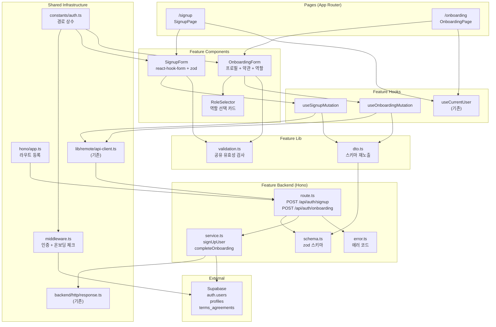

# UC-001 구현 설계: 역할 선택 & 온보딩

## 현재 상태 분석

### 이미 구현됨
- 회원가입 페이지 (`/signup`) — Supabase Auth 직접 호출 방식
- 로그인 페이지 (`/login`)
- 인증 Context/Hook (`CurrentUserProvider`, `useCurrentUser`)
- 보호된 라우트 레이아웃 (`(protected)/layout.tsx`)
- Next.js 미들웨어 (인증 기반 경로 보호)
- DB 스키마 (`profiles`, `terms_agreements` 테이블)

### 구현 필요
- 회원가입을 Hono API (`POST /api/auth/signup`)로 전환
- 온보딩 페이지 및 API (`/onboarding`, `POST /api/auth/onboarding`)
- 미들웨어에 온보딩 미완료 사용자 리다이렉트 로직 추가 (E5)
- 역할 기반 랜딩 페이지 리다이렉트

---

## 개요

| # | 모듈 | 위치 | 설명 |
|---|------|------|------|
| 1 | Auth Backend Schema | `src/features/auth/backend/schema.ts` | 회원가입/온보딩 요청·응답 zod 스키마 |
| 2 | Auth Backend Error | `src/features/auth/backend/error.ts` | 인증 관련 에러 코드 정의 |
| 3 | Auth Backend Service | `src/features/auth/backend/service.ts` | Supabase Auth signUp, 프로필 생성, 약관 동의 비즈니스 로직 |
| 4 | Auth Backend Route | `src/features/auth/backend/route.ts` | Hono 라우터 (`POST /api/auth/signup`, `POST /api/auth/onboarding`) |
| 5 | Auth DTO | `src/features/auth/lib/dto.ts` | 백엔드 스키마 프론트엔드 재노출 |
| 6 | Auth Validation | `src/features/auth/lib/validation.ts` | 공유 유효성 검사 규칙 (이메일, 비밀번호, 전화번호) |
| 7 | Auth Constants | `src/features/auth/constants/index.ts` | 역할별 리다이렉트 경로, 폼 관련 상수 |
| 8 | Signup Mutation Hook | `src/features/auth/hooks/useSignupMutation.ts` | `POST /api/auth/signup` React Query mutation |
| 9 | Onboarding Mutation Hook | `src/features/auth/hooks/useOnboardingMutation.ts` | `POST /api/auth/onboarding` React Query mutation |
| 10 | Signup Form | `src/features/auth/components/signup-form.tsx` | react-hook-form + zod 기반 회원가입 폼 |
| 11 | Role Selector | `src/features/auth/components/role-selector.tsx` | Learner/Instructor 역할 선택 카드 UI |
| 12 | Onboarding Form | `src/features/auth/components/onboarding-form.tsx` | 프로필 입력 + 약관 동의 + 역할 선택 통합 폼 |
| 13 | Signup Page | `src/app/signup/page.tsx` | **수정** — Hono API 호출 방식으로 전환 |
| 14 | Onboarding Page | `src/app/onboarding/page.tsx` | **신규** — 온보딩 페이지 |
| 15 | Auth Constants (shared) | `src/constants/auth.ts` | **수정** — 온보딩 경로 상수 추가 |
| 16 | Middleware | `src/middleware.ts` | **수정** — 프로필 미존재 시 온보딩 강제 리다이렉트 (E5) |
| 17 | Hono App | `src/backend/hono/app.ts` | **수정** — auth 라우트 등록 |

---

## Diagram



---

## Implementation Plan

### Phase 1: Backend Layer

#### 1-1. `src/features/auth/backend/schema.ts`

**zod 스키마 정의:**

```typescript
// 회원가입
SignupRequestSchema: { email: z.string().email(), password: z.string().min(6) }
SignupResponseSchema: { uid: z.string().uuid(), redirectTo: z.string() }

// 온보딩
OnboardingRequestSchema: {
  role: z.enum(['learner', 'instructor']),
  name: z.string().min(1),
  phone: z.string().regex(/^01[016789]-?\d{3,4}-?\d{4}$/),
  bio: z.string().default(''),
  termsAgreed: z.literal(true),
}
OnboardingResponseSchema: { redirectTo: z.string() }

// DB Row 매핑
ProfileRowSchema: { id, role, name, phone, bio, created_at, updated_at }
```

**Unit Test:**
- 유효한 입력 통과 확인
- 이메일 형식 오류 시 실패
- 비밀번호 최소 길이 미달 시 실패
- 전화번호 형식 오류 시 실패
- `termsAgreed: false` 시 실패
- role이 'learner'/'instructor' 외 값일 때 실패

---

#### 1-2. `src/features/auth/backend/error.ts`

**에러 코드:**

```typescript
authErrorCodes = {
  signupDuplicateEmail: 'AUTH_SIGNUP_DUPLICATE_EMAIL',
  signupFailed: 'AUTH_SIGNUP_FAILED',
  onboardingProfileExists: 'AUTH_ONBOARDING_PROFILE_EXISTS',
  onboardingInsertFailed: 'AUTH_ONBOARDING_INSERT_FAILED',
  onboardingValidation: 'AUTH_ONBOARDING_VALIDATION_ERROR',
  unauthorized: 'AUTH_UNAUTHORIZED',
}
```

**Unit Test:**
- 에러 코드 값의 고유성 검증

---

#### 1-3. `src/features/auth/backend/service.ts`

**함수:**

| 함수명 | 입력 | 출력 | 설명 |
|--------|------|------|------|
| `signUpUser` | `(supabase, { email, password })` | `HandlerResult<SignupResponse>` | Supabase Auth signUp 호출 + 세션 반환 |
| `completeOnboarding` | `(supabase, { userId, role, name, phone, bio })` | `HandlerResult<OnboardingResponse>` | profiles INSERT + terms_agreements INSERT + 역할 기반 redirectTo 반환 |
| `getProfileByUserId` | `(supabase, userId)` | `Profile \| null` | 프로필 존재 여부 확인 (미들웨어에서 사용) |

**비즈니스 로직:**
- `signUpUser`: 이메일 중복 시 409 반환, Supabase 에러 시 500 반환
- `completeOnboarding`: 프로필 이미 존재 시 409 반환, INSERT 실패 시 500 반환
- `completeOnboarding`: learner → `/courses`, instructor → `/instructor/dashboard` 리다이렉트 경로 결정

**Unit Test:**
- `signUpUser`: 성공 케이스 — `ok: true` + uid 반환
- `signUpUser`: 이메일 중복 — `ok: false`, 409, `AUTH_SIGNUP_DUPLICATE_EMAIL`
- `completeOnboarding`: 성공 케이스 — profiles + terms_agreements INSERT, 역할별 redirectTo
- `completeOnboarding`: 프로필 중복 — `ok: false`, 409, `AUTH_ONBOARDING_PROFILE_EXISTS`
- `getProfileByUserId`: 프로필 존재 시 데이터 반환
- `getProfileByUserId`: 프로필 미존재 시 null 반환

---

#### 1-4. `src/features/auth/backend/route.ts`

**엔드포인트:**

| Method | Path | 설명 |
|--------|------|------|
| POST | `/api/auth/signup` | 이메일/비밀번호 가입 |
| POST | `/api/auth/onboarding` | 프로필 생성 + 약관 동의 |

**`POST /api/auth/signup` 흐름:**
1. Body에서 `SignupRequestSchema` 파싱
2. 실패 시 400 + `INVALID_SIGNUP_PARAMS`
3. `signUpUser(supabase, data)` 호출
4. 결과 반환 (`respond`)

**`POST /api/auth/onboarding` 흐름:**
1. 인증 확인 (Supabase Auth에서 현재 사용자 추출)
2. 미인증 시 401 반환
3. Body에서 `OnboardingRequestSchema` 파싱
4. 실패 시 400 + `AUTH_ONBOARDING_VALIDATION_ERROR`
5. `completeOnboarding(supabase, { userId, ...data })` 호출
6. 결과 반환 (`respond`)

**Unit Test:**
- 유효한 signup 요청 → 200
- 잘못된 이메일 형식 → 400
- 유효한 onboarding 요청 → 200 + redirectTo
- 미인증 onboarding 요청 → 401
- 필수 필드 누락 → 400

---

### Phase 2: Shared / Infrastructure

#### 2-1. `src/features/auth/lib/validation.ts`

**공유 유효성 검사 규칙 (FE/BE 공용):**

```typescript
PASSWORD_MIN_LENGTH = 6
PHONE_REGEX = /^01[016789]-?\d{3,4}-?\d{4}$/

passwordSchema: z.string().min(PASSWORD_MIN_LENGTH)
phoneSchema: z.string().regex(PHONE_REGEX)
emailSchema: z.string().email()
```

---

#### 2-2. `src/features/auth/constants/index.ts`

```typescript
ROLE_REDIRECT_MAP = {
  learner: '/courses',
  instructor: '/instructor/dashboard',
}

ONBOARDING_PATH = '/onboarding'
```

---

#### 2-3. `src/features/auth/lib/dto.ts`

```typescript
// backend/schema.ts에서 프론트엔드용 타입/스키마 재노출
export {
  SignupRequestSchema,
  type SignupResponse,
  OnboardingRequestSchema,
  type OnboardingResponse,
} from '../backend/schema';
```

---

#### 2-4. `src/constants/auth.ts` (수정)

**추가 사항:**
- `ONBOARDING_PATH = '/onboarding'` 상수 추가
- `PUBLIC_PATHS`에 `'/onboarding'` 추가 (미들웨어에서 별도 처리하므로 보호 대상 제외)

---

#### 2-5. `src/middleware.ts` (수정)

**E5 처리 — 온보딩 미완료 사용자 강제 리다이렉트:**

기존 로직 후에 추가:
1. 인증된 사용자(`user !== null`)이고 보호된 경로 접근 시
2. Supabase에서 `profiles` 테이블 조회 (`id = user.id`)
3. 프로필 미존재 시 → `/onboarding`으로 리다이렉트
4. 이미 `/onboarding` 경로인 경우 → 리다이렉트 하지 않음 (무한 루프 방지)
5. 인증된 사용자가 `/onboarding`에 접근했으나 이미 프로필 있으면 → 역할 기반 랜딩으로 리다이렉트

---

#### 2-6. `src/backend/hono/app.ts` (수정)

```typescript
import { registerAuthRoutes } from '@/features/auth/backend/route';

// createHonoApp 내부
registerAuthRoutes(app);  // 추가
```

---

### Phase 3: Frontend Layer

#### 3-1. `src/features/auth/hooks/useSignupMutation.ts`

```typescript
// apiClient를 통해 POST /api/auth/signup 호출
// onSuccess: refresh() → /onboarding 리다이렉트
// onError: 에러 메시지 추출 (extractApiErrorMessage)
```

---

#### 3-2. `src/features/auth/hooks/useOnboardingMutation.ts`

```typescript
// apiClient를 통해 POST /api/auth/onboarding 호출
// onSuccess: response.redirectTo로 router.replace
// onError: 에러 메시지 추출
```

---

#### 3-3. `src/features/auth/components/signup-form.tsx`

**react-hook-form + zod resolver 기반 폼:**

| 필드 | 타입 | 유효성 검사 |
|------|------|-------------|
| email | Input (email) | 이메일 형식 |
| password | Input (password) | 최소 6자 |
| confirmPassword | Input (password) | password와 일치 |

- `useSignupMutation` 사용
- 에러/로딩 상태 표시
- "이미 계정이 있으신가요?" 로그인 링크

**QA Sheet:**

| # | 시나리오 | 기대 결과 |
|---|----------|-----------|
| 1 | 유효한 이메일/비밀번호 입력 후 가입 | 성공 → `/onboarding` 리다이렉트 |
| 2 | 빈 이메일로 제출 시도 | 가입 버튼 비활성화 또는 유효성 에러 |
| 3 | 잘못된 이메일 형식 | "유효한 이메일을 입력해주세요" 에러 |
| 4 | 비밀번호 5자 이하 | "비밀번호는 6자 이상이어야 합니다" 에러 |
| 5 | 비밀번호 불일치 | "비밀번호가 일치하지 않습니다" 에러 |
| 6 | 이미 가입된 이메일 | "이미 가입된 이메일입니다" 에러 (409) |
| 7 | 네트워크 오류 | 일반 에러 메시지 표시 |
| 8 | 제출 중 버튼 상태 | 로딩 스피너 + 버튼 비활성화 |
| 9 | 이미 인증된 사용자 접근 | 이전 페이지 또는 홈으로 리다이렉트 |

---

#### 3-4. `src/features/auth/components/role-selector.tsx`

**역할 선택 카드 UI:**

- Learner / Instructor 2개 카드
- 선택 시 시각적 하이라이트 (border color 변경)
- 아이콘: `lucide-react` — `GraduationCap` (Learner), `BookOpen` (Instructor)
- `value`/`onChange` props로 부모 폼에서 제어

**QA Sheet:**

| # | 시나리오 | 기대 결과 |
|---|----------|-----------|
| 1 | Learner 카드 클릭 | Learner 선택 상태, Instructor 비선택 |
| 2 | Instructor 카드 클릭 | Instructor 선택 상태, Learner 비선택 |
| 3 | 아무것도 미선택 시 | 폼 제출 불가 |

---

#### 3-5. `src/features/auth/components/onboarding-form.tsx`

**react-hook-form + zod resolver 기반 통합 폼:**

| 필드 | 타입 | 조건 | 유효성 검사 |
|------|------|------|-------------|
| role | RoleSelector | 필수 | learner/instructor |
| name | Input (text) | 필수 | 최소 1자 |
| phone | Input (tel) | 필수 | 한국 휴대폰 형식 |
| bio | Textarea | Instructor만 노출 | 선택 (빈 문자열 허용) |
| termsAgreed | Checkbox | 필수 | true만 허용 |

- `useOnboardingMutation` 사용
- `role === 'instructor'` 시 Bio 필드 조건부 렌더링
- 에러/로딩 상태 표시
- "완료" 버튼 — 필수 필드 미입력 시 비활성화

**QA Sheet:**

| # | 시나리오 | 기대 결과 |
|---|----------|-----------|
| 1 | 모든 필수 필드 입력 + Learner + 약관 동의 후 완료 | `/courses`로 리다이렉트 |
| 2 | 모든 필수 필드 입력 + Instructor + 약관 동의 후 완료 | `/instructor/dashboard`로 리다이렉트 |
| 3 | Instructor 선택 시 | Bio 입력 필드 표시 |
| 4 | Learner 선택 시 | Bio 입력 필드 숨김 |
| 5 | 이름 미입력 | 완료 버튼 비활성화 또는 유효성 에러 |
| 6 | 전화번호 형식 오류 (예: "abc") | "유효한 전화번호를 입력해주세요" 에러 |
| 7 | 약관 미동의 | 완료 버튼 비활성화 |
| 8 | 역할 미선택 | 완료 버튼 비활성화 |
| 9 | 네트워크 오류 | 에러 메시지 표시, 재시도 가능 |
| 10 | 제출 중 버튼 상태 | 로딩 스피너 + 버튼 비활성화 |
| 11 | 이미 프로필 있는 사용자 접근 | 역할 기반 랜딩으로 리다이렉트 |
| 12 | 미인증 사용자 접근 | `/login`으로 리다이렉트 |
| 13 | Instructor → Bio 입력 → Learner 변경 → 완료 | Bio는 빈 문자열로 저장 |

---

#### 3-6. `src/app/signup/page.tsx` (수정)

**변경 사항:**
- 인라인 폼 로직 → `SignupForm` 컴포넌트로 교체
- Supabase 직접 호출 → `useSignupMutation` (Hono API 경유)
- 가입 성공 시 리다이렉트 대상: 이전 페이지 → `/onboarding`

---

#### 3-7. `src/app/onboarding/page.tsx` (신규)

**구성:**
- 인증 확인 (`useCurrentUser`) — 미인증 시 `/login` 리다이렉트
- `OnboardingForm` 컴포넌트 렌더링
- 헤더: "프로필 설정", "역할을 선택하고 기본 정보를 입력해주세요."

**QA Sheet:**

| # | 시나리오 | 기대 결과 |
|---|----------|-----------|
| 1 | 인증된 사용자, 프로필 없음 | 온보딩 폼 표시 |
| 2 | 미인증 사용자 | `/login?redirectedFrom=/onboarding` 리다이렉트 |
| 3 | 이미 온보딩 완료한 사용자 | 역할 기반 랜딩으로 리다이렉트 |

---

## 작업 순서 (의존성 기반)

```
Phase 1 (Backend — 의존성 없음, 병렬 가능)
├── 1-1. schema.ts
├── 1-2. error.ts
└── 1-3. service.ts (schema, error 의존)
    └── 1-4. route.ts (service, schema, error 의존)

Phase 2 (Shared — Phase 1 후)
├── 2-1. validation.ts (schema에서 규칙 추출)
├── 2-2. constants/index.ts
├── 2-3. dto.ts
├── 2-4. constants/auth.ts 수정
├── 2-5. middleware.ts 수정 (service.getProfileByUserId 의존)
└── 2-6. hono/app.ts 수정

Phase 3 (Frontend — Phase 1, 2 후)
├── 3-1. useSignupMutation.ts
├── 3-2. useOnboardingMutation.ts
├── 3-3. signup-form.tsx
├── 3-4. role-selector.tsx
├── 3-5. onboarding-form.tsx (role-selector 의존)
├── 3-6. signup/page.tsx 수정
└── 3-7. onboarding/page.tsx 신규
```
