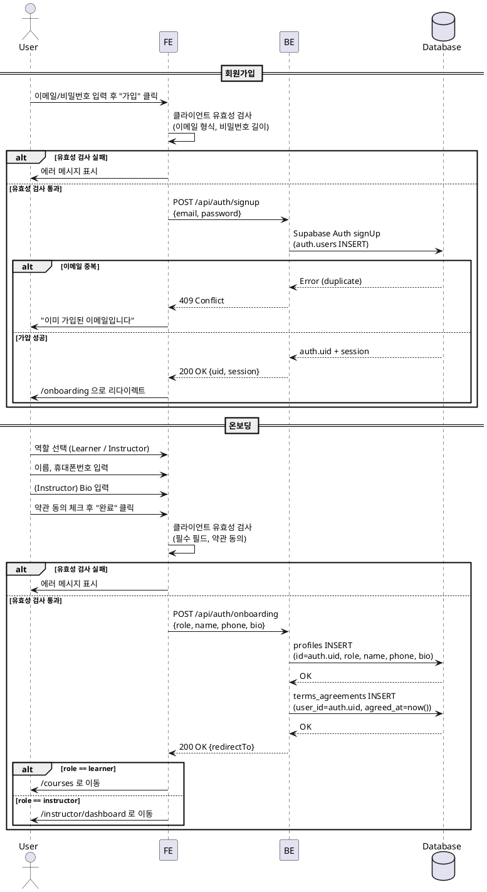

# UC-001: 역할 선택 & 온보딩

## Primary Actor

- 미인증 사용자 (신규 가입자)

## Precondition

- 사용자가 앱에 접근할 수 있는 브라우저 환경이 존재한다.
- 사용자는 아직 계정을 보유하지 않았다.

## Trigger

- 사용자가 회원가입 페이지(`/auth/signup`)에 진입한다.

## Main Scenario

| Step | Actor | Action |
|------|-------|--------|
| 1 | User | 회원가입 페이지에서 이메일, 비밀번호를 입력하고 "가입" 버튼을 클릭한다. |
| 2 | FE | 입력값 클라이언트 유효성 검사 (이메일 형식, 비밀번호 최소 길이). |
| 3 | FE | `POST /api/auth/signup` 요청을 전송한다. |
| 4 | BE | Supabase Auth `signUp`을 호출하여 `auth.users` 레코드를 생성한다. |
| 5 | BE | 생성된 `auth.uid`와 세션 토큰을 FE에 반환한다. |
| 6 | FE | 온보딩 페이지(`/onboarding`)로 리다이렉트한다. |
| 7 | User | 역할을 선택한다 (Learner / Instructor). |
| 8 | User | 공통 프로필을 입력한다: 이름, 휴대폰번호. |
| 9 | User | (Instructor 선택 시) 소개/약력(Bio)을 추가 입력한다. |
| 10 | User | 약관 동의 체크박스를 선택하고 "완료" 버튼을 클릭한다. |
| 11 | FE | 입력값 클라이언트 유효성 검사 (필수 필드, 전화번호 형식). |
| 12 | FE | `POST /api/auth/onboarding` 요청을 전송한다. |
| 13 | BE | `profiles` 테이블에 INSERT (id=auth.uid, role, name, phone, bio). |
| 14 | BE | `terms_agreements` 테이블에 INSERT (user_id, agreed_at). |
| 15 | BE | 완료 응답과 역할 기반 리다이렉트 경로를 반환한다. |
| 16 | FE | Learner → `/courses` (코스 카탈로그), Instructor → `/instructor/dashboard`로 이동한다. |

## Edge Cases

| Case | 조건 | 처리 |
|------|------|------|
| E1 | 이미 등록된 이메일로 가입 시도 | BE가 409 Conflict 반환, FE에서 "이미 가입된 이메일입니다" 안내. |
| E2 | 비밀번호가 최소 요건 미달 | FE 클라이언트 검증 단계에서 차단. BE에서도 Supabase Auth 정책으로 이중 검증. |
| E3 | 온보딩 필수 필드 누락 (이름, 휴대폰번호, 약관동의) | FE에서 "완료" 버튼 비활성화. 서버에서도 400 Bad Request 반환. |
| E4 | 약관 미동의 상태로 제출 | FE에서 체크박스 미선택 시 버튼 비활성화. |
| E5 | 온보딩 미완료 상태로 다른 페이지 접근 | 인증은 되었으나 profiles 레코드가 없으므로 `/onboarding`으로 강제 리다이렉트. |
| E6 | 네트워크 오류로 Auth 성공 후 프로필 저장 실패 | FE에서 에러 메시지 표시, 온보딩 페이지에서 재시도 가능. |
| E7 | Instructor 선택 시 Bio 미입력 | Bio는 기본값 빈 문자열 허용. 선택 필드로 처리. |

## Business Rules

| ID | Rule |
|----|------|
| BR1 | 역할은 `learner` 또는 `instructor` 중 하나만 선택 가능하다. |
| BR2 | 역할은 가입 시 1회 선택되며, 이후 변경 불가하다. |
| BR3 | 공통 프로필 필수 입력: 이름, 휴대폰번호. |
| BR4 | 약관 동의는 필수이며, 동의 이력은 `terms_agreements`에 시각과 함께 기록된다. |
| BR5 | `profiles.id`는 `auth.users.id`와 동일하며 1:1 관계를 유지한다. |
| BR6 | Bio 필드는 Instructor에게만 입력 UI를 노출하지만, DB 스키마상 모든 역할에 존재한다 (기본값 빈 문자열). |
| BR7 | 온보딩 완료 후 역할에 따라 다른 랜딩 페이지로 이동한다 (Learner → 카탈로그, Instructor → 대시보드). |

## Sequence Diagram

