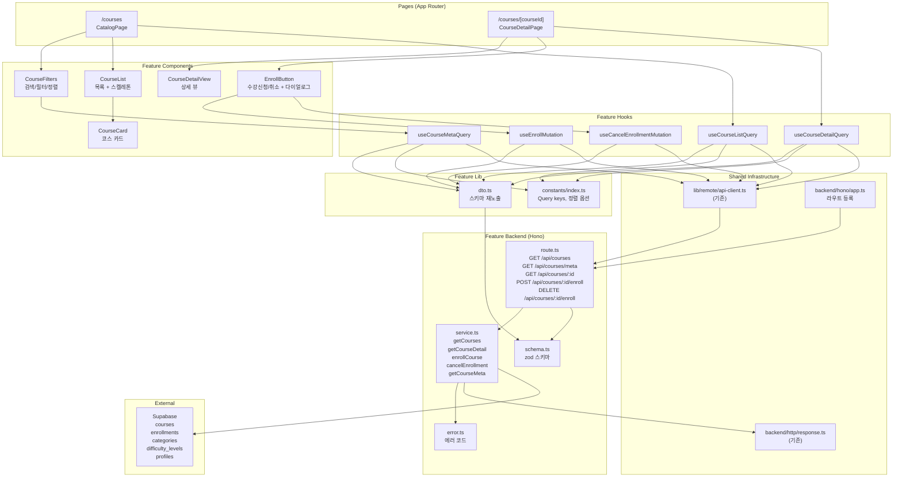

# UC-002 구현 설계: 코스 탐색 & 수강신청/취소

## 현재 상태 분석

### 이미 구현됨
- DB 스키마 (`courses`, `enrollments`, `categories`, `difficulty_levels` 테이블)
- Supabase Auth 기반 인증 (`useCurrentUser`, 미들웨어)
- 보호된 라우트 레이아웃 (`(protected)/layout.tsx`)
- Hono 앱 미들웨어 체인 (`errorBoundary`, `withAppContext`, `withSupabase`)
- 공통 HTTP 응답 헬퍼 (`success`, `failure`, `respond`)
- API 클라이언트 (`apiClient`, `extractApiErrorMessage`)
- shadcn-ui 기본 컴포넌트 (`Card`, `Badge`, `Button`, `Dialog`, `Input`, `Select`)

### 구현 필요
- 코스 카탈로그 API (`GET /api/courses`, `GET /api/courses/meta`)
- 코스 상세 API (`GET /api/courses/:courseId`)
- 수강신청/취소 API (`POST/DELETE /api/courses/:courseId/enroll`)
- 카탈로그 페이지 (`/courses`) — 검색, 필터, 정렬, 페이지네이션
- 코스 상세 페이지 (`/courses/[courseId]`) — 상세 정보, 수강신청/취소
- 인증 헬퍼 (`extractUserId`) — Bearer/Session 폴백 로직 (route 내 로컬 정의)

---

## 개요

| # | 모듈 | 위치 | 설명 |
|---|------|------|------|
| B1 | Error Codes | `src/features/course/backend/error.ts` | 코스 관련 에러 코드 정의 |
| B2 | Schema | `src/features/course/backend/schema.ts` | 요청/응답 zod 스키마 (카탈로그, 상세, 수강신청/취소, 메타) |
| B3 | Service | `src/features/course/backend/service.ts` | 코스 조회, 수강신청/취소, 메타데이터 비즈니스 로직 |
| B4 | Route | `src/features/course/backend/route.ts` | Hono 라우터 (5개 엔드포인트) + 로컬 `extractUserId` |
| F1 | Constants | `src/features/course/constants/index.ts` | Query key 팩토리, 정렬 옵션, 페이지 사이즈 |
| F2 | DTO | `src/features/course/lib/dto.ts` | backend/schema 프론트엔드 재노출 |
| F3 | Course List Query | `src/features/course/hooks/useCourseListQuery.ts` | 카탈로그 목록 React Query 훅 |
| F4 | Course Detail Query | `src/features/course/hooks/useCourseDetailQuery.ts` | 코스 상세 React Query 훅 |
| F5 | Course Meta Query | `src/features/course/hooks/useCourseMetaQuery.ts` | 필터 메타데이터 React Query 훅 |
| F6 | Enroll Mutation | `src/features/course/hooks/useEnrollMutation.ts` | 수강신청 React Query mutation |
| F7 | Cancel Mutation | `src/features/course/hooks/useCancelEnrollmentMutation.ts` | 수강취소 React Query mutation |
| F8 | Course Card | `src/features/course/components/course-card.tsx` | 코스 카드 컴포넌트 |
| F9 | Course List | `src/features/course/components/course-list.tsx` | 코스 목록 (로딩/에러/빈 상태 처리) |
| F10 | Course Filters | `src/features/course/components/course-filters.tsx` | 검색/카테고리/난이도/정렬 필터 UI |
| F11 | Course Detail View | `src/features/course/components/course-detail-view.tsx` | 코스 상세 뷰 (소개, 커리큘럼, 강사) |
| F12 | Enroll Button | `src/features/course/components/enroll-button.tsx` | 수강신청/취소 버튼 + 확인 다이얼로그 |
| P1 | Catalog Page | `src/app/(protected)/courses/page.tsx` | 카탈로그 페이지 엔트리 (`/courses`) |
| P2 | Detail Page | `src/app/(protected)/courses/[courseId]/page.tsx` | 코스 상세 페이지 엔트리 (`/courses/[courseId]`) |
| I1 | Route Registration | `src/backend/hono/app.ts` 수정 | `registerCourseRoutes(app)` 추가 |

---

## Diagram



---

## Implementation Plan

### Phase 1: Backend Layer

#### 1-1. `src/features/course/backend/error.ts`

**에러 코드:**

```typescript
courseErrorCodes = {
  notFound: 'COURSE_NOT_FOUND',               // 코스 미존재
  notPublished: 'COURSE_NOT_PUBLISHED',       // 미공개 코스 접근
  alreadyEnrolled: 'COURSE_ALREADY_ENROLLED', // 중복 수강신청
  notEnrolled: 'COURSE_NOT_ENROLLED',         // 미수강 상태에서 취소
  forbiddenRole: 'COURSE_FORBIDDEN_ROLE',     // Learner 외 역할 차단
  unauthorized: 'COURSE_UNAUTHORIZED',        // 미인증
  fetchError: 'COURSE_FETCH_ERROR',           // DB 조회 실패
  enrollFailed: 'COURSE_ENROLL_FAILED',       // 수강신청 DB 오류
  cancelFailed: 'COURSE_CANCEL_FAILED',       // 수강취소 DB 오류
  validationError: 'COURSE_VALIDATION_ERROR'  // 입력 검증 실패
}
```

---

#### 1-2. `src/features/course/backend/schema.ts`

**입력 스키마:**

```typescript
courseListQuerySchema: {
  q: z.string().optional(),                          // 제목 검색어
  categoryId: z.string().uuid().optional(),          // 카테고리 필터
  difficultyId: z.string().uuid().optional(),        // 난이도 필터
  sort: z.enum(['latest', 'popular']).default('latest'),
  page: z.coerce.number().int().min(1).default(1),
  limit: z.coerce.number().int().min(1).max(50).default(12),
}

courseIdParamSchema: {
  courseId: z.string().uuid()
}
```

**응답 스키마:**

```typescript
courseSummarySchema: {
  id, title, description: string,
  categoryName, difficultyName: string | null,
  instructorName: string,
  enrollmentCount: number,
  createdAt: string
}

courseListResponseSchema: {
  courses: courseSummarySchema[],
  total: number, page: number, limit: number
}

courseDetailResponseSchema: {
  id, title, description, curriculum: string,
  categoryName, difficultyName: string | null,
  instructorName, instructorBio: string,
  enrollmentCount: number,
  enrollmentStatus: 'active' | 'cancelled' | null,
  createdAt: string
}

enrollResponseSchema: { enrollmentId: uuid, status: 'active' }
cancelEnrollResponseSchema: { enrollmentId: uuid, status: 'cancelled' }
courseMetaResponseSchema: {
  categories: [{ id, name }],
  difficultyLevels: [{ id, name }]
}
```

**Unit Test:**
- 유효한 courseListQuery 입력 통과 확인
- page/limit 기본값 적용 확인
- 잘못된 UUID → 실패
- sort 기본값 'latest' 적용 확인

---

#### 1-3. `src/features/course/backend/service.ts`

**함수:**

| 함수명 | 입력 | 출력 | 설명 |
|--------|------|------|------|
| `getCourses` | `(supabase, CourseListQuery)` | `HandlerResult<CourseListResponse>` | published 코스 목록 조회, 필터/정렬/페이지네이션 |
| `getCourseDetail` | `(supabase, { courseId, userId? })` | `HandlerResult<CourseDetailResponse>` | 코스 상세 + 수강 상태 조회 |
| `enrollCourse` | `(supabase, { courseId, userId })` | `HandlerResult<EnrollResponse>` | 수강신청 (UPSERT 지원) |
| `cancelEnrollment` | `(supabase, { courseId, userId })` | `HandlerResult<CancelEnrollResponse>` | 수강취소 (soft delete) |
| `getCourseMeta` | `(supabase)` | `HandlerResult<CourseMetaResponse>` | 카테고리 + 난이도 메타데이터 |

**비즈니스 로직:**

`getCourses`:
1. `status='published'` 필터 (카탈로그 노출 조건 BR1)
2. `q` 존재 시 `title ILIKE '%q%'` 부분 검색
3. `categoryId`, `difficultyId` 존재 시 eq 필터 (BR7)
4. `sort='latest'` → `created_at DESC`, `sort='popular'` → 수강생 수 내림차순 (BR6)
5. 페이지네이션: `range(from, to)` + exact count
6. JOIN: `categories`, `difficulty_levels`, `profiles`(instructor), `enrollments`(count)

`getCourseDetail`:
1. `id=courseId AND status='published'` 조회 (E1: draft/archived → 404)
2. JOIN: `categories`, `difficulty_levels`, `profiles`(name, bio)
3. `enrollments` count (active 수강생 수)
4. `userId` 존재 시 해당 learner의 수강 상태 조회 (`active` / `cancelled` / `null`)

`enrollCourse`:
1. `profiles.role` 확인 → `learner` 아니면 403 (BR5, E4)
2. `courses.status` 확인 → `published` 아니면 400 (BR1, E1)
3. 기존 enrollment 확인:
   - `active` → 409 중복 (E2)
   - `cancelled` → UPDATE `status='active'` (BR3 재수강)
   - 없음 → INSERT (BR2)

`cancelEnrollment`:
1. `enrollments(course_id, learner_id, status='active')` 조회
2. 없으면 404 (E3)
3. UPDATE `status='cancelled'` (BR4)

**Unit Test:**
- `getCourses`: 검색어 필터링 확인, 카테고리/난이도 필터 확인, 페이지네이션 확인
- `getCourses`: sort='popular' 시 수강생 수 내림차순 정렬 확인
- `getCourses`: published 코스만 반환 확인
- `getCourseDetail`: 존재하는 코스 → 상세 반환 + 수강 상태 포함
- `getCourseDetail`: draft/archived 코스 → 404
- `enrollCourse`: Learner 역할, published 코스 → 성공
- `enrollCourse`: Instructor 역할 → 403
- `enrollCourse`: 이미 active → 409
- `enrollCourse`: cancelled → active 재활성화
- `cancelEnrollment`: active 수강 → cancelled 성공
- `cancelEnrollment`: 미수강 상태 → 404
- `getCourseMeta`: active 카테고리/난이도만 반환

---

#### 1-4. `src/features/course/backend/route.ts`

**엔드포인트:**

| Method | Path | Auth | 설명 |
|--------|------|------|------|
| GET | `/api/courses/meta` | 불필요 | 필터 메타데이터 (카테고리, 난이도) |
| GET | `/api/courses` | 불필요 | 카탈로그 목록 (필터/정렬/페이지네이션) |
| GET | `/api/courses/:courseId` | 선택적 | 코스 상세 + 수강 상태 |
| POST | `/api/courses/:courseId/enroll` | 필수 | 수강신청 |
| DELETE | `/api/courses/:courseId/enroll` | 필수 | 수강취소 |

**인증 처리 — `extractUserId` (로컬 헬퍼):**
1. `Authorization: Bearer {token}` → `supabase.auth.getUser(token)`
2. 폴백: `supabase.auth.getUser()` (세션 기반)
3. 실패 시 `null` 반환

**`GET /api/courses` 흐름:**
1. Query string에서 `courseListQuerySchema` 파싱
2. 실패 시 400 + `COURSE_VALIDATION_ERROR`
3. `getCourses(supabase, parsed)` 호출
4. `respond(c, result)` 반환

**`GET /api/courses/:courseId` 흐름:**
1. `:courseId` 파라미터 `courseIdParamSchema` 파싱
2. `extractUserId(c)` — 인증 실패해도 계속 (선택적 인증)
3. `getCourseDetail(supabase, { courseId, userId })` 호출
4. `respond(c, result)` 반환

**`POST /api/courses/:courseId/enroll` 흐름:**
1. `extractUserId(c)` — null이면 401 반환
2. `:courseId` 파라미터 파싱
3. `enrollCourse(supabase, { courseId, userId })` 호출
4. `respond(c, result)` 반환

**`DELETE /api/courses/:courseId/enroll` 흐름:**
1. `extractUserId(c)` — null이면 401 반환
2. `:courseId` 파라미터 파싱
3. `cancelEnrollment(supabase, { courseId, userId })` 호출
4. `respond(c, result)` 반환

**주의:** `/api/courses/meta` 라우트가 `/api/courses/:courseId` 보다 먼저 등록되어야 함 (라우트 우선순위)

---

### Phase 2: Shared / Data Layer

#### 2-1. `src/features/course/constants/index.ts`

```typescript
COURSE_QUERY_KEYS = {
  all: ['courses'],
  list: (params) => ['courses', 'list', params],
  detail: (courseId) => ['courses', 'detail', courseId],
  meta: ['courses', 'meta']
}

SORT_OPTIONS = [
  { value: 'latest', label: '최신순' },
  { value: 'popular', label: '인기순' },
]

DEFAULT_PAGE_SIZE = 12
```

---

#### 2-2. `src/features/course/lib/dto.ts`

```typescript
// backend/schema.ts에서 프론트엔드용 타입/스키마 재노출
export {
  courseListQuerySchema, courseListResponseSchema,
  courseSummarySchema, courseDetailResponseSchema,
  enrollResponseSchema, cancelEnrollResponseSchema,
  courseMetaResponseSchema,
  type CourseListQuery, type CourseListResponse,
  type CourseSummary, type CourseDetailResponse,
  type EnrollResponse, type CancelEnrollResponse,
  type CourseMetaResponse,
} from '../backend/schema';
```

---

#### 2-3. `src/backend/hono/app.ts` (수정)

```typescript
import { registerCourseRoutes } from '@/features/course/backend/route';

// createHonoApp 내부
registerCourseRoutes(app);  // 추가
```

---

### Phase 3: Frontend Hooks

#### 3-1. `src/features/course/hooks/useCourseListQuery.ts`

```typescript
// GET /api/courses 호출
// Input: CourseListQuery (params)
// Response: courseListResponseSchema.parse(data)
// QueryKey: COURSE_QUERY_KEYS.list(params)
// staleTime: 60s
// Error: extractApiErrorMessage → throw Error
```

---

#### 3-2. `src/features/course/hooks/useCourseDetailQuery.ts`

```typescript
// GET /api/courses/:courseId 호출
// Input: courseId (string)
// Response: courseDetailResponseSchema.parse(data)
// QueryKey: COURSE_QUERY_KEYS.detail(courseId)
// staleTime: 60s
// enabled: !!courseId (courseId가 있을 때만 실행)
// Error: extractApiErrorMessage → throw Error
```

---

#### 3-3. `src/features/course/hooks/useCourseMetaQuery.ts`

```typescript
// GET /api/courses/meta 호출
// Response: courseMetaResponseSchema.parse(data)
// QueryKey: COURSE_QUERY_KEYS.meta
// staleTime: 5분 (300_000ms) — 메타데이터는 자주 변경되지 않음
// Error: extractApiErrorMessage → throw Error
```

---

#### 3-4. `src/features/course/hooks/useEnrollMutation.ts`

```typescript
// POST /api/courses/:courseId/enroll 호출
// Response: enrollResponseSchema.parse(data)
// onSuccess: toast 성공 메시지 + queryClient.invalidateQueries(detail)
// onError: toast 에러 메시지
```

---

#### 3-5. `src/features/course/hooks/useCancelEnrollmentMutation.ts`

```typescript
// DELETE /api/courses/:courseId/enroll 호출
// Response: cancelEnrollResponseSchema.parse(data)
// onSuccess: toast 성공 메시지 + queryClient.invalidateQueries(detail)
// onError: toast 에러 메시지
```

---

### Phase 4: Frontend Components

#### 4-1. `src/features/course/components/course-card.tsx`

**Props:** `{ course: CourseSummary }`

**구성:**
- `Link`로 `/courses/:courseId` 이동
- Card: hover shadow 효과
- CardHeader: 제목 (line-clamp-1), 카테고리/난이도 Badge
- CardContent: 설명 (line-clamp-2)
- CardFooter: 강사 이름, 수강생 수 (Users 아이콘), 등록일 (Calendar 아이콘, yyyy.MM.dd 포맷)

**QA Sheet:**

| # | 시나리오 | 기대 결과 |
|---|----------|-----------|
| Q1 | 코스 카드 렌더링 | 제목, 카테고리, 난이도, 설명, 강사, 수강생 수, 등록일 표시 |
| Q2 | 긴 제목 | 1줄로 말줄임 처리 |
| Q3 | 긴 설명 | 2줄로 말줄임 처리 |
| Q4 | 카테고리 없는 코스 | 카테고리 Badge 숨김 |
| Q5 | 난이도 없는 코스 | 난이도 Badge 숨김 |
| Q6 | 카드 클릭 | 코스 상세 페이지로 이동 |
| Q7 | 카드 호버 | shadow 효과 표시 |

---

#### 4-2. `src/features/course/components/course-list.tsx`

**Props:** `{ courses: CourseSummary[] | undefined, isLoading: boolean, isError: boolean }`

**상태별 렌더링:**
- 로딩: 6개 스켈레톤 카드 (animate-pulse)
- 에러: 에러 메시지 + 재시도 안내
- 빈 결과: BookOpen 아이콘 + "조건에 맞는 코스가 없습니다"
- 성공: 반응형 그리드 (1열/2열/3열)

**QA Sheet:**

| # | 시나리오 | 기대 결과 |
|---|----------|-----------|
| Q1 | 로딩 중 | 6개 스켈레톤 카드 표시 |
| Q2 | 코스 3건 | 3개 CourseCard 표시 (E6 아님) |
| Q3 | 코스 0건 | 빈 상태 UI (E6) |
| Q4 | API 에러 | 에러 메시지 표시 |
| Q5 | 모바일 화면 | 1열 그리드 |
| Q6 | 데스크톱 화면 | 3열 그리드 |

---

#### 4-3. `src/features/course/components/course-filters.tsx`

**Props:** `{ q, categoryId, difficultyId, sort, onChangeQ, onChangeCategoryId, onChangeDifficultyId, onChangeSort }`

**구성:**
- 검색 Input (Search 아이콘, placeholder "코스 검색...")
- 카테고리 Select (useCourseMetaQuery에서 목록 로드)
- 난이도 Select (useCourseMetaQuery에서 목록 로드)
- 정렬 Select (최신순/인기순)
- "전체" 옵션 → `__all__` 값으로 reset

**QA Sheet:**

| # | 시나리오 | 기대 결과 |
|---|----------|-----------|
| Q1 | 검색어 입력 | 코스 목록 필터링 (제목 부분 일치) |
| Q2 | 카테고리 선택 | 해당 카테고리만 표시 |
| Q3 | 난이도 선택 | 해당 난이도만 표시 |
| Q4 | 정렬 변경 → 인기순 | 수강생 수 내림차순 정렬 |
| Q5 | "전체" 선택 | 필터 초기화 |
| Q6 | 필터 변경 시 | 페이지 1로 리셋 |

---

#### 4-4. `src/features/course/components/course-detail-view.tsx`

**Props:** `{ course: CourseDetailResponse | undefined, isLoading: boolean, isError: boolean }`

**섹션:**
1. 헤더: 제목, 카테고리/난이도 Badge, 수강생 수, 등록일
2. 구분선
3. 코스 소개: description (whitespace-pre-wrap)
4. 구분선
5. 커리큘럼: curriculum 텍스트 (미등록 시 안내 메시지)
6. 구분선
7. 강사 정보: Avatar placeholder + 이름 + Bio

**QA Sheet:**

| # | 시나리오 | 기대 결과 |
|---|----------|-----------|
| Q1 | 정상 코스 데이터 | 모든 섹션 정상 표시 |
| Q2 | 로딩 중 | DetailSkeleton 표시 |
| Q3 | 코스 미존재 | "코스를 찾을 수 없습니다" 표시 |
| Q4 | 카테고리/난이도 null | 해당 Badge 숨김 |
| Q5 | 긴 커리큘럼 텍스트 | 전체 표시 (스크롤) |
| Q6 | 강사 Bio 빈 문자열 | Bio 영역 숨김 또는 빈 표시 |

---

#### 4-5. `src/features/course/components/enroll-button.tsx`

**Props:** `{ courseId: string, enrollmentStatus: 'active' | 'cancelled' | null }`

**상태별 동작:**
- `null` 또는 `cancelled`: "수강신청" 버튼 → `useEnrollMutation` 호출
- `active`: "수강취소" 버튼 → 확인 Dialog 표시 후 `useCancelEnrollmentMutation` 호출

**확인 다이얼로그 (수강취소):**
- 제목: "수강취소 확인"
- 설명: 수강 기록 안내 + 재수강 가능 안내
- 취소 버튼 (outline), 확인 버튼 (destructive)

**QA Sheet:**

| # | 시나리오 | 기대 결과 |
|---|----------|-----------|
| Q1 | 미등록 사용자 | "수강신청" 버튼 표시 |
| Q2 | 수강신청 클릭 | 성공 → 버튼 "수강취소"로 전환, 토스트 표시 |
| Q3 | active 상태 | "수강취소" 버튼 표시 |
| Q4 | 수강취소 클릭 | 확인 다이얼로그 표시 (MS-4.2) |
| Q5 | 다이얼로그에서 확인 | 취소 처리 → 버튼 "수강신청"으로 전환, 토스트 표시 |
| Q6 | 다이얼로그에서 취소 | 아무 일도 일어나지 않음 |
| Q7 | 처리 중 | "처리 중..." 텍스트 + 버튼 비활성화 |
| Q8 | 중복 수강신청 (E2) | 에러 토스트 "이미 수강 중인 코스입니다" |
| Q9 | 미수강 상태에서 취소 (E3) | 에러 토스트 |
| Q10 | Instructor 수강신청 (E4) | 에러 토스트 "학습자만 수강신청할 수 있습니다" |
| Q11 | 미인증 수강신청 (E5) | 에러 토스트 "인증이 필요합니다" |
| Q12 | 네트워크 오류 (E7) | 에러 토스트, 재시도 가능 |

---

### Phase 5: Pages

#### 5-1. `src/app/(protected)/courses/page.tsx`

**컴포넌트:** CatalogPage (Client Component)

**로컬 상태:**
- `q` (검색어), `categoryId`, `difficultyId`, `sort`, `page`
- 필터 변경 시 `page`를 1로 리셋

**레이아웃:**
1. 헤더: "코스 탐색" 제목 + 설명
2. CourseFilters: 검색/필터/정렬 UI
3. CourseList: 코스 카드 그리드
4. Pagination: 이전/다음 버튼 + 현재 페이지 표시 (totalPages > 1일 때만)

**QA Sheet:**

| # | 시나리오 | 기대 결과 |
|---|----------|-----------|
| Q1 | 페이지 진입 | 기본 정렬(최신순)으로 코스 목록 표시 |
| Q2 | 검색어 입력 | 제목 부분 일치 결과 표시, 페이지 1로 리셋 |
| Q3 | 카테고리 필터 적용 | 해당 카테고리 코스만 표시 |
| Q4 | 코스 13건 (limit=12) | 페이지네이션 표시, "1 / 2" |
| Q5 | 다음 페이지 클릭 | 2페이지 코스 표시 |
| Q6 | 첫 페이지에서 "이전" | 비활성화 |
| Q7 | 마지막 페이지에서 "다음" | 비활성화 |
| Q8 | 결과 0건 (E6) | 빈 상태 UI 표시 |

---

#### 5-2. `src/app/(protected)/courses/[courseId]/page.tsx`

**컴포넌트:** CourseDetailPage (Client Component)

**구성:**
- `use(params)`로 `courseId` 추출
- `useCourseDetailQuery(courseId)` 호출
- 상단 바: "← 코스 목록" 뒤로가기 링크 + EnrollButton
- CourseDetailView: 코스 상세 정보

**QA Sheet:**

| # | 시나리오 | 기대 결과 |
|---|----------|-----------|
| Q1 | 존재하는 published 코스 | 코스 상세 + 수강신청 버튼 표시 |
| Q2 | 뒤로가기 링크 클릭 | `/courses` 이동 |
| Q3 | 존재하지 않는 courseId | "코스를 찾을 수 없습니다" 표시 |
| Q4 | draft/archived 코스 (E1) | "코스를 찾을 수 없습니다" 표시 |
| Q5 | 수강 중인 코스 | "수강취소" 버튼 표시 |
| Q6 | 로딩 중 | 스켈레톤 표시, EnrollButton 숨김 |

---

## 작업 순서 (의존성 기반)

```
Phase 1 (Backend — 순차)
├── 1-1. error.ts
├── 1-2. schema.ts
├── 1-3. service.ts (error, schema 의존)
└── 1-4. route.ts (service, schema, error 의존)

Phase 2 (Shared / Data Layer — Phase 1 후)
├── 2-1. constants/index.ts
├── 2-2. lib/dto.ts (schema 의존)
└── 2-3. hono/app.ts 수정 (route 의존)

Phase 3 (Frontend Hooks — Phase 2 후, 병렬 가능)
├── 3-1. useCourseListQuery.ts
├── 3-2. useCourseDetailQuery.ts
├── 3-3. useCourseMetaQuery.ts
├── 3-4. useEnrollMutation.ts
└── 3-5. useCancelEnrollmentMutation.ts

Phase 4 (Frontend Components — Phase 3 후)
├── 4-1. course-card.tsx
├── 4-2. course-list.tsx (course-card 의존)
├── 4-3. course-filters.tsx (useCourseMetaQuery 의존)
├── 4-4. course-detail-view.tsx
└── 4-5. enroll-button.tsx (useEnrollMutation, useCancelEnrollmentMutation 의존)

Phase 5 (Pages — Phase 4 후)
├── 5-1. /courses/page.tsx (course-list, course-filters, useCourseListQuery 의존)
└── 5-2. /courses/[courseId]/page.tsx (course-detail-view, enroll-button, useCourseDetailQuery 의존)
```
