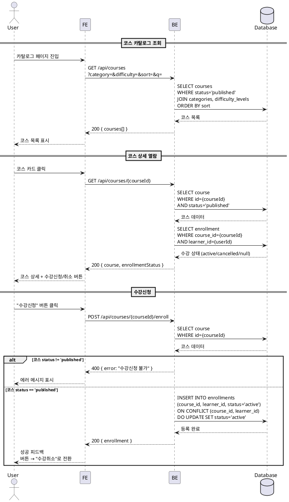
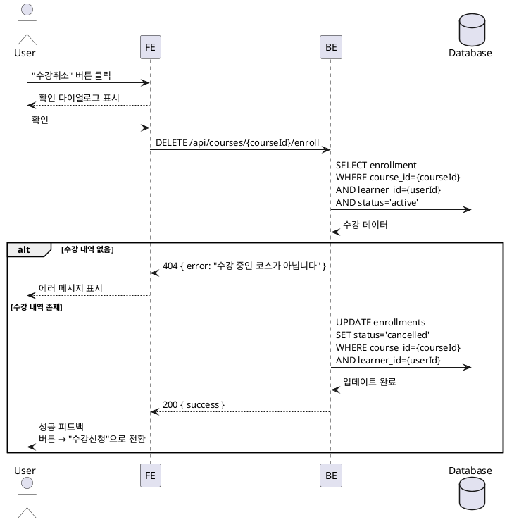

# UC-002: 코스 탐색 & 수강신청/취소

## Primary Actor

Learner (역할=learner인 인증된 사용자)

## Precondition

- 회원가입 및 온보딩(역할 선택, 프로필 입력)을 완료한 상태
- Learner 역할로 로그인되어 있는 상태

## Trigger

- 코스 카탈로그 페이지(`/courses`)에 접근
- 코스 상세 페이지에서 "수강신청" 또는 "수강취소" 버튼 클릭

---

## Main Scenario

### MS-1. 코스 카탈로그 탐색

1. Learner가 코스 카탈로그 페이지에 진입한다.
2. 시스템이 `status=published`인 코스 목록을 조회하여 표시한다.
3. Learner가 검색어, 필터(카테고리/난이도), 정렬(최신순/인기순)을 적용한다.
4. 시스템이 조건에 맞는 코스 목록을 갱신하여 표시한다.

### MS-2. 코스 상세 열람

1. Learner가 코스 카드를 클릭한다.
2. 시스템이 코스 상세 페이지(`/courses/[courseId]`)를 표시한다.
   - 소개, 커리큘럼(Markdown), 강사 정보(Bio), 수강생 수, 평균 평점
3. 시스템이 해당 Learner의 수강 상태를 확인하여 버튼을 표시한다.
   - 미등록 → "수강신청" 버튼
   - 등록(`active`) → "수강취소" 버튼

### MS-3. 수강신청

1. Learner가 "수강신청" 버튼을 클릭한다.
2. FE가 `POST /api/courses/[courseId]/enroll` 요청을 전송한다.
3. BE가 코스 상태(`published`) 및 Learner 역할을 검증한다.
4. BE가 `enrollments` 테이블에 UPSERT를 수행한다.
   - 신규: `INSERT (course_id, learner_id, status='active')`
   - 재수강: `ON CONFLICT DO UPDATE SET status='active'`
5. FE가 성공 피드백을 표시하고 버튼을 "수강취소"로 전환한다.

### MS-4. 수강취소

1. Learner가 "수강취소" 버튼을 클릭한다.
2. FE가 확인 다이얼로그를 표시한다.
3. Learner가 확인을 누르면 FE가 `DELETE /api/courses/[courseId]/enroll` 요청을 전송한다.
4. BE가 `enrollments` 테이블에서 해당 레코드를 `status='cancelled'`로 UPDATE한다.
5. FE가 성공 피드백을 표시하고 버튼을 "수강신청"으로 전환한다.

---

## Edge Cases

| # | 상황 | 처리 |
|---|------|------|
| E1 | 코스가 `draft` 또는 `archived` 상태 | 카탈로그에 노출하지 않음. 직접 URL 접근 시 404 반환 |
| E2 | 이미 `active` 상태에서 중복 수강신청 | 409 Conflict 반환, "이미 수강 중인 코스입니다" 메시지 |
| E3 | 미등록 상태에서 수강취소 시도 | 404 반환, "수강 중인 코스가 아닙니다" 메시지 |
| E4 | Instructor 역할이 수강신청 시도 | 403 Forbidden 반환, Learner 역할만 허용 |
| E5 | 미인증 사용자가 수강신청 시도 | 401 반환, 로그인 페이지로 리다이렉트 |
| E6 | 카탈로그 검색 결과가 0건 | "조건에 맞는 코스가 없습니다" 빈 상태 표시 |
| E7 | 네트워크 오류 | 에러 토스트 표시, 재시도 가능 |
| E8 | `archived` 코스에 수강신청 시도 | 400 반환, "수강신청이 마감된 코스입니다" 메시지 |

---

## Business Rules

| # | 규칙 |
|---|------|
| BR1 | `status=published`인 코스만 카탈로그에 노출되고 수강신청이 가능하다 |
| BR2 | `enrollments`는 `UNIQUE(course_id, learner_id)` 제약으로 중복 등록을 방지한다 |
| BR3 | 취소 후 재수강 시 기존 레코드를 `status='active'`로 UPSERT하여 재활성화한다 |
| BR4 | 수강취소 시 `status='cancelled'`로 변경하며, 대시보드/내 코스/성적 집계에서 제외한다 |
| BR5 | 수강신청은 Learner 역할만 가능하다 (역할 기반 가드) |
| BR6 | 코스 카탈로그 정렬은 최신순(created_at DESC)과 인기순(수강생 수 DESC)을 지원한다 |
| BR7 | 코스 카탈로그 필터는 카테고리(`category_id`)와 난이도(`difficulty_id`)를 지원한다 |

---

## Sequence Diagram

### 코스 탐색 & 수강신청

### 수강취소

