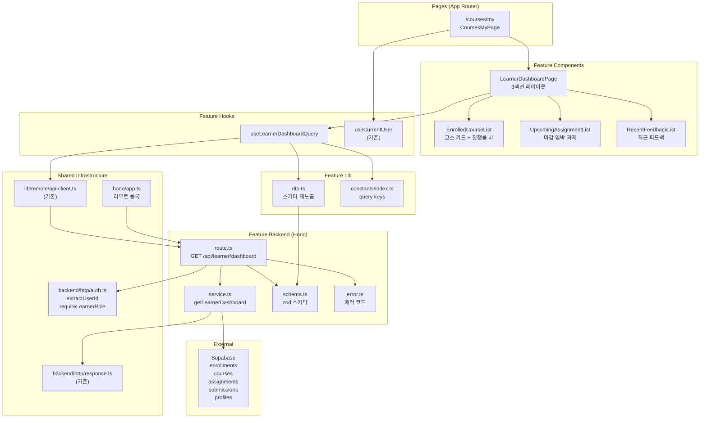

# UC-003 구현 설계: Learner 대시보드

## Context

UC-003 유스케이스(Learner 대시보드)를 구현하기 위한 모듈화 설계.
DB 스키마(`enrollments`, `courses`, `assignments`, `submissions`)는 `0002_create_lms_schema.sql`에 이미 존재.
`src/features/auth/` 및 `src/features/course/`의 패턴(schema→error→service→route, dto 재노출, React Query hooks, shadcn 컴포넌트)을 그대로 따른다.

## 현재 상태

### 이미 구현됨
- DB 스키마: `enrollments`, `courses`, `assignments`, `submissions` 테이블, 인덱스, 트리거
- 인증 인프라: `useCurrentUser`, `apiClient`, `respond`/`success`/`failure`, 미들웨어, Hono 싱글턴
- 공통 인증 유틸: `extractUserId` (`@/backend/http/auth.ts`)
- `(protected)/layout.tsx`: 인증 가드
- UC-002 (코스 탐색 & 수강신청/취소): `/courses`, `/courses/[courseId]`
- shadcn 컴포넌트: button, card, input, select, badge, toast, separator, dialog 등

### 구현 필요
- `src/backend/http/auth.ts`에 `requireLearnerRole` 공통 함수 추가
- `src/features/learner-dashboard/` 전체 (backend, hooks, components, lib, constants)
- `src/app/(protected)/courses/my/page.tsx` 페이지
- `src/backend/hono/app.ts`에 라우트 등록

---

## 개요

| # | 모듈 | 위치 | 설명 |
|---|------|------|------|
| 1 | Shared Auth Guard | `src/backend/http/auth.ts` | **수정** — `requireLearnerRole` 공통 역할 가드 추가 |
| 2 | Dashboard Backend Schema | `src/features/learner-dashboard/backend/schema.ts` | 대시보드 응답 zod 스키마 |
| 3 | Dashboard Backend Error | `src/features/learner-dashboard/backend/error.ts` | 대시보드 에러 코드 정의 |
| 4 | Dashboard Backend Service | `src/features/learner-dashboard/backend/service.ts` | 대시보드 데이터 집계 비즈니스 로직 |
| 5 | Dashboard Backend Route | `src/features/learner-dashboard/backend/route.ts` | Hono 라우터 (1개 엔드포인트) |
| 6 | Dashboard DTO | `src/features/learner-dashboard/lib/dto.ts` | 백엔드 스키마 프론트엔드 재노출 |
| 7 | Dashboard Constants | `src/features/learner-dashboard/constants/index.ts` | Query Key |
| 8 | useLearnerDashboardQuery | `src/features/learner-dashboard/hooks/useLearnerDashboardQuery.ts` | 대시보드 조회 훅 |
| 9 | LearnerDashboardPage | `src/features/learner-dashboard/components/learner-dashboard-page.tsx` | 메인 대시보드 레이아웃 |
| 10 | EnrolledCourseList | `src/features/learner-dashboard/components/enrolled-course-list.tsx` | 수강 코스 카드 그리드 + 진행률 바 |
| 11 | UpcomingAssignmentList | `src/features/learner-dashboard/components/upcoming-assignment-list.tsx` | 마감 임박 과제 목록 |
| 12 | RecentFeedbackList | `src/features/learner-dashboard/components/recent-feedback-list.tsx` | 최근 피드백 목록 |
| 13 | My Courses Page | `src/app/(protected)/courses/my/page.tsx` | Learner 대시보드 페이지 |
| 14 | Hono App | `src/backend/hono/app.ts` | **수정** — learner-dashboard 라우트 등록 |

---

## Diagram



---

## Implementation Plan

### Phase 1: Shared Infrastructure

#### 1-1. `src/backend/http/auth.ts` (수정)

기존 `extractUserId`에 추가하여 역할 기반 가드 함수 도입.

**추가 함수:**

```typescript
requireLearnerRole: (supabase, userId) => ErrorResult | null
// profiles 테이블에서 role 조회
// role !== 'learner' → failure(403, 'FORBIDDEN_ROLE', '학습자만 접근할 수 있습니다.')
// role === 'learner' → null (통과)
```

**Unit Test:**
- learner 역할 → null 반환 (통과)
- instructor 역할 → ErrorResult 반환 (403)
- operator 역할 → ErrorResult 반환 (403)
- 프로필 미존재 → ErrorResult 반환 (403)

---

### Phase 2: Backend Layer

#### 2-1. `src/features/learner-dashboard/backend/schema.ts`

**zod 스키마 정의:**

```typescript
// 수강 코스 + 진행률
enrolledCourseSchema: {
  id: z.string().uuid(),
  title: z.string(),
  description: z.string(),
  categoryName: z.string().nullable(),
  difficultyName: z.string().nullable(),
  instructorName: z.string(),
  progress: z.object({
    completed: z.number(),   // graded 제출물 수
    total: z.number(),       // published+closed 과제 수
    percentage: z.number(),  // 0~100
  }),
}

// 마감 임박 과제
upcomingAssignmentSchema: {
  id: z.string().uuid(),
  courseId: z.string().uuid(),
  courseTitle: z.string(),
  title: z.string(),
  dueDate: z.string(),
  submissionStatus: z.enum(['submitted', 'graded', 'resubmission_required']).nullable(),
}

// 최근 피드백
recentFeedbackSchema: {
  submissionId: z.string().uuid(),
  assignmentId: z.string().uuid(),
  assignmentTitle: z.string(),
  courseTitle: z.string(),
  score: z.number().nullable(),
  feedback: z.string().nullable(),
  status: z.enum(['submitted', 'graded', 'resubmission_required']),
  gradedAt: z.string().nullable(),
}

// 대시보드 전체 응답
learnerDashboardResponseSchema: {
  courses: z.array(enrolledCourseSchema),
  upcomingAssignments: z.array(upcomingAssignmentSchema),
  recentFeedback: z.array(recentFeedbackSchema),
}
```

**Unit Test:**
- 유효한 `enrolledCourseSchema` 입력 통과 확인
- progress.percentage 범위 확인
- `upcomingAssignmentSchema`의 submissionStatus nullable 확인
- `recentFeedbackSchema`의 score/gradedAt nullable 확인

---

#### 2-2. `src/features/learner-dashboard/backend/error.ts`

**에러 코드:**

```typescript
dashboardErrorCodes = {
  unauthorized: 'DASHBOARD_UNAUTHORIZED',
  forbiddenRole: 'DASHBOARD_FORBIDDEN_ROLE',
  fetchError: 'DASHBOARD_FETCH_ERROR',
} as const;
```

**Unit Test:**
- 에러 코드 값의 고유성 검증

---

#### 2-3. `src/features/learner-dashboard/backend/service.ts`

**함수:**

| 함수명 | 입력 | 출력 | 설명 |
|--------|------|------|------|
| `getLearnerDashboard` | `(supabase, userId: string)` | `HandlerResult<LearnerDashboardResponse>` | 수강 코스, 마감 임박 과제, 최근 피드백 집계 |

**비즈니스 로직 상세:**

`getLearnerDashboard` 5단계 데이터 집계:

**Step 1. 수강 중인 코스 목록:**
1. `enrollments` SELECT WHERE `learner_id={userId}` AND `status='active'`
2. JOIN `courses(id, title, description)`, `categories(name)`, `difficulty_levels(name)`, `profiles(name)`
3. 결과에서 `course_id` 배열 추출 (이후 쿼리에 사용)
4. courseIds가 빈 배열이면 빈 결과 즉시 반환

**Step 2. 코스별 전체 과제 수:**
1. `assignments` SELECT WHERE `course_id IN (courseIds)` AND `status IN ('published', 'closed')`
2. 클라이언트 사이드 GROUP BY `course_id` → Map<courseId, count>

**Step 3. 코스별 완료 과제 수:**
1. `submissions` SELECT WHERE `learner_id={userId}` AND `status='graded'`
2. JOIN `assignments(course_id)` — course_id 역참조
3. `courseIds`에 포함된 코스만 필터
4. 클라이언트 사이드 GROUP BY `course_id` → Map<courseId, count>

**Step 4. 진행률 계산 및 코스 응답 조립:**
1. 각 코스별: `percentage = total > 0 ? round(completed / total * 100) : 0`
2. `{ id, title, description, categoryName, difficultyName, instructorName, progress: { completed, total, percentage } }`

**Step 5. 마감 임박 과제:**
1. `assignments` SELECT WHERE `course_id IN (courseIds)` AND `status='published'` AND `due_date > now()`
2. JOIN `courses(title)` — 코스명 참조
3. ORDER BY `due_date ASC`, LIMIT 10
4. 해당 과제들의 Learner 제출 상태 조회: `submissions` WHERE `learner_id={userId}` AND `assignment_id IN (assignmentIds)`
5. 제출 상태 Map 조립 → 응답에 `submissionStatus` 포함

**Step 6. 최근 피드백:**
1. `submissions` SELECT WHERE `learner_id={userId}` AND `feedback IS NOT NULL`
2. JOIN `assignments(title, courses(title))` — 과제명, 코스명 역참조
3. ORDER BY `graded_at DESC`, LIMIT 10
4. `{ submissionId, assignmentId, assignmentTitle, courseTitle, score, feedback, status, gradedAt }`

**Unit Test:**
- 수강 코스 0건 → `courses: []`, `upcomingAssignments: []`, `recentFeedback: []` (E1)
- 수강 코스 있음 → 코스 목록에 포함
- `status='cancelled'` 수강 → 대시보드에서 제외 (BR1)
- 진행률 계산: 과제 3건 중 graded 2건 → 67% (BR2)
- 진행률 계산: 과제 0건 → 0% (E2)
- 마감 임박: `due_date > now()` AND `status='published'`만 포함 (BR3)
- 마감 임박: `due_date ASC` 정렬 확인
- 마감 임박: 과제 없음 → 빈 배열 (E3)
- 마감 임박: 제출 상태(submitted/graded/null) 정상 매핑
- 최근 피드백: `feedback IS NOT NULL`만 포함 (BR4)
- 최근 피드백: `graded_at DESC` 정렬 확인
- 최근 피드백: 피드백 없음 → 빈 배열 (E4)
- 최근 피드백: score, status 정상 포함
- DB 오류 시 500 + `DASHBOARD_FETCH_ERROR`

---

#### 2-4. `src/features/learner-dashboard/backend/route.ts`

**엔드포인트:**

| Method | Path | Auth | 설명 |
|--------|------|------|------|
| GET | `/api/learner/dashboard` | 필수 (Learner만) | 대시보드 데이터 |

**흐름:**
1. `extractUserId(c)` — 미인증 시 401 반환
2. `requireLearnerRole(supabase, userId)` — 비학습자 시 403 반환
3. `getLearnerDashboard(supabase, userId)` 호출
4. `respond(c, result)` 반환

---

### Phase 3: Shared / Infrastructure

#### 3-1. `src/features/learner-dashboard/lib/dto.ts`

```typescript
export {
  enrolledCourseSchema,
  upcomingAssignmentSchema,
  recentFeedbackSchema,
  learnerDashboardResponseSchema,
  type EnrolledCourse,
  type UpcomingAssignment,
  type RecentFeedback,
  type LearnerDashboardResponse,
} from '../backend/schema';
```

---

#### 3-2. `src/features/learner-dashboard/constants/index.ts`

```typescript
export const DASHBOARD_QUERY_KEYS = {
  all: ['learner-dashboard'] as const,
  dashboard: ['learner-dashboard', 'main'] as const,
} as const;
```

---

#### 3-3. `src/backend/hono/app.ts` (수정)

```typescript
import { registerLearnerDashboardRoutes } from '@/features/learner-dashboard/backend/route';
// ...
registerLearnerDashboardRoutes(app);  // 추가
```

---

### Phase 4: Frontend Hook

#### 4-1. `src/features/learner-dashboard/hooks/useLearnerDashboardQuery.ts`

```typescript
// apiClient.get('/api/learner/dashboard')로 호출
// learnerDashboardResponseSchema.parse(data) 응답 검증
// queryKey: DASHBOARD_QUERY_KEYS.dashboard
// staleTime: 60 * 1000
```

---

### Phase 5: Frontend Components

#### 5-1. `src/features/learner-dashboard/components/learner-dashboard-page.tsx`

메인 대시보드 레이아웃. 3개 섹션 + 로딩/에러 상태.

| 섹션 | 컴포넌트 | 데이터 |
|------|----------|--------|
| 수강 중인 코스 | `EnrolledCourseList` | `data.courses` |
| 마감 임박 과제 | `UpcomingAssignmentList` | `data.upcomingAssignments` |
| 최근 피드백 | `RecentFeedbackList` | `data.recentFeedback` |

- `useLearnerDashboardQuery()` 호출
- 로딩 시 스켈레톤 카드 표시
- 에러 시 에러 메시지 + "다시 시도" 버튼 (`refetch`)

**QA Sheet:**

| # | 시나리오 | 기대 결과 |
|---|----------|-----------|
| 1 | 정상 데이터 | 3개 섹션 모두 렌더링 |
| 2 | 로딩 중 | 스켈레톤 UI 표시 |
| 3 | 네트워크 오류 (E7) | 에러 메시지 + 재시도 버튼 |
| 4 | 미인증 접근 (E5) | 로그인 리다이렉트 (layout 가드) |

---

#### 5-2. `src/features/learner-dashboard/components/enrolled-course-list.tsx`

수강 코스 카드 그리드 + 진행률 바. shadcn `Card` + `Badge`.

| 영역 | 내용 |
|------|------|
| Header | 코스 제목, 카테고리 Badge, 난이도 Badge |
| Content | 강사명, 진행률 텍스트 (completed/total), Progress Bar |
| 전체 | 코스 상세 페이지(`/courses/[courseId]`)로 링크 |

**QA Sheet:**

| # | 시나리오 | 기대 결과 |
|---|----------|-----------|
| 1 | 수강 코스 있음 | 그리드 레이아웃에 코스 카드 표시 |
| 2 | 수강 코스 0건 (E1) | "수강 중인 코스가 없습니다" + 카탈로그 링크 |
| 3 | 과제 없는 코스 (E2) | 진행률 0% 표시 (0/0 완료) |
| 4 | 진행 중인 코스 | 진행률 바 부분 채움 (예: 67%) |
| 5 | 모든 과제 완료 | 진행률 100% |
| 6 | 카테고리/난이도 null | 해당 뱃지 미표시 |
| 7 | 카드 클릭 | `/courses/[courseId]`로 이동 |

---

#### 5-3. `src/features/learner-dashboard/components/upcoming-assignment-list.tsx`

마감 임박 과제 카드 목록. 마감일 기준 색상 구분.

| 영역 | 내용 |
|------|------|
| 왼쪽 | 과제명, 코스명 |
| 오른쪽 | 제출 상태 Badge, 남은 시간 (date-fns `formatDistanceToNow`) |

**마감일 색상 규칙:**
- 3일 이내: 빨간색 (`text-red-600`)
- 7일 이내: 노란색 (`text-yellow-600`)
- 그 외: 기본 (`text-muted-foreground`)

**제출 상태 Badge:**
- `submitted` → "제출됨" (secondary)
- `graded` → "채점완료" (default)
- `resubmission_required` → "재제출요청" (outline)
- `null` → 미표시

**QA Sheet:**

| # | 시나리오 | 기대 결과 |
|---|----------|-----------|
| 1 | 마감 임박 과제 있음 | 카드 목록 표시 |
| 2 | 과제 0건 (E3) | "예정된 과제가 없습니다" 빈 상태 |
| 3 | 마감 3일 이내 | 빨간색 텍스트 |
| 4 | 마감 7일 이내 | 노란색 텍스트 |
| 5 | 이미 제출된 과제 | "제출됨" 뱃지 표시 |
| 6 | 채점 완료 과제 | "채점완료" 뱃지 표시 |
| 7 | 미제출 과제 | 뱃지 미표시 |

---

#### 5-4. `src/features/learner-dashboard/components/recent-feedback-list.tsx`

최근 피드백 카드 목록. 점수 + 상태 뱃지 + 피드백 요약.

| 영역 | 내용 |
|------|------|
| 상단 왼쪽 | 과제명, 코스명 |
| 상단 오른쪽 | 점수 (XX점), 상태 Badge |
| 하단 | 피드백 내용 (2줄 truncate), 채점일 |

**상태 Badge 색상:**
- `submitted` → 파란색 (`bg-blue-100 text-blue-800`)
- `graded` → 초록색 (`bg-green-100 text-green-800`)
- `resubmission_required` → 주황색 (`bg-orange-100 text-orange-800`)

**QA Sheet:**

| # | 시나리오 | 기대 결과 |
|---|----------|-----------|
| 1 | 피드백 있음 | 카드 목록 표시 |
| 2 | 피드백 0건 (E4) | "아직 피드백이 없습니다" 빈 상태 |
| 3 | score null | 점수 영역 미표시 |
| 4 | 긴 피드백 | 2줄 truncate |
| 5 | 채점일 있음 | yyyy.MM.dd HH:mm 형식 표시 |
| 6 | 재제출 요청 상태 | 주황색 "재제출요청" 뱃지 |

---

### Phase 6: Page

#### 6-1. `src/app/(protected)/courses/my/page.tsx`

`(protected)` 라우트 그룹 하위 → 인증 가드 자동 적용.

**구성:**
- `LearnerDashboardPage` 컴포넌트 렌더링
- `params: Promise<Record<string, never>>` + `void params` 패턴

**QA Sheet:**

| # | 시나리오 | 기대 결과 |
|---|----------|-----------|
| 1 | Learner 사용자 접근 | 대시보드 표시 |
| 2 | 미인증 접근 (E5) | 로그인 페이지 리다이렉트 |
| 3 | Instructor 역할 접근 (E6) | 403 에러 표시 |
| 4 | 수강 코스 없음 | 빈 상태 UI + 카탈로그 링크 |

---

## 작업 순서 (의존성 기반)

```
Phase 1 (Shared Infrastructure)
└── 1-1. auth.ts에 requireLearnerRole 추가

Phase 2 (Backend — 순차)
├── 2-1. schema.ts
├── 2-2. error.ts
├── 2-3. service.ts (schema, error 의존)
└── 2-4. route.ts (service, schema, error, auth.ts 의존)

Phase 3 (Shared — Phase 2 후)
├── 3-1. dto.ts
├── 3-2. constants/index.ts
└── 3-3. hono/app.ts 수정

Phase 4 (Frontend Hook — Phase 3 후)
└── 4-1. useLearnerDashboardQuery.ts

Phase 5 (Frontend Components — Phase 4 후)
├── 5-1. learner-dashboard-page.tsx (useLearnerDashboardQuery 의존)
├── 5-2. enrolled-course-list.tsx
├── 5-3. upcoming-assignment-list.tsx
└── 5-4. recent-feedback-list.tsx

Phase 6 (Page — Phase 5 후)
└── 6-1. /courses/my/page.tsx (learner-dashboard-page 의존)
```

## 참조 파일

| 용도 | 파일 |
|------|------|
| Route 패턴 | `src/features/course/backend/route.ts` |
| Service 패턴 | `src/features/course/backend/service.ts` |
| Schema 패턴 | `src/features/course/backend/schema.ts` |
| Error 패턴 | `src/features/course/backend/error.ts` |
| 공통 인증 유틸 | `src/backend/http/auth.ts` |
| HTTP 응답 | `src/backend/http/response.ts` |
| Hono Context | `src/backend/hono/context.ts` |
| Query Hook 패턴 | `src/features/course/hooks/useCourseDetailQuery.ts` |
| DTO 패턴 | `src/features/course/lib/dto.ts` |
| API Client | `src/lib/remote/api-client.ts` |
| Page 패턴 | `src/app/(protected)/courses/page.tsx` |
| Protected Layout | `src/app/(protected)/layout.tsx` |
| Component 패턴 | `src/features/course/components/course-card.tsx` |
