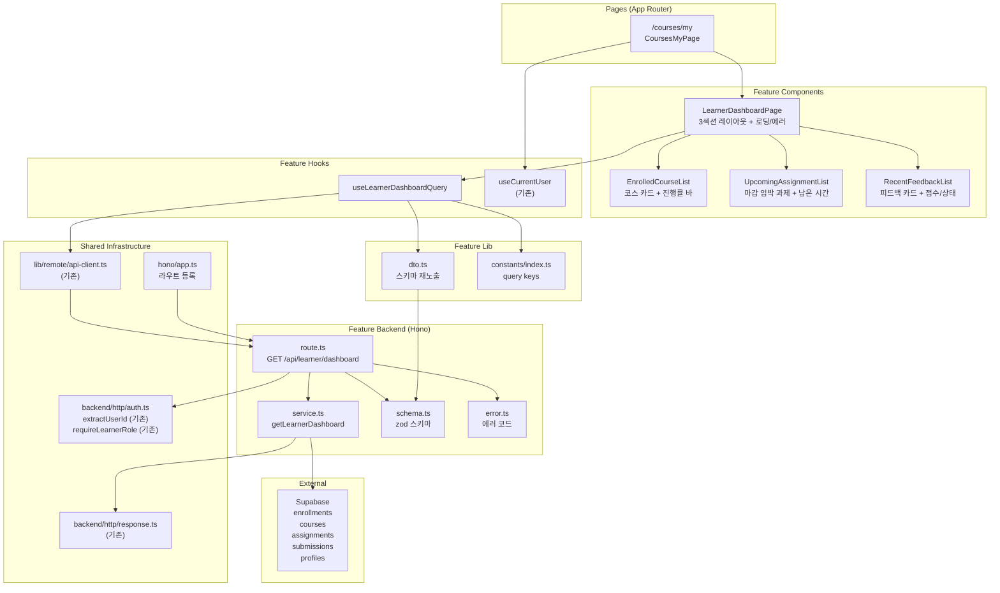

# UC-003 구현 설계: Learner 대시보드

## Context

UC-003 유스케이스(Learner 대시보드)를 구현하기 위한 모듈화 설계.
DB 스키마(`enrollments`, `courses`, `assignments`, `submissions`, `profiles`)는 `0002_create_lms_schema.sql`에 이미 존재.
`src/features/course/`의 패턴(schema→error→service→route, dto 재노출, React Query hooks, shadcn 컴포넌트)을 그대로 따른다.

## 현재 상태

### 이미 구현됨
- DB 스키마: `enrollments`, `courses`, `assignments`, `submissions` 테이블, 인덱스, 트리거
- 인증 인프라: `useCurrentUser`, `apiClient`, `respond`/`success`/`failure`, Hono 싱글턴
- 공통 인증 유틸: `extractUserId`, `requireLearnerRole` (`@/backend/http/auth.ts`)
- `(protected)/layout.tsx`: 인증 가드
- UC-002 (코스 탐색 & 수강신청/취소): `/courses`, `/courses/[courseId]`
- shadcn 컴포넌트: button, card, badge, separator, dialog 등

### 구현 필요
- `src/features/learner-dashboard/` 전체 (backend, hooks, components, lib, constants)
- `src/app/(protected)/courses/my/page.tsx` 페이지
- `src/backend/hono/app.ts`에 라우트 등록

---

## 개요

| # | 모듈 | 위치 | 설명 |
|---|------|------|------|
| 1 | Dashboard Backend Schema | `src/features/learner-dashboard/backend/schema.ts` | 대시보드 응답 zod 스키마 |
| 2 | Dashboard Backend Error | `src/features/learner-dashboard/backend/error.ts` | 대시보드 에러 코드 정의 |
| 3 | Dashboard Backend Service | `src/features/learner-dashboard/backend/service.ts` | 대시보드 데이터 집계 비즈니스 로직 |
| 4 | Dashboard Backend Route | `src/features/learner-dashboard/backend/route.ts` | Hono 라우터 (1개 엔드포인트) |
| 5 | Dashboard DTO | `src/features/learner-dashboard/lib/dto.ts` | 백엔드 스키마 프론트엔드 재노출 |
| 6 | Dashboard Constants | `src/features/learner-dashboard/constants/index.ts` | Query Key |
| 7 | useLearnerDashboardQuery | `src/features/learner-dashboard/hooks/useLearnerDashboardQuery.ts` | 대시보드 조회 훅 |
| 8 | LearnerDashboardPage | `src/features/learner-dashboard/components/learner-dashboard-page.tsx` | 메인 대시보드 레이아웃 (3섹션) |
| 9 | EnrolledCourseList | `src/features/learner-dashboard/components/enrolled-course-list.tsx` | 수강 코스 카드 그리드 + 진행률 바 |
| 10 | UpcomingAssignmentList | `src/features/learner-dashboard/components/upcoming-assignment-list.tsx` | 마감 임박 과제 목록 |
| 11 | RecentFeedbackList | `src/features/learner-dashboard/components/recent-feedback-list.tsx` | 최근 피드백 목록 |
| 12 | My Courses Page | `src/app/(protected)/courses/my/page.tsx` | Learner 대시보드 페이지 |
| 13 | Hono App | `src/backend/hono/app.ts` | **수정** — learner-dashboard 라우트 등록 |

---

## Diagram



---

## Implementation Plan

### Phase 1: Backend Layer

#### 1-1. `src/features/learner-dashboard/backend/schema.ts`

**zod 스키마 정의:**

```typescript
// 수강 코스 + 진행률
enrolledCourseSchema: {
  id: z.string().uuid(),
  title: z.string(),
  description: z.string(),
  categoryName: z.string().nullable(),
  difficultyName: z.string().nullable(),
  instructorName: z.string(),
  progress: z.object({
    completed: z.number(),   // status='graded' 제출물 수
    total: z.number(),       // status IN ('published','closed') 과제 수
    percentage: z.number(),  // round(completed/total*100), 과제 0건이면 0
  }),
}

// 마감 임박 과제
upcomingAssignmentSchema: {
  id: z.string().uuid(),
  courseId: z.string().uuid(),
  courseTitle: z.string(),
  title: z.string(),
  dueDate: z.string(),
  submissionStatus: z.enum(['submitted', 'graded', 'resubmission_required']).nullable(),
}

// 최근 피드백
recentFeedbackSchema: {
  submissionId: z.string().uuid(),
  assignmentId: z.string().uuid(),
  assignmentTitle: z.string(),
  courseTitle: z.string(),
  score: z.number().nullable(),
  feedback: z.string().nullable(),
  status: z.enum(['submitted', 'graded', 'resubmission_required']),
  gradedAt: z.string().nullable(),
}

// 대시보드 전체 응답
learnerDashboardResponseSchema: {
  courses: z.array(enrolledCourseSchema),
  upcomingAssignments: z.array(upcomingAssignmentSchema),
  recentFeedback: z.array(recentFeedbackSchema),
}
```

**Unit Test:**
- 유효한 `enrolledCourseSchema` 입력 통과
- progress.percentage가 0~100 범위
- `upcomingAssignmentSchema`의 submissionStatus nullable 통과
- `recentFeedbackSchema`의 score/gradedAt nullable 통과

---

#### 1-2. `src/features/learner-dashboard/backend/error.ts`

**에러 코드:**

```typescript
dashboardErrorCodes = {
  unauthorized: 'DASHBOARD_UNAUTHORIZED',
  forbiddenRole: 'DASHBOARD_FORBIDDEN_ROLE',
  fetchError: 'DASHBOARD_FETCH_ERROR',
} as const;
```

**Unit Test:**
- 에러 코드 값의 고유성 검증

---

#### 1-3. `src/features/learner-dashboard/backend/service.ts`

**함수:**

| 함수명 | 입력 | 출력 | 설명 |
|--------|------|------|------|
| `getLearnerDashboard` | `(supabase, userId: string)` | `HandlerResult<LearnerDashboardResponse>` | 수강 코스 + 진행률, 마감 임박 과제, 최근 피드백 집계 |

**비즈니스 로직 상세 (6단계):**

**Step 1 — 수강 중인 코스 목록 (MS-1):**
1. `enrollments` SELECT WHERE `learner_id={userId}` AND `status='active'` (BR1)
2. JOIN `courses(id, title, description)`, `categories(name)`, `difficulty_levels(name)`, `profiles!courses_instructor_id_fkey(name)`
3. 결과에서 `course_id` 배열 추출 → courseIds
4. courseIds 빈 배열이면 모든 섹션 빈 배열로 즉시 반환 (E1)

**Step 2 — 코스별 전체 과제 수 (MS-1, BR2):**
1. `assignments` SELECT WHERE `course_id IN (courseIds)` AND `status IN ('published', 'closed')`
2. 클라이언트 사이드 GROUP BY `course_id` → Map<courseId, totalCount>

**Step 3 — 코스별 완료 과제 수 (MS-1, BR2):**
1. `submissions` SELECT WHERE `learner_id={userId}` AND `status='graded'`
2. JOIN `assignments(course_id)` — course_id 역참조
3. courseIds에 포함된 코스만 필터
4. 클라이언트 사이드 GROUP BY `course_id` → Map<courseId, completedCount>

**Step 4 — 코스 응답 조립 + 진행률 계산 (MS-1, BR2):**
1. 각 코스별: `percentage = total > 0 ? round(completed / total * 100) : 0` (E2)
2. `{ id, title, description, categoryName, difficultyName, instructorName, progress }`

**Step 5 — 마감 임박 과제 (MS-2, BR3):**
1. `assignments` SELECT WHERE `course_id IN (courseIds)` AND `status='published'` AND `due_date > now()`
2. JOIN `courses(title)`
3. ORDER BY `due_date ASC`, LIMIT 10
4. 해당 과제들의 Learner 제출 상태 조회: `submissions` WHERE `learner_id={userId}` AND `assignment_id IN (ids)`
5. Map<assignmentId, submissionStatus> → 응답에 매핑

**Step 6 — 최근 피드백 (MS-3, BR4):**
1. `submissions` SELECT WHERE `learner_id={userId}` AND `feedback IS NOT NULL`
2. JOIN `assignments(title, courses(title))`
3. ORDER BY `graded_at DESC`, LIMIT 10
4. `{ submissionId, assignmentId, assignmentTitle, courseTitle, score, feedback, status, gradedAt }`

**Unit Test:**
- 수강 코스 0건 → 빈 응답 반환 (E1)
- 수강 코스 있음 → courses에 포함
- `status='cancelled'` 수강 → 제외 (BR1)
- `status='archived'` 코스 + active 수강 → 포함 (BR6)
- 진행률: 과제 3건, graded 2건 → 67% (BR2)
- 진행률: 과제 0건 → 0% (E2)
- 마감 임박: `due_date > now()` AND `status='published'`만 (BR3)
- 마감 임박: `due_date ASC` 정렬
- 마감 임박: 0건 → 빈 배열 (E3)
- 마감 임박: 제출 상태 매핑 (submitted/graded/resubmission_required/null)
- 최근 피드백: `feedback IS NOT NULL`만 (BR4)
- 최근 피드백: `graded_at DESC` 정렬
- 최근 피드백: 0건 → 빈 배열 (E4)
- DB 오류 → 500, `DASHBOARD_FETCH_ERROR`

---

#### 1-4. `src/features/learner-dashboard/backend/route.ts`

**엔드포인트:**

| Method | Path | Auth | 설명 |
|--------|------|------|------|
| GET | `/api/learner/dashboard` | 필수 (Learner만) | 대시보드 전체 데이터 |

**흐름:**
1. `extractUserId(c)` — 미인증 시 401, `DASHBOARD_UNAUTHORIZED` (E5)
2. `requireLearnerRole(supabase, userId)` — 비학습자 시 403, `DASHBOARD_FORBIDDEN_ROLE` (E6)
3. `getLearnerDashboard(supabase, userId)` 호출
4. `respond(c, result)` 반환

---

### Phase 2: Shared / Infrastructure

#### 2-1. `src/features/learner-dashboard/lib/dto.ts`

```typescript
export {
  enrolledCourseSchema,
  upcomingAssignmentSchema,
  recentFeedbackSchema,
  learnerDashboardResponseSchema,
  type EnrolledCourse,
  type UpcomingAssignment,
  type RecentFeedback,
  type LearnerDashboardResponse,
} from '../backend/schema';
```

---

#### 2-2. `src/features/learner-dashboard/constants/index.ts`

```typescript
export const DASHBOARD_QUERY_KEYS = {
  all: ['learner-dashboard'] as const,
  dashboard: ['learner-dashboard', 'main'] as const,
} as const;
```

---

#### 2-3. `src/backend/hono/app.ts` (수정)

```typescript
import { registerLearnerDashboardRoutes } from '@/features/learner-dashboard/backend/route';
// ...
registerLearnerDashboardRoutes(app);  // registerCourseRoutes 다음에 추가
```

---

### Phase 3: Frontend Hook

#### 3-1. `src/features/learner-dashboard/hooks/useLearnerDashboardQuery.ts`

```typescript
// apiClient.get('/api/learner/dashboard')로 호출
// learnerDashboardResponseSchema.parse(data) 응답 검증
// queryKey: DASHBOARD_QUERY_KEYS.dashboard
// staleTime: 60 * 1000
```

---

### Phase 4: Frontend Components

#### 4-1. `src/features/learner-dashboard/components/learner-dashboard-page.tsx`

메인 대시보드 레이아웃. `useLearnerDashboardQuery` 호출하여 3개 섹션에 데이터 분배.

| 섹션 | 제목 | 컴포넌트 | 데이터 |
|------|------|----------|--------|
| 1 | 수강 중인 코스 | `EnrolledCourseList` | `data.courses` |
| 2 | 마감 임박 과제 | `UpcomingAssignmentList` | `data.upcomingAssignments` |
| 3 | 최근 피드백 | `RecentFeedbackList` | `data.recentFeedback` |

- 로딩 시 스켈레톤 카드 표시
- 에러 시 에러 메시지 + "다시 시도" 버튼 (`refetch`)

**QA Sheet:**

| # | 시나리오 | 기대 결과 |
|---|----------|-----------|
| 1 | 정상 데이터 | 3개 섹션 모두 렌더링 |
| 2 | 로딩 중 | 스켈레톤 UI 표시 |
| 3 | 네트워크 오류 (E7) | 에러 메시지 + 재시도 버튼 |
| 4 | 미인증 접근 (E5) | 로그인 리다이렉트 (layout 가드) |

---

#### 4-2. `src/features/learner-dashboard/components/enrolled-course-list.tsx`

수강 코스 카드 그리드. shadcn `Card` + `Badge`. 각 카드는 코스 상세 페이지 링크.

| 영역 | 내용 |
|------|------|
| Header | 코스 제목(line-clamp-1), 카테고리 Badge, 난이도 Badge |
| Content | 강사명, 진행률 텍스트 (completed/total 완료), Progress Bar (% 너비) |

**진행률 바:**
- `div.h-2.rounded-full.bg-muted` 배경
- `div.h-full.rounded-full.bg-primary` 내부 (width: `${percentage}%`)

**QA Sheet:**

| # | 시나리오 | 기대 결과 |
|---|----------|-----------|
| 1 | 수강 코스 있음 | 그리드(sm:2열, lg:3열) 레이아웃에 카드 표시 |
| 2 | 수강 코스 0건 (E1) | "수강 중인 코스가 없습니다" + 카탈로그 링크 |
| 3 | 과제 없는 코스 (E2) | 진행률 0% (0/0 완료) |
| 4 | 진행 중인 코스 | 바 부분 채움 (예: 67%) |
| 5 | 모든 과제 완료 | 진행률 100% |
| 6 | 카테고리/난이도 null | 해당 뱃지 미표시 |
| 7 | 카드 클릭 | `/courses/[courseId]`로 이동 |

---

#### 4-3. `src/features/learner-dashboard/components/upcoming-assignment-list.tsx`

마감 임박 과제 카드 목록. `date-fns`로 남은 시간 표시.

| 영역 | 내용 |
|------|------|
| 왼쪽 | 과제명(truncate), 코스명 |
| 오른쪽 | 제출 상태 Badge, 남은 시간 (`formatDistanceToNow`, locale: ko) |

**마감일 색상 규칙:**
- `differenceInDays` ≤ 3 → `text-red-600`
- `differenceInDays` ≤ 7 → `text-yellow-600`
- 그 외 → `text-muted-foreground`

**제출 상태 Badge:**
- `submitted` → "제출됨" (variant: secondary)
- `graded` → "채점완료" (variant: default)
- `resubmission_required` → "재제출요청" (variant: outline)
- `null` → Badge 미표시

**QA Sheet:**

| # | 시나리오 | 기대 결과 |
|---|----------|-----------|
| 1 | 마감 임박 과제 있음 | 카드 목록 표시 |
| 2 | 과제 0건 (E3) | "예정된 과제가 없습니다" 빈 상태 |
| 3 | 마감 3일 이내 | 빨간색 남은 시간 |
| 4 | 마감 7일 이내 | 노란색 남은 시간 |
| 5 | 이미 제출된 과제 | "제출됨" 뱃지 |
| 6 | 채점 완료 과제 | "채점완료" 뱃지 |
| 7 | 미제출 과제 | 뱃지 미표시 |

---

#### 4-4. `src/features/learner-dashboard/components/recent-feedback-list.tsx`

최근 피드백 카드 목록. 점수 + 상태 뱃지 + 피드백 내용 요약.

| 영역 | 내용 |
|------|------|
| 상단 좌 | 과제명(truncate), 코스명 |
| 상단 우 | 점수 (XX점), 상태 Badge |
| 하단 | 피드백 내용 (line-clamp-2), 채점일 (yyyy.MM.dd HH:mm) |

**상태 Badge 색상:**
- `submitted` → `bg-blue-100 text-blue-800` "제출됨"
- `graded` → `bg-green-100 text-green-800` "채점완료"
- `resubmission_required` → `bg-orange-100 text-orange-800` "재제출요청"

**QA Sheet:**

| # | 시나리오 | 기대 결과 |
|---|----------|-----------|
| 1 | 피드백 있음 | 카드 목록 표시 |
| 2 | 피드백 0건 (E4) | "아직 피드백이 없습니다" 빈 상태 |
| 3 | score null | 점수 영역 미표시 |
| 4 | 긴 피드백 | 2줄 truncate |
| 5 | gradedAt 있음 | yyyy.MM.dd HH:mm 형식 |
| 6 | 재제출 요청 상태 | 주황색 "재제출요청" 뱃지 |

---

### Phase 5: Page

#### 5-1. `src/app/(protected)/courses/my/page.tsx`

`(protected)` 라우트 그룹 하위 → 인증 가드 자동 적용.

**구성:**
- `LearnerDashboardPage` 컴포넌트 렌더링
- `params: Promise<Record<string, never>>` + `void params` 패턴

**QA Sheet:**

| # | 시나리오 | 기대 결과 |
|---|----------|-----------|
| 1 | Learner 사용자 접근 | 대시보드 3개 섹션 표시 |
| 2 | 미인증 접근 (E5) | 로그인 페이지 리다이렉트 |
| 3 | Instructor 역할 접근 (E6) | 403 에러 메시지 표시 |
| 4 | 수강 코스 없음 (E1) | 빈 상태 UI + 카탈로그 링크 |

---

## 작업 순서 (의존성 기반)

```
Phase 1 (Backend — 순차)
├── 1-1. schema.ts
├── 1-2. error.ts
├── 1-3. service.ts (schema, error 의존)
└── 1-4. route.ts (service, schema, error, auth.ts 의존)

Phase 2 (Shared — Phase 1 후)
├── 2-1. dto.ts
├── 2-2. constants/index.ts
└── 2-3. hono/app.ts 수정

Phase 3 (Frontend Hook — Phase 2 후)
└── 3-1. useLearnerDashboardQuery.ts

Phase 4 (Frontend Components — Phase 3 후)
├── 4-1. learner-dashboard-page.tsx (useLearnerDashboardQuery 의존)
├── 4-2. enrolled-course-list.tsx
├── 4-3. upcoming-assignment-list.tsx
└── 4-4. recent-feedback-list.tsx

Phase 5 (Page — Phase 4 후)
└── 5-1. /courses/my/page.tsx (learner-dashboard-page 의존)
```

## 참조 파일

| 용도 | 파일 |
|------|------|
| Route 패턴 | `src/features/course/backend/route.ts` |
| Service 패턴 | `src/features/course/backend/service.ts` |
| Schema 패턴 | `src/features/course/backend/schema.ts` |
| Error 패턴 | `src/features/course/backend/error.ts` |
| 공통 인증 유틸 | `src/backend/http/auth.ts` |
| HTTP 응답 | `src/backend/http/response.ts` |
| Hono Context | `src/backend/hono/context.ts` |
| Query Hook 패턴 | `src/features/course/hooks/useCourseDetailQuery.ts` |
| DTO 패턴 | `src/features/course/lib/dto.ts` |
| Constants 패턴 | `src/features/course/constants/index.ts` |
| API Client | `src/lib/remote/api-client.ts` |
| Component 패턴 (카드) | `src/features/course/components/course-card.tsx` |
| Component 패턴 (리스트) | `src/features/course/components/course-list.tsx` |
| Page 패턴 | `src/app/(protected)/courses/page.tsx` |
| Protected Layout | `src/app/(protected)/layout.tsx` |
