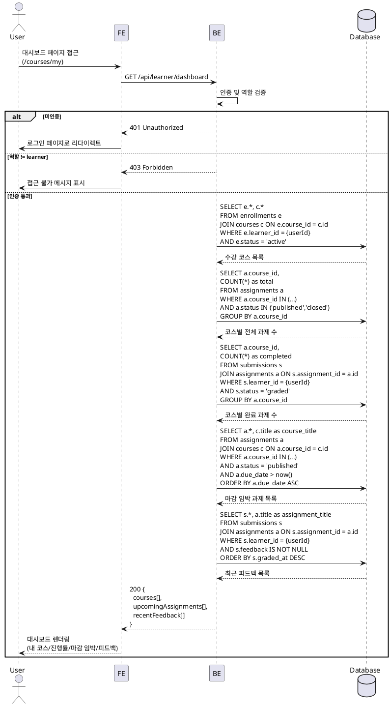

# UC-003: Learner 대시보드

## Primary Actor

Learner (역할=learner인 인증된 사용자)

## Precondition

- 회원가입 및 온보딩(역할 선택, 프로필 입력)을 완료한 상태
- Learner 역할로 로그인되어 있는 상태

## Trigger

- Learner가 대시보드 페이지(`/courses/my`)에 접근한다.

---

## Main Scenario

### MS-1. 내 코스 목록 및 진행률 조회

1. Learner가 대시보드 페이지에 진입한다.
2. FE가 `GET /api/learner/dashboard` 요청을 전송한다.
3. BE가 인증 및 역할(`learner`)을 검증한다.
4. BE가 `enrollments(status='active')` JOIN `courses`로 수강 코스 목록을 조회한다.
5. BE가 코스별 진행률을 계산한다.
   - 분모: 해당 코스의 `status IN ('published', 'closed')` assignments 수
   - 분자: 해당 Learner의 `status='graded'` submissions 수
   - 진행률 = 분자 / 분모 (과제가 0건이면 0%)
6. FE가 코스 카드 목록과 진행률 바를 렌더링한다.

### MS-2. 마감 임박 과제 표시

1. BE가 수강 코스의 `status='published'` assignments 중 `due_date > now()`인 과제를 `due_date ASC` 정렬로 조회한다.
2. FE가 마감 임박 과제 목록을 표시한다 (과제명, 코스명, 마감일).

### MS-3. 최근 피드백 표시

1. BE가 Learner의 submissions 중 `feedback IS NOT NULL`인 제출물을 `graded_at DESC` 정렬로 조회한다.
2. FE가 최근 피드백 목록을 표시한다 (과제명, 점수, 피드백 요약, 상태).

---

## Edge Cases

| # | 상황 | 처리 |
|---|------|------|
| E1 | 수강 중인 코스가 0건 | 빈 상태 UI 표시 ("수강 중인 코스가 없습니다. 코스를 둘러보세요.") + 카탈로그 링크 |
| E2 | 코스에 과제가 없음 | 해당 코스 진행률 0% 표시, 마감 임박 영역에 노출 없음 |
| E3 | 마감 임박 과제가 0건 | "예정된 과제가 없습니다" 빈 상태 표시 |
| E4 | 피드백이 없음 (채점 전) | "아직 피드백이 없습니다" 빈 상태 표시 |
| E5 | 미인증 사용자 접근 | 401 반환, 로그인 페이지로 리다이렉트 |
| E6 | Instructor 역할이 접근 | 403 Forbidden 반환 |
| E7 | 네트워크 오류 | 에러 메시지 표시, 재시도 가능 |

---

## Business Rules

| # | 규칙 |
|---|------|
| BR1 | `enrollments.status='active'`인 코스만 대시보드에 표시한다. `cancelled` 수강은 제외. |
| BR2 | 진행률 = `status='graded'` 제출물 수 / 코스 전체 과제(`status IN ('published','closed')`) 수. 과제 0건이면 0%. |
| BR3 | 마감 임박 과제는 `due_date > now()` AND `status='published'`인 과제만 대상이며, 마감일 오름차순으로 정렬한다. |
| BR4 | 최근 피드백은 `feedback IS NOT NULL`인 제출물을 `graded_at DESC`로 정렬하여 표시한다. |
| BR5 | 대시보드 접근은 Learner 역할만 허용한다 (역할 기반 가드). |
| BR6 | 수강 코스가 `archived`로 전환되어도 기존 `active` 수강은 대시보드에 유지된다. |

---

## Sequence Diagram

