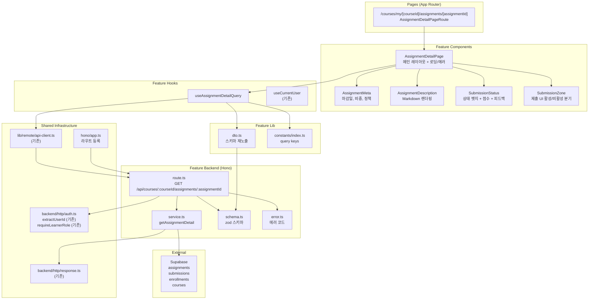

# UC-004 구현 설계: 과제 상세 열람 (Learner)

## Context

UC-004 유스케이스(과제 상세 열람)를 구현하기 위한 모듈화 설계.
DB 스키마(`assignments`, `submissions`, `enrollments`, `courses`)는 `0002_create_lms_schema.sql`에 이미 존재.
`src/features/learner-dashboard/` 및 `src/features/course/`의 패턴(schema→error→service→route, dto 재노출, React Query hooks, shadcn 컴포넌트)을 그대로 따른다.

## 현재 상태

### 이미 구현됨
- DB 스키마: `assignments` (title, description, due_date, weight, allow_late, allow_resubmission, status), `submissions` (content, link, is_late, status, score, feedback, graded_at), `enrollments` 테이블
- 인증 인프라: `useCurrentUser`, `apiClient`, `respond`/`success`/`failure`, Hono 싱글턴
- 공통 인증 유틸: `extractUserId`, `requireLearnerRole` (`@/backend/http/auth.ts`)
- `(protected)/layout.tsx`: 인증 가드
- UC-003 (Learner 대시보드): `/courses/my` — `upcoming-assignment-list`에서 과제 목록 링크 타겟이 되는 페이지가 필요한 상태
- shadcn 컴포넌트: button, card, badge, separator, dialog 등

### 구현 필요
- `src/features/assignment-detail/` 전체 (backend, hooks, components, lib, constants)
- `src/app/(protected)/courses/my/[courseId]/assignments/[assignmentId]/page.tsx` 신규 페이지
- `src/backend/hono/app.ts`에 라우트 등록
- Markdown 렌더링 라이브러리 도입 (react-markdown 또는 동급)

---

## 개요

| # | 모듈 | 위치 | 설명 |
|---|------|------|------|
| 1 | Assignment Detail Backend Schema | `src/features/assignment-detail/backend/schema.ts` | 과제 상세 + 제출물 응답 zod 스키마, 파라미터 스키마 |
| 2 | Assignment Detail Backend Error | `src/features/assignment-detail/backend/error.ts` | 과제 상세 조회 에러 코드 정의 |
| 3 | Assignment Detail Backend Service | `src/features/assignment-detail/backend/service.ts` | 수강 검증, 과제 조회, 제출물 조회 비즈니스 로직 |
| 4 | Assignment Detail Backend Route | `src/features/assignment-detail/backend/route.ts` | Hono 라우터 (GET 1개 엔드포인트) |
| 5 | Assignment Detail DTO | `src/features/assignment-detail/lib/dto.ts` | 백엔드 스키마 프론트엔드 재노출 |
| 6 | Assignment Detail Constants | `src/features/assignment-detail/constants/index.ts` | Query Key |
| 7 | useAssignmentDetailQuery | `src/features/assignment-detail/hooks/useAssignmentDetailQuery.ts` | 과제 상세 조회 훅 |
| 8 | AssignmentDetailPage | `src/features/assignment-detail/components/assignment-detail-page.tsx` | 메인 레이아웃 (상세 정보 + 제출 영역) |
| 9 | AssignmentMeta | `src/features/assignment-detail/components/assignment-meta.tsx` | 마감일, 비중, 정책 메타 정보 카드 |
| 10 | AssignmentDescription | `src/features/assignment-detail/components/assignment-description.tsx` | Markdown 렌더링 영역 |
| 11 | SubmissionStatus | `src/features/assignment-detail/components/submission-status.tsx` | 기존 제출물 상태 뱃지 + 점수 + 피드백 표시 |
| 12 | SubmissionZone | `src/features/assignment-detail/components/submission-zone.tsx` | 제출 가능 여부에 따른 UI 영역 (활성/비활성 분기) |
| 13 | Assignment Detail Page | `src/app/(protected)/courses/my/[courseId]/assignments/[assignmentId]/page.tsx` | 과제 상세 페이지 (신규) |
| 14 | Hono App | `src/backend/hono/app.ts` | **수정** — assignment-detail 라우트 등록 |

---

## Diagram



---

## Implementation Plan

### Phase 1: Backend Layer

#### 1-1. `src/features/assignment-detail/backend/schema.ts`

**zod 스키마 정의:**

```typescript
// URL 파라미터
assignmentDetailParamSchema: {
  courseId: z.string().uuid({ message: '유효한 코스 ID가 필요합니다.' }),
  assignmentId: z.string().uuid({ message: '유효한 과제 ID가 필요합니다.' }),
}

// 과제 상세
assignmentDetailSchema: {
  id: z.string().uuid(),
  courseId: z.string().uuid(),
  title: z.string(),
  description: z.string(),        // Markdown 원문
  dueDate: z.string(),            // ISO 8601
  weight: z.number().int(),
  allowLate: z.boolean(),
  allowResubmission: z.boolean(),
  status: z.enum(['published', 'closed']),
}

// 제출물 (존재할 경우)
submissionDetailSchema: {
  id: z.string().uuid(),
  content: z.string(),
  link: z.string().nullable(),
  isLate: z.boolean(),
  status: z.enum(['submitted', 'graded', 'resubmission_required']),
  score: z.number().nullable(),
  feedback: z.string().nullable(),
  submittedAt: z.string(),
  gradedAt: z.string().nullable(),
}

// 전체 응답
assignmentDetailResponseSchema: {
  assignment: assignmentDetailSchema,
  submission: submissionDetailSchema.nullable(),
}
```

**Unit Test:**
- 유효한 `assignmentDetailParamSchema` 입력 통과
- `courseId`가 UUID 형식이 아닐 때 실패
- `assignmentId`가 UUID 형식이 아닐 때 실패
- `assignmentDetailSchema`의 status가 'draft'일 때 실패 (enum 범위 밖)
- `submissionDetailSchema`의 score, feedback, gradedAt nullable 통과
- `assignmentDetailResponseSchema`에서 submission이 null일 때 통과

---

#### 1-2. `src/features/assignment-detail/backend/error.ts`

**에러 코드:**

```typescript
assignmentDetailErrorCodes = {
  unauthorized: 'ASSIGNMENT_DETAIL_UNAUTHORIZED',
  forbiddenRole: 'ASSIGNMENT_DETAIL_FORBIDDEN_ROLE',
  notEnrolled: 'ASSIGNMENT_DETAIL_NOT_ENROLLED',
  notFound: 'ASSIGNMENT_DETAIL_NOT_FOUND',
  fetchError: 'ASSIGNMENT_DETAIL_FETCH_ERROR',
  validationError: 'ASSIGNMENT_DETAIL_VALIDATION_ERROR',
} as const;
```

**Unit Test:**
- 에러 코드 값의 고유성 검증
- `as const` 타입 추론으로 `AssignmentDetailServiceError` 유니온 타입 생성 확인

---

#### 1-3. `src/features/assignment-detail/backend/service.ts`

**함수:**

| 함수명 | 입력 | 출력 | 설명 |
|--------|------|------|------|
| `getAssignmentDetail` | `(supabase, { courseId, assignmentId, userId })` | `HandlerResult<AssignmentDetailResponse>` | 수강 검증 → 과제 조회 → 제출물 조회 → 조합 반환 |

**비즈니스 로직 상세 (4단계):**

**Step 1 — 수강 등록 검증 (BR2, E2):**
1. `enrollments` SELECT WHERE `course_id={courseId}` AND `learner_id={userId}` AND `status='active'`
2. 결과 없을 경우 → 403, `ASSIGNMENT_DETAIL_NOT_ENROLLED`, "수강 중인 코스가 아닙니다."

**Step 2 — 과제 조회 (BR1, E1, E3):**
1. `assignments` SELECT WHERE `id={assignmentId}` AND `course_id={courseId}` AND `status IN ('published', 'closed')`
2. `maybeSingle()` 사용
3. 결과 없을 경우 (draft, 미존재) → 404, `ASSIGNMENT_DETAIL_NOT_FOUND`, "존재하지 않는 과제입니다."

**Step 3 — 제출물 조회 (nullable):**
1. `submissions` SELECT WHERE `assignment_id={assignmentId}` AND `learner_id={userId}`
2. `maybeSingle()` 사용
3. 결과 없을 경우 → submission: null 로 처리 (에러 아님)

**Step 4 — 응답 조합:**
1. assignment 데이터를 camelCase 응답 스키마에 매핑
2. submission 데이터가 존재하면 camelCase로 매핑, 없으면 null
3. `success({ assignment, submission })` 반환

**Unit Test:**
- 수강 등록 없음 → 403, `ASSIGNMENT_DETAIL_NOT_ENROLLED` (E2)
- `status='draft'` 과제 접근 → 404, `ASSIGNMENT_DETAIL_NOT_FOUND` (E1)
- 존재하지 않는 assignmentId → 404, `ASSIGNMENT_DETAIL_NOT_FOUND` (E3)
- courseId와 assignmentId 불일치 → 404, `ASSIGNMENT_DETAIL_NOT_FOUND`
- 정상 조회, 제출물 없음 → `{ assignment: {...}, submission: null }`
- 정상 조회, 제출물 있음 (submitted) → submission 포함 반환
- 정상 조회, 제출물 있음 (graded, score 있음) → score, feedback, gradedAt 포함
- 정상 조회, 제출물 있음 (resubmission_required) → 해당 status 반환
- `is_late=true` 제출물 → `isLate: true` 반환
- DB 오류 → 500, `ASSIGNMENT_DETAIL_FETCH_ERROR`

---

#### 1-4. `src/features/assignment-detail/backend/route.ts`

**엔드포인트:**

| Method | Path | Auth | 설명 |
|--------|------|------|------|
| GET | `/api/courses/:courseId/assignments/:assignmentId` | 필수 (Learner만) | 과제 상세 + 제출 상태 |

**흐름:**
1. `extractUserId(c)` — 미인증 시 401, `ASSIGNMENT_DETAIL_UNAUTHORIZED` (E5)
2. `requireLearnerRole(supabase, userId)` — Instructor 역할 시 403, `ASSIGNMENT_DETAIL_FORBIDDEN_ROLE` (E4)
3. URL 파라미터에서 `courseId`, `assignmentId` 추출 후 `assignmentDetailParamSchema` 파싱
4. 파싱 실패 시 400, `ASSIGNMENT_DETAIL_VALIDATION_ERROR`
5. `getAssignmentDetail(supabase, { courseId, assignmentId, userId })` 호출
6. `respond(c, result)` 반환

**Unit Test:**
- 미인증 요청 → 401
- Instructor 역할 요청 → 403 (E4)
- 유효하지 않은 UUID 파라미터 → 400
- 정상 Learner 요청, 과제 존재 → 200, `{ assignment, submission }`
- 정상 Learner 요청, 과제 없음 → 404

---

### Phase 2: Shared / Infrastructure

#### 2-1. `src/features/assignment-detail/lib/dto.ts`

```typescript
export {
  assignmentDetailSchema,
  submissionDetailSchema,
  assignmentDetailResponseSchema,
  type AssignmentDetail,
  type SubmissionDetail,
  type AssignmentDetailResponse,
} from '../backend/schema';
```

---

#### 2-2. `src/features/assignment-detail/constants/index.ts`

```typescript
export const ASSIGNMENT_DETAIL_QUERY_KEYS = {
  all: ['assignment-detail'] as const,
  detail: (courseId: string, assignmentId: string) =>
    ['assignment-detail', courseId, assignmentId] as const,
} as const;
```

---

#### 2-3. `src/backend/hono/app.ts` (수정)

```typescript
import { registerAssignmentDetailRoutes } from '@/features/assignment-detail/backend/route';
// ...
registerAssignmentDetailRoutes(app);  // registerLearnerDashboardRoutes 다음에 추가
```

---

### Phase 3: Frontend Hook

#### 3-1. `src/features/assignment-detail/hooks/useAssignmentDetailQuery.ts`

```typescript
// apiClient.get(`/api/courses/${courseId}/assignments/${assignmentId}`)로 호출
// assignmentDetailResponseSchema.parse(data) 응답 검증
// queryKey: ASSIGNMENT_DETAIL_QUERY_KEYS.detail(courseId, assignmentId)
// staleTime: 30 * 1000
// enabled: Boolean(courseId) && Boolean(assignmentId)
```

---

### Phase 4: Frontend Components

#### 4-1. `src/features/assignment-detail/components/assignment-detail-page.tsx`

메인 레이아웃 컴포넌트. `useAssignmentDetailQuery` 호출하여 하위 컴포넌트에 데이터 분배.

| 영역 | 컴포넌트 | 데이터 |
|------|----------|--------|
| 상단 헤더 | 과제 제목 + 뒤로 가기 버튼 | `assignment.title` |
| 메타 정보 | `AssignmentMeta` | `assignment` |
| 과제 설명 | `AssignmentDescription` | `assignment.description` |
| 제출물 상태 | `SubmissionStatus` | `submission` |
| 제출 영역 | `SubmissionZone` | `assignment`, `submission` |

- 로딩 시 스켈레톤 표시
- 에러 시 에러 메시지 + "다시 시도" 버튼 (`refetch`)
- 404 에러 시 "존재하지 않는 과제입니다." 메시지

**QA Sheet:**

| # | 시나리오 | 기대 결과 |
|---|----------|-----------|
| 1 | 정상 데이터 로드 | 메타, 설명, 제출 영역 모두 렌더링 |
| 2 | 로딩 중 | 스켈레톤 UI 표시 |
| 3 | 네트워크 오류 (E7) | 에러 메시지 + 재시도 버튼 |
| 4 | 404 응답 (E1, E3) | "존재하지 않는 과제입니다." 표시 |
| 5 | 403 응답 — 미수강 (E2) | "수강 중인 코스가 아닙니다." 표시 |
| 6 | 403 응답 — Instructor (E4) | 접근 불가 메시지 표시 |
| 7 | 미인증 접근 (E5) | 로그인 리다이렉트 (layout 가드) |

---

#### 4-2. `src/features/assignment-detail/components/assignment-meta.tsx`

과제 메타 정보 카드. shadcn `Card` 내부에 그리드 레이아웃.

| 항목 | 표시 | 비고 |
|------|------|------|
| 마감일 | `format(dueDate, 'yyyy.MM.dd HH:mm')` + 마감 여부 Badge | `date-fns` 사용 |
| 점수 비중 | `weight` 점 | 정수 표시 |
| 지각 제출 | `allowLate ? "허용" : "불허"` | Badge |
| 재제출 | `allowResubmission ? "허용" : "불허"` | Badge |
| 과제 상태 | `status === 'published' ? "진행중" : "마감"` | Badge (variant 분기) |

**마감일 Badge 규칙 (`date-fns` differenceInHours 활용):**
- 마감 전 24시간 이내 → `destructive` variant, "마감 임박"
- 마감 후 → `secondary` variant, "마감됨"
- 그 외 → 날짜만 표시

**QA Sheet:**

| # | 시나리오 | 기대 결과 |
|---|----------|-----------|
| 1 | 마감일 24시간 이내 | "마감 임박" destructive 뱃지 표시 |
| 2 | 마감일 지남 | "마감됨" secondary 뱃지 표시 |
| 3 | `allowLate=true` | "허용" 표시 |
| 4 | `allowResubmission=false` | "불허" 표시 |
| 5 | `status='closed'` | "마감" 상태 뱃지 |
| 6 | `status='published'` | "진행중" 상태 뱃지 |

---

#### 4-3. `src/features/assignment-detail/components/assignment-description.tsx`

과제 설명 Markdown 렌더링 영역.

- `react-markdown` 라이브러리를 사용하여 `description` 필드 렌더링
- Markdown 스타일: `prose prose-sm max-w-none dark:prose-invert` (Tailwind typography)
- description이 빈 문자열인 경우 "과제 설명이 없습니다." 안내 텍스트 표시

**설치 안내 (Shadcn/추가 패키지):**
```
$ npm install react-markdown
$ npm install @tailwindcss/typography
```
(tailwind.config에 `require('@tailwindcss/typography')` 플러그인 추가 필요)

**QA Sheet:**

| # | 시나리오 | 기대 결과 |
|---|----------|-----------|
| 1 | Markdown 헤더(#, ##) 포함 | 적절한 h1, h2 태그로 렌더링 |
| 2 | Markdown 목록(-, 1.) 포함 | ul, ol 태그로 렌더링 |
| 3 | Markdown 코드블록 포함 | code 태그 + 스타일 적용 |
| 4 | 빈 description | "과제 설명이 없습니다." 표시 |
| 5 | 일반 텍스트 | p 태그로 렌더링 |

---

#### 4-4. `src/features/assignment-detail/components/submission-status.tsx`

기존 제출물 상태 표시 컴포넌트. 제출물이 없는 경우 안내 표시.

**제출물 없음 (submission === null):**
- "아직 제출하지 않았습니다" 텍스트 (muted)

**제출물 있음:**

| 상태 | 뱃지 | 추가 표시 |
|------|------|-----------|
| `submitted` | "제출됨" (secondary) | 제출 일시 |
| `graded` | "채점완료" (default) | 점수 (XX/100점) + 피드백 (존재 시) + 채점 일시 |
| `resubmission_required` | "재제출요청" (outline/destructive) | 피드백 내용 표시 + 제출 일시 |

**지각 여부:**
- `isLate=true` 인 경우 → "지각" 라벨 (Badge, destructive variant) 추가 표시

**QA Sheet:**

| # | 시나리오 | 기대 결과 |
|---|----------|-----------|
| 1 | 제출물 없음 | "아직 제출하지 않았습니다" 표시 |
| 2 | `status='submitted'` | "제출됨" 뱃지 + 제출 일시 |
| 3 | `status='graded'`, score=85 | "채점완료" 뱃지 + "85/100점" + 피드백 + 채점일 |
| 4 | `status='graded'`, score=null | 점수 영역 미표시 |
| 5 | `status='resubmission_required'` | "재제출요청" 뱃지 + 피드백 표시 |
| 6 | `isLate=true` | "지각" destructive 뱃지 추가 표시 |
| 7 | feedback=null | 피드백 영역 미표시 |
| 8 | gradedAt 있음 | yyyy.MM.dd HH:mm 형식 채점일 표시 |

---

#### 4-5. `src/features/assignment-detail/components/submission-zone.tsx`

과제 제출 가능 여부에 따라 UI를 분기하는 컴포넌트.

**활성화 조건 판단 (BR3):**
- `assignment.status === 'published'` AND `new Date() < new Date(assignment.dueDate)` → 정상 제출 활성화
- `assignment.status === 'published'` AND `new Date() >= new Date(assignment.dueDate)` AND `allowLate=true` → 지각 제출 활성화 (안내 문구 표시)
- `assignment.status === 'published'` AND `new Date() >= new Date(assignment.dueDate)` AND `allowLate=false` → 비활성화 ("마감되었습니다")
- `assignment.status === 'closed'` → 비활성화 ("과제가 마감되었습니다") (E6)

**재제출 활성화 조건 (BR4):**
- `allowResubmission=true` AND `submission?.status === 'resubmission_required'` → 재제출 버튼 활성화

**이미 채점 완료 (E9):**
- `submission?.status === 'graded'` → 제출/재제출 불가, 점수/피드백만 표시

**활성화 상태 UI:**
- textarea: 제출 내용 (content) 입력
- input[type=url]: 참고 링크 (link) 입력 (선택)
- 제출 버튼 ("제출하기" 또는 "재제출하기")
- 지각 제출 시 안내 문구: "마감일이 지났으나 지각 제출이 허용됩니다."

**비활성화 상태 UI:**
- 이유에 따른 안내 텍스트만 표시 (버튼 없음 또는 disabled)

> **주의:** 제출 액션(POST) 자체는 UC-005에서 구현. 이 컴포넌트는 제출 가능 여부 판단과 UI 렌더링만 담당하며, UC-005 구현 전에는 버튼이 `disabled` 상태 또는 `onClick` 미연결 상태로 둔다.

**QA Sheet:**

| # | 시나리오 | 기대 결과 |
|---|----------|-----------|
| 1 | `status='published'`, 마감 전, 제출 없음 | 텍스트 입력 + 링크 입력 + "제출하기" 버튼 활성 |
| 2 | `status='published'`, 마감 전, 이미 제출(`submitted`) | 제출 입력 폼 활성 (재제출 아님, 제출은 UC-005에서 처리) |
| 3 | `status='published'`, 마감 후, `allowLate=true` | 제출 UI 활성 + "지각 제출" 안내 문구 표시 (E8) |
| 4 | `status='published'`, 마감 후, `allowLate=false` | "마감되었습니다" 안내, 버튼 없음 (BR3) |
| 5 | `status='closed'` | "과제가 마감되었습니다" 안내, 버튼 없음 (E6) |
| 6 | `allowResubmission=true`, `status='resubmission_required'` | "재제출하기" 버튼 활성 (BR4) |
| 7 | `allowResubmission=false`, `status='resubmission_required'` | 재제출 버튼 미표시 |
| 8 | `status='graded'` (채점 완료) | 제출/재제출 불가 안내 (E9) |
| 9 | 링크 입력 필드 | 선택 입력, 빈 값 허용 |

---

### Phase 5: Page

#### 5-1. `src/app/(protected)/courses/my/[courseId]/assignments/[assignmentId]/page.tsx`

`(protected)` 라우트 그룹 하위 → 인증 가드 자동 적용.

**구성:**
- `params: Promise<{ courseId: string; assignmentId: string }>` + `use(params)` 패턴
- 뒤로 가기 링크: `/courses/my` (내 학습 대시보드)
- `AssignmentDetailPage` 컴포넌트에 `courseId`, `assignmentId` 전달

**QA Sheet:**

| # | 시나리오 | 기대 결과 |
|---|----------|-----------|
| 1 | 정상 Learner 접근, 과제 존재 | 과제 상세 화면 렌더링 |
| 2 | 미인증 접근 (E5) | 로그인 페이지 리다이렉트 |
| 3 | Instructor 역할 접근 (E4) | 403 에러 메시지 표시 |
| 4 | 미수강 코스의 과제 접근 (E2) | "수강 중인 코스가 아닙니다" 메시지 |
| 5 | 존재하지 않는 assignmentId (E3) | "존재하지 않는 과제입니다" 메시지 |
| 6 | `status='draft'` 과제 접근 (E1) | "존재하지 않는 과제입니다" 메시지 |
| 7 | 뒤로 가기 클릭 | `/courses/my` 이동 |

---

## 작업 순서 (의존성 기반)

```
Phase 1 (Backend — 순차)
├── 1-1. schema.ts
├── 1-2. error.ts
├── 1-3. service.ts (schema, error 의존)
└── 1-4. route.ts (service, schema, error, auth.ts 의존)

Phase 2 (Shared — Phase 1 후)
├── 2-1. dto.ts
├── 2-2. constants/index.ts
└── 2-3. hono/app.ts 수정

Phase 3 (Frontend Hook — Phase 2 후)
└── 3-1. useAssignmentDetailQuery.ts

Phase 4 (Frontend Components — Phase 3 후)
├── 4-1. assignment-detail-page.tsx (useAssignmentDetailQuery 의존)
├── 4-2. assignment-meta.tsx
├── 4-3. assignment-description.tsx
├── 4-4. submission-status.tsx
└── 4-5. submission-zone.tsx

Phase 5 (Page — Phase 4 후)
└── 5-1. /courses/my/[courseId]/assignments/[assignmentId]/page.tsx
```

---

## 참조 파일

| 용도 | 파일 |
|------|------|
| Route 패턴 | `src/features/learner-dashboard/backend/route.ts` |
| Service 패턴 | `src/features/course/backend/service.ts` |
| Schema 패턴 | `src/features/learner-dashboard/backend/schema.ts` |
| Error 패턴 | `src/features/course/backend/error.ts` |
| 공통 인증 유틸 | `src/backend/http/auth.ts` |
| HTTP 응답 | `src/backend/http/response.ts` |
| Hono Context | `src/backend/hono/context.ts` |
| Query Hook 패턴 | `src/features/learner-dashboard/hooks/useLearnerDashboardQuery.ts` |
| DTO 패턴 | `src/features/course/lib/dto.ts` |
| Constants 패턴 | `src/features/course/constants/index.ts` |
| API Client | `src/lib/remote/api-client.ts` |
| Component 패턴 (상세 뷰) | `src/features/course/components/course-detail-view.tsx` |
| Component 패턴 (리스트) | `src/features/learner-dashboard/components/upcoming-assignment-list.tsx` |
| Page 패턴 (dynamic params) | `src/app/(protected)/courses/[courseId]/page.tsx` |
| Page 패턴 (no params) | `src/app/(protected)/courses/my/page.tsx` |
| Protected Layout | `src/app/(protected)/layout.tsx` |
| DB 스키마 | `supabase/migrations/0002_create_lms_schema.sql` |
