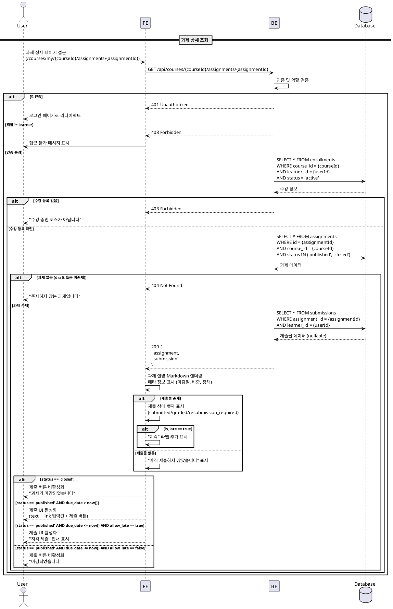

# UC-004: 과제 상세 열람 (Learner)

## Primary Actor

Learner (역할=learner인 인증된 사용자)

## Precondition

- 회원가입 및 온보딩(역할 선택, 프로필 입력)을 완료한 상태
- Learner 역할로 로그인되어 있는 상태
- 해당 코스에 수강신청(`enrollments.status='active'`)이 완료된 상태

## Trigger

- Learner가 내 코스의 Assignment 목록에서 특정 과제를 클릭하여 상세 페이지(`/courses/my/[courseId]/assignments/[assignmentId]`)에 접근한다.

---

## Main Scenario

### MS-1. 과제 상세 정보 조회

1. Learner가 과제 상세 페이지에 진입한다.
2. FE가 `GET /api/courses/{courseId}/assignments/{assignmentId}` 요청을 전송한다.
3. BE가 인증 및 역할(`learner`)을 검증한다.
4. BE가 `enrollments` 테이블에서 해당 Learner의 코스 등록 여부(`status='active'`)를 확인한다.
5. BE가 `assignments` 테이블에서 해당 과제를 조회한다 (`status='published'` 또는 `status='closed'`).
6. BE가 `submissions` 테이블에서 해당 Learner의 기존 제출물을 조회한다.
7. BE가 과제 상세 정보와 제출 상태를 FE에 반환한다.
8. FE가 과제 상세 화면을 렌더링한다.

### MS-2. 과제 상세 화면 구성

1. FE가 과제 설명(description)을 Markdown으로 렌더링한다.
2. FE가 과제 메타 정보를 표시한다.
   - 마감일(`due_date`)
   - 점수 비중(`weight`)
   - 지각 제출 허용 여부(`allow_late`)
   - 재제출 허용 여부(`allow_resubmission`)
3. FE가 현재 과제 상태에 따라 제출 영역을 구성한다.
   - `status='published'` AND 마감일 전 → 제출 UI 활성화 (text 입력란 + link 입력란 + 제출 버튼)
   - `status='published'` AND 마감일 후 AND `allow_late=true` → 제출 UI 활성화 (지각 안내 문구 표시)
   - `status='published'` AND 마감일 후 AND `allow_late=false` → 제출 버튼 비활성화 ("마감되었습니다" 안내)
   - `status='closed'` → 제출 버튼 비활성화 ("과제가 마감되었습니다" 안내)

### MS-3. 기존 제출물 상태 표시

1. 제출물이 존재할 경우 FE가 제출 상태를 표시한다.
   - `submitted` → "제출됨" 상태 뱃지
   - `graded` → "채점완료" 상태 뱃지 + 점수 표시
   - `resubmission_required` → "재제출요청" 상태 뱃지 + 피드백 표시
2. 지각 제출인 경우(`is_late=true`) "지각" 라벨을 추가 표시한다.
3. 재제출이 허용되고(`allow_resubmission=true`) 기존 제출 상태가 `resubmission_required`인 경우, 재제출 버튼을 활성화한다.
4. 제출물이 없는 경우 "아직 제출하지 않았습니다" 안내를 표시한다.

---

## Edge Cases

| # | 상황 | 처리 |
|---|------|------|
| E1 | `status='draft'`인 과제에 접근 | 404 반환, "존재하지 않는 과제입니다" 메시지 |
| E2 | 수강 등록되지 않은 코스의 과제에 접근 | 403 Forbidden 반환, "수강 중인 코스가 아닙니다" 메시지 |
| E3 | 존재하지 않는 과제 ID로 접근 | 404 반환, "존재하지 않는 과제입니다" 메시지 |
| E4 | Instructor 역할이 접근 | 403 Forbidden 반환, Learner 역할만 허용 |
| E5 | 미인증 사용자가 접근 | 401 반환, 로그인 페이지로 리다이렉트 |
| E6 | 과제가 `closed` 상태 | 상세 정보는 열람 가능하나 제출 버튼 비활성화 |
| E7 | 네트워크 오류 | 에러 메시지 표시, 재시도 가능 |
| E8 | 마감일이 지났으나 `allow_late=true`인 과제 | 제출 UI 활성화, "지각 제출" 안내 문구 표시 |
| E9 | 이미 채점 완료(`graded`)된 제출물이 있는 경우 | 재제출 불가, 점수와 피드백만 표시 |

---

## Business Rules

| # | 규칙 |
|---|------|
| BR1 | `status='published'` 또는 `status='closed'`인 과제만 Learner에게 열람 가능하다. `draft` 상태는 노출하지 않는다. |
| BR2 | 과제 상세 접근 시 반드시 `enrollments(course_id, learner_id, status='active')` 존재 여부를 검증한다. |
| BR3 | 제출 버튼 활성화 조건: `status='published'` AND (`due_date > now()` OR `allow_late=true`). |
| BR4 | 재제출 버튼 활성화 조건: `allow_resubmission=true` AND 기존 제출물 `status='resubmission_required'`. |
| BR5 | 과제 설명(`description`)은 Markdown 형식으로 저장되며, FE에서 렌더링한다. |
| BR6 | `status='closed'`인 과제는 상세 정보 열람은 가능하지만 제출/재제출은 불가하다. |
| BR7 | 지각 제출 여부(`is_late`)는 `submitted_at > due_date`로 판단한다. |

---

## Sequence Diagram

