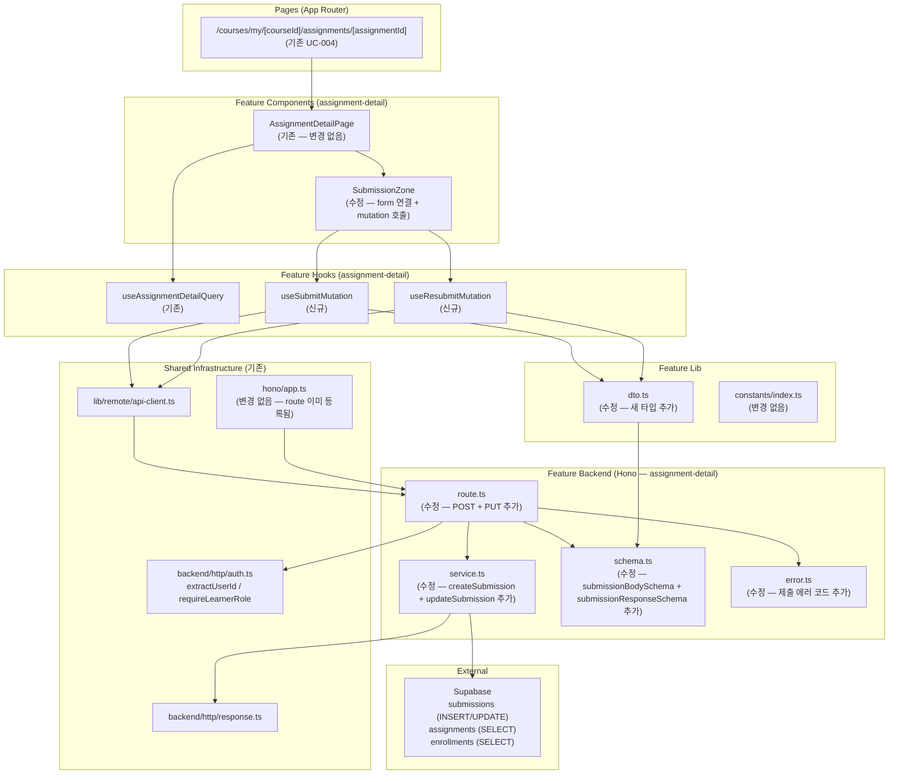

# UC-005 구현 설계: 과제 제출/재제출 (Learner)

## Context

UC-005 유스케이스(과제 제출/재제출)를 구현하기 위한 모듈화 설계.
DB 스키마(`submissions`, `assignments`, `enrollments`)는 `0002_create_lms_schema.sql`에 이미 존재.
`UNIQUE(assignment_id, learner_id)` 제약으로 신규 제출은 INSERT, 재제출은 UPDATE 방식으로 처리한다.

`src/features/assignment-detail/`은 UC-004에서 이미 구현됨.
UC-005는 해당 피처를 **확장**하는 방식으로 구현한다 — 별도 피처 모듈을 신설하지 않고, `assignment-detail` 피처 내에 제출 관련 backend(schema, error 확장 + service + route 추가)와 hooks(mutation), 그리고 `submission-zone.tsx` 수정만 수행한다.

## 현재 상태

### 이미 구현됨
- DB 스키마: `submissions` (content, link, is_late, status, score, feedback, submitted_at, graded_at), `UNIQUE(assignment_id, learner_id)` 제약, `assignments` (allow_late, allow_resubmission, status, due_date)
- 인증 인프라: `useCurrentUser`, `apiClient`, `respond`/`success`/`failure`, Hono 싱글턴
- 공통 인증 유틸: `extractUserId`, `requireLearnerRole` (`@/backend/http/auth.ts`)
- UC-004 (과제 상세): `assignment-detail` 피처 전체 — GET 엔드포인트, `useAssignmentDetailQuery`, `SubmissionZone` (버튼 `disabled` 상태로 UC-005 대기 중)
- Mutation 패턴: `useEnrollMutation`, `useCancelEnrollmentMutation` — `useMutation` + `onSuccess` toast + `invalidateQueries`
- `react-hook-form` + `zod` 클라이언트 폼 유효성 검사 패턴

### 구현 필요
- `src/features/assignment-detail/backend/schema.ts` **수정** — 제출 요청/응답 스키마 추가
- `src/features/assignment-detail/backend/error.ts` **수정** — 제출 관련 에러 코드 추가
- `src/features/assignment-detail/backend/service.ts` **수정** — `createSubmission`, `updateSubmission` 함수 추가
- `src/features/assignment-detail/backend/route.ts` **수정** — POST, PUT 엔드포인트 추가
- `src/features/assignment-detail/lib/dto.ts` **수정** — 새 스키마 타입 재노출 추가
- `src/features/assignment-detail/hooks/useSubmitMutation.ts` **신규** — POST 제출 mutation 훅
- `src/features/assignment-detail/hooks/useResubmitMutation.ts` **신규** — PUT 재제출 mutation 훅
- `src/features/assignment-detail/components/submission-zone.tsx` **수정** — `react-hook-form` 연결, 버튼 활성화 및 라우터 이동

---

## 개요

| # | 모듈 | 위치 | 유형 | 설명 |
|---|------|------|------|------|
| 1 | Assignment Detail Schema | `src/features/assignment-detail/backend/schema.ts` | **수정** | 제출 요청 body 스키마(`submissionBodySchema`), 제출 응답 스키마(`submissionResponseSchema`) 추가 |
| 2 | Assignment Detail Error | `src/features/assignment-detail/backend/error.ts` | **수정** | 제출 관련 에러 코드 추가 (already_submitted, late_not_allowed, resubmit_not_allowed, not_resubmit_required 등) |
| 3 | Assignment Detail Service | `src/features/assignment-detail/backend/service.ts` | **수정** | `createSubmission`, `updateSubmission` 비즈니스 로직 함수 추가 |
| 4 | Assignment Detail Route | `src/features/assignment-detail/backend/route.ts` | **수정** | `POST /api/courses/:courseId/assignments/:assignmentId/submissions`, `PUT /api/courses/:courseId/assignments/:assignmentId/submissions` 엔드포인트 추가 |
| 5 | Assignment Detail DTO | `src/features/assignment-detail/lib/dto.ts` | **수정** | 새로운 스키마/타입 재노출 추가 |
| 6 | useSubmitMutation | `src/features/assignment-detail/hooks/useSubmitMutation.ts` | **신규** | 신규 제출(POST) React Query mutation 훅 |
| 7 | useResubmitMutation | `src/features/assignment-detail/hooks/useResubmitMutation.ts` | **신규** | 재제출(PUT) React Query mutation 훅 |
| 8 | SubmissionZone | `src/features/assignment-detail/components/submission-zone.tsx` | **수정** | `react-hook-form` 연결, mutation 훅 연결, 성공 시 라우터 이동 |

---

## Diagram



---

## Implementation Plan

### Phase 1: Backend Layer

#### 1-1. `src/features/assignment-detail/backend/schema.ts` (수정)

**추가할 스키마:**

```typescript
// 제출/재제출 공통 요청 body
export const submissionBodySchema = z.object({
  content: z.string().min(1, { message: '내용을 입력해주세요.' }),
  link: z.string().url({ message: '올바른 URL 형식을 입력해주세요.' }).optional().or(z.literal('')),
});

export type SubmissionBody = z.infer<typeof submissionBodySchema>;

// 제출/재제출 응답 (단일 submission 반환)
export const submissionResponseSchema = z.object({
  id: z.string().uuid(),
  assignmentId: z.string().uuid(),
  learnerId: z.string().uuid(),
  content: z.string(),
  link: z.string().nullable(),
  isLate: z.boolean(),
  status: z.enum(['submitted', 'graded', 'resubmission_required']),
  submittedAt: z.string(),
});

export type SubmissionResponse = z.infer<typeof submissionResponseSchema>;
```

**Unit Test:**
- `submissionBodySchema` — content 빈 문자열 시 실패 (E1)
- `submissionBodySchema` — link가 URL 형식이 아닐 때 실패 (E2)
- `submissionBodySchema` — link가 빈 문자열이거나 undefined일 때 통과 (선택 필드)
- `submissionBodySchema` — content 있고 link 없을 때 통과 (MS-1)
- `submissionResponseSchema` — 유효한 submission 데이터 통과
- `submissionResponseSchema` — link nullable 통과

---

#### 1-2. `src/features/assignment-detail/backend/error.ts` (수정)

**추가할 에러 코드:**

```typescript
export const assignmentDetailErrorCodes = {
  // 기존 (변경 없음)
  unauthorized: 'ASSIGNMENT_DETAIL_UNAUTHORIZED',
  forbiddenRole: 'ASSIGNMENT_DETAIL_FORBIDDEN_ROLE',
  notEnrolled: 'ASSIGNMENT_DETAIL_NOT_ENROLLED',
  notFound: 'ASSIGNMENT_DETAIL_NOT_FOUND',
  fetchError: 'ASSIGNMENT_DETAIL_FETCH_ERROR',
  validationError: 'ASSIGNMENT_DETAIL_VALIDATION_ERROR',
  // 신규 추가
  alreadySubmitted: 'ASSIGNMENT_SUBMISSION_ALREADY_SUBMITTED',
  lateNotAllowed: 'ASSIGNMENT_SUBMISSION_LATE_NOT_ALLOWED',
  assignmentClosed: 'ASSIGNMENT_SUBMISSION_CLOSED',
  resubmitNotAllowed: 'ASSIGNMENT_SUBMISSION_RESUBMIT_NOT_ALLOWED',
  notResubmitRequired: 'ASSIGNMENT_SUBMISSION_NOT_RESUBMIT_REQUIRED',
  submissionNotFound: 'ASSIGNMENT_SUBMISSION_NOT_FOUND',
} as const;
```

**Unit Test:**
- 모든 에러 코드 값의 고유성 검증

---

#### 1-3. `src/features/assignment-detail/backend/service.ts` (수정)

**추가할 함수:**

| 함수명 | 입력 | 출력 | 설명 |
|--------|------|------|------|
| `createSubmission` | `(supabase, { courseId, assignmentId, userId, content, link })` | `HandlerResult<SubmissionResponse, AssignmentDetailServiceError>` | 신규 제출 (INSERT) |
| `updateSubmission` | `(supabase, { courseId, assignmentId, userId, content, link })` | `HandlerResult<SubmissionResponse, AssignmentDetailServiceError>` | 재제출 (UPDATE) |

**`createSubmission` 비즈니스 로직 (MS-1, MS-2):**

**Step 1 — 수강 등록 검증 (BR1):**
1. `enrollments` WHERE `course_id={courseId}` AND `learner_id={userId}` AND `status='active'`
2. 없으면 → 403, `ASSIGNMENT_SUBMISSION_NOT_ENROLLED`

**Step 2 — 과제 조회 및 상태 검증 (BR1, E4, E12):**
1. `assignments` WHERE `id={assignmentId}` AND `course_id={courseId}`
2. `maybeSingle()` — 없으면 404, `ASSIGNMENT_DETAIL_NOT_FOUND`
3. `status='draft'` → 404, `ASSIGNMENT_DETAIL_NOT_FOUND` (E12 — draft는 없는 것으로 처리)
4. `status='closed'` → 400, `ASSIGNMENT_SUBMISSION_CLOSED`, "마감된 과제입니다." (E4)

**Step 3 — 기존 제출물 중복 확인 (BR8, E5):**
1. `submissions` WHERE `assignment_id={assignmentId}` AND `learner_id={userId}`
2. `maybeSingle()` — 이미 존재하면 409, `ASSIGNMENT_SUBMISSION_ALREADY_SUBMITTED`, "이미 제출한 과제입니다."

**Step 4 — 마감일 검증 (BR3, BR4, E3):**
1. `isLate = now() > due_date`
2. `isLate=true` AND `allow_late=false` → 400, `ASSIGNMENT_SUBMISSION_LATE_NOT_ALLOWED`, "마감일이 지나 제출할 수 없습니다."

**Step 5 — 신규 INSERT (BR3):**
1. `submissions` INSERT `{ assignment_id, learner_id, content, link: link || null, is_late: isLate, status='submitted', submitted_at=now() }`
2. DB 오류 → 500, `ASSIGNMENT_DETAIL_FETCH_ERROR`
3. 성공 → 201, `success(submissionResponse, 201)`

---

**`updateSubmission` 비즈니스 로직 (MS-3):**

**Step 1 — 수강 등록 검증 (동일):**
1. `enrollments` WHERE `course_id={courseId}` AND `learner_id={userId}` AND `status='active'`
2. 없으면 → 403, `ASSIGNMENT_SUBMISSION_NOT_ENROLLED`

**Step 2 — 과제 조회 및 재제출 허용 여부 검증 (BR5, E6):**
1. `assignments` WHERE `id={assignmentId}` AND `course_id={courseId}`
2. `maybeSingle()` — 없으면 404, `ASSIGNMENT_DETAIL_NOT_FOUND`
3. `allow_resubmission=false` → 400, `ASSIGNMENT_SUBMISSION_RESUBMIT_NOT_ALLOWED`, "재제출이 허용되지 않는 과제입니다."

**Step 3 — 기존 제출물 조회 및 상태 검증 (BR5, E7):**
1. `submissions` WHERE `assignment_id={assignmentId}` AND `learner_id={userId}`
2. 없으면 → 400, `ASSIGNMENT_SUBMISSION_NOT_FOUND`, "재제출 요청 상태가 아닙니다."
3. `status !== 'resubmission_required'` → 400, `ASSIGNMENT_SUBMISSION_NOT_RESUBMIT_REQUIRED`, "재제출 요청 상태가 아닙니다."

**Step 4 — 마감일 기반 is_late 갱신 (BR9):**
1. `isLate = now() > due_date` — 재제출 시에도 현재 시각 기준으로 갱신

**Step 5 — 기존 레코드 UPDATE (BR6, BR7):**
1. `submissions` UPDATE `{ content, link: link || null, is_late: isLate, status='submitted', submitted_at=now() }` WHERE `assignment_id={assignmentId}` AND `learner_id={userId}`
2. DB 오류 → 500, `ASSIGNMENT_DETAIL_FETCH_ERROR`
3. 성공 → 200, `success(submissionResponse)`

**Unit Test — `createSubmission`:**
- 수강 등록 없음 → 403, `ASSIGNMENT_DETAIL_NOT_ENROLLED` (E8)
- `status='draft'` 과제 → 404, `ASSIGNMENT_DETAIL_NOT_FOUND` (E12)
- `status='closed'` 과제 → 400, `ASSIGNMENT_SUBMISSION_CLOSED` (E4)
- 기존 제출물 존재 → 409, `ASSIGNMENT_SUBMISSION_ALREADY_SUBMITTED` (E5)
- 마감 후 + `allow_late=false` → 400, `ASSIGNMENT_SUBMISSION_LATE_NOT_ALLOWED` (E3)
- 마감 전 정상 제출 → 201, `{ is_late: false, status: 'submitted' }` (MS-1)
- 마감 후 + `allow_late=true` → 201, `{ is_late: true, status: 'submitted' }` (MS-2)
- link 빈 문자열 → DB에 null로 저장
- DB INSERT 오류 → 500, `ASSIGNMENT_DETAIL_FETCH_ERROR`

**Unit Test — `updateSubmission`:**
- 수강 등록 없음 → 403, `ASSIGNMENT_DETAIL_NOT_ENROLLED` (E8)
- 과제 없음 → 404, `ASSIGNMENT_DETAIL_NOT_FOUND`
- `allow_resubmission=false` → 400, `ASSIGNMENT_SUBMISSION_RESUBMIT_NOT_ALLOWED` (E6)
- 제출물 없음 → 400, `ASSIGNMENT_SUBMISSION_NOT_FOUND` (E7 변형)
- `submission.status='submitted'` → 400, `ASSIGNMENT_SUBMISSION_NOT_RESUBMIT_REQUIRED` (E7)
- `submission.status='graded'` → 400, `ASSIGNMENT_SUBMISSION_NOT_RESUBMIT_REQUIRED` (E7)
- 정상 재제출 → 200, `{ status: 'submitted', submitted_at: 최신 시각 }` (MS-3)
- 마감 후 재제출 → `is_late: true` 로 갱신 (BR9)
- DB UPDATE 오류 → 500, `ASSIGNMENT_DETAIL_FETCH_ERROR`

---

#### 1-4. `src/features/assignment-detail/backend/route.ts` (수정)

**추가할 엔드포인트:**

| Method | Path | Auth | 설명 |
|--------|------|------|------|
| POST | `/api/courses/:courseId/assignments/:assignmentId/submissions` | 필수 (Learner만) | 신규 제출 |
| PUT | `/api/courses/:courseId/assignments/:assignmentId/submissions` | 필수 (Learner만) | 재제출 |

**POST 흐름:**
1. `extractUserId(c)` — 미인증 시 401, `ASSIGNMENT_DETAIL_UNAUTHORIZED`
2. `requireLearnerRole(supabase, userId)` — 비학습자 시 403, `ASSIGNMENT_DETAIL_FORBIDDEN_ROLE`
3. URL 파라미터 `assignmentDetailParamSchema` 파싱 — 실패 시 400
4. Request body `submissionBodySchema` 파싱 — 실패 시 400
5. `createSubmission(supabase, { courseId, assignmentId, userId, content, link })` 호출
6. `respond(c, result)` 반환

**PUT 흐름:**
1. `extractUserId(c)` — 미인증 시 401
2. `requireLearnerRole(supabase, userId)` — 비학습자 시 403
3. URL 파라미터 파싱 — 실패 시 400
4. Request body `submissionBodySchema` 파싱 — 실패 시 400
5. `updateSubmission(supabase, { courseId, assignmentId, userId, content, link })` 호출
6. `respond(c, result)` 반환

**Unit Test:**
- 미인증 POST → 401 (E9)
- Instructor 역할 POST → 403 (E10)
- 유효하지 않은 UUID 파라미터 POST → 400
- content 없는 body POST → 400
- 유효하지 않은 URL link POST → 400
- 정상 POST → 201 (MS-1)
- 미인증 PUT → 401
- 정상 PUT → 200 (MS-3)

---

### Phase 2: Shared / Infrastructure

#### 2-1. `src/features/assignment-detail/lib/dto.ts` (수정)

```typescript
export {
  // 기존
  assignmentDetailSchema,
  submissionDetailSchema,
  assignmentDetailResponseSchema,
  type AssignmentDetail,
  type SubmissionDetail,
  type AssignmentDetailResponse,
  // 신규 추가
  submissionBodySchema,
  submissionResponseSchema,
  type SubmissionBody,
  type SubmissionResponse,
} from '../backend/schema';
```

---

#### 2-2. `src/backend/hono/app.ts` (변경 없음)

`registerAssignmentDetailRoutes`는 UC-004에서 이미 등록되어 있음. 동일 라우터 파일에 새 엔드포인트를 추가하므로 `app.ts` 수정 불필요.

---

### Phase 3: Frontend Hooks

#### 3-1. `src/features/assignment-detail/hooks/useSubmitMutation.ts` (신규)

```typescript
'use client';

// useMutation으로 POST /api/courses/{courseId}/assignments/{assignmentId}/submissions 호출
// 성공 시:
//   - toast: "제출이 완료되었습니다." (isLate=true면 "지각 제출이 완료되었습니다.")
//   - queryClient.invalidateQueries({ queryKey: ASSIGNMENT_DETAIL_QUERY_KEYS.detail(courseId, assignmentId) })
//   - onSuccess 콜백으로 페이지 이동 처리 (useRouter는 컴포넌트에서 전달)
// 실패 시:
//   - toast: variant='destructive', description=error.message
// 타입:
//   mutationFn: (body: SubmissionBody) => Promise<SubmissionResponse>
```

**패턴 참조:** `useEnrollMutation.ts`와 동일한 구조 사용.

---

#### 3-2. `src/features/assignment-detail/hooks/useResubmitMutation.ts` (신규)

```typescript
'use client';

// useMutation으로 PUT /api/courses/{courseId}/assignments/{assignmentId}/submissions 호출
// 성공 시:
//   - toast: "재제출이 완료되었습니다."
//   - queryClient.invalidateQueries({ queryKey: ASSIGNMENT_DETAIL_QUERY_KEYS.detail(courseId, assignmentId) })
//   - onSuccess 콜백으로 페이지 이동
// 실패 시:
//   - toast: variant='destructive', description=error.message
// 타입:
//   mutationFn: (body: SubmissionBody) => Promise<SubmissionResponse>
```

---

### Phase 4: Frontend Component 수정

#### 4-1. `src/features/assignment-detail/components/submission-zone.tsx` (수정)

**현재 상태:** `SubmissionForm` 내부 버튼이 `disabled` 고정, `useState`로 로컬 상태만 관리.

**수정 내용:**

`SubmissionForm`을 `react-hook-form` 기반으로 교체:

```typescript
// useForm<SubmissionBody> 사용 — zodResolver(submissionBodySchema)
// isResubmit prop에 따라 useSubmitMutation 또는 useResubmitMutation 선택
// 제출 핸들러: handleSubmit(async (data) => { await mutateAsync(data); router.push(`/courses/my/${courseId}/assignments/${assignmentId}`) })
// isPending 중 버튼 disabled + 로딩 스피너 (Loader2 from lucide-react)
// 에러는 mutation의 onError toast로 처리 (form 에러 메시지는 인라인 표시)
```

**props 확장:**

```typescript
type SubmissionZoneProps = {
  assignment: AssignmentDetail;
  submission: SubmissionDetail | null;
  courseId: string;      // 신규 추가 — mutation URL 구성에 필요
  assignmentId: string;  // 신규 추가 — mutation URL 구성에 필요
};
```

`AssignmentDetailPage`에서 `SubmissionZone`에 `courseId`, `assignmentId` 전달하도록 수정.

**QA Sheet:**

| # | 시나리오 | 기대 결과 |
|---|----------|-----------|
| 1 | content 빈 상태로 제출 클릭 | "내용을 입력해주세요." 인라인 에러 표시, API 미호출 (E1) |
| 2 | link 필드에 잘못된 URL 입력 후 제출 | "올바른 URL 형식을 입력해주세요." 인라인 에러 표시 (E2) |
| 3 | 정상 입력 후 "제출하기" 클릭 | 버튼 로딩 상태 → "제출이 완료되었습니다." toast → 과제 상세 페이지 갱신 (MS-1) |
| 4 | 마감 후 지각 제출 성공 | "지각 제출이 완료되었습니다." toast 표시 (MS-2) |
| 5 | "재제출하기" 클릭 성공 | "재제출이 완료되었습니다." toast → 과제 상세 페이지 갱신 (MS-3) |
| 6 | 이미 제출된 상태에서 POST 시도 (BE 방어) | "이미 제출한 과제입니다." 에러 toast (E5) |
| 7 | 네트워크 오류 | 에러 toast 표시, 폼 재입력 가능 (E11) |
| 8 | 제출 중 버튼 상태 | disabled + 로딩 스피너 표시 |
| 9 | link 빈 값 | 선택 필드 — 빈 값으로 제출 통과 |
| 10 | `status='graded'` | 제출 폼 미표시 (기존 UC-004 로직 유지) |

---

## 작업 순서 (의존성 기반)

```
Phase 1 (Backend — 순차)
├── 1-1. schema.ts 수정 (submissionBodySchema, submissionResponseSchema 추가)
├── 1-2. error.ts 수정 (제출 에러 코드 추가)
├── 1-3. service.ts 수정 (createSubmission, updateSubmission 추가)
└── 1-4. route.ts 수정 (POST, PUT 엔드포인트 추가)

Phase 2 (Shared — Phase 1 후)
└── 2-1. dto.ts 수정 (새 타입 재노출)

Phase 3 (Frontend Hooks — Phase 2 후)
├── 3-1. useSubmitMutation.ts 신규
└── 3-2. useResubmitMutation.ts 신규

Phase 4 (Component 수정 — Phase 3 후)
└── 4-1. submission-zone.tsx 수정 (form 연결 + mutation 호출)
    └── assignment-detail-page.tsx 수정 (courseId, assignmentId prop 전달)
```

---

## 참조 파일

| 용도 | 파일 |
|------|------|
| 기존 Route 패턴 (POST/DELETE) | `src/features/course/backend/route.ts` |
| 기존 Service 패턴 | `src/features/assignment-detail/backend/service.ts` |
| 기존 Schema 패턴 | `src/features/assignment-detail/backend/schema.ts` |
| 기존 Error 패턴 | `src/features/assignment-detail/backend/error.ts` |
| 공통 인증 유틸 | `src/backend/http/auth.ts` |
| HTTP 응답 | `src/backend/http/response.ts` |
| Mutation Hook 패턴 | `src/features/course/hooks/useEnrollMutation.ts` |
| Mutation Hook 패턴 (DELETE) | `src/features/course/hooks/useCancelEnrollmentMutation.ts` |
| DTO 패턴 | `src/features/assignment-detail/lib/dto.ts` |
| API Client | `src/lib/remote/api-client.ts` |
| 수정 대상 컴포넌트 | `src/features/assignment-detail/components/submission-zone.tsx` |
| 수정 대상 컴포넌트 | `src/features/assignment-detail/components/assignment-detail-page.tsx` |
| DB 스키마 | `supabase/migrations/0002_create_lms_schema.sql` |
