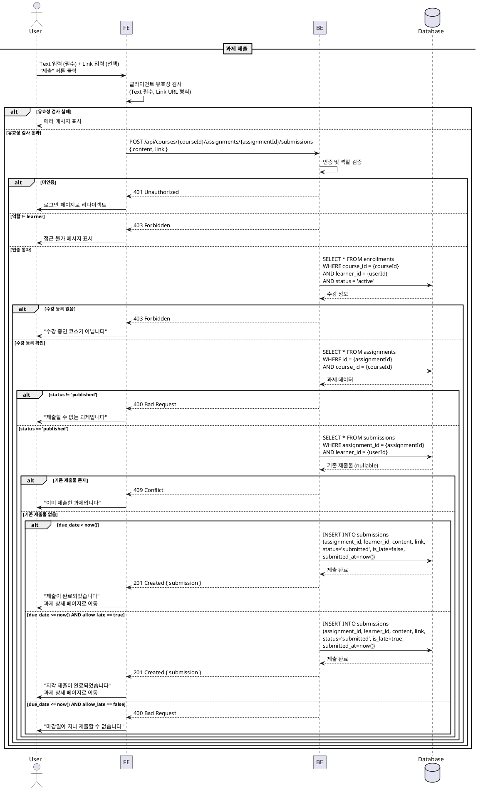
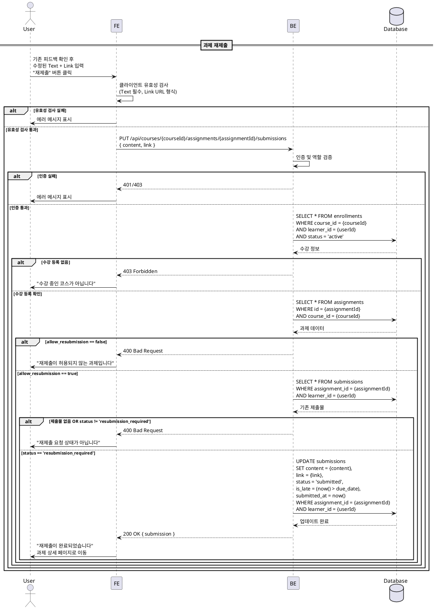

# UC-005: 과제 제출/재제출 (Learner)

## Primary Actor

Learner (역할=learner인 인증된 사용자)

## Precondition

- 회원가입 및 온보딩(역할 선택, 프로필 입력)을 완료한 상태
- Learner 역할로 로그인되어 있는 상태
- 해당 코스에 수강신청(`enrollments.status='active'`)이 완료된 상태
- 과제 상세 페이지에서 제출 가능한 상태를 확인한 상태

## Trigger

- Learner가 과제 상세 페이지에서 제출 내용을 입력하고 "제출" 버튼을 클릭한다.
- 또는 재제출이 요청된 과제에서 "재제출" 버튼을 클릭한다.

---

## Main Scenario

### MS-1. 신규 제출 (마감일 전)

1. Learner가 과제 제출 페이지(`/courses/my/{courseId}/assignments/{assignmentId}/submit`)에 진입한다.
2. Learner가 Text 필드(필수)에 내용을 입력한다.
3. Learner가 Link 필드(선택)에 URL을 입력한다.
4. Learner가 "제출" 버튼을 클릭한다.
5. FE가 클라이언트 유효성 검사를 수행한다.
   - Text 필드: 빈 값 불가
   - Link 필드: 입력 시 URL 형식 검증
6. FE가 `POST /api/courses/{courseId}/assignments/{assignmentId}/submissions` 요청을 전송한다.
7. BE가 인증 및 역할(`learner`)을 검증한다.
8. BE가 수강 등록 여부(`enrollments.status='active'`)를 확인한다.
9. BE가 과제 상태(`assignments.status='published'`)를 확인한다.
10. BE가 마감일을 확인한다 (`due_date > now()` → 정상 제출).
11. BE가 기존 제출물 존재 여부를 확인한다 (신규 제출이므로 없어야 함).
12. BE가 `submissions` 테이블에 INSERT한다 (`status='submitted'`, `is_late=false`).
13. BE가 성공 응답을 반환한다.
14. FE가 성공 메시지를 표시하고 과제 상세 페이지로 이동한다.

### MS-2. 지각 제출 (마감일 후, allow_late=true)

1. Learner가 마감일이 지난 과제의 제출 페이지에 진입한다.
2. FE가 "지각 제출" 안내 문구를 표시한다.
3. Learner가 Text 필드(필수)에 내용을 입력하고 Link 필드(선택)를 입력한다.
4. Learner가 "제출" 버튼을 클릭한다.
5. FE가 클라이언트 유효성 검사를 수행한다.
6. FE가 `POST /api/courses/{courseId}/assignments/{assignmentId}/submissions` 요청을 전송한다.
7. BE가 인증, 수강 등록, 과제 상태를 검증한다.
8. BE가 마감일을 확인한다 (`due_date <= now()` AND `allow_late=true` → 지각 제출 허용).
9. BE가 `submissions` 테이블에 INSERT한다 (`status='submitted'`, `is_late=true`).
10. BE가 성공 응답을 반환한다.
11. FE가 "지각 제출이 완료되었습니다" 메시지를 표시하고 과제 상세 페이지로 이동한다.

### MS-3. 재제출 (allow_resubmission=true)

1. Learner가 재제출 요청(`resubmission_required`) 상태인 과제의 제출 페이지에 진입한다.
2. FE가 기존 제출 내용과 Instructor의 피드백을 표시한다.
3. Learner가 Text 필드에 수정된 내용을 입력한다.
4. Learner가 Link 필드를 수정한다 (선택).
5. Learner가 "재제출" 버튼을 클릭한다.
6. FE가 클라이언트 유효성 검사를 수행한다.
7. FE가 `PUT /api/courses/{courseId}/assignments/{assignmentId}/submissions` 요청을 전송한다.
8. BE가 인증, 수강 등록, 과제 상태를 검증한다.
9. BE가 재제출 조건을 검증한다.
   - `assignments.allow_resubmission=true`
   - 기존 제출물 `status='resubmission_required'`
10. BE가 `submissions` 테이블을 UPDATE한다 (`content`, `link` 덮어쓰기, `status='submitted'`, `submitted_at=now()`).
11. BE가 성공 응답을 반환한다.
12. FE가 "재제출이 완료되었습니다" 메시지를 표시하고 과제 상세 페이지로 이동한다.

---

## Edge Cases

| # | 상황 | 처리 |
|---|------|------|
| E1 | Text 필드가 비어있는 상태로 제출 시도 | FE 클라이언트 검증에서 차단, "내용을 입력해주세요" 메시지 표시 |
| E2 | Link 필드에 유효하지 않은 URL 입력 | FE 클라이언트 검증에서 차단, "올바른 URL 형식을 입력해주세요" 메시지 표시 |
| E3 | 마감일 후 + `allow_late=false`인 과제에 제출 시도 | 400 반환, "마감일이 지나 제출할 수 없습니다" 메시지 |
| E4 | `status='closed'`인 과제에 제출 시도 | 400 반환, "마감된 과제입니다" 메시지 |
| E5 | 이미 제출물이 존재하는데 신규 제출 시도 | 409 Conflict 반환, "이미 제출한 과제입니다" 메시지 |
| E6 | `allow_resubmission=false`인 과제에 재제출 시도 | 400 반환, "재제출이 허용되지 않는 과제입니다" 메시지 |
| E7 | 기존 제출물이 `resubmission_required`가 아닌 상태에서 재제출 시도 | 400 반환, "재제출 요청 상태가 아닙니다" 메시지 |
| E8 | 수강 등록되지 않은 코스의 과제에 제출 시도 | 403 Forbidden 반환, "수강 중인 코스가 아닙니다" 메시지 |
| E9 | 미인증 사용자가 제출 시도 | 401 반환, 로그인 페이지로 리다이렉트 |
| E10 | Instructor 역할이 제출 시도 | 403 Forbidden 반환, Learner 역할만 허용 |
| E11 | 네트워크 오류 | 에러 토스트 표시, 재시도 가능 |
| E12 | `status='draft'`인 과제에 제출 시도 | 404 반환, "존재하지 않는 과제입니다" 메시지 |

---

## Business Rules

| # | 규칙 |
|---|------|
| BR1 | 제출은 `assignments.status='published'`인 과제에만 가능하다. `draft`, `closed` 상태에서는 제출 불가. |
| BR2 | Text 필드(`content`)는 필수이며, Link 필드(`link`)는 선택이다. |
| BR3 | 마감일 이전 제출: `is_late=false`, 마감일 이후 제출: `is_late=true`. |
| BR4 | 마감일 이후 + `allow_late=false`이면 제출을 차단한다. |
| BR5 | 재제출은 `allow_resubmission=true` AND 기존 제출물 `status='resubmission_required'`인 경우에만 허용한다. |
| BR6 | 재제출 시 기존 제출물의 `content`, `link`를 덮어쓰며, 이전 이력은 보관하지 않는다. |
| BR7 | 재제출 시 `status`는 `submitted`로 초기화되고, `submitted_at`은 현재 시각으로 갱신된다. |
| BR8 | `submissions` 테이블의 `UNIQUE(assignment_id, learner_id)` 제약으로 동일 과제에 대한 중복 제출을 방지한다. |
| BR9 | 마감일 이후 재제출의 경우에도 `is_late` 판정은 `submitted_at > due_date` 기준으로 갱신한다. |

---

## Sequence Diagram

### 신규 제출

### 재제출

