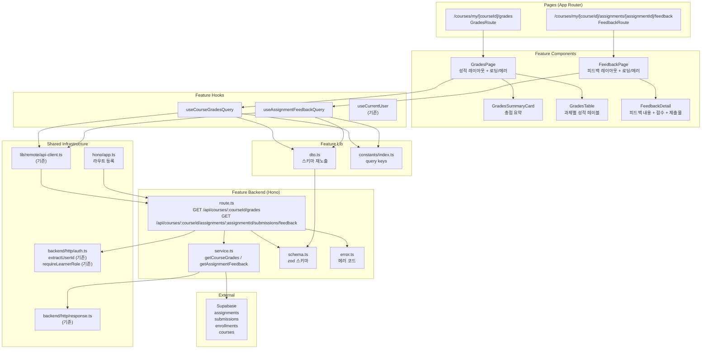

# UC-006 구현 설계: 성적 & 피드백 열람 (Learner)

## Context

UC-006 유스케이스(성적 & 피드백 열람)를 구현하기 위한 모듈화 설계.
DB 스키마(`assignments`, `submissions`, `enrollments`, `courses`)는 `0002_create_lms_schema.sql`에 이미 존재.
`src/features/assignment-detail/`과 `src/features/learner-dashboard/`의 패턴(schema→error→service→route, dto 재노출, React Query hooks, shadcn 컴포넌트)을 그대로 따른다.

## 현재 상태

### 이미 구현됨
- DB 스키마: `assignments` (title, weight, due_date, status), `submissions` (score, feedback, is_late, status, graded_at), `enrollments` 테이블
- 인증 인프라: `useCurrentUser`, `apiClient`, `respond`/`success`/`failure`, Hono 싱글턴
- 공통 인증 유틸: `extractUserId`, `requireLearnerRole` (`@/backend/http/auth.ts`)
- `(protected)/layout.tsx`: 인증 가드
- UC-003 (Learner 대시보드): `/courses/my` — `recent-feedback-list`에서 피드백 링크 타겟이 되는 페이지가 필요한 상태
- UC-004 (과제 상세 열람): `/courses/my/[courseId]/assignments/[assignmentId]` — 과제 상세 페이지에서 피드백 링크 타겟이 되는 페이지가 필요한 상태
- shadcn 컴포넌트: button, card, badge, separator, table 등

### 구현 필요
- `src/features/grades/` 전체 (backend, hooks, components, lib, constants)
- `src/app/(protected)/courses/my/[courseId]/grades/page.tsx` 신규 페이지
- `src/app/(protected)/courses/my/[courseId]/assignments/[assignmentId]/feedback/page.tsx` 신규 페이지
- `src/backend/hono/app.ts`에 라우트 등록

---

## 개요

| # | 모듈 | 위치 | 설명 |
|---|------|------|------|
| 1 | Grades Backend Schema | `src/features/grades/backend/schema.ts` | 성적 조회 + 피드백 응답 zod 스키마, 파라미터 스키마 |
| 2 | Grades Backend Error | `src/features/grades/backend/error.ts` | 성적/피드백 에러 코드 정의 |
| 3 | Grades Backend Service | `src/features/grades/backend/service.ts` | 수강 검증, 과제 조회, 가중 평균 계산, 피드백 조회 비즈니스 로직 |
| 4 | Grades Backend Route | `src/features/grades/backend/route.ts` | Hono 라우터 (2개 엔드포인트) |
| 5 | Grades DTO | `src/features/grades/lib/dto.ts` | 백엔드 스키마 프론트엔드 재노출 |
| 6 | Grades Constants | `src/features/grades/constants/index.ts` | Query Keys |
| 7 | useCourseGradesQuery | `src/features/grades/hooks/useCourseGradesQuery.ts` | 코스 성적 조회 훅 |
| 8 | useAssignmentFeedbackQuery | `src/features/grades/hooks/useAssignmentFeedbackQuery.ts` | 과제 피드백 조회 훅 |
| 9 | GradesPage | `src/features/grades/components/grades-page.tsx` | 성적 메인 레이아웃 (요약 + 테이블) |
| 10 | GradesSummaryCard | `src/features/grades/components/grades-summary-card.tsx` | 코스 총점 요약 카드 |
| 11 | GradesTable | `src/features/grades/components/grades-table.tsx` | 과제별 성적 테이블 |
| 12 | FeedbackPage | `src/features/grades/components/feedback-page.tsx` | 피드백 상세 레이아웃 |
| 13 | FeedbackDetail | `src/features/grades/components/feedback-detail.tsx` | 피드백 내용 + 점수 + 제출물 상세 |
| 14 | Grades Route Page | `src/app/(protected)/courses/my/[courseId]/grades/page.tsx` | 성적 페이지 (신규) |
| 15 | Feedback Route Page | `src/app/(protected)/courses/my/[courseId]/assignments/[assignmentId]/feedback/page.tsx` | 피드백 페이지 (신규) |
| 16 | Hono App | `src/backend/hono/app.ts` | **수정** — grades 라우트 등록 |

---

## Diagram



---

## Implementation Plan

### Phase 1: Backend Layer

#### 1-1. `src/features/grades/backend/schema.ts`

**zod 스키마 정의:**

```typescript
// URL 파라미터 — 코스 성적
gradesParamSchema: {
  courseId: z.string().uuid({ message: '유효한 코스 ID가 필요합니다.' }),
}

// URL 파라미터 — 피드백
feedbackParamSchema: {
  courseId: z.string().uuid({ message: '유효한 코스 ID가 필요합니다.' }),
  assignmentId: z.string().uuid({ message: '유효한 과제 ID가 필요합니다.' }),
}

// 과제별 성적 항목
assignmentGradeSchema: {
  assignmentId: z.string().uuid(),
  title: z.string(),
  weight: z.number().int(),
  score: z.number().nullable(),         // 미제출/채점대기 시 null
  isLate: z.boolean().nullable(),       // 미제출 시 null
  status: z.enum([
    'not_submitted',                    // 미제출 (FE 가상 상태)
    'submitted',                        // 채점 대기
    'graded',                           // 채점 완료
    'resubmission_required',            // 재제출 요청
  ]),
  feedbackSummary: z.string().nullable(), // 피드백 첫 100자 요약
  assignmentId: z.string().uuid(),       // 피드백 링크용
}

// 코스 성적 전체 응답
courseGradesResponseSchema: {
  courseTitle: z.string(),
  totalScore: z.number().nullable(),    // 채점완료 과제 없으면 null (N/A)
  assignments: z.array(assignmentGradeSchema),
}

// 피드백 과제 정보
feedbackAssignmentSchema: {
  id: z.string().uuid(),
  title: z.string(),
  weight: z.number().int(),
  allowResubmission: z.boolean(),
}

// 피드백 제출물 정보
feedbackSubmissionSchema: {
  id: z.string().uuid(),
  content: z.string(),
  link: z.string().nullable(),
  isLate: z.boolean(),
  status: z.enum(['submitted', 'graded', 'resubmission_required']),
  score: z.number().nullable(),
  feedback: z.string().nullable(),
  submittedAt: z.string(),
  gradedAt: z.string().nullable(),
}

// 피드백 전체 응답
assignmentFeedbackResponseSchema: {
  assignment: feedbackAssignmentSchema,
  submission: feedbackSubmissionSchema,  // null 불가 — 404로 처리
}
```

**Unit Test:**
- 유효한 `gradesParamSchema` 입력 통과
- `courseId`가 UUID 형식이 아닐 때 실패
- `assignmentGradeSchema`의 status 'not_submitted'는 FE 전용 가상 상태
- `totalScore` nullable — 채점완료 과제 없을 때 null 통과
- `feedbackSubmissionSchema`의 score, feedback, gradedAt nullable 통과
- `feedbackAssignmentSchema`의 allowResubmission boolean 통과

---

#### 1-2. `src/features/grades/backend/error.ts`

**에러 코드:**

```typescript
gradesErrorCodes = {
  unauthorized: 'GRADES_UNAUTHORIZED',
  forbiddenRole: 'GRADES_FORBIDDEN_ROLE',
  notEnrolled: 'GRADES_NOT_ENROLLED',
  notFound: 'GRADES_NOT_FOUND',         // 제출물 없는 피드백 접근
  forbidden: 'GRADES_FORBIDDEN',        // 타인 제출물 접근 시도
  fetchError: 'GRADES_FETCH_ERROR',
  validationError: 'GRADES_VALIDATION_ERROR',
} as const;
```

**Unit Test:**
- 에러 코드 값의 고유성 검증
- `as const` 타입 추론으로 `GradesServiceError` 유니온 타입 생성 확인

---

#### 1-3. `src/features/grades/backend/service.ts`

**함수 목록:**

| 함수명 | 입력 | 출력 | 설명 |
|--------|------|------|------|
| `getCourseGrades` | `(supabase, { courseId, userId })` | `HandlerResult<CourseGradesResponse>` | 수강 검증 → 과제 조회 → 제출물 조회 → 가중 평균 계산 |
| `getAssignmentFeedback` | `(supabase, { courseId, assignmentId, userId })` | `HandlerResult<AssignmentFeedbackResponse>` | 수강 검증 → 제출물 조회 → 본인 검증 → 피드백 반환 |

**`getCourseGrades` 비즈니스 로직 상세 (5단계):**

**Step 1 — 수강 등록 검증 (BR8, E4):**
1. `enrollments` SELECT WHERE `course_id={courseId}` AND `learner_id={userId}` AND `status='active'`
2. 결과 없을 경우 → 403, `GRADES_NOT_ENROLLED`, "수강 중인 코스가 아닙니다."

**Step 2 — 코스 제목 조회:**
1. `courses` SELECT `title` WHERE `id={courseId}`

**Step 3 — 과제 목록 조회 (BR5):**
1. `assignments` SELECT WHERE `course_id={courseId}` AND `status IN ('published', 'closed')`
2. ORDER BY `created_at ASC`
3. draft 과제는 제외

**Step 4 — 해당 Learner의 제출물 조회 (BR1, BR6):**
1. `submissions` SELECT WHERE `learner_id={userId}` AND `assignment_id IN (assignmentIds)`
2. Map<assignmentId, submission>으로 변환

**Step 5 — 응답 조합 + 총점 계산 (BR2, BR3, BR4, BR10):**
1. 과제별로 `assignmentGrade` 조합:
   - 제출물 없음: `status='not_submitted'`, `score=null`, `isLate=null`
   - 제출물 있고 `status='submitted'`: 채점 대기
   - 제출물 있고 `status='graded'`: 점수 포함
   - 제출물 있고 `status='resubmission_required'`: 해당 상태 (BR4 — 총점 제외)
2. 가중 평균 계산 (BR2):
   - `gradedAssignments = assignments.filter(a => submission[a.id]?.status === 'graded')`
   - `totalWeight = SUM(gradedAssignments.weight)`
   - `totalWeight === 0` → `totalScore = null` (E10)
   - `totalWeight > 0` → `totalScore = SUM(score * weight) / totalWeight`
3. `success({ courseTitle, totalScore, assignments })` 반환

**`getAssignmentFeedback` 비즈니스 로직 상세 (4단계):**

**Step 1 — 수강 등록 검증 (BR8, E4):**
1. `enrollments` SELECT WHERE `course_id={courseId}` AND `learner_id={userId}` AND `status='active'`
2. 결과 없을 경우 → 403, `GRADES_NOT_ENROLLED`, "수강 중인 코스가 아닙니다."

**Step 2 — 과제 조회:**
1. `assignments` SELECT WHERE `id={assignmentId}` AND `course_id={courseId}`
2. `maybeSingle()`
3. 결과 없을 경우 → 404, `GRADES_NOT_FOUND`, "존재하지 않는 과제입니다."

**Step 3 — 제출물 조회 + 본인 검증 (BR1, BR6, E7, E9):**
1. `submissions` SELECT WHERE `assignment_id={assignmentId}` AND `learner_id={userId}`
2. `maybeSingle()`
3. 결과 없을 경우 → 404, `GRADES_NOT_FOUND`, "제출물이 없습니다."
4. `submission.learner_id !== userId` → 403, `GRADES_FORBIDDEN` (타인 접근 방어)

**Step 4 — 응답 조합:**
1. assignment, submission 데이터를 camelCase로 매핑
2. `success({ assignment, submission })` 반환

**Unit Test (`getCourseGrades`):**
- 수강 등록 없음 → 403, `GRADES_NOT_ENROLLED` (E4)
- 과제 0건 → `{ assignments: [], totalScore: null }` (E1)
- 모든 과제 미제출 → 각 `status='not_submitted'`, `totalScore=null` (E2)
- 모든 과제 `status='submitted'` → 각 "채점 대기", `totalScore=null` (E3)
- graded 과제 1건 (score=80, weight=2) → `totalScore=80`
- graded 과제 2건 (score=80 weight=1, score=60 weight=3) → `totalScore=(80*1+60*3)/(1+3)=65`
- `status='resubmission_required'` → 총점 계산 제외 (BR4)
- weight 모두 0인 graded 과제들 → `totalScore=null` (E10)
- 피드백 요약: 100자 초과 시 truncate
- DB 오류 → 500, `GRADES_FETCH_ERROR`

**Unit Test (`getAssignmentFeedback`):**
- 수강 등록 없음 → 403, `GRADES_NOT_ENROLLED` (E4)
- 제출물 없음 → 404, `GRADES_NOT_FOUND` (E7)
- 타인 제출물 접근 → 403, `GRADES_FORBIDDEN` (E9)
- 정상 조회, feedback null → submission.feedback=null 반환 (E7 — 피드백 없음)
- 정상 조회, feedback 있음 → 피드백 내용, score, gradedAt 포함
- `is_late=true` → `isLate: true` 반환 (BR7)
- DB 오류 → 500, `GRADES_FETCH_ERROR`

---

#### 1-4. `src/features/grades/backend/route.ts`

**엔드포인트:**

| Method | Path | Auth | 설명 |
|--------|------|------|------|
| GET | `/api/courses/:courseId/grades` | 필수 (Learner만) | 코스 성적 요약 + 과제별 성적 목록 |
| GET | `/api/courses/:courseId/assignments/:assignmentId/submissions/feedback` | 필수 (Learner만) | 과제별 피드백 상세 |

**GET `/api/courses/:courseId/grades` 흐름:**
1. `extractUserId(c)` — 미인증 시 401, `GRADES_UNAUTHORIZED` (E5)
2. `requireLearnerRole(supabase, userId)` — 비학습자 시 403, `GRADES_FORBIDDEN_ROLE` (E6)
3. `gradesParamSchema` 파싱 — 실패 시 400, `GRADES_VALIDATION_ERROR`
4. `getCourseGrades(supabase, { courseId, userId })` 호출
5. `respond(c, result)` 반환

**GET `/api/courses/:courseId/assignments/:assignmentId/submissions/feedback` 흐름:**
1. `extractUserId(c)` — 미인증 시 401, `GRADES_UNAUTHORIZED` (E5)
2. `requireLearnerRole(supabase, userId)` — 비학습자 시 403, `GRADES_FORBIDDEN_ROLE` (E6)
3. `feedbackParamSchema` 파싱 — 실패 시 400, `GRADES_VALIDATION_ERROR`
4. `getAssignmentFeedback(supabase, { courseId, assignmentId, userId })` 호출
5. `respond(c, result)` 반환

**Unit Test:**
- 미인증 요청 → 401
- Instructor 역할 요청 → 403 (E6)
- 유효하지 않은 UUID 파라미터 → 400
- 정상 Learner 요청, 성적 조회 → 200, `{ courseTitle, totalScore, assignments }`
- 정상 Learner 요청, 피드백 조회 → 200, `{ assignment, submission }`
- 수강 등록 없는 코스 접근 → 403

---

### Phase 2: Shared / Infrastructure

#### 2-1. `src/features/grades/lib/dto.ts`

```typescript
export {
  assignmentGradeSchema,
  courseGradesResponseSchema,
  feedbackAssignmentSchema,
  feedbackSubmissionSchema,
  assignmentFeedbackResponseSchema,
  type AssignmentGrade,
  type CourseGradesResponse,
  type FeedbackAssignment,
  type FeedbackSubmission,
  type AssignmentFeedbackResponse,
} from '../backend/schema';
```

---

#### 2-2. `src/features/grades/constants/index.ts`

```typescript
export const GRADES_QUERY_KEYS = {
  all: ['grades'] as const,
  courseGrades: (courseId: string) =>
    ['grades', 'course', courseId] as const,
  feedback: (courseId: string, assignmentId: string) =>
    ['grades', 'feedback', courseId, assignmentId] as const,
} as const;
```

---

#### 2-3. `src/backend/hono/app.ts` (수정)

```typescript
import { registerGradesRoutes } from '@/features/grades/backend/route';
// ...
registerGradesRoutes(app);  // registerAssignmentDetailRoutes 다음에 추가
```

> **주의:** 기존 `registerAssignmentDetailRoutes`에 등록된 `GET /api/courses/:courseId/assignments/:assignmentId` 라우트와 경로 충돌 없음.
> 피드백 엔드포인트는 `/api/courses/:courseId/assignments/:assignmentId/submissions/feedback`으로 더 구체적인 경로를 사용.

---

### Phase 3: Frontend Hooks

#### 3-1. `src/features/grades/hooks/useCourseGradesQuery.ts`

```typescript
// apiClient.get(`/api/courses/${courseId}/grades`)로 호출
// courseGradesResponseSchema.parse(data) 응답 검증
// queryKey: GRADES_QUERY_KEYS.courseGrades(courseId)
// staleTime: 30 * 1000
// enabled: Boolean(courseId)
```

---

#### 3-2. `src/features/grades/hooks/useAssignmentFeedbackQuery.ts`

```typescript
// apiClient.get(`/api/courses/${courseId}/assignments/${assignmentId}/submissions/feedback`)로 호출
// assignmentFeedbackResponseSchema.parse(data) 응답 검증
// queryKey: GRADES_QUERY_KEYS.feedback(courseId, assignmentId)
// staleTime: 30 * 1000
// enabled: Boolean(courseId) && Boolean(assignmentId)
```

---

### Phase 4: Frontend Components

#### 4-1. `src/features/grades/components/grades-page.tsx`

메인 성적 레이아웃. `useCourseGradesQuery` 호출하여 요약 카드와 테이블에 데이터 분배.

| 영역 | 컴포넌트 | 데이터 |
|------|----------|--------|
| 상단 | 코스명 헤더 + 뒤로 가기 버튼 | `data.courseTitle` |
| 총점 요약 | `GradesSummaryCard` | `data.totalScore` |
| 과제별 성적 | `GradesTable` | `data.assignments` |

- 뒤로 가기: `/courses/my` 링크
- 로딩 시 스켈레톤 표시 (헤더 + 카드 + 테이블 행 5개)
- 에러 시 에러 메시지 + "다시 시도" 버튼 (`refetch`)
- 403 응답 시 "수강 중인 코스가 아닙니다." 메시지

**QA Sheet:**

| # | 시나리오 | 기대 결과 |
|---|----------|-----------|
| 1 | 정상 데이터 | 총점 카드 + 과제 테이블 렌더링 |
| 2 | 로딩 중 | 스켈레톤 UI 표시 |
| 3 | 네트워크 오류 (E8) | 에러 메시지 + 재시도 버튼 |
| 4 | 403 미수강 (E4) | "수강 중인 코스가 아닙니다." 표시 |
| 5 | 403 Instructor (E6) | 접근 불가 메시지 표시 |
| 6 | 과제 없음 (E1) | "등록된 과제가 없습니다" 빈 상태 + 총점 N/A |
| 7 | 미인증 접근 (E5) | 로그인 리다이렉트 (layout 가드) |

---

#### 4-2. `src/features/grades/components/grades-summary-card.tsx`

코스 총점 요약 카드. shadcn `Card` 사용.

| 항목 | 표시 조건 | 내용 |
|------|-----------|------|
| 코스 총점 | `totalScore !== null` | 점수 (소수점 1자리, 예: 75.5점) |
| N/A | `totalScore === null` | "채점 완료된 과제가 없습니다" 안내 |

**QA Sheet:**

| # | 시나리오 | 기대 결과 |
|---|----------|-----------|
| 1 | `totalScore=85` | "85.0점" 표시 |
| 2 | `totalScore=75.5` | "75.5점" 표시 |
| 3 | `totalScore=null` (E2, E3, E10) | "N/A" + "채점 완료된 과제가 없습니다" |

---

#### 4-3. `src/features/grades/components/grades-table.tsx`

과제별 성적 테이블. shadcn `Table` 컴포넌트 사용.

**컬럼 구성:**

| 컬럼 | 내용 | 비고 |
|------|------|------|
| 과제명 | `title` + 피드백 링크 | graded / resubmission_required 시 링크 활성 |
| 비중 | `weight`점 | 정수 |
| 점수 | `score`/100 | submitted → "채점 대기", not_submitted → "미제출", graded → 숫자 |
| 지각 | `isLate` | true → "지각" Badge (destructive), false → "-" |
| 상태 | `status` | 상태별 Badge |
| 피드백 | 요약 텍스트 | `feedbackSummary` truncate, 없으면 "-" |

**제출 상태 Badge 규칙:**
- `not_submitted` → "미제출" (variant: secondary, 회색)
- `submitted` → "채점 대기" (variant: outline)
- `graded` → "채점완료" (variant: default, 초록)
- `resubmission_required` → "재제출요청" (`bg-orange-100 text-orange-800`)

**피드백 링크 조건:**
- `status === 'graded'` 또는 `status === 'resubmission_required'` → `/courses/my/${courseId}/assignments/${assignmentId}/feedback` 링크 활성화
- 그 외 → 링크 없이 텍스트만

**빈 상태 (E1):**
- `assignments.length === 0` → "등록된 과제가 없습니다" 텍스트 (colspan=6)

**QA Sheet:**

| # | 시나리오 | 기대 결과 |
|---|----------|-----------|
| 1 | 과제 없음 (E1) | "등록된 과제가 없습니다" 테이블 빈 상태 |
| 2 | `status='not_submitted'` | 점수 칸 "미제출", 지각 "-" (BR7) |
| 3 | `status='submitted'` | 점수 칸 "채점 대기", "채점 대기" badge |
| 4 | `status='graded'`, score=85 | "85/100", "채점완료" badge, 피드백 링크 활성 |
| 5 | `status='resubmission_required'` | 해당 badge 강조, 피드백 링크 활성 |
| 6 | `isLate=true` | "지각" destructive badge 표시 (BR7) |
| 7 | `feedbackSummary` 있음 | 요약 텍스트 truncate 표시 |
| 8 | `feedbackSummary=null` | "-" 표시 |
| 9 | 피드백 링크 클릭 (graded) | 피드백 상세 페이지로 이동 |

---

#### 4-4. `src/features/grades/components/feedback-page.tsx`

피드백 상세 레이아웃. `useAssignmentFeedbackQuery` 호출하여 `FeedbackDetail`에 데이터 전달.

| 영역 | 내용 |
|------|------|
| 헤더 | 과제명 + 뒤로 가기 버튼 (성적 페이지로) |
| 본문 | `FeedbackDetail` |

- 뒤로 가기: `/courses/my/${courseId}/grades` 링크
- 로딩 시 스켈레톤 표시
- 에러 시 에러 메시지 + "다시 시도" 버튼
- 404 응답 시 "제출물이 없습니다." 메시지

**QA Sheet:**

| # | 시나리오 | 기대 결과 |
|---|----------|-----------|
| 1 | 정상 데이터 | 피드백 상세 렌더링 |
| 2 | 로딩 중 | 스켈레톤 UI 표시 |
| 3 | 네트워크 오류 (E8) | 에러 메시지 + 재시도 버튼 |
| 4 | 404 제출물 없음 | "제출물이 없습니다." 표시 |
| 5 | 403 미수강 (E4) | "수강 중인 코스가 아닙니다." 표시 |
| 6 | 미인증 접근 (E5) | 로그인 리다이렉트 (layout 가드) |

---

#### 4-5. `src/features/grades/components/feedback-detail.tsx`

피드백 내용 + 점수 + 제출물 상세 컴포넌트.

**레이아웃 섹션:**

| 섹션 | 내용 | 조건 |
|------|------|------|
| 제출 정보 | 제출 일시, 지각 여부 Badge, 제출 상태 Badge | 항상 표시 |
| 내 제출 내용 | `content` 텍스트 | 항상 표시 |
| 참고 링크 | `link` 앵커 태그 | `link !== null` 시 표시 |
| Instructor 피드백 | 점수(XX/100점), 피드백 내용, 채점 일시 | `feedback !== null` 시 강조 카드로 표시 |
| 피드백 없음 | "아직 피드백이 없습니다" 안내 | `feedback === null` 시 표시 (E7) |
| 재제출 버튼 | "재제출하기" 버튼 — 과제 상세 페이지로 링크 | `status === 'resubmission_required'` AND `allowResubmission === true` |

**Instructor 피드백 카드 강조 스타일:**
- `bg-blue-50 border border-blue-200 rounded-lg p-4` (피드백 영역 강조)
- 점수: `text-2xl font-bold text-blue-700` 강조

**재제출 버튼:**
- `/courses/my/${courseId}/assignments/${assignmentId}` 링크 (과제 상세 페이지로 이동)
- `status === 'resubmission_required'` AND `allowResubmission === true` 일 때만 표시

**QA Sheet:**

| # | 시나리오 | 기대 결과 |
|---|----------|-----------|
| 1 | feedback 있음, score=85 | 피드백 카드에 "85/100점" 강조 + 피드백 내용 |
| 2 | feedback=null (E7) | "아직 피드백이 없습니다" 안내, 제출 내용만 표시 |
| 3 | score=null, feedback 있음 | 점수 미표시, 피드백 내용만 표시 |
| 4 | `isLate=true` | "지각" destructive badge (BR7) |
| 5 | `status='resubmission_required'`, allowResubmission=true | "재제출하기" 버튼 표시 |
| 6 | `status='resubmission_required'`, allowResubmission=false | 재제출 버튼 미표시 |
| 7 | `status='graded'` | 재제출 버튼 미표시 |
| 8 | link 있음 | 참고 링크 앵커 표시 |
| 9 | link=null | 참고 링크 미표시 |
| 10 | gradedAt 있음 | "yyyy.MM.dd HH:mm" 형식 채점일 표시 |

---

### Phase 5: Pages

#### 5-1. `src/app/(protected)/courses/my/[courseId]/grades/page.tsx`

`(protected)` 라우트 그룹 하위 → 인증 가드 자동 적용.

**구성:**
- `params: Promise<{ courseId: string }>` + `use(params)` 패턴
- `GradesPage` 컴포넌트에 `courseId` 전달

**QA Sheet:**

| # | 시나리오 | 기대 결과 |
|---|----------|-----------|
| 1 | 정상 Learner 접근 | 성적 요약 + 과제별 성적 테이블 렌더링 |
| 2 | 미인증 접근 (E5) | 로그인 페이지 리다이렉트 |
| 3 | Instructor 역할 접근 (E6) | 403 에러 메시지 표시 |
| 4 | 미수강 코스 접근 (E4) | "수강 중인 코스가 아닙니다." 표시 |
| 5 | 과제 없는 코스 (E1) | "등록된 과제가 없습니다" + 총점 N/A |

---

#### 5-2. `src/app/(protected)/courses/my/[courseId]/assignments/[assignmentId]/feedback/page.tsx`

`(protected)` 라우트 그룹 하위 → 인증 가드 자동 적용.

**구성:**
- `params: Promise<{ courseId: string; assignmentId: string }>` + `use(params)` 패턴
- `FeedbackPage` 컴포넌트에 `courseId`, `assignmentId` 전달

**QA Sheet:**

| # | 시나리오 | 기대 결과 |
|---|----------|-----------|
| 1 | 정상 Learner 접근, 피드백 있음 | 피드백 상세 화면 렌더링 |
| 2 | 정상 Learner 접근, 피드백 없음 (E7) | "아직 피드백이 없습니다" + 제출 내용 표시 |
| 3 | 미인증 접근 (E5) | 로그인 페이지 리다이렉트 |
| 4 | Instructor 역할 접근 (E6) | 403 에러 메시지 표시 |
| 5 | 미수강 코스 접근 (E4) | "수강 중인 코스가 아닙니다." 표시 |
| 6 | 제출물 없는 과제 접근 | "제출물이 없습니다." 표시 |
| 7 | 재제출 요청 상태 | "재제출하기" 버튼 표시 (allowResubmission=true 시) |
| 8 | 뒤로 가기 클릭 | `/courses/my/${courseId}/grades` 이동 |

---

## 작업 순서 (의존성 기반)

```
Phase 1 (Backend — 순차)
├── 1-1. schema.ts
├── 1-2. error.ts
├── 1-3. service.ts (schema, error 의존)
└── 1-4. route.ts (service, schema, error, auth.ts 의존)

Phase 2 (Shared — Phase 1 후)
├── 2-1. dto.ts
├── 2-2. constants/index.ts
└── 2-3. hono/app.ts 수정

Phase 3 (Frontend Hooks — Phase 2 후)
├── 3-1. useCourseGradesQuery.ts
└── 3-2. useAssignmentFeedbackQuery.ts

Phase 4 (Frontend Components — Phase 3 후)
├── 4-1. grades-page.tsx (useCourseGradesQuery 의존)
├── 4-2. grades-summary-card.tsx
├── 4-3. grades-table.tsx
├── 4-4. feedback-page.tsx (useAssignmentFeedbackQuery 의존)
└── 4-5. feedback-detail.tsx

Phase 5 (Pages — Phase 4 후)
├── 5-1. /courses/my/[courseId]/grades/page.tsx
└── 5-2. /courses/my/[courseId]/assignments/[assignmentId]/feedback/page.tsx
```

---

## 참조 파일

| 용도 | 파일 |
|------|------|
| Route 패턴 | `src/features/assignment-detail/backend/route.ts` |
| Service 패턴 | `src/features/assignment-detail/backend/service.ts` |
| Schema 패턴 | `src/features/assignment-detail/backend/schema.ts` |
| Error 패턴 | `src/features/assignment-detail/backend/error.ts` |
| 공통 인증 유틸 | `src/backend/http/auth.ts` |
| HTTP 응답 | `src/backend/http/response.ts` |
| Hono Context | `src/backend/hono/context.ts` |
| Hono App (라우트 등록) | `src/backend/hono/app.ts` |
| Query Hook 패턴 | `src/features/assignment-detail/hooks/useAssignmentDetailQuery.ts` |
| DTO 패턴 | `src/features/assignment-detail/lib/dto.ts` |
| Constants 패턴 | `src/features/assignment-detail/constants/index.ts` |
| API Client | `src/lib/remote/api-client.ts` |
| Component 패턴 (상세 뷰) | `src/features/assignment-detail/components/assignment-detail-page.tsx` |
| Component 패턴 (상태 표시) | `src/features/assignment-detail/components/submission-status.tsx` |
| Component 패턴 (테이블) | `src/features/learner-dashboard/components/upcoming-assignment-list.tsx` |
| Page 패턴 (dynamic params) | `src/app/(protected)/courses/my/[courseId]/assignments/[assignmentId]/page.tsx` |
| Protected Layout | `src/app/(protected)/layout.tsx` |
| DB 스키마 | `supabase/migrations/0002_create_lms_schema.sql` |
