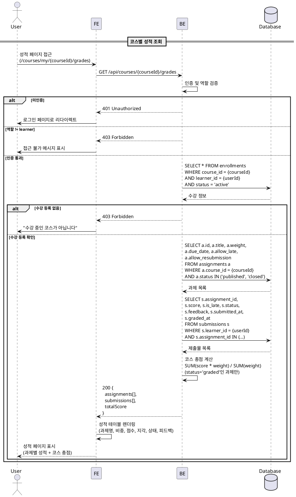
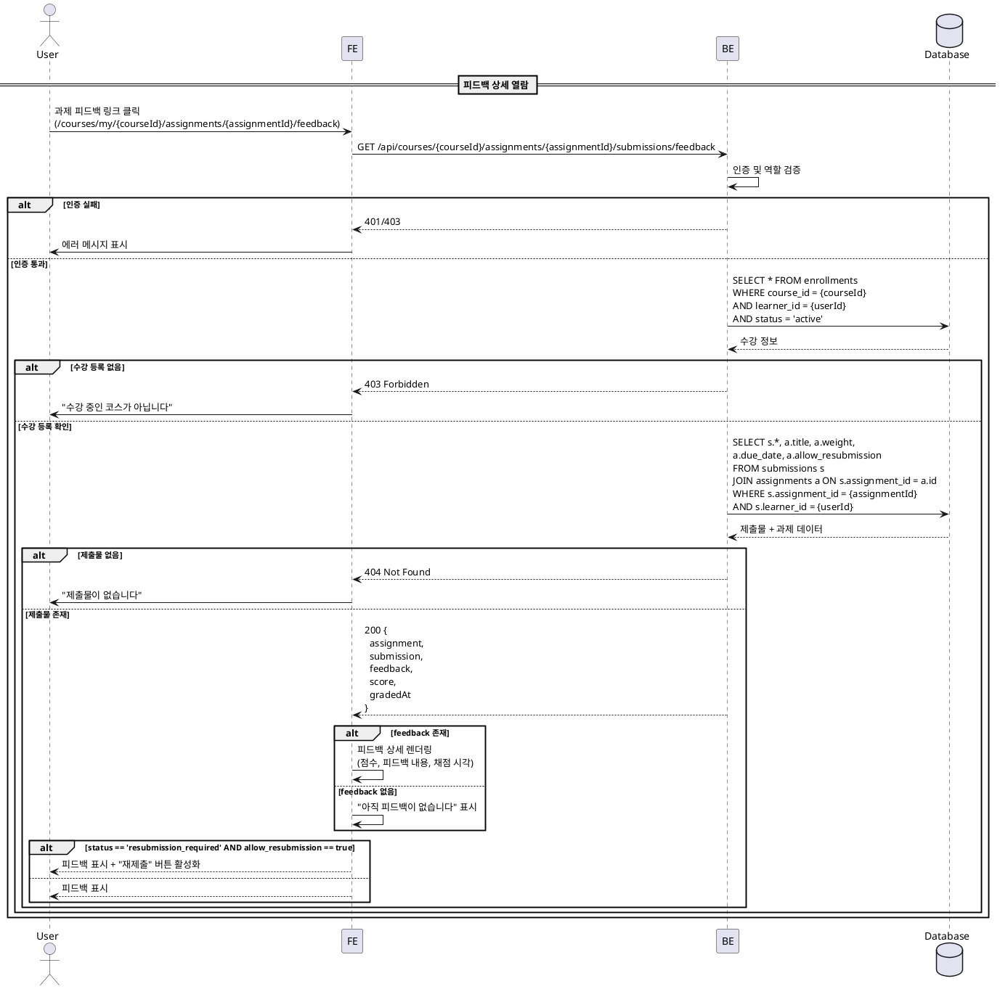

# UC-006: 성적 & 피드백 열람 (Learner)

## Primary Actor

Learner (역할=learner인 인증된 사용자)

## Precondition

- 회원가입 및 온보딩(역할 선택, 프로필 입력)을 완료한 상태
- Learner 역할로 로그인되어 있는 상태
- 해당 코스에 수강신청(`enrollments.status='active'`)이 완료된 상태

## Trigger

- Learner가 내 코스의 성적 페이지(`/courses/my/[courseId]/grades`)에 접근한다.
- 또는 Learner가 과제 상세에서 피드백 페이지(`/courses/my/[courseId]/assignments/[assignmentId]/feedback`)에 접근한다.

---

## Main Scenario

### MS-1. 코스별 성적 요약 조회

1. Learner가 성적 페이지(`/courses/my/{courseId}/grades`)에 진입한다.
2. FE가 `GET /api/courses/{courseId}/grades` 요청을 전송한다.
3. BE가 인증 및 역할(`learner`)을 검증한다.
4. BE가 수강 등록 여부(`enrollments.status='active'`)를 확인한다.
5. BE가 해당 코스의 모든 과제(`status IN ('published', 'closed')`)를 조회한다.
6. BE가 해당 Learner의 제출물(`submissions`)을 과제별로 조회한다.
7. BE가 코스 총점을 계산한다.
   - 가중 평균 = SUM(score * weight) / SUM(weight)
   - 채점 완료(`status='graded'`)된 과제만 총점 계산에 포함
   - 채점 완료된 과제가 없으면 총점 "N/A"
8. BE가 과제별 성적 목록과 코스 총점을 FE에 반환한다.
9. FE가 성적 테이블과 코스 총점 요약을 렌더링한다.

### MS-2. 과제별 성적 상세 표시

1. FE가 과제별로 다음 정보를 테이블 형태로 표시한다.
   - 과제명(`title`)
   - 점수 비중(`weight`)
   - 점수(`score`) / 100
   - 지각 여부(`is_late`)
   - 제출 상태(`status`: submitted / graded / resubmission_required)
   - 피드백 요약 (있을 경우)
2. 채점 전(`status='submitted'`)인 과제는 점수 칸에 "채점 대기" 표시.
3. 재제출 요청(`status='resubmission_required'`)인 과제는 해당 상태를 강조 표시.
4. 미제출 과제(제출물이 없는 경우)는 "미제출" 표시.

### MS-3. 개별 과제 피드백 열람

1. Learner가 성적 테이블에서 특정 과제의 피드백 링크를 클릭한다.
2. FE가 피드백 페이지(`/courses/my/{courseId}/assignments/{assignmentId}/feedback`)로 이동한다.
3. FE가 `GET /api/courses/{courseId}/assignments/{assignmentId}/submissions/feedback` 요청을 전송한다.
4. BE가 인증, 수강 등록, 본인 제출물 여부를 검증한다.
5. BE가 해당 제출물의 피드백 정보를 반환한다.
   - 점수(`score`), 피드백 내용(`feedback`), 채점 시각(`graded_at`)
   - 제출 내용(`content`, `link`), 제출 시각(`submitted_at`)
   - 지각 여부(`is_late`), 제출 상태(`status`)
6. FE가 피드백 상세 화면을 렌더링한다.
   - Instructor의 피드백을 강조하여 표시
   - 재제출 요청 상태인 경우 "재제출" 버튼 표시

---

## Edge Cases

| # | 상황 | 처리 |
|---|------|------|
| E1 | 코스에 과제가 없음 | "등록된 과제가 없습니다" 빈 상태 표시, 총점 "N/A" |
| E2 | 모든 과제가 미제출 상태 | 각 과제 "미제출" 표시, 총점 "N/A" |
| E3 | 모든 과제가 채점 대기 상태 | 각 과제 "채점 대기" 표시, 총점 "N/A" |
| E4 | 수강 등록되지 않은 코스의 성적 접근 | 403 Forbidden 반환, "수강 중인 코스가 아닙니다" 메시지 |
| E5 | 미인증 사용자가 접근 | 401 반환, 로그인 페이지로 리다이렉트 |
| E6 | Instructor 역할이 접근 | 403 Forbidden 반환, Learner 역할만 허용 |
| E7 | 피드백이 아직 없는 제출물의 피드백 페이지 접근 | "아직 피드백이 없습니다" 안내 표시, 제출 내용과 상태만 표시 |
| E8 | 네트워크 오류 | 에러 메시지 표시, 재시도 가능 |
| E9 | 타인의 제출물 피드백에 접근 시도 | 403 Forbidden 반환, 본인 제출물만 열람 가능 |
| E10 | 과제의 `weight`가 모두 0인 경우 | 가중 평균 계산 불가, 총점 "N/A" 표시 |

---

## Business Rules

| # | 규칙 |
|---|------|
| BR1 | 성적 조회는 본인의 제출물만 대상으로 하며, 타인의 성적은 열람할 수 없다. |
| BR2 | 코스 총점 = SUM(score * weight) / SUM(weight). 채점 완료(`status='graded'`)된 과제만 계산에 포함한다. |
| BR3 | 미제출 과제와 채점 대기(`status='submitted'`) 과제는 총점 계산에서 제외한다. |
| BR4 | 재제출 요청(`status='resubmission_required'`) 과제의 점수는 총점 계산에 포함하지 않는다. |
| BR5 | `status IN ('published', 'closed')`인 과제만 성적 목록에 표시한다. `draft` 상태는 제외. |
| BR6 | 피드백 열람 시 반드시 본인 제출물인지 검증한다 (`submissions.learner_id = 현재 사용자`). |
| BR7 | 지각 제출(`is_late=true`)은 성적 테이블에서 별도 표시하여 Learner가 인지할 수 있도록 한다. |
| BR8 | 성적 페이지 접근은 `enrollments(course_id, learner_id, status='active')` 존재 여부를 검증한다. |

---

## Sequence Diagram

### 성적 요약 조회

### 개별 과제 피드백 열람

