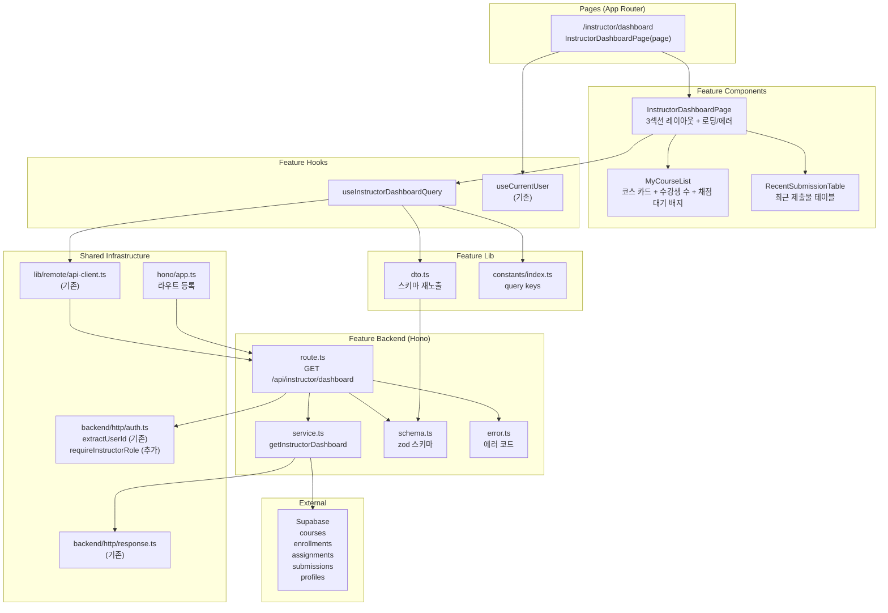

# UC-007 구현 설계: Instructor 대시보드

## Context

UC-007 유스케이스(Instructor 대시보드)를 구현하기 위한 모듈화 설계.
DB 스키마(`courses`, `enrollments`, `assignments`, `submissions`, `profiles`)는 `0002_create_lms_schema.sql`에 이미 존재.
`src/features/learner-dashboard/`의 패턴(schema→error→service→route, dto 재노출, React Query hooks, shadcn 컴포넌트)을 그대로 따른다.

## 현재 상태

### 이미 구현됨
- DB 스키마: `courses`, `enrollments`, `assignments`, `submissions`, `profiles` 테이블, 인덱스, 트리거
- 인증 인프라: `useCurrentUser`, `apiClient`, `respond`/`success`/`failure`, Hono 싱글턴
- 공통 인증 유틸: `extractUserId`, `requireLearnerRole` (`@/backend/http/auth.ts`)
- `(protected)/layout.tsx`: 인증 가드
- `src/app/(protected)/instructor/dashboard/page.tsx`: 임시 페이지 (플레이스홀더)
- shadcn 컴포넌트: button, card, badge, separator, dialog, table 등
- UC-003 (Learner 대시보드): 동일 패턴 참조

### 구현 필요
- `requireInstructorRole` 유틸 추가 (`src/backend/http/auth.ts` 수정)
- `src/features/instructor-dashboard/` 전체 (backend, hooks, components, lib, constants)
- `src/app/(protected)/instructor/dashboard/page.tsx` 페이지 업데이트
- `src/backend/hono/app.ts`에 라우트 등록

---

## 개요

| # | 모듈 | 위치 | 설명 |
|---|------|------|------|
| 1 | requireInstructorRole | `src/backend/http/auth.ts` | **수정** — Instructor 역할 가드 유틸 추가 |
| 2 | Dashboard Backend Schema | `src/features/instructor-dashboard/backend/schema.ts` | 대시보드 응답 zod 스키마 |
| 3 | Dashboard Backend Error | `src/features/instructor-dashboard/backend/error.ts` | 대시보드 에러 코드 정의 |
| 4 | Dashboard Backend Service | `src/features/instructor-dashboard/backend/service.ts` | 대시보드 데이터 집계 비즈니스 로직 |
| 5 | Dashboard Backend Route | `src/features/instructor-dashboard/backend/route.ts` | Hono 라우터 (1개 엔드포인트) |
| 6 | Dashboard DTO | `src/features/instructor-dashboard/lib/dto.ts` | 백엔드 스키마 프론트엔드 재노출 |
| 7 | Dashboard Constants | `src/features/instructor-dashboard/constants/index.ts` | Query Key |
| 8 | useInstructorDashboardQuery | `src/features/instructor-dashboard/hooks/useInstructorDashboardQuery.ts` | 대시보드 조회 훅 |
| 9 | InstructorDashboardPage | `src/features/instructor-dashboard/components/instructor-dashboard-page.tsx` | 메인 대시보드 레이아웃 (3섹션) |
| 10 | MyCourseList | `src/features/instructor-dashboard/components/my-course-list.tsx` | 코스 카드 그리드 + 수강생 수 + 채점 대기 배지 |
| 11 | RecentSubmissionTable | `src/features/instructor-dashboard/components/recent-submission-table.tsx` | 최근 제출물 테이블 |
| 12 | Instructor Dashboard Page | `src/app/(protected)/instructor/dashboard/page.tsx` | **수정** — InstructorDashboardPage 렌더링 |
| 13 | Hono App | `src/backend/hono/app.ts` | **수정** — instructor-dashboard 라우트 등록 |

---

## Diagram



---

## Implementation Plan

### Phase 1: Backend Layer

#### 1-1. `src/backend/http/auth.ts` (수정)

**`requireInstructorRole` 추가:**

```typescript
export const requireInstructorRole = async (
  supabase: SupabaseClient,
  userId: string,
): Promise<ErrorResult<string> | null> => {
  const { data: profile } = await supabase
    .from('profiles')
    .select('role')
    .eq('id', userId)
    .maybeSingle();

  if (profile?.role !== 'instructor') {
    return failure(
      403,
      'FORBIDDEN_ROLE',
      'Instructor만 접근할 수 있습니다.',
    );
  }

  return null;
};
```

**Unit Test:**
- `role='instructor'` → null 반환 (허용)
- `role='learner'` → 403, `FORBIDDEN_ROLE` 반환
- `role='operator'` → 403, `FORBIDDEN_ROLE` 반환
- 프로필 없음 → 403 반환

---

#### 1-2. `src/features/instructor-dashboard/backend/schema.ts`

**zod 스키마 정의:**

```typescript
// 내 코스 + 수강생 수 + 채점 대기 건수
instructorCourseSchema: {
  id: z.string().uuid(),
  title: z.string(),
  description: z.string(),
  categoryName: z.string().nullable(),
  difficultyName: z.string().nullable(),
  status: z.enum(['draft', 'published', 'archived']),
  learnerCount: z.number(),          // enrollments.status='active' COUNT
  pendingGradingCount: z.number(),   // submissions.status='submitted' COUNT
  createdAt: z.string(),
}

// 최근 제출물
recentSubmissionSchema: {
  id: z.string().uuid(),
  assignmentId: z.string().uuid(),
  assignmentTitle: z.string(),
  courseId: z.string().uuid(),
  courseTitle: z.string(),
  learnerId: z.string().uuid(),
  learnerName: z.string(),
  status: z.enum(['submitted', 'graded', 'resubmission_required']),
  isLate: z.boolean(),
  submittedAt: z.string(),
}

// 대시보드 전체 응답
instructorDashboardResponseSchema: {
  courses: z.array(instructorCourseSchema),
  totalPendingGradingCount: z.number(),    // 전체 채점 대기 총 건수
  recentSubmissions: z.array(recentSubmissionSchema),
}
```

**Unit Test:**
- 유효한 `instructorCourseSchema` 입력 통과
- `status` 열거값 3종 통과
- `recentSubmissionSchema`의 `isLate` boolean 통과
- 전체 응답 스키마 조합 통과

---

#### 1-3. `src/features/instructor-dashboard/backend/error.ts`

**에러 코드:**

```typescript
export const instructorDashboardErrorCodes = {
  unauthorized: 'INSTRUCTOR_DASHBOARD_UNAUTHORIZED',
  forbiddenRole: 'INSTRUCTOR_DASHBOARD_FORBIDDEN_ROLE',
  fetchError: 'INSTRUCTOR_DASHBOARD_FETCH_ERROR',
} as const;
```

**Unit Test:**
- 에러 코드 값의 고유성 검증

---

#### 1-4. `src/features/instructor-dashboard/backend/service.ts`

**함수:**

| 함수명 | 입력 | 출력 | 설명 |
|--------|------|------|------|
| `getInstructorDashboard` | `(supabase, userId: string)` | `HandlerResult<InstructorDashboardResponse>` | 내 코스 + 수강생 수 + 채점 대기, 최근 제출물 집계 |

**비즈니스 로직 상세 (4단계):**

**Step 1 — 내 코스 목록 (MS-1, BR1, BR2):**
1. `courses` SELECT WHERE `instructor_id={userId}`
2. JOIN `categories(name)`, `difficulty_levels(name)`
3. ORDER BY `created_at DESC` (BR2)
4. 결과에서 `courseIds` 배열 추출
5. courseIds 빈 배열이면 빈 응답 즉시 반환 (E1)

**Step 2 — 코스별 수강생 수 (MS-1, BR6):**
1. `enrollments` SELECT WHERE `course_id IN (courseIds)` AND `status='active'`
2. 클라이언트 사이드 GROUP BY `course_id` → Map<courseId, learnerCount>

**Step 3 — 코스별 채점 대기 건수 (MS-2, BR3):**
1. `submissions` SELECT WHERE `status='submitted'`
2. JOIN `assignments(course_id)` — course_id 역참조
3. courseIds에 포함된 코스만 필터
4. 클라이언트 사이드 GROUP BY `course_id` → Map<courseId, pendingCount>
5. `totalPendingGradingCount` = 모든 pendingCount 합산

**Step 4 — 최근 제출물 (MS-3, BR4):**
1. `submissions` SELECT 최근 10건 (`created_at DESC`)
2. JOIN `assignments(id, title, course_id)`, `courses(id, title)`, `profiles(name)` — learner_id 기준
3. `course_id IN (courseIds)` 필터 (BR1)
4. LIMIT 10
5. `{ id, assignmentId, assignmentTitle, courseId, courseTitle, learnerId, learnerName, status, isLate, submittedAt }`

**Unit Test:**
- 코스 0건 → 빈 응답 반환 (E1)
- 코스 있음 → courses에 포함
- `instructor_id != userId` 코스 → 제외 (BR1)
- `enrollments.status='cancelled'` → learnerCount 제외 (BR6)
- 채점 대기: `status='submitted'`만 집계 (BR3)
- 채점 대기: `status='graded'` → 제외 (BR3)
- 채점 대기: `status='resubmission_required'` → 제외 (BR3)
- 최근 제출물: `created_at DESC` 정렬 (BR4)
- 최근 제출물: 최대 10건 (BR4)
- 최근 제출물: 0건 → 빈 배열 (E3)
- 최근 제출물: 다른 강사 코스 제출물 → 제외 (BR1)
- `totalPendingGradingCount`: 코스별 합산 값 정확성
- DB 오류 → 500, `INSTRUCTOR_DASHBOARD_FETCH_ERROR`

---

#### 1-5. `src/features/instructor-dashboard/backend/route.ts`

**엔드포인트:**

| Method | Path | Auth | 설명 |
|--------|------|------|------|
| GET | `/api/instructor/dashboard` | 필수 (Instructor만) | 대시보드 전체 데이터 |

**흐름:**
1. `extractUserId(c)` — 미인증 시 401, `INSTRUCTOR_DASHBOARD_UNAUTHORIZED` (E4)
2. `requireInstructorRole(supabase, userId)` — 비강사 시 403, `INSTRUCTOR_DASHBOARD_FORBIDDEN_ROLE` (E5)
3. `getInstructorDashboard(supabase, userId)` 호출
4. `respond(c, result)` 반환

---

### Phase 2: Shared / Infrastructure

#### 2-1. `src/features/instructor-dashboard/lib/dto.ts`

```typescript
export {
  instructorCourseSchema,
  recentSubmissionSchema,
  instructorDashboardResponseSchema,
  type InstructorCourse,
  type RecentSubmission,
  type InstructorDashboardResponse,
} from '../backend/schema';
```

---

#### 2-2. `src/features/instructor-dashboard/constants/index.ts`

```typescript
export const INSTRUCTOR_DASHBOARD_QUERY_KEYS = {
  all: ['instructor-dashboard'] as const,
  dashboard: ['instructor-dashboard', 'main'] as const,
} as const;
```

---

#### 2-3. `src/backend/hono/app.ts` (수정)

```typescript
import { registerInstructorDashboardRoutes } from '@/features/instructor-dashboard/backend/route';
// ...
registerInstructorDashboardRoutes(app);  // registerLearnerDashboardRoutes 다음에 추가
```

---

### Phase 3: Frontend Hook

#### 3-1. `src/features/instructor-dashboard/hooks/useInstructorDashboardQuery.ts`

```typescript
// apiClient.get('/api/instructor/dashboard')로 호출
// instructorDashboardResponseSchema.parse(data) 응답 검증
// queryKey: INSTRUCTOR_DASHBOARD_QUERY_KEYS.dashboard
// staleTime: 60 * 1000
```

---

### Phase 4: Frontend Components

#### 4-1. `src/features/instructor-dashboard/components/instructor-dashboard-page.tsx`

메인 대시보드 레이아웃. `useInstructorDashboardQuery` 호출하여 3개 섹션에 데이터 분배.

| 섹션 | 제목 | 컴포넌트 | 데이터 |
|------|------|----------|--------|
| 1 | 채점 대기 배지 (헤더) | 인라인 Badge | `data.totalPendingGradingCount` |
| 2 | 내 코스 목록 | `MyCourseList` | `data.courses` |
| 3 | 최근 제출물 | `RecentSubmissionTable` | `data.recentSubmissions` |

- 로딩 시 스켈레톤 카드 표시
- 에러 시 에러 메시지 + "다시 시도" 버튼 (`refetch`)
- `totalPendingGradingCount > 0`일 때 헤더에 빨간 채점 대기 배지 표시 (E2)

**QA Sheet:**

| # | 시나리오 | 기대 결과 |
|---|----------|-----------|
| 1 | 정상 데이터 | 채점 대기 배지 + 코스 목록 + 최근 제출물 렌더링 |
| 2 | 로딩 중 | 스켈레톤 UI 표시 |
| 3 | 네트워크 오류 (E6) | 에러 메시지 + 재시도 버튼 |
| 4 | 미인증 접근 (E4) | 로그인 리다이렉트 (layout 가드) |
| 5 | Learner 역할 접근 (E5) | 403 에러 메시지 표시 |
| 6 | 채점 대기 0건 (E2) | 채점 대기 배지 미표시 또는 0 표시 |

---

#### 4-2. `src/features/instructor-dashboard/components/my-course-list.tsx`

내 코스 카드 그리드. shadcn `Card` + `Badge`. 상태별 색상 구분. 각 카드에 채점 대기 배지 표시.

| 영역 | 내용 |
|------|------|
| Header | 코스 제목(line-clamp-1), 상태 Badge (published/draft/archived 색상 구분) |
| Content | 카테고리 Badge, 난이도 Badge, 수강생 수, 채점 대기 건수 Badge |

**상태 Badge 색상:**
- `published` → `bg-green-100 text-green-800` "공개"
- `draft` → `bg-yellow-100 text-yellow-800` "초안"
- `archived` → `bg-gray-100 text-gray-800` "보관"

**채점 대기 Badge:**
- `pendingGradingCount > 0` → `variant="destructive"` `{count}건 채점 대기`
- `pendingGradingCount === 0` → 미표시 (E2)

**QA Sheet:**

| # | 시나리오 | 기대 결과 |
|---|----------|-----------|
| 1 | 코스 있음 | 그리드(sm:2열, lg:3열) 레이아웃에 카드 표시 |
| 2 | 코스 0건 (E1) | "아직 코스가 없습니다. 새 코스를 만들어 보세요." + 코스 생성 버튼 |
| 3 | published 코스 | 초록색 "공개" 뱃지 |
| 4 | draft 코스 | 노란색 "초안" 뱃지 |
| 5 | archived 코스 | 회색 "보관" 뱃지 |
| 6 | 채점 대기 있음 | 빨간색 "N건 채점 대기" 뱃지 |
| 7 | 채점 대기 0건 | 채점 대기 뱃지 미표시 |
| 8 | 수강생 없는 코스 | 수강생 0명 표시 |
| 9 | 카테고리/난이도 null | 해당 뱃지 미표시 |

---

#### 4-3. `src/features/instructor-dashboard/components/recent-submission-table.tsx`

최근 제출물 테이블. shadcn `Table` 또는 반응형 카드 목록. 행 클릭 시 채점 페이지로 이동.

| 컬럼 | 내용 |
|------|------|
| 제출자 | 학습자 이름 |
| 과제명 | 과제 제목 (truncate) |
| 코스명 | 코스 제목 |
| 제출일 | `format(submittedAt, 'yyyy.MM.dd HH:mm', { locale: ko })` |
| 상태 | 상태 Badge |
| 지각 여부 | 지각 시 `Badge variant="outline"` "지각" 표시 |

**상태 Badge:**
- `submitted` → `bg-blue-100 text-blue-800` "제출됨"
- `graded` → `bg-green-100 text-green-800` "채점완료"
- `resubmission_required` → `bg-orange-100 text-orange-800` "재제출요청"

**클릭 이동 경로:**
- `/instructor/assignments/${submission.assignmentId}/submissions`

**QA Sheet:**

| # | 시나리오 | 기대 결과 |
|---|----------|-----------|
| 1 | 제출물 있음 | 테이블/목록에 행 표시 |
| 2 | 제출물 0건 (E3) | "아직 제출된 과제가 없습니다" 빈 상태 표시 |
| 3 | status=submitted | 파란색 "제출됨" 뱃지 |
| 4 | status=graded | 초록색 "채점완료" 뱃지 |
| 5 | status=resubmission_required | 주황색 "재제출요청" 뱃지 |
| 6 | isLate=true | "지각" 뱃지 표시 |
| 7 | isLate=false | 지각 뱃지 미표시 |
| 8 | 행 클릭 | `/instructor/assignments/{assignmentId}/submissions`로 이동 |

---

### Phase 5: Page

#### 5-1. `src/app/(protected)/instructor/dashboard/page.tsx` (수정)

`(protected)` 라우트 그룹 하위 → 인증 가드 자동 적용. 기존 임시 페이지를 `InstructorDashboardPage` 컴포넌트로 대체.

**구성:**
- `InstructorDashboardPage` 컴포넌트 렌더링
- `params: Promise<Record<string, never>>` + `void params` 패턴 유지

**QA Sheet:**

| # | 시나리오 | 기대 결과 |
|---|----------|-----------|
| 1 | Instructor 사용자 접근 | 대시보드 3개 섹션 표시 |
| 2 | 미인증 접근 (E4) | 로그인 페이지 리다이렉트 |
| 3 | Learner 역할 접근 (E5) | 403 에러 메시지 표시 |
| 4 | 코스 없음 (E1) | 빈 상태 UI + 코스 생성 버튼 |
| 5 | 채점 대기 0건 (E2) | 배지 미표시 |
| 6 | 최근 제출물 없음 (E3) | 빈 상태 메시지 표시 |

---

## 작업 순서 (의존성 기반)

```
Phase 1 (Backend — 순차)
├── 1-1. auth.ts 수정 (requireInstructorRole 추가)
├── 1-2. schema.ts
├── 1-3. error.ts
├── 1-4. service.ts (schema, error 의존)
└── 1-5. route.ts (service, schema, error, auth.ts 의존)

Phase 2 (Shared — Phase 1 후)
├── 2-1. dto.ts
├── 2-2. constants/index.ts
└── 2-3. hono/app.ts 수정

Phase 3 (Frontend Hook — Phase 2 후)
└── 3-1. useInstructorDashboardQuery.ts

Phase 4 (Frontend Components — Phase 3 후)
├── 4-1. instructor-dashboard-page.tsx (useInstructorDashboardQuery 의존)
├── 4-2. my-course-list.tsx
└── 4-3. recent-submission-table.tsx

Phase 5 (Page — Phase 4 후)
└── 5-1. /instructor/dashboard/page.tsx 수정 (instructor-dashboard-page 의존)
```

## 참조 파일

| 용도 | 파일 |
|------|------|
| Route 패턴 | `src/features/learner-dashboard/backend/route.ts` |
| Service 패턴 | `src/features/learner-dashboard/backend/service.ts` |
| Schema 패턴 | `src/features/learner-dashboard/backend/schema.ts` |
| Error 패턴 | `src/features/learner-dashboard/backend/error.ts` |
| 공통 인증 유틸 | `src/backend/http/auth.ts` |
| HTTP 응답 | `src/backend/http/response.ts` |
| Hono Context | `src/backend/hono/context.ts` |
| Query Hook 패턴 | `src/features/learner-dashboard/hooks/useLearnerDashboardQuery.ts` |
| DTO 패턴 | `src/features/learner-dashboard/lib/dto.ts` |
| Constants 패턴 | `src/features/learner-dashboard/constants/index.ts` |
| API Client | `src/lib/remote/api-client.ts` |
| Component 패턴 (카드 리스트) | `src/features/learner-dashboard/components/enrolled-course-list.tsx` |
| Component 패턴 (테이블 리스트) | `src/features/learner-dashboard/components/upcoming-assignment-list.tsx` |
| Dashboard Page 패턴 | `src/features/learner-dashboard/components/learner-dashboard-page.tsx` |
| Protected Layout | `src/app/(protected)/layout.tsx` |
| 기존 Instructor Page | `src/app/(protected)/instructor/dashboard/page.tsx` |
