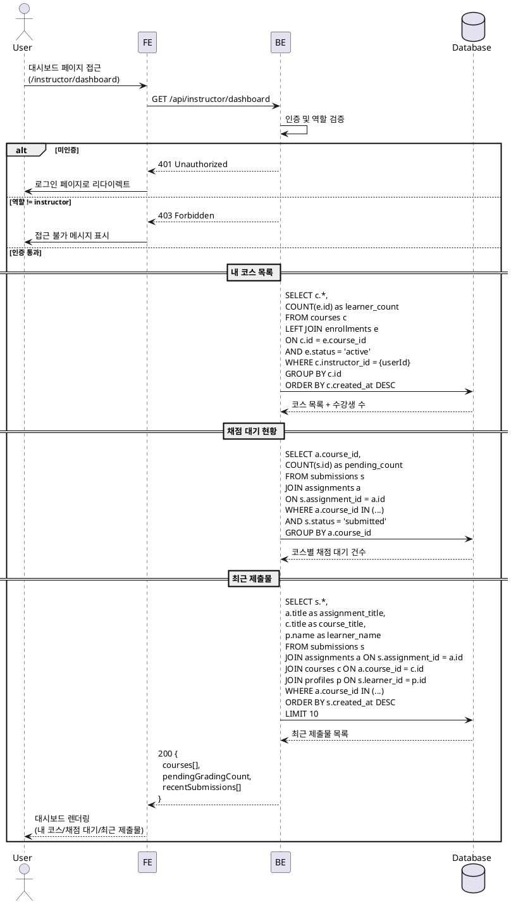

# UC-007: Instructor 대시보드

## Primary Actor

Instructor (역할=instructor인 인증된 사용자)

## Precondition

- 회원가입 및 온보딩(역할 선택, 프로필 입력)을 완료한 상태
- Instructor 역할로 로그인되어 있는 상태

## Trigger

- Instructor가 대시보드 페이지(`/instructor/dashboard`)에 접근한다.

---

## Main Scenario

### MS-1. 내 코스 목록 조회

1. Instructor가 대시보드 페이지에 진입한다.
2. FE가 `GET /api/instructor/dashboard` 요청을 전송한다.
3. BE가 인증 및 역할(`instructor`)을 검증한다.
4. BE가 `courses WHERE instructor_id = {userId}`로 본인이 생성한 코스 목록을 조회한다.
5. BE가 각 코스의 상태(`draft` / `published` / `archived`)와 수강생 수(`enrollments WHERE status='active'` COUNT)를 함께 반환한다.
6. FE가 코스 카드 목록을 상태별로 그룹핑하여 렌더링한다 (Published / Draft / Archived 탭 또는 섹션).

### MS-2. 채점 대기 현황 표시

1. BE가 Instructor의 코스에 속한 과제의 제출물 중 `submissions.status = 'submitted'`인 건수를 집계한다.
   - `submissions JOIN assignments ON submissions.assignment_id = assignments.id`
   - `assignments.course_id IN (Instructor의 코스 ID 목록)`
2. BE가 코스별 채점 대기 건수와 전체 채점 대기 총 건수를 반환한다.
3. FE가 대시보드 상단에 채점 대기 배지(총 건수)를 표시하고, 코스 카드에 개별 건수를 표시한다.

### MS-3. 최근 제출물 목록 표시

1. BE가 Instructor의 코스에 속한 과제의 제출물을 `submissions.created_at DESC` 순으로 조회한다.
   - 최대 10건으로 제한한다.
   - 제출자 이름, 과제명, 코스명, 제출일시, 상태(`submitted` / `graded` / `resubmission_required`), 지각 여부를 포함한다.
2. FE가 최근 제출물 목록을 테이블 형태로 렌더링한다.
3. 각 제출물 행을 클릭하면 해당 과제의 제출물 상세 페이지(`/instructor/assignments/[assignmentId]/submissions`)로 이동한다.

---

## Edge Cases

| # | 상황 | 처리 |
|---|------|------|
| E1 | 생성한 코스가 0건 | 빈 상태 UI 표시 ("아직 코스가 없습니다. 새 코스를 만들어 보세요.") + 코스 생성 버튼 |
| E2 | 채점 대기 제출물이 0건 | 채점 대기 배지를 숨기거나 0으로 표시 |
| E3 | 최근 제출물이 0건 | "아직 제출된 과제가 없습니다" 빈 상태 표시 |
| E4 | 미인증 사용자 접근 | 401 반환, 로그인 페이지로 리다이렉트 |
| E5 | Learner 역할이 접근 | 403 Forbidden 반환, 접근 불가 메시지 표시 |
| E6 | 네트워크 오류 | 에러 메시지 표시, 재시도 가능 |
| E7 | 코스가 다수(50건 이상)인 경우 | 페이지네이션 또는 무한 스크롤로 처리, 초기 로드는 최근 생성순 상위 20건 |

---

## Business Rules

| # | 규칙 |
|---|------|
| BR1 | 대시보드에는 `courses.instructor_id`가 본인인 코스만 표시된다. 다른 Instructor의 코스는 노출하지 않는다. |
| BR2 | 코스 목록은 상태(`draft` / `published` / `archived`)별로 구분하여 표시하며, 기본 정렬은 `created_at DESC`이다. |
| BR3 | 채점 대기 건수는 `submissions.status = 'submitted'`인 제출물만 집계한다. `graded` 또는 `resubmission_required`는 제외한다. |
| BR4 | 최근 제출물은 모든 상태의 제출물을 포함하며, `created_at DESC` 정렬로 최대 10건을 표시한다. |
| BR5 | 대시보드 접근은 Instructor 역할만 허용한다 (역할 기반 가드). |
| BR6 | 수강생 수는 `enrollments.status = 'active'`인 레코드만 집계한다. `cancelled`는 제외한다. |

---

## Sequence Diagram

