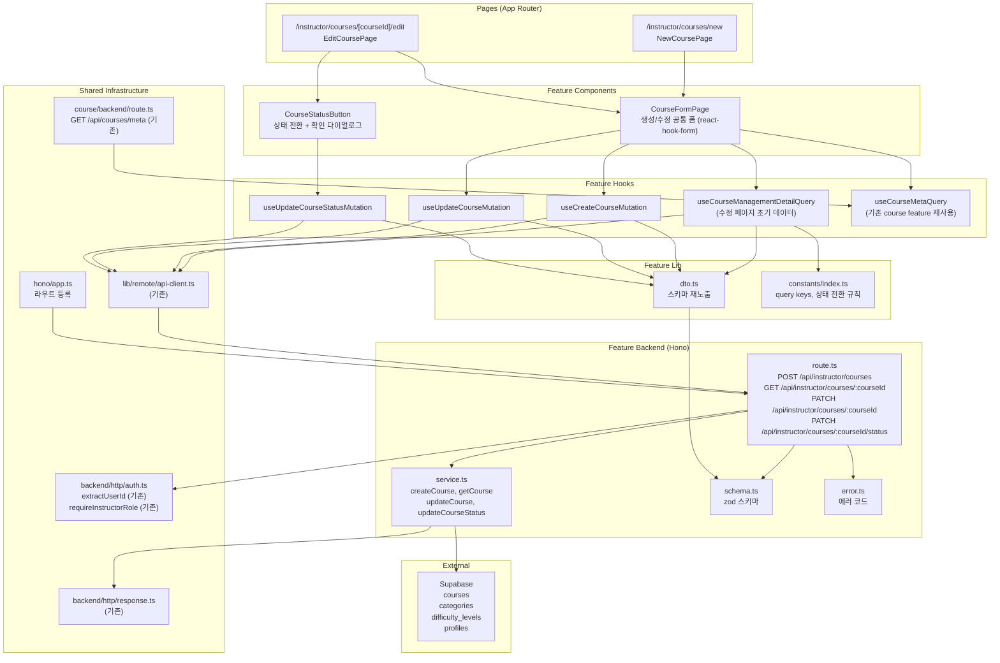

# UC-008 구현 설계: 코스 관리 (Instructor)

## Context

UC-008 유스케이스(Instructor 코스 관리)를 구현하기 위한 모듈화 설계.
DB 스키마(`courses`, `categories`, `difficulty_levels`, `profiles`)는 `0002_create_lms_schema.sql`에 이미 존재.
`src/features/instructor-dashboard/`의 패턴(schema→error→service→route, dto 재노출, React Query hooks, shadcn 컴포넌트)을 그대로 따른다.

## 현재 상태

### 이미 구현됨

- DB 스키마: `courses`, `categories`, `difficulty_levels`, `profiles` 테이블, 인덱스, 트리거
- 인증 인프라: `useCurrentUser`, `apiClient`, `respond`/`success`/`failure`, Hono 싱글턴
- 공통 인증 유틸: `extractUserId`, `requireInstructorRole` (`src/backend/http/auth.ts`)
- `(protected)/layout.tsx`: 인증 가드
- `src/features/course/backend/service.ts`의 `getCourseMeta`: `GET /api/courses/meta` — 카테고리 + 난이도 목록 (재사용 가능)
- Instructor 대시보드 `MyCourseList`: `/instructor/courses/new` 링크 이미 포함됨
- shadcn 컴포넌트: button, card, badge, separator, dialog, form, input, textarea, select 등

### 구현 필요

- `src/features/course-management/` 전체 (backend, hooks, components, lib, constants)
- `src/app/(protected)/instructor/courses/new/page.tsx` 페이지
- `src/app/(protected)/instructor/courses/[courseId]/edit/page.tsx` 페이지
- `src/backend/hono/app.ts`에 라우트 등록

---

## 개요

| # | 모듈 | 위치 | 설명 |
|---|------|------|------|
| 1 | CourseManagement Backend Schema | `src/features/course-management/backend/schema.ts` | 요청/응답 zod 스키마 |
| 2 | CourseManagement Backend Error | `src/features/course-management/backend/error.ts` | 에러 코드 정의 |
| 3 | CourseManagement Backend Service | `src/features/course-management/backend/service.ts` | CRUD 및 상태 전환 비즈니스 로직 |
| 4 | CourseManagement Backend Route | `src/features/course-management/backend/route.ts` | Hono 라우터 (4개 엔드포인트) |
| 5 | CourseManagement DTO | `src/features/course-management/lib/dto.ts` | 백엔드 스키마 프론트엔드 재노출 |
| 6 | CourseManagement Constants | `src/features/course-management/constants/index.ts` | Query Key, 상태 전환 규칙 상수 |
| 7 | useCourseManagementDetailQuery | `src/features/course-management/hooks/useCourseManagementDetailQuery.ts` | 코스 조회 훅 (수정 페이지 초기 데이터) |
| 8 | useCreateCourseMutation | `src/features/course-management/hooks/useCreateCourseMutation.ts` | 코스 생성 뮤테이션 |
| 9 | useUpdateCourseMutation | `src/features/course-management/hooks/useUpdateCourseMutation.ts` | 코스 수정 뮤테이션 |
| 10 | useUpdateCourseStatusMutation | `src/features/course-management/hooks/useUpdateCourseStatusMutation.ts` | 코스 상태 전환 뮤테이션 |
| 11 | CourseFormPage | `src/features/course-management/components/course-form-page.tsx` | 생성/수정 공통 폼 레이아웃 (react-hook-form) |
| 12 | CourseStatusButton | `src/features/course-management/components/course-status-button.tsx` | 상태 전환 버튼 + 확인 다이얼로그 |
| 13 | New Course Page | `src/app/(protected)/instructor/courses/new/page.tsx` | 코스 생성 페이지 |
| 14 | Edit Course Page | `src/app/(protected)/instructor/courses/[courseId]/edit/page.tsx` | 코스 수정 페이지 |
| 15 | Hono App | `src/backend/hono/app.ts` | **수정** — course-management 라우트 등록 |

---

## Diagram



---

## Implementation Plan

### Phase 1: Backend Layer

#### 1-1. `src/features/course-management/backend/schema.ts`

**zod 스키마 정의:**

```typescript
// 코스 생성 요청
createCourseBodySchema: {
  title: z.string().min(1, '제목을 입력해주세요.'),
  description: z.string().default(''),
  categoryId: z.string().uuid('유효한 카테고리를 선택해주세요.'),
  difficultyId: z.string().uuid('유효한 난이도를 선택해주세요.'),
  curriculum: z.string().default(''),
}

// 코스 수정 요청
updateCourseBodySchema: {
  title: z.string().min(1, '제목을 입력해주세요.').optional(),
  description: z.string().optional(),
  categoryId: z.string().uuid().optional(),
  difficultyId: z.string().uuid().optional(),
  curriculum: z.string().optional(),
}

// 상태 전환 요청
updateCourseStatusBodySchema: {
  status: z.enum(['published', 'archived']),
}

// 코스 응답 (생성/조회/수정 공통)
courseManagementResponseSchema: {
  id: z.string().uuid(),
  title: z.string(),
  description: z.string(),
  categoryId: z.string().uuid().nullable(),
  categoryName: z.string().nullable(),
  difficultyId: z.string().uuid().nullable(),
  difficultyName: z.string().nullable(),
  curriculum: z.string(),
  status: z.enum(['draft', 'published', 'archived']),
  createdAt: z.string(),
  updatedAt: z.string(),
}

// 경로 파라미터
courseIdParamSchema: {
  courseId: z.string().uuid('유효한 코스 ID가 필요합니다.'),
}
```

**Unit Test:**
- `createCourseBodySchema`: title 빈 문자열 → 실패 (E1)
- `createCourseBodySchema`: categoryId/difficultyId UUID 형식 아님 → 실패 (E2)
- `updateCourseBodySchema`: 모든 필드 optional, 하나만 있어도 통과
- `updateCourseStatusBodySchema`: `'draft'` 전달 → 실패 (허용 안 됨)
- `updateCourseStatusBodySchema`: `'published'` / `'archived'` → 통과
- `courseManagementResponseSchema`: status 3종 enum 통과
- `courseManagementResponseSchema`: categoryId nullable 통과

---

#### 1-2. `src/features/course-management/backend/error.ts`

**에러 코드:**

```typescript
export const courseManagementErrorCodes = {
  unauthorized: 'COURSE_MGMT_UNAUTHORIZED',
  forbiddenRole: 'COURSE_MGMT_FORBIDDEN_ROLE',
  forbidden: 'COURSE_MGMT_FORBIDDEN',
  notFound: 'COURSE_MGMT_NOT_FOUND',
  validationError: 'COURSE_MGMT_VALIDATION_ERROR',
  invalidCategory: 'COURSE_MGMT_INVALID_CATEGORY',
  invalidDifficulty: 'COURSE_MGMT_INVALID_DIFFICULTY',
  invalidStatusTransition: 'COURSE_MGMT_INVALID_STATUS_TRANSITION',
  createFailed: 'COURSE_MGMT_CREATE_FAILED',
  updateFailed: 'COURSE_MGMT_UPDATE_FAILED',
  fetchError: 'COURSE_MGMT_FETCH_ERROR',
} as const;
```

**Unit Test:**
- 에러 코드 값의 고유성 검증

---

#### 1-3. `src/features/course-management/backend/service.ts`

**함수 목록:**

| 함수명 | 입력 | 출력 | 설명 |
|--------|------|------|------|
| `createCourse` | `(supabase, userId, body: CreateCourseBody)` | `HandlerResult<CourseManagementResponse>` | 코스 생성, status='draft' (BR1) |
| `getCourse` | `(supabase, userId, courseId)` | `HandlerResult<CourseManagementResponse>` | 코스 조회 + 소유자 검증 |
| `updateCourse` | `(supabase, userId, courseId, body: UpdateCourseBody)` | `HandlerResult<CourseManagementResponse>` | 코스 필드 수정 |
| `updateCourseStatus` | `(supabase, userId, courseId, newStatus)` | `HandlerResult<CourseManagementResponse>` | 상태 전환 (BR2) |

**비즈니스 로직 상세:**

**`createCourse` (MS-1):**
1. `categories` SELECT WHERE `id={categoryId}` AND `is_active=true` — 없으면 400, `COURSE_MGMT_INVALID_CATEGORY` (E3, E11)
2. `difficulty_levels` SELECT WHERE `id={difficultyId}` AND `is_active=true` — 없으면 400, `COURSE_MGMT_INVALID_DIFFICULTY` (E3, E11)
3. `courses` INSERT `{ instructor_id: userId, title, description, category_id, difficulty_id, curriculum, status: 'draft' }` (BR1)
4. 생성된 코스 JOIN `categories(name)`, `difficulty_levels(name)` 조회 후 응답 반환 (201)

**`getCourse` (MS-2):**
1. `courses` SELECT JOIN `categories(name)`, `difficulty_levels(name)` WHERE `id={courseId}` — 없으면 404 (E5)
2. `courses.instructor_id !== userId` → 403, `COURSE_MGMT_FORBIDDEN` (E4, BR5)
3. 코스 데이터 반환

**`updateCourse` (MS-2):**
1. `courses` SELECT WHERE `id={courseId}` — 없으면 404 (E5)
2. `courses.instructor_id !== userId` → 403, `COURSE_MGMT_FORBIDDEN` (E4, BR5)
3. `categoryId` 전달 시 `is_active=true` 검증 (E3, E11)
4. `difficultyId` 전달 시 `is_active=true` 검증 (E3, E11)
5. `courses` UPDATE 필드 (title, description, category_id, difficulty_id, curriculum) 중 전달된 것만 (BR8)
6. 업데이트된 코스 응답 반환

**`updateCourseStatus` (MS-3, BR2):**
1. `courses` SELECT WHERE `id={courseId}` — 없으면 404 (E5)
2. `courses.instructor_id !== userId` → 403, `COURSE_MGMT_FORBIDDEN` (E4, BR5)
3. 상태 전환 규칙 검증 (E6):
   - `currentStatus === 'draft'` → `newStatus`는 `'published'`만 허용
   - `currentStatus === 'published'` → `newStatus`는 `'archived'`만 허용
   - `currentStatus === 'archived'` → 모든 전환 차단 (`COURSE_MGMT_INVALID_STATUS_TRANSITION`)
4. `courses` UPDATE `{ status: newStatus }`
5. 업데이트된 코스 응답 반환

**Unit Test:**
- `createCourse`: 비활성 categoryId → 400, `COURSE_MGMT_INVALID_CATEGORY` (E3)
- `createCourse`: 비활성 difficultyId → 400, `COURSE_MGMT_INVALID_DIFFICULTY` (E3)
- `createCourse`: 정상 → status='draft', 201 (BR1)
- `getCourse`: 존재하지 않는 courseId → 404 (E5)
- `getCourse`: 타 instructor 소유 코스 → 403 (E4)
- `getCourse`: 본인 소유 코스 → 200, 데이터 반환
- `updateCourse`: 타 instructor 소유 코스 → 403 (E4)
- `updateCourse`: 비활성 카테고리 → 400 (E11)
- `updateCourse`: title 빈 문자열 전달 → 400 (E7)
- `updateCourse`: 정상 → 200, 변경 반영
- `updateCourseStatus`: `draft` → `published` → 200 (BR2)
- `updateCourseStatus`: `published` → `archived` → 200 (BR2)
- `updateCourseStatus`: `draft` → `archived` → 400, `COURSE_MGMT_INVALID_STATUS_TRANSITION` (E6)
- `updateCourseStatus`: `archived` → `published` → 400 (E6)
- `updateCourseStatus`: `archived` → `draft` → 400 (E6)
- DB 오류 → 500, `COURSE_MGMT_FETCH_ERROR`

---

#### 1-4. `src/features/course-management/backend/route.ts`

**엔드포인트:**

| Method | Path | Auth | 설명 |
|--------|------|------|------|
| POST | `/api/instructor/courses` | 필수 (Instructor만) | 코스 생성 (MS-1) |
| GET | `/api/instructor/courses/:courseId` | 필수 (Instructor만, 소유자) | 코스 조회 (MS-2) |
| PATCH | `/api/instructor/courses/:courseId` | 필수 (Instructor만, 소유자) | 코스 수정 (MS-2) |
| PATCH | `/api/instructor/courses/:courseId/status` | 필수 (Instructor만, 소유자) | 상태 전환 (MS-3) |

**공통 인증 흐름 (각 엔드포인트):**
1. `extractUserId(c)` — 미인증 시 401, `COURSE_MGMT_UNAUTHORIZED` (E9)
2. `requireInstructorRole(supabase, userId)` — 비강사 시 403 (E8)
3. service 함수 호출
4. `respond(c, result)` 반환

**POST `/api/instructor/courses` 추가 흐름:**
- `createCourseBodySchema.safeParse(await c.req.json())` — 실패 시 400 (E1, E2)
- `createCourse(supabase, userId, body)` 호출

**GET `/api/instructor/courses/:courseId` 추가 흐름:**
- `courseIdParamSchema.safeParse({ courseId: c.req.param('courseId') })` — 실패 시 400
- `getCourse(supabase, userId, courseId)` 호출

**PATCH `/api/instructor/courses/:courseId` 추가 흐름:**
- `courseIdParamSchema.safeParse(...)` — 실패 시 400
- `updateCourseBodySchema.safeParse(await c.req.json())` — 실패 시 400 (E1, E7)
- `updateCourse(supabase, userId, courseId, body)` 호출

**PATCH `/api/instructor/courses/:courseId/status` 추가 흐름:**
- `courseIdParamSchema.safeParse(...)` — 실패 시 400
- `updateCourseStatusBodySchema.safeParse(await c.req.json())` — 실패 시 400 (E6)
- `updateCourseStatus(supabase, userId, courseId, body.status)` 호출

---

### Phase 2: Shared / Infrastructure

#### 2-1. `src/features/course-management/lib/dto.ts`

```typescript
export {
  createCourseBodySchema,
  updateCourseBodySchema,
  updateCourseStatusBodySchema,
  courseManagementResponseSchema,
  type CreateCourseBody,
  type UpdateCourseBody,
  type UpdateCourseStatusBody,
  type CourseManagementResponse,
} from '../backend/schema';
```

---

#### 2-2. `src/features/course-management/constants/index.ts`

```typescript
export const COURSE_MANAGEMENT_QUERY_KEYS = {
  all: ['course-management'] as const,
  detail: (courseId: string) => ['course-management', 'detail', courseId] as const,
} as const;

// 허용된 상태 전환 규칙 (BR2)
export const ALLOWED_STATUS_TRANSITIONS = {
  draft: ['published'],
  published: ['archived'],
  archived: [],
} as const satisfies Record<string, readonly string[]>;

// 상태 전환 버튼 라벨 및 확인 다이얼로그 메시지
export const STATUS_TRANSITION_CONFIG = {
  published: {
    label: '게시하기',
    confirmMessage: '코스를 게시하면 학습자에게 공개됩니다. 게시하시겠습니까?',
  },
  archived: {
    label: '보관하기',
    confirmMessage: '코스를 보관하면 신규 수강신청이 차단됩니다. 보관하시겠습니까?',
  },
} as const;
```

---

#### 2-3. `src/backend/hono/app.ts` (수정)

```typescript
import { registerCourseManagementRoutes } from '@/features/course-management/backend/route';
// ...
registerCourseManagementRoutes(app);  // registerInstructorDashboardRoutes 다음에 추가
```

---

### Phase 3: Frontend Hooks

#### 3-1. `src/features/course-management/hooks/useCourseManagementDetailQuery.ts`

```typescript
// apiClient.get(`/api/instructor/courses/${courseId}`)로 호출
// courseManagementResponseSchema.parse(data) 응답 검증
// queryKey: COURSE_MANAGEMENT_QUERY_KEYS.detail(courseId)
// staleTime: 0 (항상 최신 데이터 보장 — 수정 페이지에서 사용)
// enabled: Boolean(courseId)
```

---

#### 3-2. `src/features/course-management/hooks/useCreateCourseMutation.ts`

```typescript
// apiClient.post('/api/instructor/courses', body)로 호출
// courseManagementResponseSchema.parse(data.data) 응답 검증
// onSuccess: router.push(`/instructor/courses/${course.id}/edit`)
// useMutation 패턴
```

---

#### 3-3. `src/features/course-management/hooks/useUpdateCourseMutation.ts`

```typescript
// apiClient.patch(`/api/instructor/courses/${courseId}`, body)로 호출
// courseManagementResponseSchema.parse(data.data) 응답 검증
// onSuccess: queryClient.invalidateQueries(COURSE_MANAGEMENT_QUERY_KEYS.detail(courseId))
// useMutation 패턴
```

---

#### 3-4. `src/features/course-management/hooks/useUpdateCourseStatusMutation.ts`

```typescript
// apiClient.patch(`/api/instructor/courses/${courseId}/status`, { status })로 호출
// courseManagementResponseSchema.parse(data.data) 응답 검증
// onSuccess: queryClient.invalidateQueries(COURSE_MANAGEMENT_QUERY_KEYS.detail(courseId))
//            + queryClient.invalidateQueries(['instructor-dashboard']) (대시보드 갱신)
// useMutation 패턴
```

---

### Phase 4: Frontend Components

#### 4-1. `src/features/course-management/components/course-form-page.tsx`

생성/수정 공통 폼 컴포넌트. `react-hook-form` + `zod` resolver 사용.

**Props:**
```typescript
type CourseFormPageProps = {
  mode: 'create' | 'edit';
  courseId?: string;  // edit 모드에서 필수
};
```

**폼 필드:**

| 필드 | 타입 | 검증 | 설명 |
|------|------|------|------|
| title | text input | 필수 | 코스 제목 |
| description | textarea | optional | 코스 소개 (Markdown 지원, placeholder 안내) |
| categoryId | select | 필수 | 카테고리 선택 (useCourseMetaQuery 데이터) |
| difficultyId | select | 필수 | 난이도 선택 (useCourseMetaQuery 데이터) |
| curriculum | textarea | optional | 커리큘럼 (Markdown 지원, placeholder 안내) |

**동작 흐름:**
- `edit` 모드: `useCourseManagementDetailQuery(courseId)` 호출 → `form.reset(data)` 초기값 바인딩
- `useCourseMetaQuery()` 호출 → 카테고리/난이도 select 옵션 채움
- 저장 버튼 클릭 → `create` 모드: `useCreateCourseMutation`, `edit` 모드: `useUpdateCourseMutation`
- `edit` 모드: 폼 하단에 `CourseStatusButton` 표시 (draft/published 상태일 때)
- 로딩 중 저장 버튼 disabled, 스피너 표시
- 에러 시 toast 또는 form error 표시

**QA Sheet:**

| # | 시나리오 | 기대 결과 |
|---|----------|-----------|
| 1 | create 모드 접근 | 빈 폼 표시, 카테고리/난이도 목록 로드 |
| 2 | edit 모드 접근 | 기존 코스 데이터 폼에 바인딩 |
| 3 | title 비어 있는 상태로 저장 (E1) | "제목을 입력해주세요." 에러 표시 |
| 4 | 카테고리 미선택 상태로 저장 (E2) | "유효한 카테고리를 선택해주세요." 에러 표시 |
| 5 | 난이도 미선택 상태로 저장 (E2) | "유효한 난이도를 선택해주세요." 에러 표시 |
| 6 | 정상 create 제출 | API 호출 → 성공 시 `/instructor/courses/{id}/edit`로 이동 |
| 7 | 정상 edit 제출 | API 호출 → 성공 시 폼 데이터 갱신 |
| 8 | 저장 중 | 버튼 disabled + 스피너 표시 |
| 9 | API 에러 (E10) | 에러 토스트 표시, 폼 유지 |
| 10 | description/curriculum에 Markdown 입력 | 저장 후 그대로 반환 (렌더링은 조회 페이지에서) |
| 11 | 미인증 접근 (E9) | 로그인 페이지 리다이렉트 (layout 가드) |
| 12 | Learner 역할 접근 (E8) | 403 에러 메시지 표시 |
| 13 | 타 Instructor의 코스 edit 접근 (E4) | 403 에러 메시지 표시 |
| 14 | 존재하지 않는 courseId edit 접근 (E5) | 404 에러 메시지 표시 |

---

#### 4-2. `src/features/course-management/components/course-status-button.tsx`

상태 전환 버튼 + shadcn `Dialog` 확인 다이얼로그.

**Props:**
```typescript
type CourseStatusButtonProps = {
  courseId: string;
  currentStatus: 'draft' | 'published' | 'archived';
};
```

**동작 흐름:**
1. `ALLOWED_STATUS_TRANSITIONS[currentStatus]`에서 다음 전환 가능 상태 확인
2. 전환 가능 상태가 없으면 (`archived`) 버튼 미표시
3. `draft` → "게시하기" 버튼 표시
4. `published` → "보관하기" 버튼 표시
5. 버튼 클릭 → 확인 다이얼로그 표시 (`STATUS_TRANSITION_CONFIG`의 메시지 사용)
6. 확인 → `useUpdateCourseStatusMutation` 호출
7. 성공 시 다이얼로그 닫힘, 상태 갱신

**QA Sheet:**

| # | 시나리오 | 기대 결과 |
|---|----------|-----------|
| 1 | status='draft' | "게시하기" 버튼 표시 |
| 2 | status='published' | "보관하기" 버튼 표시 |
| 3 | status='archived' | 버튼 미표시 |
| 4 | "게시하기" 클릭 | 게시 확인 다이얼로그 표시 |
| 5 | "보관하기" 클릭 | 보관 확인 다이얼로그 표시 |
| 6 | 다이얼로그 취소 | 다이얼로그 닫힘, 상태 변경 없음 |
| 7 | 다이얼로그 확인 (게시) | API 호출 → status='published'로 갱신 |
| 8 | 다이얼로그 확인 (보관) | API 호출 → status='archived'로 갱신 |
| 9 | 전환 처리 중 | 버튼 disabled |
| 10 | API 에러 (E6, E10) | 에러 토스트 표시 |

---

### Phase 5: Pages

#### 5-1. `src/app/(protected)/instructor/courses/new/page.tsx`

`(protected)` 라우트 그룹 하위 → 인증 가드 자동 적용.

**구성:**
- `CourseFormPage` 컴포넌트 렌더링 (`mode="create"`)
- `params: Promise<Record<string, never>>` + `void params` 패턴

```typescript
'use client';

import { CourseFormPage } from '@/features/course-management/components/course-form-page';

type NewCoursePageProps = {
  params: Promise<Record<string, never>>;
};

export default function NewCoursePage({ params }: NewCoursePageProps) {
  void params;
  return <CourseFormPage mode="create" />;
}
```

**QA Sheet:**

| # | 시나리오 | 기대 결과 |
|---|----------|-----------|
| 1 | Instructor 접근 | 빈 코스 생성 폼 표시 |
| 2 | 미인증 접근 (E9) | 로그인 페이지 리다이렉트 |
| 3 | Learner 역할 접근 (E8) | 403 에러 메시지 표시 |
| 4 | 정상 저장 | 수정 페이지(`/instructor/courses/{id}/edit`)로 이동 |

---

#### 5-2. `src/app/(protected)/instructor/courses/[courseId]/edit/page.tsx`

`(protected)` 라우트 그룹 하위 → 인증 가드 자동 적용.

**구성:**
- `CourseFormPage` 컴포넌트 렌더링 (`mode="edit"`, `courseId` 전달)
- `params: Promise<{ courseId: string }>` 패턴 (Next.js App Router Promise params)

```typescript
'use client';

import { use } from 'react';
import { CourseFormPage } from '@/features/course-management/components/course-form-page';

type EditCoursePageProps = {
  params: Promise<{ courseId: string }>;
};

export default function EditCoursePage({ params }: EditCoursePageProps) {
  const { courseId } = use(params);
  return <CourseFormPage mode="edit" courseId={courseId} />;
}
```

**QA Sheet:**

| # | 시나리오 | 기대 결과 |
|---|----------|-----------|
| 1 | Instructor 본인 코스 접근 | 기존 데이터 바인딩된 수정 폼 + 상태 전환 버튼 |
| 2 | 미인증 접근 (E9) | 로그인 페이지 리다이렉트 |
| 3 | Learner 역할 접근 (E8) | 403 에러 메시지 표시 |
| 4 | 타 Instructor 코스 접근 (E4) | 403 에러 메시지 표시 |
| 5 | 존재하지 않는 courseId (E5) | 404 에러 메시지 표시 |
| 6 | draft 코스 → "게시하기" | 상태 전환 다이얼로그 → 확인 → published |
| 7 | published 코스 → "보관하기" | 상태 전환 다이얼로그 → 확인 → archived |
| 8 | archived 코스 | 상태 전환 버튼 미표시 |
| 9 | 정상 저장 | 성공 토스트 표시, 폼 최신 데이터 유지 |

---

## 작업 순서 (의존성 기반)

```
Phase 1 (Backend — 순차)
├── 1-1. schema.ts
├── 1-2. error.ts
├── 1-3. service.ts (schema, error 의존)
└── 1-4. route.ts (service, schema, error, auth.ts 의존)

Phase 2 (Shared — Phase 1 후)
├── 2-1. dto.ts
├── 2-2. constants/index.ts
└── 2-3. hono/app.ts 수정

Phase 3 (Frontend Hooks — Phase 2 후)
├── 3-1. useCourseManagementDetailQuery.ts
├── 3-2. useCreateCourseMutation.ts
├── 3-3. useUpdateCourseMutation.ts
└── 3-4. useUpdateCourseStatusMutation.ts

Phase 4 (Frontend Components — Phase 3 후)
├── 4-1. course-form-page.tsx (모든 훅 의존)
└── 4-2. course-status-button.tsx (useUpdateCourseStatusMutation 의존)

Phase 5 (Pages — Phase 4 후)
├── 5-1. /instructor/courses/new/page.tsx
└── 5-2. /instructor/courses/[courseId]/edit/page.tsx
```

---

## 참조 파일

| 용도 | 파일 |
|------|------|
| Route 패턴 | `src/features/instructor-dashboard/backend/route.ts` |
| Service 패턴 | `src/features/instructor-dashboard/backend/service.ts` |
| Schema 패턴 | `src/features/instructor-dashboard/backend/schema.ts` |
| Error 패턴 | `src/features/instructor-dashboard/backend/error.ts` |
| 공통 인증 유틸 | `src/backend/http/auth.ts` |
| HTTP 응답 | `src/backend/http/response.ts` |
| Hono Context | `src/backend/hono/context.ts` |
| Hono App | `src/backend/hono/app.ts` |
| Query Hook 패턴 | `src/features/instructor-dashboard/hooks/useInstructorDashboardQuery.ts` |
| Mutation Hook 패턴 | `src/features/course/hooks/useEnrollMutation.ts` |
| DTO 패턴 | `src/features/instructor-dashboard/lib/dto.ts` |
| Constants 패턴 | `src/features/course/constants/index.ts` |
| API Client | `src/lib/remote/api-client.ts` |
| 카테고리/난이도 목록 API | `src/features/course/backend/route.ts` (`GET /api/courses/meta`) |
| 카테고리/난이도 훅 재사용 | `src/features/course/hooks/useCourseMetaQuery.ts` |
| Component 패턴 (카드 리스트) | `src/features/instructor-dashboard/components/my-course-list.tsx` |
| 기존 Instructor Layout | `src/app/(protected)/instructor/dashboard/page.tsx` |
| Protected Layout | `src/app/(protected)/layout.tsx` |
