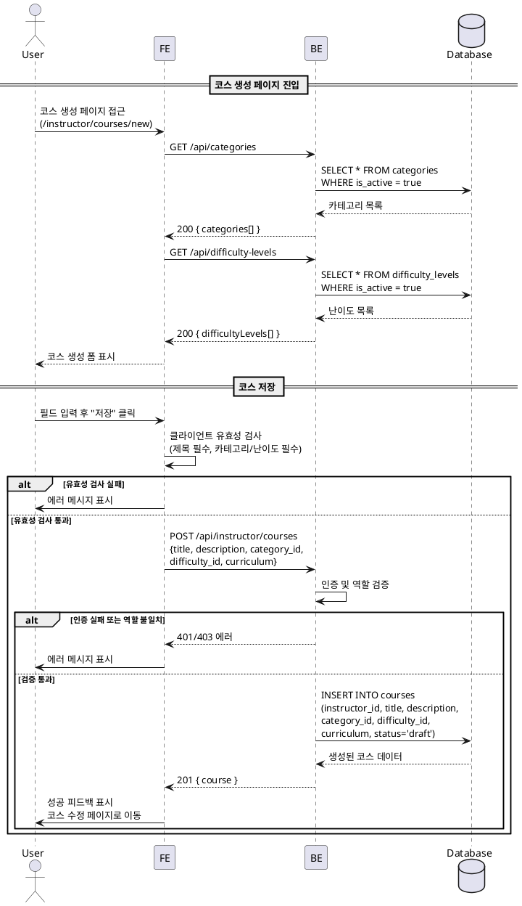
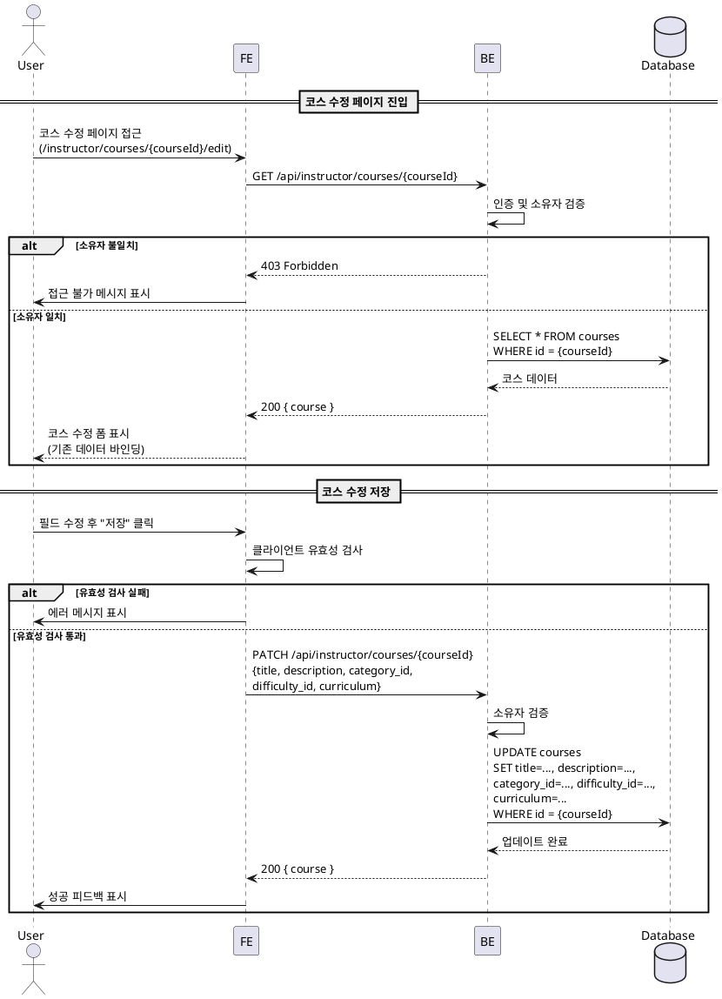
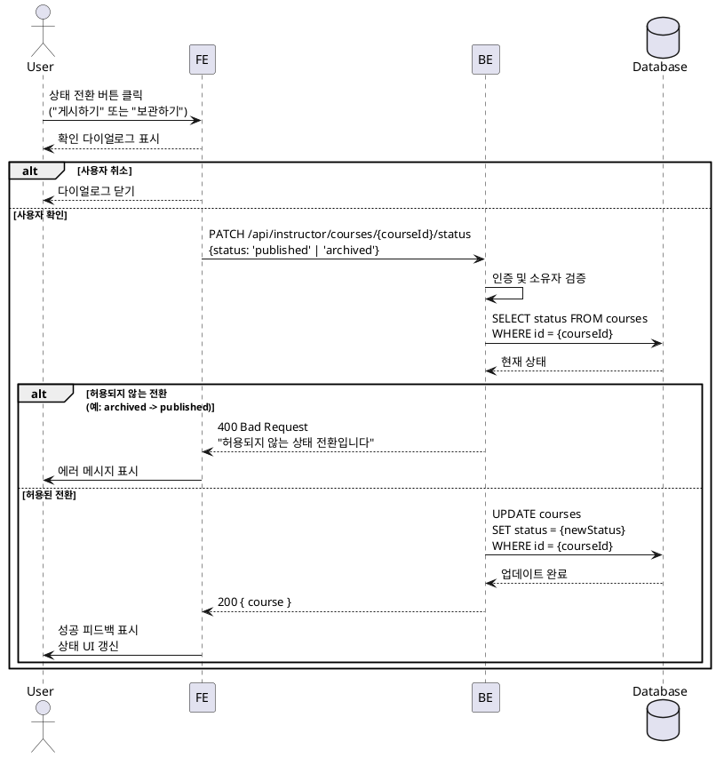

# UC-008: 코스 관리 (Instructor)

## Primary Actor

Instructor (역할=instructor인 인증된 사용자)

## Precondition

- 회원가입 및 온보딩(역할 선택, 프로필 입력)을 완료한 상태
- Instructor 역할로 로그인되어 있는 상태

## Trigger

- Instructor가 코스 생성 페이지(`/instructor/courses/new`)에 접근한다.
- Instructor가 코스 수정 페이지(`/instructor/courses/[courseId]/edit`)에 접근한다.
- Instructor가 코스 상태 전환 버튼을 클릭한다.

---

## Main Scenario

### MS-1. 코스 생성

1. Instructor가 코스 생성 페이지에 진입한다.
2. FE가 카테고리 및 난이도 목록을 조회한다.
   - `GET /api/categories` (is_active=true인 항목)
   - `GET /api/difficulty-levels` (is_active=true인 항목)
3. Instructor가 다음 필드를 입력한다.
   - 제목(필수), 소개(Markdown 지원), 카테고리(필수), 난이도(필수), 커리큘럼(Markdown 지원)
4. Instructor가 "저장" 버튼을 클릭한다.
5. FE가 클라이언트 유효성 검사를 수행한다 (제목 필수, 카테고리/난이도 선택 필수).
6. FE가 `POST /api/instructor/courses` 요청을 전송한다.
7. BE가 인증 및 역할(`instructor`)을 검증한다.
8. BE가 `courses` 테이블에 INSERT를 수행한다.
   - `instructor_id = {userId}`, `status = 'draft'`
9. BE가 생성된 코스 정보를 반환한다.
10. FE가 성공 피드백을 표시하고 코스 수정 페이지(`/instructor/courses/[courseId]/edit`)로 이동한다.

### MS-2. 코스 수정

1. Instructor가 코스 수정 페이지에 진입한다.
2. FE가 `GET /api/instructor/courses/{courseId}` 요청을 전송한다.
3. BE가 코스 소유자 검증(`courses.instructor_id = {userId}`)을 수행한다.
4. FE가 기존 코스 정보를 폼에 바인딩하여 표시한다.
5. Instructor가 필드를 수정한다 (제목, 소개, 카테고리, 난이도, 커리큘럼).
6. Instructor가 "저장" 버튼을 클릭한다.
7. FE가 클라이언트 유효성 검사를 수행한다.
8. FE가 `PATCH /api/instructor/courses/{courseId}` 요청을 전송한다.
9. BE가 소유자 검증 후 `courses` 테이블을 UPDATE한다.
10. FE가 성공 피드백을 표시하고 변경 사항을 반영한다.

### MS-3. 코스 상태 전환

1. Instructor가 코스 목록 또는 수정 페이지에서 상태 전환 버튼을 클릭한다.
   - Draft 상태 코스: "게시하기" 버튼 표시
   - Published 상태 코스: "보관하기" 버튼 표시
2. FE가 확인 다이얼로그를 표시한다.
   - 게시: "코스를 게시하면 학습자에게 공개됩니다. 게시하시겠습니까?"
   - 보관: "코스를 보관하면 신규 수강신청이 차단됩니다. 보관하시겠습니까?"
3. Instructor가 확인을 누른다.
4. FE가 `PATCH /api/instructor/courses/{courseId}/status` 요청을 전송한다.
   - `{ status: 'published' }` 또는 `{ status: 'archived' }`
5. BE가 소유자 검증 및 상태 전환 규칙을 검증한다.
6. BE가 `courses.status`를 UPDATE한다.
7. FE가 성공 피드백을 표시하고 코스 상태를 갱신한다.

---

## Edge Cases

| # | 상황 | 처리 |
|---|------|------|
| E1 | 제목 미입력 | FE 클라이언트 검증 단계에서 차단. BE에서도 400 Bad Request 반환 |
| E2 | 카테고리 또는 난이도 미선택 | FE 클라이언트 검증 단계에서 차단. BE에서도 400 반환 |
| E3 | 존재하지 않는 category_id 또는 difficulty_id 전송 | BE에서 400 반환, "유효하지 않은 카테고리/난이도입니다" 메시지 |
| E4 | 타 Instructor의 코스 수정 시도 | BE에서 403 Forbidden 반환, "본인의 코스만 수정할 수 있습니다" 메시지 |
| E5 | 존재하지 않는 courseId로 접근 | BE에서 404 Not Found 반환 |
| E6 | 허용되지 않는 상태 전환 시도 (예: archived -> published) | BE에서 400 반환, "허용되지 않는 상태 전환입니다" 메시지 |
| E7 | Published 코스의 필수 필드(제목) 삭제 후 저장 | FE 클라이언트 검증 차단. BE에서도 400 반환 |
| E8 | Learner 역할이 코스 생성/수정 시도 | 403 Forbidden 반환 |
| E9 | 미인증 사용자 접근 | 401 반환, 로그인 페이지로 리다이렉트 |
| E10 | 네트워크 오류 | 에러 토스트 표시, 재시도 가능 |
| E11 | 비활성(is_active=false) 카테고리/난이도 선택 시도 | 목록에 노출하지 않으므로 정상적으로는 발생하지 않음. BE에서도 검증하여 400 반환 |

---

## Business Rules

| # | 규칙 |
|---|------|
| BR1 | 코스 생성 시 초기 상태는 반드시 `draft`이다. |
| BR2 | 상태 전환은 단방향만 허용한다: `draft` -> `published` -> `archived`. 역방향 전환은 불가하다. |
| BR3 | `published` 상태의 코스만 코스 카탈로그에 노출되고 수강신청이 가능하다. |
| BR4 | `archived` 전환 시 기존 `active` 수강생의 수강 상태는 유지되지만, 신규 수강신청은 차단된다. |
| BR5 | 코스 수정은 소유자(`instructor_id = 본인`)만 가능하다. |
| BR6 | `description`과 `curriculum` 필드는 Markdown 입력을 지원한다. |
| BR7 | 카테고리와 난이도는 `is_active=true`인 항목만 선택 가능하다. |
| BR8 | `draft` 상태에서만 자유롭게 필드를 수정할 수 있다. `published` / `archived` 상태에서도 필드 수정은 가능하나, 즉시 반영된다. |
| BR9 | 코스 삭제 기능은 제공하지 않는다. 필요 시 `archived` 상태로 전환한다. |

---

## Sequence Diagram

### 코스 생성

### 코스 수정

### 코스 상태 전환

