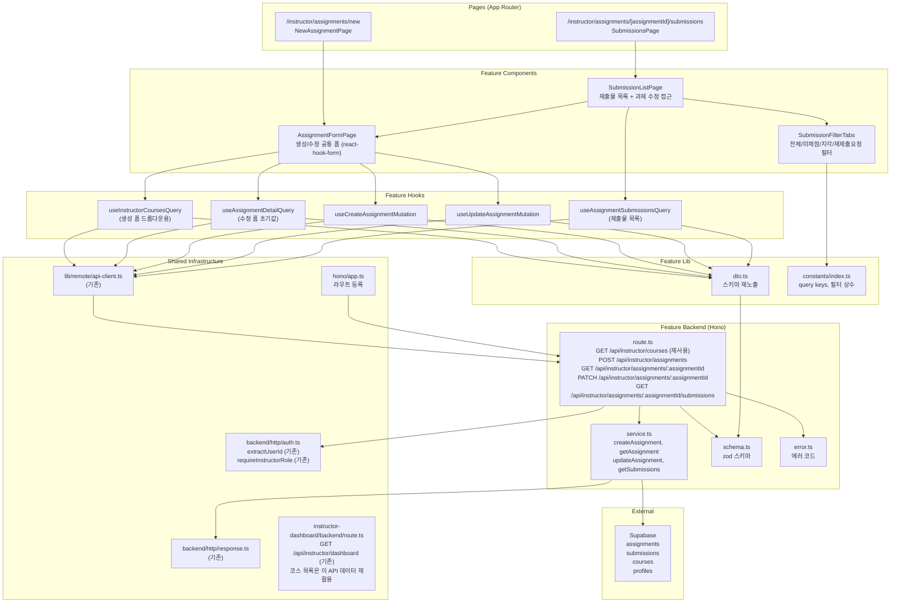

# UC-009 구현 설계: 과제 관리 (Instructor)

## Context

UC-009 유스케이스(Instructor 과제 CRUD + 제출물 목록 조회)를 구현하기 위한 모듈화 설계.

DB 스키마(`assignments`, `submissions`, `courses`, `profiles`)는 `0002_create_lms_schema.sql`에 이미 존재.
`src/features/course-management/`의 패턴(schema → error → service → route, dto 재노출, React Query hooks, shadcn 컴포넌트)을 그대로 따른다.

과제 상태 전환(게시/마감)은 UC-011 범위이며, 본 UC는 CRUD + 제출물 목록(필터링)에 집중한다.

---

## 현재 상태

### 이미 구현됨

- DB 스키마: `assignments`, `submissions`, `courses`, `profiles` 테이블, 인덱스, 트리거
- 인증 인프라: `extractUserId`, `apiClient`, `respond`/`success`/`failure`, Hono 싱글턴
- 공통 인증 유틸: `extractUserId`, `requireInstructorRole` (`src/backend/http/auth.ts`)
- `(protected)/layout.tsx`: 인증 가드
- `GET /api/instructor/courses`: `src/features/instructor-dashboard/backend/route.ts` — 코스 목록 (본인 소유) 이미 제공
- shadcn 컴포넌트: button, card, badge, separator, dialog, form, input, textarea, select, checkbox 등

### 구현 필요

- `src/features/assignment-management/` 전체 (backend, hooks, components, lib, constants)
- `src/app/(protected)/instructor/assignments/new/page.tsx` 페이지
- `src/app/(protected)/instructor/assignments/[assignmentId]/submissions/page.tsx` 페이지
- `src/backend/hono/app.ts`에 라우트 등록

---

## 개요

| # | 모듈 | 위치 | 설명 |
|---|------|------|------|
| 1 | AssignmentManagement Backend Schema | `src/features/assignment-management/backend/schema.ts` | 요청/응답 zod 스키마 |
| 2 | AssignmentManagement Backend Error | `src/features/assignment-management/backend/error.ts` | 에러 코드 정의 |
| 3 | AssignmentManagement Backend Service | `src/features/assignment-management/backend/service.ts` | CRUD + 제출물 목록 비즈니스 로직 |
| 4 | AssignmentManagement Backend Route | `src/features/assignment-management/backend/route.ts` | Hono 라우터 (5개 엔드포인트) |
| 5 | AssignmentManagement DTO | `src/features/assignment-management/lib/dto.ts` | 백엔드 스키마 프론트엔드 재노출 |
| 6 | AssignmentManagement Constants | `src/features/assignment-management/constants/index.ts` | Query Key, 제출물 필터 상수 |
| 7 | useInstructorCoursesQuery | `src/features/assignment-management/hooks/useInstructorCoursesQuery.ts` | 코스 목록 조회 (생성 폼 드롭다운용) |
| 8 | useAssignmentDetailQuery | `src/features/assignment-management/hooks/useAssignmentDetailQuery.ts` | 과제 단건 조회 훅 (수정 폼 초기값) |
| 9 | useCreateAssignmentMutation | `src/features/assignment-management/hooks/useCreateAssignmentMutation.ts` | 과제 생성 뮤테이션 |
| 10 | useUpdateAssignmentMutation | `src/features/assignment-management/hooks/useUpdateAssignmentMutation.ts` | 과제 수정 뮤테이션 |
| 11 | useAssignmentSubmissionsQuery | `src/features/assignment-management/hooks/useAssignmentSubmissionsQuery.ts` | 제출물 목록 조회 훅 |
| 12 | AssignmentFormPage | `src/features/assignment-management/components/assignment-form-page.tsx` | 생성/수정 공통 폼 (react-hook-form) |
| 13 | SubmissionListPage | `src/features/assignment-management/components/submission-list-page.tsx` | 제출물 목록 + 필터 UI |
| 14 | SubmissionFilterTabs | `src/features/assignment-management/components/submission-filter-tabs.tsx` | 필터 탭 (전체/미채점/지각/재제출요청) |
| 15 | New Assignment Page | `src/app/(protected)/instructor/assignments/new/page.tsx` | 과제 생성 페이지 |
| 16 | Submissions Page | `src/app/(protected)/instructor/assignments/[assignmentId]/submissions/page.tsx` | 제출물 관리 페이지 (수정 폼 포함) |
| 17 | Hono App | `src/backend/hono/app.ts` | **수정** — assignment-management 라우트 등록 |

---

## Diagram



---

## Implementation Plan

### Phase 1: Backend Layer

#### 1-1. `src/features/assignment-management/backend/schema.ts`

**zod 스키마 정의:**

```typescript
// 과제 생성 요청
createAssignmentBodySchema: {
  courseId: z.string().uuid('유효한 코스를 선택해주세요.'),
  title: z.string().min(1, '제목을 입력해주세요.'),
  description: z.string().default(''),
  dueDate: z.string().min(1, '마감일을 입력해주세요.'),  // ISO 문자열
  weight: z.number().int().min(0, '비중은 0 이상이어야 합니다.').max(100, '비중은 100 이하여야 합니다.'),
  allowLate: z.boolean().default(false),
  allowResubmission: z.boolean().default(false),
}

// 과제 수정 요청 (course_id 변경 불가 — BR7)
updateAssignmentBodySchema: {
  title: z.string().min(1, '제목을 입력해주세요.').optional(),
  description: z.string().optional(),
  dueDate: z.string().optional(),
  weight: z.number().int().min(0).max(100).optional(),
  allowLate: z.boolean().optional(),
  allowResubmission: z.boolean().optional(),
}

// 경로 파라미터
assignmentIdParamSchema: {
  assignmentId: z.string().uuid('유효한 과제 ID가 필요합니다.'),
}

// 제출물 필터 쿼리
submissionFilterQuerySchema: {
  filter: z.enum(['all', 'submitted', 'late', 'resubmission_required']).default('all'),
}

// 과제 응답 (생성/조회/수정 공통)
assignmentManagementResponseSchema: {
  id: z.string().uuid(),
  courseId: z.string().uuid(),
  courseTitle: z.string(),
  title: z.string(),
  description: z.string(),
  dueDate: z.string(),
  weight: z.number(),
  allowLate: z.boolean(),
  allowResubmission: z.boolean(),
  status: z.enum(['draft', 'published', 'closed']),
  createdAt: z.string(),
  updatedAt: z.string(),
}

// 제출물 항목 응답
submissionItemSchema: {
  id: z.string().uuid(),
  learnerId: z.string().uuid(),
  learnerName: z.string(),
  status: z.enum(['submitted', 'graded', 'resubmission_required']),
  isLate: z.boolean(),
  score: z.number().nullable(),
  submittedAt: z.string(),
}

// 제출물 목록 응답 (과제 정보 포함)
assignmentSubmissionsResponseSchema: {
  assignment: assignmentManagementResponseSchema,
  submissions: z.array(submissionItemSchema),
}
```

**Unit Test:**
- `createAssignmentBodySchema`: courseId 미선택 → 실패 (E1)
- `createAssignmentBodySchema`: title 빈 문자열 → 실패 (E1)
- `createAssignmentBodySchema`: dueDate 미입력 → 실패 (E1)
- `createAssignmentBodySchema`: weight=-1 → 실패 (E2)
- `createAssignmentBodySchema`: weight=101 → 실패 (E2)
- `createAssignmentBodySchema`: weight=0, weight=100 → 성공 (경계값)
- `updateAssignmentBodySchema`: 모든 필드 optional, 하나만 있어도 통과
- `updateAssignmentBodySchema`: courseId 필드 없음 (BR7 — 스키마 자체에서 차단)
- `submissionFilterQuerySchema`: 'all' | 'submitted' | 'late' | 'resubmission_required' → 성공
- `submissionFilterQuerySchema`: 그 외 값 → 실패

---

#### 1-2. `src/features/assignment-management/backend/error.ts`

**에러 코드:**

```typescript
export const assignmentManagementErrorCodes = {
  unauthorized: 'ASSIGNMENT_MGMT_UNAUTHORIZED',
  forbiddenRole: 'ASSIGNMENT_MGMT_FORBIDDEN_ROLE',
  forbidden: 'ASSIGNMENT_MGMT_FORBIDDEN',
  notFound: 'ASSIGNMENT_MGMT_NOT_FOUND',
  validationError: 'ASSIGNMENT_MGMT_VALIDATION_ERROR',
  pastDueDate: 'ASSIGNMENT_MGMT_PAST_DUE_DATE',
  courseIdImmutable: 'ASSIGNMENT_MGMT_COURSE_ID_IMMUTABLE',
  createFailed: 'ASSIGNMENT_MGMT_CREATE_FAILED',
  updateFailed: 'ASSIGNMENT_MGMT_UPDATE_FAILED',
  fetchError: 'ASSIGNMENT_MGMT_FETCH_ERROR',
} as const;
```

**Unit Test:**
- 에러 코드 값의 고유성 검증

---

#### 1-3. `src/features/assignment-management/backend/service.ts`

**함수 목록:**

| 함수명 | 입력 | 출력 | 설명 |
|--------|------|------|------|
| `createAssignment` | `(supabase, userId, body: CreateAssignmentBody)` | `HandlerResult<AssignmentManagementResponse>` | 과제 생성, status='draft' (BR1) |
| `getAssignment` | `(supabase, userId, assignmentId)` | `HandlerResult<AssignmentManagementResponse>` | 과제 조회 + 코스 소유자 검증 |
| `updateAssignment` | `(supabase, userId, assignmentId, body: UpdateAssignmentBody)` | `HandlerResult<AssignmentManagementResponse>` | 과제 필드 수정 (course_id 변경 불가) |
| `getAssignmentSubmissions` | `(supabase, userId, assignmentId, filter)` | `HandlerResult<AssignmentSubmissionsResponse>` | 제출물 목록 조회 + 필터링 |

**비즈니스 로직 상세:**

**`createAssignment` (MS-1):**
1. `courses` SELECT WHERE `id={courseId}` AND `instructor_id={userId}` — 없거나 소유자 불일치 시 403, `ASSIGNMENT_MGMT_FORBIDDEN` (E4)
2. `courses.status NOT IN ('draft', 'published')` → 400 (비활성 코스에 과제 생성 불가, spec MS-1 step 2)
3. `body.dueDate` 파싱 — 과거 날짜이면 400, `ASSIGNMENT_MGMT_PAST_DUE_DATE` (E3)
4. `assignments` INSERT `{ course_id, title, description, due_date, weight, allow_late, allow_resubmission, status: 'draft' }` (BR1)
5. `courses.title` JOIN 후 응답 반환 (201)

**`getAssignment` (MS-2):**
1. `assignments` SELECT JOIN `courses(id, title, instructor_id)` WHERE `assignments.id={assignmentId}` — 없으면 404 (E6)
2. `courses.instructor_id !== userId` → 403, `ASSIGNMENT_MGMT_FORBIDDEN` (E5)
3. 과제 데이터 반환

**`updateAssignment` (MS-2):**
1. `assignments` SELECT JOIN `courses(instructor_id)` WHERE `id={assignmentId}` — 없으면 404 (E6)
2. `courses.instructor_id !== userId` → 403, `ASSIGNMENT_MGMT_FORBIDDEN` (E5)
3. `body`에 `courseId` 필드가 존재하면 400, `ASSIGNMENT_MGMT_COURSE_ID_IMMUTABLE` (E7, BR7) — 런타임 방어
4. `body.dueDate` 전달 시 과거 날짜 → 400, `ASSIGNMENT_MGMT_PAST_DUE_DATE` (E3)
5. `assignments` UPDATE 전달된 필드만 (title, description, due_date, weight, allow_late, allow_resubmission)
6. 업데이트된 과제 응답 반환

**`getAssignmentSubmissions` (MS-3):**
1. `assignments` SELECT JOIN `courses(id, title, instructor_id)` WHERE `assignments.id={assignmentId}` — 없으면 404 (E6)
2. `courses.instructor_id !== userId` → 403, `ASSIGNMENT_MGMT_FORBIDDEN` (E5)
3. `submissions` SELECT JOIN `profiles(name)` WHERE `assignment_id={assignmentId}` ORDER BY `submitted_at DESC`
4. 필터 적용:
   - `filter='submitted'` → `status='submitted'` 인 행만
   - `filter='late'` → `is_late=true` 인 행만
   - `filter='resubmission_required'` → `status='resubmission_required'` 인 행만
   - `filter='all'` → 전체
5. `{ assignment, submissions[] }` 반환

**Unit Test:**
- `createAssignment`: 타 Instructor 소유 courseId → 403 (E4)
- `createAssignment`: 과거 dueDate → 400, `ASSIGNMENT_MGMT_PAST_DUE_DATE` (E3)
- `createAssignment`: 정상 → status='draft', 201 (BR1)
- `getAssignment`: 존재하지 않는 assignmentId → 404 (E6)
- `getAssignment`: 타 Instructor 소유 과제 → 403 (E5)
- `getAssignment`: 본인 소유 과제 → 200, 데이터 반환
- `updateAssignment`: 타 Instructor 소유 과제 → 403 (E5)
- `updateAssignment`: courseId 전달 → 400, `ASSIGNMENT_MGMT_COURSE_ID_IMMUTABLE` (E7)
- `updateAssignment`: 과거 dueDate → 400, `ASSIGNMENT_MGMT_PAST_DUE_DATE` (E3)
- `updateAssignment`: 정상 → 200, 변경 반영
- `getAssignmentSubmissions`: 타 Instructor 소유 과제 → 403 (E5)
- `getAssignmentSubmissions`: filter='submitted' → submitted 상태 행만 반환
- `getAssignmentSubmissions`: filter='late' → is_late=true 행만 반환
- `getAssignmentSubmissions`: filter='resubmission_required' → resubmission_required 행만 반환
- `getAssignmentSubmissions`: filter='all' → 전체 반환
- `getAssignmentSubmissions`: 결과 0건 → 빈 배열 반환 (E11)
- DB 오류 → 500, `ASSIGNMENT_MGMT_FETCH_ERROR`

---

#### 1-4. `src/features/assignment-management/backend/route.ts`

**엔드포인트:**

| Method | Path | Auth | 설명 |
|--------|------|------|------|
| POST | `/api/instructor/assignments` | 필수 (Instructor만) | 과제 생성 (MS-1) |
| GET | `/api/instructor/assignments/:assignmentId` | 필수 (Instructor만, 코스 소유자) | 과제 조회 (MS-2) |
| PATCH | `/api/instructor/assignments/:assignmentId` | 필수 (Instructor만, 코스 소유자) | 과제 수정 (MS-2) |
| GET | `/api/instructor/assignments/:assignmentId/submissions` | 필수 (Instructor만, 코스 소유자) | 제출물 목록 (MS-3) |

> 참고: `GET /api/instructor/courses`는 `instructor-dashboard/backend/route.ts`에서 이미 제공하며 재사용. 신규 등록 불필요.

**공통 인증 흐름 (각 엔드포인트):**
1. `extractUserId(c)` — 미인증 시 401, `ASSIGNMENT_MGMT_UNAUTHORIZED` (E9)
2. `requireInstructorRole(supabase, userId)` — 비강사 시 403 (E8)
3. service 함수 호출
4. `respond(c, result)` 반환

**POST `/api/instructor/assignments` 추가 흐름:**
- `createAssignmentBodySchema.safeParse(await c.req.json())` — 실패 시 400 (E1, E2)
- `createAssignment(supabase, userId, body)` 호출

**GET `/api/instructor/assignments/:assignmentId` 추가 흐름:**
- `assignmentIdParamSchema.safeParse({ assignmentId: c.req.param('assignmentId') })` — 실패 시 400
- `getAssignment(supabase, userId, assignmentId)` 호출

**PATCH `/api/instructor/assignments/:assignmentId` 추가 흐름:**
- `assignmentIdParamSchema.safeParse(...)` — 실패 시 400
- `updateAssignmentBodySchema.safeParse(await c.req.json())` — 실패 시 400 (E1, E2)
- `updateAssignment(supabase, userId, assignmentId, body)` 호출

**GET `/api/instructor/assignments/:assignmentId/submissions` 추가 흐름:**
- `assignmentIdParamSchema.safeParse(...)` — 실패 시 400
- `submissionFilterQuerySchema.safeParse({ filter: c.req.query('filter') })` — 실패 시 400
- `getAssignmentSubmissions(supabase, userId, assignmentId, filter)` 호출

---

### Phase 2: Shared / Infrastructure

#### 2-1. `src/features/assignment-management/lib/dto.ts`

```typescript
export {
  createAssignmentBodySchema,
  updateAssignmentBodySchema,
  assignmentManagementResponseSchema,
  submissionItemSchema,
  assignmentSubmissionsResponseSchema,
  type CreateAssignmentBody,
  type UpdateAssignmentBody,
  type AssignmentManagementResponse,
  type SubmissionItem,
  type AssignmentSubmissionsResponse,
} from '../backend/schema';
```

---

#### 2-2. `src/features/assignment-management/constants/index.ts`

```typescript
export const ASSIGNMENT_MANAGEMENT_QUERY_KEYS = {
  all: ['assignment-management'] as const,
  detail: (assignmentId: string) =>
    ['assignment-management', 'detail', assignmentId] as const,
  submissions: (assignmentId: string, filter: string) =>
    ['assignment-management', 'submissions', assignmentId, filter] as const,
} as const;

// 제출물 필터 레이블
export const SUBMISSION_FILTER_LABELS = {
  all: '전체',
  submitted: '미채점',
  late: '지각',
  resubmission_required: '재제출 요청',
} as const satisfies Record<string, string>;

export type SubmissionFilter = keyof typeof SUBMISSION_FILTER_LABELS;
```

---

#### 2-3. `src/backend/hono/app.ts` (수정)

```typescript
import { registerAssignmentManagementRoutes } from '@/features/assignment-management/backend/route';
// ...
registerAssignmentManagementRoutes(app);  // registerCourseManagementRoutes 다음에 추가
```

---

### Phase 3: Frontend Hooks

#### 3-1. `src/features/assignment-management/hooks/useInstructorCoursesQuery.ts`

```typescript
// GET /api/instructor/dashboard 응답에서 courses 배열 활용하거나
// 별도 최소화 API를 통해 본인 코스 목록(id, title, status) 조회
// apiClient.get('/api/instructor/dashboard') 호출 후 courses 필드 추출
// queryKey: ['instructor-dashboard'] — 기존 대시보드 캐시와 공유
// enabled: true (생성 폼 진입 시 즉시 호출)
// staleTime: 30_000 (코스 목록은 자주 변경되지 않음)
```

---

#### 3-2. `src/features/assignment-management/hooks/useAssignmentDetailQuery.ts`

```typescript
// apiClient.get(`/api/instructor/assignments/${assignmentId}`)로 호출
// assignmentManagementResponseSchema.parse(data) 응답 검증
// queryKey: ASSIGNMENT_MANAGEMENT_QUERY_KEYS.detail(assignmentId)
// staleTime: 0 (항상 최신 데이터 보장 — 수정 폼에서 사용)
// enabled: Boolean(assignmentId)
```

---

#### 3-3. `src/features/assignment-management/hooks/useCreateAssignmentMutation.ts`

```typescript
// apiClient.post('/api/instructor/assignments', body)로 호출
// assignmentManagementResponseSchema.parse(data.data) 응답 검증
// onSuccess: router.push(`/instructor/assignments/${assignment.id}/submissions`)
// useMutation 패턴
```

---

#### 3-4. `src/features/assignment-management/hooks/useUpdateAssignmentMutation.ts`

```typescript
// apiClient.patch(`/api/instructor/assignments/${assignmentId}`, body)로 호출
// assignmentManagementResponseSchema.parse(data.data) 응답 검증
// onSuccess: queryClient.invalidateQueries(ASSIGNMENT_MANAGEMENT_QUERY_KEYS.detail(assignmentId))
// useMutation 패턴
```

---

#### 3-5. `src/features/assignment-management/hooks/useAssignmentSubmissionsQuery.ts`

```typescript
// apiClient.get(`/api/instructor/assignments/${assignmentId}/submissions?filter=${filter}`)로 호출
// assignmentSubmissionsResponseSchema.parse(data) 응답 검증
// queryKey: ASSIGNMENT_MANAGEMENT_QUERY_KEYS.submissions(assignmentId, filter)
// staleTime: 0
// enabled: Boolean(assignmentId)
```

---

### Phase 4: Frontend Components

#### 4-1. `src/features/assignment-management/components/assignment-form-page.tsx`

생성/수정 공통 폼 컴포넌트. `react-hook-form` + `zod` resolver 사용.

**Props:**
```typescript
type AssignmentFormPageProps = {
  mode: 'create' | 'edit';
  assignmentId?: string;  // edit 모드에서 필수
};
```

**폼 필드:**

| 필드 | 타입 | 검증 | 설명 |
|------|------|------|------|
| courseId | select | 필수 (create 모드만 활성) | 대상 코스 선택 (edit 모드에서는 disabled, BR7) |
| title | text input | 필수 | 과제 제목 |
| description | textarea | optional | 과제 설명 (Markdown 지원) |
| dueDate | datetime-local input | 필수 | 마감일시 |
| weight | number input (0~100) | 필수, 0~100 정수 | 점수 비중 (BR3: 합계 참고 표시) |
| allowLate | checkbox | optional | 지각 제출 허용 여부 (BR4) |
| allowResubmission | checkbox | optional | 재제출 허용 여부 (BR5) |

**동작 흐름:**
- `create` 모드: `useInstructorCoursesQuery()` 호출 → 코스 select 옵션 채움
- `edit` 모드: `useAssignmentDetailQuery(assignmentId)` 호출 → `form.reset(data)` 초기값 바인딩, courseId select disabled
- 저장 버튼 클릭:
  - `create` 모드: `useCreateAssignmentMutation`
  - `edit` 모드: `useUpdateAssignmentMutation`
- 로딩 중 저장 버튼 disabled, 스피너 표시
- 에러 시 toast 표시

**QA Sheet:**

| # | 시나리오 | 기대 결과 |
|---|----------|-----------|
| 1 | create 모드 접근 | 빈 폼 표시, 코스 선택 드롭다운 로드 |
| 2 | edit 모드 접근 | 기존 과제 데이터 폼에 바인딩, courseId select disabled |
| 3 | 코스 미선택 상태로 저장 (E1) | "유효한 코스를 선택해주세요." 에러 표시 |
| 4 | title 비어 있는 상태로 저장 (E1) | "제목을 입력해주세요." 에러 표시 |
| 5 | dueDate 미입력 상태로 저장 (E1) | "마감일을 입력해주세요." 에러 표시 |
| 6 | weight=-1 입력 (E2) | "비중은 0 이상이어야 합니다." 에러 표시 |
| 7 | weight=101 입력 (E2) | "비중은 100 이하여야 합니다." 에러 표시 |
| 8 | 과거 dueDate 입력 (E3) | BE에서 400 반환, 에러 토스트 표시 |
| 9 | 정상 create 제출 | API 호출 → 성공 시 `/instructor/assignments/{id}/submissions`로 이동 |
| 10 | 정상 edit 제출 | API 호출 → 성공 시 폼 데이터 갱신, 성공 토스트 |
| 11 | 저장 중 | 버튼 disabled + 스피너 표시 |
| 12 | API 에러 (E10) | 에러 토스트 표시, 폼 유지 |
| 13 | 미인증 접근 (E9) | 로그인 페이지 리다이렉트 (layout 가드) |
| 14 | Learner 역할 접근 (E8) | 403 에러 메시지 표시 |
| 15 | 타 Instructor의 과제 edit 접근 (E5) | 403 에러 메시지 표시 |
| 16 | 존재하지 않는 assignmentId edit 접근 (E6) | 404 에러 메시지 표시 |
| 17 | allowLate 체크 → allowResubmission 연동 없음 | 독립적 checkbox (BR4, BR5 각각 독립) |

---

#### 4-2. `src/features/assignment-management/components/submission-filter-tabs.tsx`

필터 탭 컴포넌트. shadcn `Tabs` 또는 Button 그룹으로 구현.

**Props:**
```typescript
type SubmissionFilterTabsProps = {
  currentFilter: SubmissionFilter;
  onFilterChange: (filter: SubmissionFilter) => void;
  counts: Record<SubmissionFilter, number>;
};
```

**동작 흐름:**
1. `SUBMISSION_FILTER_LABELS`에서 탭 목록 생성
2. 각 탭에 카운트 배지 표시 (제출물 전체 목록에서 FE 집계)
3. 탭 클릭 → `onFilterChange` 호출

**QA Sheet:**

| # | 시나리오 | 기대 결과 |
|---|----------|-----------|
| 1 | 초기 렌더 | "전체" 탭 활성, 각 탭에 건수 배지 표시 |
| 2 | "미채점" 탭 클릭 | filter='submitted' 활성, 미채점 행만 표시 |
| 3 | "지각" 탭 클릭 | filter='late' 활성, is_late=true 행만 표시 |
| 4 | "재제출 요청" 탭 클릭 | filter='resubmission_required' 활성, 해당 행만 표시 |
| 5 | 해당 필터 0건 (E11) | "해당 조건의 제출물이 없습니다." 빈 상태 메시지 표시 |

---

#### 4-3. `src/features/assignment-management/components/submission-list-page.tsx`

제출물 목록 + 과제 수정 폼을 함께 제공하는 페이지 레벨 컴포넌트.

**Props:**
```typescript
type SubmissionListPageProps = {
  assignmentId: string;
};
```

**동작 흐름:**
1. `useAssignmentSubmissionsQuery(assignmentId, 'all')` 호출 — 전체 제출물 로드
2. FE에서 filter 상태 관리 (`useState<SubmissionFilter>('all')`)
3. 필터 결과를 FE에서 계산 (서버 재요청 없이 로컬 필터링)
4. 상단에 과제 기본 정보 표시 (제목, 마감일, 상태 배지)
5. `AssignmentFormPage mode="edit"` 를 Collapsible 또는 하단 섹션으로 표시 (수정 버튼 클릭 시 열림)
6. `SubmissionFilterTabs` 렌더링
7. 필터된 제출물을 테이블 형태로 렌더링:
   - 컬럼: 학습자 이름, 제출일시, 상태 배지, 지각 여부, 점수 (채점된 경우)
8. 로딩 중 스피너, 에러 시 에러 메시지

**QA Sheet:**

| # | 시나리오 | 기대 결과 |
|---|----------|-----------|
| 1 | Instructor 본인 과제 접근 | 과제 정보 + 제출물 목록 표시 |
| 2 | 제출물 0건 | "아직 제출된 과제가 없습니다." 빈 상태 표시 |
| 3 | 필터 적용 후 0건 (E11) | "해당 조건의 제출물이 없습니다." 빈 상태 표시 |
| 4 | 지각 제출물 | is_late 배지 표시 |
| 5 | 채점 완료 제출물 | score 값 표시 |
| 6 | 재제출 요청 제출물 | 상태 배지로 'resubmission_required' 표시 |
| 7 | 과제 수정 버튼 클릭 | AssignmentFormPage(edit 모드) 표시 |
| 8 | 미인증 접근 (E9) | 로그인 페이지 리다이렉트 |
| 9 | 타 Instructor 과제 접근 (E5) | 403 에러 메시지 표시 |
| 10 | 네트워크 오류 (E10) | 에러 토스트 표시, 재시도 가능 |

---

### Phase 5: Pages

#### 5-1. `src/app/(protected)/instructor/assignments/new/page.tsx`

`(protected)` 라우트 그룹 하위 → 인증 가드 자동 적용.

```typescript
'use client';

import { AssignmentFormPage } from '@/features/assignment-management/components/assignment-form-page';

type NewAssignmentPageProps = {
  params: Promise<Record<string, never>>;
};

export default function NewAssignmentPage({ params }: NewAssignmentPageProps) {
  void params;
  return <AssignmentFormPage mode="create" />;
}
```

**QA Sheet:**

| # | 시나리오 | 기대 결과 |
|---|----------|-----------|
| 1 | Instructor 접근 | 빈 과제 생성 폼 표시, 코스 선택 드롭다운 로드 |
| 2 | 미인증 접근 (E9) | 로그인 페이지 리다이렉트 |
| 3 | Learner 역할 접근 (E8) | 403 에러 메시지 표시 |
| 4 | 정상 저장 | 제출물 관리 페이지(`/instructor/assignments/{id}/submissions`)로 이동 |

---

#### 5-2. `src/app/(protected)/instructor/assignments/[assignmentId]/submissions/page.tsx`

`(protected)` 라우트 그룹 하위 → 인증 가드 자동 적용.

```typescript
'use client';

import { use } from 'react';
import { SubmissionListPage } from '@/features/assignment-management/components/submission-list-page';

type SubmissionsPageProps = {
  params: Promise<{ assignmentId: string }>;
};

export default function SubmissionsPage({ params }: SubmissionsPageProps) {
  const { assignmentId } = use(params);
  return <SubmissionListPage assignmentId={assignmentId} />;
}
```

**QA Sheet:**

| # | 시나리오 | 기대 결과 |
|---|----------|-----------|
| 1 | Instructor 본인 과제 접근 | 과제 정보 + 제출물 목록 표시 |
| 2 | 미인증 접근 (E9) | 로그인 페이지 리다이렉트 |
| 3 | Learner 역할 접근 (E8) | 403 에러 메시지 표시 |
| 4 | 타 Instructor 과제 접근 (E5) | 403 에러 메시지 표시 |
| 5 | 존재하지 않는 assignmentId (E6) | 404 에러 메시지 표시 |
| 6 | 전체 필터 | 모든 제출물 표시 |
| 7 | 미채점 필터 | submitted 상태 제출물만 표시 |
| 8 | 지각 필터 | is_late=true 제출물만 표시 |
| 9 | 재제출 필터 | resubmission_required 제출물만 표시 |
| 10 | 과제 수정 → 저장 | 과제 정보 갱신, 성공 토스트 |

---

## 작업 순서 (의존성 기반)

```
Phase 1 (Backend — 순차)
├── 1-1. schema.ts
├── 1-2. error.ts
├── 1-3. service.ts (schema, error 의존)
└── 1-4. route.ts (service, schema, error, auth.ts 의존)

Phase 2 (Shared — Phase 1 후)
├── 2-1. dto.ts
├── 2-2. constants/index.ts
└── 2-3. hono/app.ts 수정

Phase 3 (Frontend Hooks — Phase 2 후)
├── 3-1. useInstructorCoursesQuery.ts
├── 3-2. useAssignmentDetailQuery.ts
├── 3-3. useCreateAssignmentMutation.ts
├── 3-4. useUpdateAssignmentMutation.ts
└── 3-5. useAssignmentSubmissionsQuery.ts

Phase 4 (Frontend Components — Phase 3 후)
├── 4-1. assignment-form-page.tsx (hooks 3-1~3-4 의존)
├── 4-2. submission-filter-tabs.tsx (constants 의존)
└── 4-3. submission-list-page.tsx (hooks 3-5, components 4-1, 4-2 의존)

Phase 5 (Pages — Phase 4 후)
├── 5-1. /instructor/assignments/new/page.tsx
└── 5-2. /instructor/assignments/[assignmentId]/submissions/page.tsx
```

---

## 참조 파일

| 용도 | 파일 |
|------|------|
| Route 패턴 | `src/features/course-management/backend/route.ts` |
| Service 패턴 | `src/features/course-management/backend/service.ts` |
| Schema 패턴 | `src/features/course-management/backend/schema.ts` |
| Error 패턴 | `src/features/course-management/backend/error.ts` |
| 공통 인증 유틸 | `src/backend/http/auth.ts` |
| HTTP 응답 | `src/backend/http/response.ts` |
| Hono Context | `src/backend/hono/context.ts` |
| Hono App | `src/backend/hono/app.ts` |
| Query Hook 패턴 | `src/features/course-management/hooks/useCourseManagementDetailQuery.ts` |
| Mutation Hook 패턴 | `src/features/course-management/hooks/useCreateCourseMutation.ts` |
| DTO 패턴 | `src/features/course-management/lib/dto.ts` |
| Constants 패턴 | `src/features/course-management/constants/index.ts` |
| API Client | `src/lib/remote/api-client.ts` |
| 코스 목록 API (재사용) | `src/features/instructor-dashboard/backend/route.ts` (`GET /api/instructor/dashboard`) |
| Form Component 패턴 | `src/features/course-management/components/course-form-page.tsx` |
| 기존 Instructor Layout | `src/app/(protected)/instructor/dashboard/page.tsx` |
| Protected Layout | `src/app/(protected)/layout.tsx` |
| DB 스키마 | `supabase/migrations/0002_create_lms_schema.sql` |
