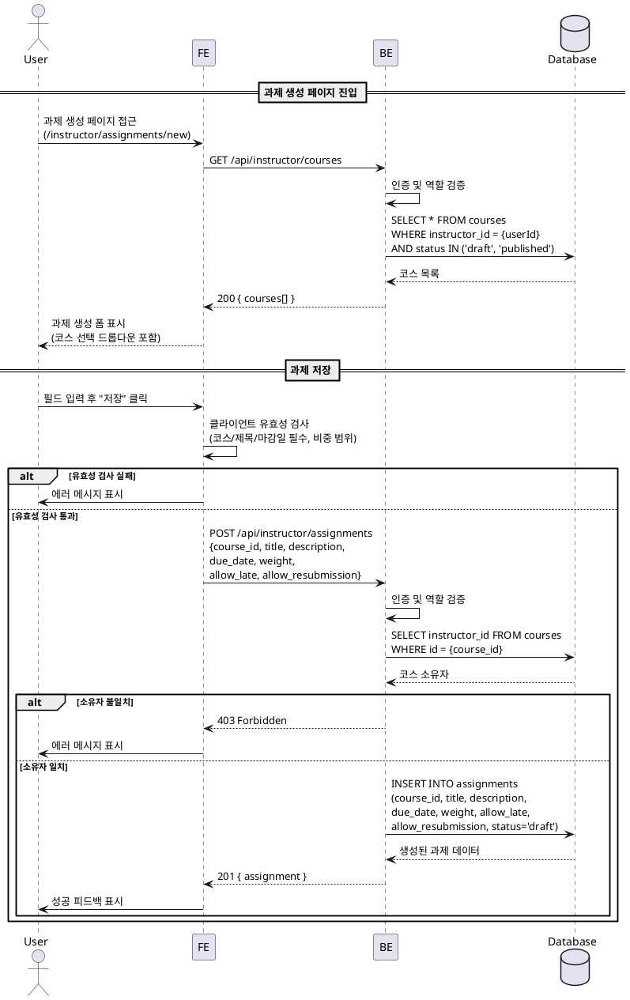
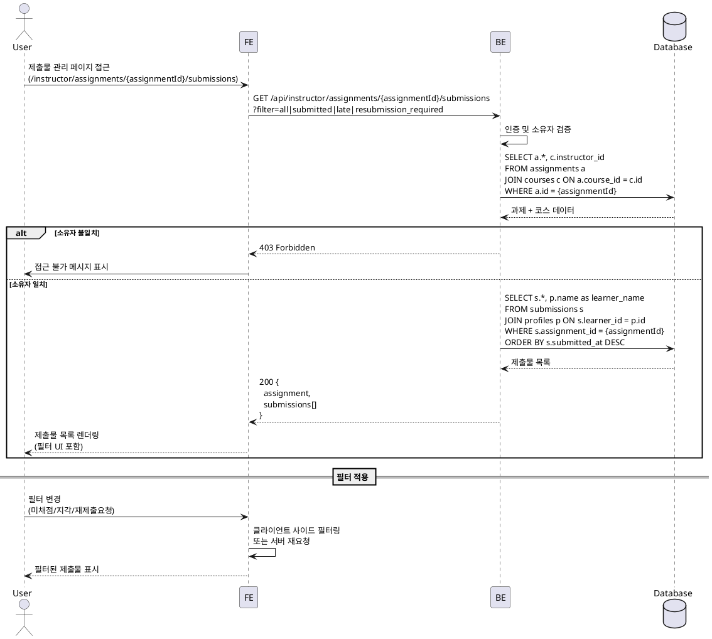

# UC-009: 과제 관리 (Instructor)

## Primary Actor

Instructor (역할=instructor인 인증된 사용자)

## Precondition

- 회원가입 및 온보딩(역할 선택, 프로필 입력)을 완료한 상태
- Instructor 역할로 로그인되어 있는 상태
- 본인이 생성한 코스가 최소 1개 존재한다

## Trigger

- Instructor가 과제 생성 페이지(`/instructor/assignments/new`)에 접근한다.
- Instructor가 과제의 제출물 관리 페이지(`/instructor/assignments/[assignmentId]/submissions`)에 접근한다.

---

## Main Scenario

### MS-1. 과제 생성

1. Instructor가 과제 생성 페이지에 진입한다.
2. FE가 Instructor 본인의 코스 목록을 조회한다.
   - `GET /api/instructor/courses` (본인 소유 코스 중 `status IN ('draft', 'published')`)
3. Instructor가 다음 필드를 입력한다.
   - 대상 코스(필수), 제목(필수), 설명(선택), 마감일(필수), 점수 비중(필수, 0~100 정수), 지각 제출 허용 여부, 재제출 허용 여부
4. Instructor가 "저장" 버튼을 클릭한다.
5. FE가 클라이언트 유효성 검사를 수행한다 (코스 선택 필수, 제목 필수, 마감일 필수, 비중 0~100 범위).
6. FE가 `POST /api/instructor/assignments` 요청을 전송한다.
7. BE가 인증, 역할(`instructor`), 코스 소유자 검증을 수행한다.
8. BE가 `assignments` 테이블에 INSERT를 수행한다.
   - `status = 'draft'`
9. BE가 생성된 과제 정보를 반환한다.
10. FE가 성공 피드백을 표시한다.

### MS-2. 과제 수정

1. Instructor가 과제 수정을 요청한다 (제출물 관리 페이지 내 수정 기능 또는 별도 접근).
2. FE가 `GET /api/instructor/assignments/{assignmentId}` 요청을 전송한다.
3. BE가 코스 소유자 검증을 수행한다 (해당 과제가 속한 코스의 `instructor_id = {userId}`).
4. FE가 기존 과제 정보를 폼에 바인딩하여 표시한다.
5. Instructor가 필드를 수정한다 (제목, 설명, 마감일, 비중, 지각/재제출 정책).
6. Instructor가 "저장" 버튼을 클릭한다.
7. FE가 클라이언트 유효성 검사를 수행한다.
8. FE가 `PATCH /api/instructor/assignments/{assignmentId}` 요청을 전송한다.
9. BE가 소유자 검증 후 `assignments` 테이블을 UPDATE한다.
10. FE가 성공 피드백을 표시하고 변경 사항을 반영한다.

### MS-3. 제출물 목록 조회 및 필터링

1. Instructor가 제출물 관리 페이지(`/instructor/assignments/[assignmentId]/submissions`)에 접근한다.
2. FE가 `GET /api/instructor/assignments/{assignmentId}/submissions` 요청을 전송한다.
3. BE가 코스 소유자 검증을 수행한다.
4. BE가 해당 과제의 제출물 목록을 조회한다.
   - 제출자 이름, 제출일시, 상태, 점수, 지각 여부를 포함한다.
5. FE가 제출물 목록을 테이블 형태로 렌더링한다.
6. Instructor가 필터를 적용한다.
   - 전체 / 미채점(`submitted`) / 지각(`is_late=true`) / 재제출 요청(`resubmission_required`)
7. FE가 필터 조건에 맞는 제출물을 표시한다.

---

## Edge Cases

| # | 상황 | 처리 |
|---|------|------|
| E1 | 코스 미선택 또는 제목 미입력 | FE 클라이언트 검증 단계에서 차단. BE에서도 400 Bad Request 반환 |
| E2 | 비중(weight)이 0~100 범위 밖 | FE 클라이언트 검증 차단. BE에서도 400 반환 |
| E3 | 마감일이 과거 날짜 | FE 클라이언트 검증에서 경고. BE에서도 400 반환, "마감일은 미래 날짜여야 합니다" 메시지 |
| E4 | 타 Instructor 소유 코스에 과제 생성 시도 | 코스 목록에 노출되지 않음. 직접 요청 시 BE에서 403 Forbidden 반환 |
| E5 | 타 Instructor의 과제 수정 시도 | BE에서 403 Forbidden 반환, "본인 코스의 과제만 관리할 수 있습니다" 메시지 |
| E6 | 존재하지 않는 assignmentId로 접근 | BE에서 404 Not Found 반환 |
| E7 | 제출물이 존재하는 과제의 코스 변경 시도 | 과제의 `course_id`는 변경 불가. BE에서 400 반환 |
| E8 | Learner 역할이 과제 관리 시도 | 403 Forbidden 반환 |
| E9 | 미인증 사용자 접근 | 401 반환, 로그인 페이지로 리다이렉트 |
| E10 | 네트워크 오류 | 에러 토스트 표시, 재시도 가능 |
| E11 | 제출물 필터링 결과 0건 | 해당 필터의 빈 상태 표시 ("해당 조건의 제출물이 없습니다") |

---

## Business Rules

| # | 규칙 |
|---|------|
| BR1 | 과제 생성 시 초기 상태는 반드시 `draft`이다. |
| BR2 | 과제는 본인 소유 코스(`courses.instructor_id = 본인`)에만 생성/수정할 수 있다. |
| BR3 | `weight`(점수 비중)는 0~100 정수로 입력하며, 동일 코스 내 과제들의 비중 합계는 프론트엔드에서 참고 정보로 표시하되 서버에서 강제하지 않는다. |
| BR4 | `allow_late=true`인 과제는 마감 후에도 제출 가능하며, 해당 제출물은 `is_late=true`로 기록된다. |
| BR5 | `allow_resubmission=true`인 과제는 `resubmission_required` 상태의 제출물에 대해 재제출이 가능하다. |
| BR6 | 과제 삭제 기능은 제공하지 않는다. 필요 시 `closed` 상태로 전환한다. |
| BR7 | 과제의 `course_id`는 생성 시 설정되며, 이후 변경할 수 없다. |
| BR8 | 과제 상태 전환(게시/마감/자동 마감) 관련 규칙은 UC-011 참조. |

---

## Sequence Diagram

### 과제 생성

### 제출물 목록 조회

