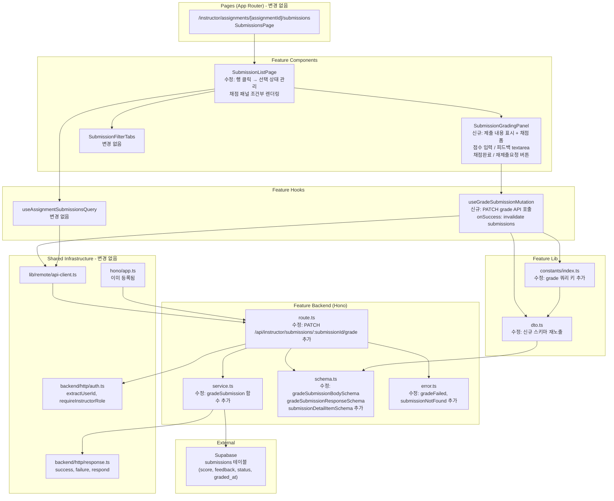

# UC-010 구현 설계: 제출물 채점 & 피드백 (Instructor)

## Context

UC-010 유스케이스(Instructor 채점 완료 / 재제출 요청)를 구현하기 위한 모듈화 설계.

UC-009에서 `src/features/assignment-management/` 구조 전체가 구현되어 있으며, 제출물 목록 페이지(`/instructor/assignments/[assignmentId]/submissions`)도 이미 존재한다. 본 UC는 해당 피처를 **확장**하는 방식으로 진행한다.

- DB: `submissions` 테이블에 `score`, `feedback`, `status`, `graded_at`, `content`, `link` 컬럼이 이미 존재
- API: `GET /api/instructor/assignments/:assignmentId/submissions` 이미 구현
- 페이지: `SubmissionListPage` 컴포넌트(목록 테이블)가 이미 존재 → 채점 패널을 확장 추가
- `Hono app.ts`: `registerAssignmentManagementRoutes` 이미 등록됨 → 채점 엔드포인트만 추가

구현 목표: **채점 패널 UI + PATCH grade API** 추가. 기존 코드 최소 변경.

---

## 현재 상태

### 이미 구현됨

- `submissions` 테이블 스키마: `score(integer 0-100)`, `feedback(text)`, `status(submission_status)`, `graded_at(timestamptz)`, `content(text)`, `link(text)`
- `src/features/assignment-management/backend/schema.ts`: `submissionItemSchema` (score, status 포함)
- `src/features/assignment-management/backend/service.ts`: `getAssignmentSubmissions`
- `src/features/assignment-management/backend/route.ts`: `GET /api/instructor/assignments/:assignmentId/submissions`
- `src/features/assignment-management/backend/error.ts`: 에러 코드 상수
- `src/features/assignment-management/lib/dto.ts`: DTO 재노출
- `src/features/assignment-management/constants/index.ts`: `ASSIGNMENT_MANAGEMENT_QUERY_KEYS`, `SubmissionFilter`
- `src/features/assignment-management/hooks/useAssignmentSubmissionsQuery.ts`
- `src/features/assignment-management/components/submission-list-page.tsx`: 목록 테이블 (행 클릭 시 채점 패널 없음)
- `src/features/assignment-management/components/submission-filter-tabs.tsx`
- `src/app/(protected)/instructor/assignments/[assignmentId]/submissions/page.tsx`
- `src/backend/hono/app.ts`: `registerAssignmentManagementRoutes` 등록 완료
- `src/backend/http/auth.ts`: `extractUserId`, `requireInstructorRole`
- `src/backend/http/response.ts`: `success`, `failure`, `respond`

### 구현 필요

- `submissionDetailItemSchema` 확장: `content`, `link`, `feedback` 필드 추가 (채점 패널에서 제출 내용 표시)
- `gradeSubmissionBodySchema`: 채점 요청 스키마
- `gradeSubmissionResponseSchema`: 채점 응답 스키마
- `gradeSubmissionErrorCodes`: 채점 전용 에러 코드 (기존 `assignmentManagementErrorCodes` 확장)
- `gradeSubmission` service 함수
- `PATCH /api/instructor/submissions/:submissionId/grade` 라우트
- `ASSIGNMENT_MANAGEMENT_QUERY_KEYS.grade` 쿼리 키
- `useGradeSubmissionMutation` 훅
- `SubmissionGradingPanel` 컴포넌트 (채점 폼 UI)
- `SubmissionListPage` 확장: 행 선택 → 채점 패널 표시

---

## 개요

| # | 모듈 | 위치 | 변경 유형 | 설명 |
|---|------|------|-----------|------|
| 1 | Backend Schema 확장 | `src/features/assignment-management/backend/schema.ts` | **수정** | `submissionDetailItemSchema`, `gradeSubmissionBodySchema`, `gradeSubmissionResponseSchema` 추가 |
| 2 | Backend Error 확장 | `src/features/assignment-management/backend/error.ts` | **수정** | `gradeFailed`, `submissionNotFound` 에러 코드 추가 |
| 3 | Backend Service 확장 | `src/features/assignment-management/backend/service.ts` | **수정** | `gradeSubmission` 함수 추가 |
| 4 | Backend Route 확장 | `src/features/assignment-management/backend/route.ts` | **수정** | `PATCH /api/instructor/submissions/:submissionId/grade` 추가 |
| 5 | DTO 재노출 확장 | `src/features/assignment-management/lib/dto.ts` | **수정** | 신규 스키마/타입 재노출 |
| 6 | Constants 확장 | `src/features/assignment-management/constants/index.ts` | **수정** | `grade` 쿼리 키, `GRADING_ACTION_LABELS` 추가 |
| 7 | useGradeSubmissionMutation | `src/features/assignment-management/hooks/useGradeSubmissionMutation.ts` | **신규** | 채점 뮤테이션 훅 |
| 8 | SubmissionGradingPanel | `src/features/assignment-management/components/submission-grading-panel.tsx` | **신규** | 채점 폼 UI 컴포넌트 |
| 9 | SubmissionListPage 확장 | `src/features/assignment-management/components/submission-list-page.tsx` | **수정** | 행 클릭 → 채점 패널 연동 |

> `src/backend/hono/app.ts`는 이미 `registerAssignmentManagementRoutes` 등록 완료이므로 변경 불필요.

---

## Diagram



---

## Implementation Plan

### Phase 1: Backend Layer

#### 1-1. `src/features/assignment-management/backend/schema.ts` (수정)

기존 파일에 다음 스키마를 **추가**한다. 기존 스키마는 변경하지 않는다.

**추가할 스키마:**

```typescript
// 제출물 상세 조회용 (채점 패널에서 content, link, feedback 표시)
export const submissionDetailItemSchema = submissionItemSchema.extend({
  content: z.string(),
  link: z.string().nullable(),
  feedback: z.string().nullable(),
});

export type SubmissionDetailItem = z.infer<typeof submissionDetailItemSchema>;

// 채점 요청 바디 (action: 'grade' | 'resubmission')
export const gradeSubmissionBodySchema = z.discriminatedUnion('action', [
  z.object({
    action: z.literal('grade'),
    score: z
      .number()
      .int('점수는 정수여야 합니다.')
      .min(0, '점수는 0 이상이어야 합니다.')
      .max(100, '점수는 100 이하여야 합니다.'),
    feedback: z.string().min(1, '피드백을 입력해주세요.'),
  }),
  z.object({
    action: z.literal('resubmission'),
    feedback: z.string().min(1, '피드백을 입력해주세요.'),
  }),
]);

export type GradeSubmissionBody = z.infer<typeof gradeSubmissionBodySchema>;

// 채점 응답 (갱신된 제출물 상태 반환)
export const gradeSubmissionResponseSchema = z.object({
  id: z.string().uuid(),
  status: z.enum(['submitted', 'graded', 'resubmission_required']),
  score: z.number().nullable(),
  feedback: z.string().nullable(),
  gradedAt: z.string().nullable(),
  updatedAt: z.string(),
});

export type GradeSubmissionResponse = z.infer<typeof gradeSubmissionResponseSchema>;

// 경로 파라미터
export const submissionIdParamSchema = z.object({
  submissionId: z.string().uuid('유효한 제출물 ID가 필요합니다.'),
});

export type SubmissionIdParam = z.infer<typeof submissionIdParamSchema>;
```

**Unit Test:**
- `gradeSubmissionBodySchema` (action='grade'): score=-1 → 실패 (E1)
- `gradeSubmissionBodySchema` (action='grade'): score=101 → 실패 (E1)
- `gradeSubmissionBodySchema` (action='grade'): score=50.5 (소수점) → 실패 (E9)
- `gradeSubmissionBodySchema` (action='grade'): score=0, score=100 → 성공 (경계값)
- `gradeSubmissionBodySchema` (action='grade'): feedback='' → 실패 (E2)
- `gradeSubmissionBodySchema` (action='grade'): score=85, feedback='Good' → 성공
- `gradeSubmissionBodySchema` (action='resubmission'): feedback='' → 실패 (E2)
- `gradeSubmissionBodySchema` (action='resubmission'): score 필드 없어도 → 성공
- `gradeSubmissionBodySchema` (action='resubmission'): feedback='재작성 필요' → 성공
- `submissionIdParamSchema`: 유효하지 않은 UUID → 실패

---

#### 1-2. `src/features/assignment-management/backend/error.ts` (수정)

기존 `assignmentManagementErrorCodes`에 다음 코드를 **추가**한다.

```typescript
export const assignmentManagementErrorCodes = {
  // ... 기존 코드 유지 ...
  gradeFailed: 'ASSIGNMENT_MGMT_GRADE_FAILED',
  submissionNotFound: 'ASSIGNMENT_MGMT_SUBMISSION_NOT_FOUND',
} as const;
```

**Unit Test:**
- 에러 코드 값의 고유성 검증 (기존 포함 전체)

---

#### 1-3. `src/features/assignment-management/backend/service.ts` (수정)

`gradeSubmission` 함수를 **추가**한다. 기존 함수는 변경하지 않는다.

**함수 시그니처:**

```typescript
export const gradeSubmission = async (
  supabase: SupabaseClient,
  userId: string,
  submissionId: string,
  body: GradeSubmissionBody,
): Promise<HandlerResult<GradeSubmissionResponse, AssignmentManagementServiceError>>
```

**비즈니스 로직 상세 (BR 적용):**

1. `submissions` 테이블에서 `id={submissionId}`인 레코드를 JOIN 조회:
   ```sql
   SELECT s.id, s.assignment_id, s.status, s.score, s.feedback, s.graded_at,
          a.course_id, c.instructor_id
   FROM submissions s
   JOIN assignments a ON s.assignment_id = a.id
   JOIN courses c ON a.course_id = c.id
   WHERE s.id = {submissionId}
   ```
2. 레코드 없음 → 404, `submissionNotFound`, '제출물을 찾을 수 없습니다.' (E6)
3. `c.instructor_id !== userId` → 403, `forbidden`, '본인 코스의 제출물만 채점할 수 있습니다.' (E5, BR1)
4. `body.action === 'grade'` 분기:
   - UPDATE `submissions` SET `score={body.score}`, `feedback={body.feedback}`, `status='graded'`, `graded_at=now()` WHERE `id={submissionId}` (BR6)
5. `body.action === 'resubmission'` 분기:
   - UPDATE `submissions` SET `feedback={body.feedback}`, `status='resubmission_required'` WHERE `id={submissionId}` (BR7 — score, graded_at 유지)
6. UPDATE 실패 → 500, `gradeFailed`
7. 갱신된 레코드 반환 (E3/E4: 이미 graded/resubmission_required 상태여도 허용 — BR8)

**Unit Test:**
- `gradeSubmission`: 존재하지 않는 submissionId → 404, `submissionNotFound` (E6)
- `gradeSubmission`: 타 Instructor 코스 제출물 → 403, `forbidden` (E5, BR1)
- `gradeSubmission` (action='grade'): 정상 → status='graded', score 기록, graded_at 갱신 (BR6)
- `gradeSubmission` (action='grade'): 이미 graded 상태인 제출물 → 허용, 덮어쓰기 (E3, BR8)
- `gradeSubmission` (action='grade'): resubmission_required 상태인 제출물 → 허용 (E4)
- `gradeSubmission` (action='resubmission'): 정상 → status='resubmission_required', feedback 기록, score/graded_at 불변 (BR7)
- `gradeSubmission` (action='resubmission'): 이미 graded 상태인 제출물 → 허용 (BR8)
- DB 오류 → 500, `gradeFailed`

---

#### 1-4. `src/features/assignment-management/backend/route.ts` (수정)

기존 라우트 파일에 `PATCH /api/instructor/submissions/:submissionId/grade` 엔드포인트를 **추가**한다.

**추가할 임포트:**
```typescript
import {
  gradeSubmissionBodySchema,
  submissionIdParamSchema,
} from './schema';
import { gradeSubmission } from './service';
```

**추가할 라우트:**

```typescript
// PATCH /api/instructor/submissions/:submissionId/grade — 채점 완료 / 재제출 요청
app.patch('/api/instructor/submissions/:submissionId/grade', async (c) => {
  const userId = await extractUserId(c);

  if (!userId) {
    return respond(
      c,
      failure(401, assignmentManagementErrorCodes.unauthorized, '인증이 필요합니다.'),
    );
  }

  const supabase = getSupabase(c);

  const roleError = await requireInstructorRole(supabase, userId);
  if (roleError) {
    return respond(c, roleError);
  }

  const paramResult = submissionIdParamSchema.safeParse({
    submissionId: c.req.param('submissionId'),
  });
  if (!paramResult.success) {
    return respond(
      c,
      failure(
        400,
        assignmentManagementErrorCodes.validationError,
        paramResult.error.errors[0]?.message ?? '유효하지 않은 제출물 ID입니다.',
      ),
    );
  }

  const bodyResult = gradeSubmissionBodySchema.safeParse(await c.req.json());
  if (!bodyResult.success) {
    return respond(
      c,
      failure(
        400,
        assignmentManagementErrorCodes.validationError,
        bodyResult.error.errors[0]?.message ?? '유효하지 않은 요청입니다.',
      ),
    );
  }

  const result = await gradeSubmission(
    supabase,
    userId,
    paramResult.data.submissionId,
    bodyResult.data,
  );
  return respond(c, result);
});
```

---

### Phase 2: Shared / Infrastructure

#### 2-1. `src/features/assignment-management/lib/dto.ts` (수정)

신규 스키마/타입을 재노출한다.

```typescript
export {
  // 기존 export 유지 ...
  submissionDetailItemSchema,
  gradeSubmissionBodySchema,
  gradeSubmissionResponseSchema,
  submissionIdParamSchema,
  type SubmissionDetailItem,
  type GradeSubmissionBody,
  type GradeSubmissionResponse,
  type SubmissionIdParam,
} from '../backend/schema';
```

---

#### 2-2. `src/features/assignment-management/constants/index.ts` (수정)

채점 관련 상수 및 쿼리 키를 **추가**한다.

```typescript
export const ASSIGNMENT_MANAGEMENT_QUERY_KEYS = {
  // ... 기존 유지 ...
  grade: (submissionId: string) =>
    ['assignment-management', 'grade', submissionId] as const,
} as const;

// 채점 액션 레이블
export const GRADING_ACTION_LABELS = {
  grade: '채점 완료',
  resubmission: '재제출 요청',
} as const;

export type GradingAction = keyof typeof GRADING_ACTION_LABELS;
```

---

### Phase 3: Frontend Hooks

#### 3-1. `src/features/assignment-management/hooks/useGradeSubmissionMutation.ts` (신규)

```typescript
'use client';

import { useMutation, useQueryClient } from '@tanstack/react-query';
import { apiClient, extractApiErrorMessage } from '@/lib/remote/api-client';
import { gradeSubmissionResponseSchema } from '@/features/assignment-management/lib/dto';
import { ASSIGNMENT_MANAGEMENT_QUERY_KEYS } from '@/features/assignment-management/constants';
import { toast } from '@/hooks/use-toast';
import type { GradeSubmissionBody } from '@/features/assignment-management/lib/dto';

type GradeSubmissionArgs = {
  submissionId: string;
  body: GradeSubmissionBody;
  assignmentId: string;  // 성공 후 목록 캐시 무효화에 사용
};

const gradeSubmissionFetcher = async ({ submissionId, body }: GradeSubmissionArgs) => {
  try {
    const { data } = await apiClient.patch(
      `/api/instructor/submissions/${submissionId}/grade`,
      body,
    );
    return gradeSubmissionResponseSchema.parse(data);
  } catch (error) {
    const message = extractApiErrorMessage(error, '채점에 실패했습니다.');
    throw new Error(message);
  }
};

export const useGradeSubmissionMutation = () => {
  const queryClient = useQueryClient();

  return useMutation({
    mutationFn: gradeSubmissionFetcher,
    onSuccess: (_, variables) => {
      // 제출물 목록 캐시 무효화 → 상태 자동 갱신 (BR9)
      queryClient.invalidateQueries({
        queryKey: ASSIGNMENT_MANAGEMENT_QUERY_KEYS.submissions(variables.assignmentId, 'all'),
      });
      queryClient.invalidateQueries({
        queryKey: ASSIGNMENT_MANAGEMENT_QUERY_KEYS.all,
      });

      const actionLabel =
        variables.body.action === 'grade' ? '채점이 완료되었습니다.' : '재제출 요청이 완료되었습니다.';
      toast({ title: '완료', description: actionLabel });
    },
    onError: (error: Error) => {
      // E8: 에러 토스트. 폼은 컴포넌트에서 유지
      toast({ variant: 'destructive', title: '처리 실패', description: error.message });
    },
  });
};
```

---

### Phase 4: Frontend Components

#### 4-1. `src/features/assignment-management/components/submission-grading-panel.tsx` (신규)

제출물 상세 열람 + 채점 폼 통합 컴포넌트. `react-hook-form` + `zod` resolver 사용.

**Props:**

```typescript
type SubmissionGradingPanelProps = {
  submission: SubmissionDetailItem;
  assignmentId: string;
  onClose: () => void;
};
```

**폼 필드 (react-hook-form + zod resolver):**

| 필드 | 타입 | 검증 | 설명 |
|------|------|------|------|
| action | hidden / radio | 'grade' \| 'resubmission' | 버튼 클릭 시 결정 |
| score | number input | 0~100 정수, action='grade'일 때 필수 | 점수 입력 |
| feedback | textarea | 필수 (1자 이상) | 피드백 입력 |

**UI 구성:**

1. 제출물 상세 정보 섹션:
   - 제출자 이름, 제출 시각, 지각 여부 배지
   - 제출 내용(`content`) 텍스트 박스 (읽기 전용)
   - 링크(`link`) — 존재할 때만 표시, 클릭 가능한 URL
   - 이전 채점 정보: status 배지, score, feedback (존재 시 표시)

2. 채점 폼 섹션:
   - 점수 입력 (number input, min=0, max=100, step=1, action='resubmission'일 때 비활성화)
   - 피드백 textarea (required)
   - 버튼 그룹: "채점 완료" (primary), "재제출 요청" (outline/destructive)
   - 두 버튼 모두 피드백 미입력 시 disabled (E2)
   - "채점 완료" 버튼: 추가로 score 미입력 시 disabled (E2)
   - 뮤테이션 진행 중: 두 버튼 모두 disabled + Loader2 스피너

3. 닫기 버튼: 우상단 X 버튼 → `onClose` 호출

**채점 완료 버튼 클릭 흐름 (BR4):**
1. `form.handleSubmit` 트리거 (client-side 유효성 검사: score, feedback)
2. 유효 → `useGradeSubmissionMutation` 실행 `{ action: 'grade', score, feedback }`
3. 성공 → toast 표시, 목록 캐시 무효화
4. 실패 → toast 에러 (E8), 폼 입력값 유지

**재제출 요청 버튼 클릭 흐름 (BR4):**
1. feedback만 검사
2. 유효 → `useGradeSubmissionMutation` 실행 `{ action: 'resubmission', feedback }`
3. 성공 → toast 표시, 목록 캐시 무효화
4. 실패 → toast 에러 (E8), 폼 입력값 유지

**QA Sheet:**

| # | 시나리오 | 기대 결과 |
|---|----------|-----------|
| 1 | 패널 오픈 | 제출 내용, 링크, 이전 채점 정보 표시 |
| 2 | 기존 graded 상태 제출물 선택 | 기존 score, feedback이 폼에 prefill됨 (E3 허용) |
| 3 | resubmission_required 상태 제출물 선택 | feedback prefill, 채점 가능 (E4 허용) |
| 4 | 점수 미입력 + "채점 완료" 클릭 (E2) | "점수를 입력해주세요." 에러, 버튼 비활성 |
| 5 | 점수 -1 입력 (E1) | input min 제한으로 차단 + "점수는 0 이상이어야 합니다." |
| 6 | 점수 101 입력 (E1) | input max 제한으로 차단 + "점수는 100 이하여야 합니다." |
| 7 | 소수점 입력 (E9) | step=1 제한, BE에서도 정수 검증 |
| 8 | 피드백 비어있는 상태로 "채점 완료" 클릭 (E2) | "피드백을 입력해주세요." 에러, 버튼 비활성 |
| 9 | 피드백 비어있는 상태로 "재제출 요청" 클릭 (E2) | "피드백을 입력해주세요." 에러, 버튼 비활성 |
| 10 | 정상 "채점 완료" 클릭 | API 호출 → 성공 토스트, 목록 행 상태 'graded'로 갱신 |
| 11 | 정상 "재제출 요청" 클릭 | API 호출 → 성공 토스트, 목록 행 상태 'resubmission_required'로 갱신 |
| 12 | 처리 중 상태 | 두 버튼 disabled + Loader2 스피너 |
| 13 | 네트워크 오류 (E8) | 에러 토스트, 폼 입력값 유지 |
| 14 | "재제출 요청" 모드에서 점수 입력 무시 | score 필드 비활성화 상태, body에 포함 안 됨 |
| 15 | 링크 없는 제출물 | 링크 영역 미표시 |

---

#### 4-2. `src/features/assignment-management/components/submission-list-page.tsx` (수정)

기존 `SubmissionListPage`에 **행 선택 상태** 및 **채점 패널 렌더링**을 추가한다.

**변경 사항:**

1. `selectedSubmission` 상태 추가:
   ```typescript
   const [selectedSubmission, setSelectedSubmission] = useState<SubmissionDetailItem | null>(null);
   ```

2. `submissionItemSchema`를 `submissionDetailItemSchema`로 교체 (content, link, feedback 포함 조회 필요):
   - 현재 `submissionsQuery`는 `content`, `link`, `feedback` 필드를 포함하지 않으므로, 기존 `submissionItemSchema` → `submissionDetailItemSchema`로 확장
   - `useAssignmentSubmissionsQuery`가 반환하는 데이터 타입 변경 (schema에서 extend)

3. 테이블 행 클릭 → `setSelectedSubmission(submission)`:
   ```typescript
   <TableRow
     key={submission.id}
     className="cursor-pointer hover:bg-muted/50"
     onClick={() => setSelectedSubmission(submission)}
   >
   ```

4. 행 선택 시 우측 슬라이드인 패널 또는 하단 섹션으로 `SubmissionGradingPanel` 렌더링:
   ```typescript
   {selectedSubmission && (
     <SubmissionGradingPanel
       submission={selectedSubmission}
       assignmentId={assignmentId}
       onClose={() => setSelectedSubmission(null)}
     />
   )}
   ```
   - 레이아웃: 2컬럼 `grid grid-cols-1 lg:grid-cols-2 gap-6` — 좌: 목록, 우: 채점 패널
   - 패널 없을 때: 단일 컬럼 전체 폭

5. 채점 성공 후 캐시 무효화 → 목록 자동 갱신 (queryClient.invalidateQueries는 뮤테이션 훅에서 처리)

> `submissions` BE SELECT 쿼리에 `content`, `link`, `feedback` 컬럼 추가가 필요하다.
> `service.ts`의 `getAssignmentSubmissions` 함수 SELECT 목록 확장: `content, link, feedback` 추가.

**QA Sheet:**

| # | 시나리오 | 기대 결과 |
|---|----------|-----------|
| 1 | 제출물 목록에서 행 클릭 | 우측에 채점 패널 표시, 제출 내용/링크 포함 |
| 2 | 다른 행 클릭 | 채점 패널 내용이 선택한 제출물로 교체됨 |
| 3 | 채점 완료 후 | 목록 해당 행 상태 배지 'graded'로 자동 갱신 |
| 4 | 재제출 요청 후 | 목록 해당 행 상태 배지 'resubmission_required'로 자동 갱신 |
| 5 | 패널 닫기(X) 클릭 | 채점 패널 숨김, 목록 단일 컬럼으로 복귀 |
| 6 | 제출물 0건 (E10) | 빈 상태 메시지, 채점 패널 없음 |
| 7 | 필터 탭 변경 | 선택된 제출물 패널 유지 (selectedSubmission 상태 유지) |

---

### Phase 5: Backend Service 부분 수정 (getAssignmentSubmissions)

`submission-list-page.tsx`의 채점 패널에서 `content`, `link`, `feedback`을 표시하기 위해, `getAssignmentSubmissions` 서비스 함수의 SELECT 목록을 확장한다.

**`src/features/assignment-management/backend/service.ts` 추가 수정:**

```typescript
// 기존 submissions SELECT 쿼리 수정
let submissionsQuery = supabase
  .from(SUBMISSIONS_TABLE)
  .select(
    `
    id,
    learner_id,
    content,
    link,
    status,
    is_late,
    score,
    feedback,
    submitted_at,
    profiles!submissions_learner_id_fkey ( name )
    `,
  )
  // ... 기존 필터 유지
```

```typescript
// RawSubmission 타입 확장
type RawSubmission = {
  id: string;
  learner_id: string;
  content: string;
  link: string | null;
  status: 'submitted' | 'graded' | 'resubmission_required';
  is_late: boolean;
  score: number | null;
  feedback: string | null;
  submitted_at: string;
  profiles: { name: string } | null;
};

// mapRawSubmission 확장
const mapRawSubmission = (raw: RawSubmission): SubmissionDetailItem => ({
  id: raw.id,
  learnerId: raw.learner_id,
  learnerName: raw.profiles?.name ?? '',
  content: raw.content,
  link: raw.link,
  status: raw.status,
  isLate: raw.is_late,
  score: raw.score,
  feedback: raw.feedback,
  submittedAt: raw.submitted_at,
});
```

> `assignmentSubmissionsResponseSchema`의 `submissions` 배열 타입을 `submissionItemSchema` → `submissionDetailItemSchema`로 교체 필요.

---

## 작업 순서 (의존성 기반)

```
Phase 1 (Backend — 순차)
├── 1-1. schema.ts 수정 (submissionDetailItemSchema, gradeSubmissionBodySchema 등 추가)
├── 1-2. error.ts 수정 (gradeFailed, submissionNotFound 추가)
├── 1-3. service.ts 수정 (gradeSubmission 함수 추가, getAssignmentSubmissions SELECT 확장)
└── 1-4. route.ts 수정 (PATCH grade 엔드포인트 추가)

Phase 2 (Shared — Phase 1 후)
├── 2-1. dto.ts 수정 (신규 스키마 재노출)
└── 2-2. constants/index.ts 수정 (grade 쿼리 키, GRADING_ACTION_LABELS 추가)

Phase 3 (Frontend Hooks — Phase 2 후)
└── 3-1. useGradeSubmissionMutation.ts 신규 생성

Phase 4 (Frontend Components — Phase 3 후)
├── 4-1. submission-grading-panel.tsx 신규 생성
└── 4-2. submission-list-page.tsx 수정 (행 선택 + 채점 패널 연동)
```

---

## 스키마 변경 요약

DB 스키마(`submissions` 테이블)는 이미 `content`, `link`, `feedback`, `score`, `graded_at` 컬럼을 보유하므로 **마이그레이션 추가 불필요**.

---

## 참조 파일

| 용도 | 파일 |
|------|------|
| 기존 Schema 패턴 | `src/features/assignment-management/backend/schema.ts` |
| 기존 Service 패턴 | `src/features/assignment-management/backend/service.ts` |
| 기존 Route 패턴 | `src/features/assignment-management/backend/route.ts` |
| 기존 Error 패턴 | `src/features/assignment-management/backend/error.ts` |
| 공통 인증 유틸 | `src/backend/http/auth.ts` |
| HTTP 응답 | `src/backend/http/response.ts` |
| Mutation Hook 패턴 | `src/features/assignment-management/hooks/useCreateAssignmentMutation.ts` |
| Query Hook 패턴 | `src/features/assignment-management/hooks/useAssignmentSubmissionsQuery.ts` |
| DTO 패턴 | `src/features/assignment-management/lib/dto.ts` |
| Constants 패턴 | `src/features/assignment-management/constants/index.ts` |
| API Client | `src/lib/remote/api-client.ts` |
| DB 스키마 | `supabase/migrations/0002_create_lms_schema.sql` |
| 기존 목록 페이지 | `src/features/assignment-management/components/submission-list-page.tsx` |
| 기존 필터 탭 | `src/features/assignment-management/components/submission-filter-tabs.tsx` |
| UC-009 계획 참조 | `docs/009/plan.md` |
