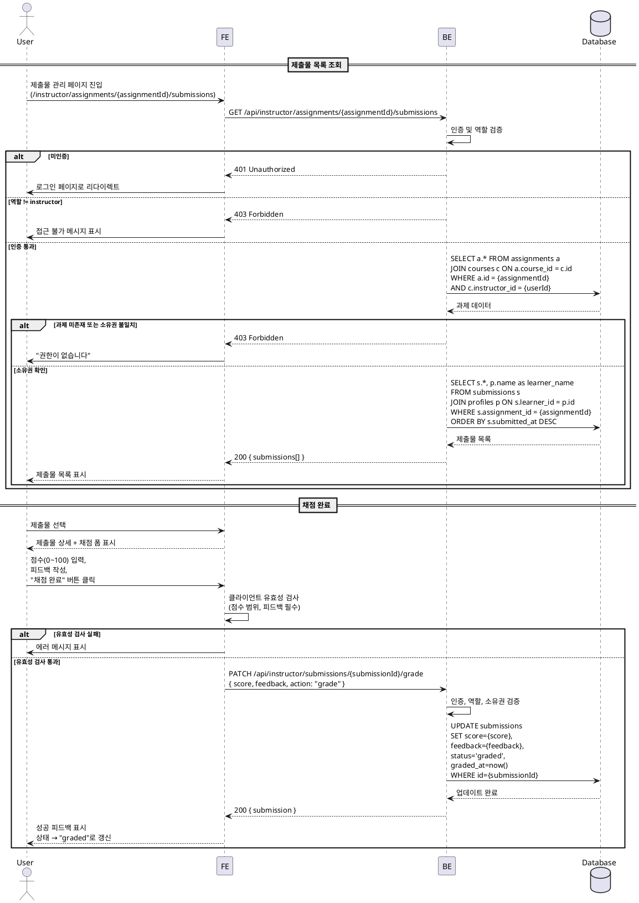
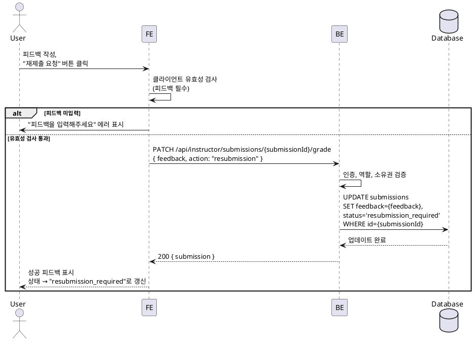

# UC-010: 제출물 채점 & 피드백

## Primary Actor

Instructor (역할=instructor인 인증된 사용자)

## Precondition

- 회원가입 및 온보딩(역할 선택, 프로필 입력)을 완료한 상태
- Instructor 역할로 로그인되어 있는 상태
- 본인이 개설한 코스에 과제가 존재하고, Learner가 제출물을 제출한 상태

## Trigger

- Instructor가 제출물 관리 페이지(`/instructor/assignments/[assignmentId]/submissions`)에 접근한다.

---

## Main Scenario

### MS-1. 제출물 목록 조회

1. Instructor가 특정 과제의 제출물 관리 페이지에 진입한다.
2. FE가 `GET /api/instructor/assignments/{assignmentId}/submissions` 요청을 전송한다.
3. BE가 인증 및 역할(`instructor`)을 검증하고, 해당 과제가 본인 코스 소속인지 확인한다.
4. BE가 `submissions` 테이블에서 해당 과제의 제출물 목록을 조회한다.
   - Learner 이름, 제출 시각, 상태(`submitted`/`graded`/`resubmission_required`), 점수, 지각 여부
5. FE가 제출물 목록을 테이블 형태로 표시한다.
   - 상태별 필터링 기능 제공 (전체/미채점/채점완료/재제출 요청)

### MS-2. 제출물 상세 열람

1. Instructor가 제출물 목록에서 특정 제출물을 선택한다.
2. FE가 제출물 상세 영역을 표시한다.
   - 제출 내용(`content`), 링크(`link`), 제출 시각, 지각 여부
3. FE가 채점 입력 폼을 표시한다.
   - 점수 입력 필드 (0~100), 피드백 텍스트 영역, "채점 완료" 버튼, "재제출 요청" 버튼

### MS-3. 채점 완료 (점수 부여)

1. Instructor가 점수(0~100)를 입력하고 피드백을 작성한다.
2. Instructor가 "채점 완료" 버튼을 클릭한다.
3. FE가 클라이언트 유효성 검사를 수행한다.
   - 점수 범위 확인 (0~100 정수)
   - 피드백 필수 입력 확인
4. FE가 `PATCH /api/instructor/submissions/{submissionId}/grade` 요청을 전송한다.
   - 요청 본문: `{ score, feedback, action: "grade" }`
5. BE가 인증, 역할, 과제 소유권을 검증한다.
6. BE가 `submissions` 테이블을 UPDATE한다.
   - `score={score}`, `feedback={feedback}`, `status='graded'`, `graded_at=now()`
7. BE가 성공 응답을 반환한다.
8. FE가 성공 피드백을 표시하고 제출물 상태를 `graded`로 갱신한다.

### MS-4. 재제출 요청

1. Instructor가 피드백을 작성한다 (재제출 사유 포함).
2. Instructor가 "재제출 요청" 버튼을 클릭한다.
3. FE가 클라이언트 유효성 검사를 수행한다.
   - 피드백 필수 입력 확인
4. FE가 `PATCH /api/instructor/submissions/{submissionId}/grade` 요청을 전송한다.
   - 요청 본문: `{ feedback, action: "resubmission" }`
5. BE가 인증, 역할, 과제 소유권을 검증한다.
6. BE가 `submissions` 테이블을 UPDATE한다.
   - `feedback={feedback}`, `status='resubmission_required'`
   - 기존 `score`와 `graded_at`은 변경하지 않는다.
7. BE가 성공 응답을 반환한다.
8. FE가 성공 피드백을 표시하고 제출물 상태를 `resubmission_required`로 갱신한다.

---

## Edge Cases

| # | 상황 | 처리 |
|---|------|------|
| E1 | 점수가 0~100 범위를 벗어남 | FE에서 입력 차단 (숫자 입력 제한). BE에서도 400 반환 |
| E2 | 피드백 미입력 상태로 채점/재제출 요청 | FE에서 버튼 비활성화. BE에서도 400 반환 |
| E3 | 이미 `graded` 상태인 제출물에 재채점 | 허용. 기존 점수/피드백을 덮어쓰고 `graded_at`을 갱신 |
| E4 | `resubmission_required` 상태인 제출물에 채점 | 허용. Learner가 재제출하지 않아도 Instructor가 현재 내용을 기반으로 채점 가능 |
| E5 | 타 Instructor의 코스 과제에 채점 시도 | 403 Forbidden 반환, "권한이 없습니다" 메시지 |
| E6 | 미인증 사용자 접근 | 401 반환, 로그인 페이지로 리다이렉트 |
| E7 | Learner 역할이 채점 시도 | 403 Forbidden 반환 |
| E8 | 네트워크 오류로 채점 저장 실패 | 에러 토스트 표시. 작성 중인 점수/피드백은 FE 폼에 유지, 재시도 가능 |
| E9 | 소수점 점수 입력 | FE에서 정수만 허용. BE에서도 정수 검증 |
| E10 | 해당 과제에 제출물이 0건 | 빈 상태 UI 표시 ("아직 제출된 과제가 없습니다") |

---

## Business Rules

| # | 규칙 |
|---|------|
| BR1 | 채점은 해당 코스의 Instructor만 수행할 수 있다 (코스 소유권 검증). |
| BR2 | 점수는 0~100 범위의 정수만 허용한다. |
| BR3 | 피드백은 채점 완료와 재제출 요청 모두에서 필수 입력이다. |
| BR4 | DB 반영은 "채점 완료" 또는 "재제출 요청" 버튼 클릭 시점에만 수행한다 (임시 저장 없음). |
| BR5 | 작성 중인 피드백은 Learner에게 노출되지 않는다 (버튼 클릭 전까지 DB 미반영). |
| BR6 | "채점 완료" 시 `status`가 `graded`로 전환되고 `graded_at`이 현재 시각으로 기록된다. |
| BR7 | "재제출 요청" 시 `status`가 `resubmission_required`로 전환되며, 기존 `score`와 `graded_at`은 유지된다. |
| BR8 | 이미 채점된 제출물도 재채점이 가능하다 (점수/피드백 덮어쓰기). |
| BR9 | 채점 결과는 Learner 대시보드(UC-003)의 최근 피드백 영역에 즉시 반영된다. |

---

## Sequence Diagram

### 제출물 목록 조회 & 채점

### 재제출 요청

