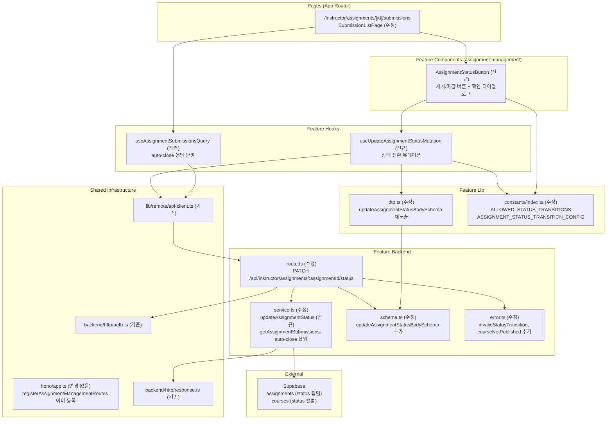

# UC-011 구현 설계: Assignment 게시/마감 (Instructor)

## Context

UC-011 유스케이스(과제 게시/마감)를 구현하기 위한 모듈화 설계.
`src/features/assignment-management/` 기능을 **확장**하여 상태 전환 기능을 추가한다.
UC-008의 `course-status-button` 패턴을 그대로 따른다.

### 이미 구현됨

- `assignments` 테이블: `status` 컬럼 (`draft`, `published`, `closed`), `allow_late`, `due_date` 존재
- `assignment-management` 백엔드: `schema.ts`, `error.ts`, `service.ts`, `route.ts`
- `assignment-management` 프론트엔드: hooks, components, constants, lib/dto
- `SubmissionListPage`: 과제 상세 + 제출물 목록 통합 페이지 (상태 버튼 통합 대상)
- 공통 인증 유틸: `extractUserId`, `requireInstructorRole`
- HTTP 응답 헬퍼: `respond`, `success`, `failure`
- `course-management/course-status-button.tsx`: 참조 패턴

### 구현 필요

- `src/features/assignment-management/backend/schema.ts` **수정** — 상태 전환 요청 스키마 추가
- `src/features/assignment-management/backend/error.ts` **수정** — 상태 전환 에러 코드 추가
- `src/features/assignment-management/backend/service.ts` **수정** — `updateAssignmentStatus` 함수 추가 (auto-close 포함)
- `src/features/assignment-management/backend/route.ts` **수정** — `PATCH /api/instructor/assignments/:assignmentId/status` 엔드포인트 추가
- `src/features/assignment-management/backend/service.ts` **수정** — `getAssignmentSubmissions`에 auto-close lazy evaluation 삽입
- `src/features/assignment-management/constants/index.ts` **수정** — 상태 전환 규칙/레이블 상수 추가
- `src/features/assignment-management/lib/dto.ts` **수정** — `updateAssignmentStatusBodySchema` 재노출 추가
- `src/features/assignment-management/hooks/useUpdateAssignmentStatusMutation.ts` **신규** — 상태 전환 뮤테이션 훅
- `src/features/assignment-management/components/assignment-status-button.tsx` **신규** — 상태 전환 버튼 컴포넌트
- `src/features/assignment-management/components/submission-list-page.tsx` **수정** — header에 `AssignmentStatusButton` 통합

---

## 개요

| # | 모듈 | 위치 | 변경 여부 | 설명 |
|---|------|------|-----------|------|
| 1 | Backend Schema 수정 | `src/features/assignment-management/backend/schema.ts` | 수정 | `updateAssignmentStatusBodySchema` 추가 |
| 2 | Backend Error 수정 | `src/features/assignment-management/backend/error.ts` | 수정 | 상태 전환 전용 에러 코드 추가 |
| 3 | Backend Service 수정 | `src/features/assignment-management/backend/service.ts` | 수정 | `updateAssignmentStatus` 추가, `getAssignmentSubmissions`에 auto-close 삽입 |
| 4 | Backend Route 수정 | `src/features/assignment-management/backend/route.ts` | 수정 | `PATCH /:assignmentId/status` 엔드포인트 추가 |
| 5 | Constants 수정 | `src/features/assignment-management/constants/index.ts` | 수정 | 상태 전환 규칙 및 버튼 설정 상수 추가 |
| 6 | DTO 수정 | `src/features/assignment-management/lib/dto.ts` | 수정 | `updateAssignmentStatusBodySchema` 재노출 추가 |
| 7 | useUpdateAssignmentStatusMutation | `src/features/assignment-management/hooks/useUpdateAssignmentStatusMutation.ts` | 신규 | 상태 전환 뮤테이션 훅 |
| 8 | AssignmentStatusButton | `src/features/assignment-management/components/assignment-status-button.tsx` | 신규 | 게시/마감 버튼 + 확인 다이얼로그 |
| 9 | SubmissionListPage 수정 | `src/features/assignment-management/components/submission-list-page.tsx` | 수정 | header에 `AssignmentStatusButton` 통합 |

> `src/backend/hono/app.ts`는 이미 `registerAssignmentManagementRoutes`가 등록되어 있으므로 **수정 불필요**.

---

## Diagram



---

## Implementation Plan

### Phase 1: Backend Layer

#### 1-1. `src/features/assignment-management/backend/schema.ts` (수정)

**추가 내용:**

```typescript
// 상태 전환 요청 스키마
export const updateAssignmentStatusBodySchema = z.object({
  status: z.enum(['published', 'closed']),
});

export type UpdateAssignmentStatusBody = z.infer<typeof updateAssignmentStatusBodySchema>;
```

**검증 규칙:**
- `status`는 `published` 또는 `closed`만 허용 (`draft`로의 역방향 전환은 스키마 레벨에서 차단)
- `draft` 전달 시 zod 파싱 실패 → 400 반환

**Unit Test:**
- `updateAssignmentStatusBodySchema`: `"published"` → 통과
- `updateAssignmentStatusBodySchema`: `"closed"` → 통과
- `updateAssignmentStatusBodySchema`: `"draft"` → 실패 (E5)
- `updateAssignmentStatusBodySchema`: 빈 문자열 → 실패

---

#### 1-2. `src/features/assignment-management/backend/error.ts` (수정)

**추가 에러 코드:**

```typescript
export const assignmentManagementErrorCodes = {
  // ... 기존 코드 유지 ...
  invalidStatusTransition: 'ASSIGNMENT_MGMT_INVALID_STATUS_TRANSITION',
  courseNotPublished: 'ASSIGNMENT_MGMT_COURSE_NOT_PUBLISHED',
  missingTitle: 'ASSIGNMENT_MGMT_MISSING_TITLE',
  pastDueDateOnPublish: 'ASSIGNMENT_MGMT_PAST_DUE_DATE_ON_PUBLISH',
} as const;
```

**에러 코드 매핑:**

| 코드 | HTTP | 상황 |
|------|------|------|
| `ASSIGNMENT_MGMT_INVALID_STATUS_TRANSITION` | 400 | 잘못된 상태 전환 시도 (E3, E4, E5) |
| `ASSIGNMENT_MGMT_COURSE_NOT_PUBLISHED` | 400 | 소속 코스가 published가 아닌 상태에서 게시 시도 (E6) |
| `ASSIGNMENT_MGMT_MISSING_TITLE` | 400 | 제목 없이 게시 시도 (E1) |
| `ASSIGNMENT_MGMT_PAST_DUE_DATE_ON_PUBLISH` | 400 | 마감일이 과거인 과제 게시 시도 (E2) |

**Unit Test:**
- 에러 코드 값의 고유성 검증

---

#### 1-3. `src/features/assignment-management/backend/service.ts` (수정)

**추가 함수: `updateAssignmentStatus`**

```typescript
export const updateAssignmentStatus = async (
  supabase: SupabaseClient,
  userId: string,
  assignmentId: string,
  newStatus: 'published' | 'closed',
): Promise<HandlerResult<AssignmentManagementResponse, AssignmentManagementServiceError>>
```

**비즈니스 로직:**

1. `assignments` SELECT (JOIN courses) WHERE `id={assignmentId}` — 없으면 404
2. `courses.instructor_id !== userId` → 403 (E7, BR8)
3. `currentStatus === newStatus` 중복 전환 방지:
   - `currentStatus === 'closed'` → `newStatus === 'published'` → 400, `ASSIGNMENT_MGMT_INVALID_STATUS_TRANSITION` (E5: "마감된 과제는 다시 게시할 수 없습니다")
   - `currentStatus === 'published'` → `newStatus === 'published'` → 400, `ASSIGNMENT_MGMT_INVALID_STATUS_TRANSITION` (E3: "이미 게시된 과제입니다")
   - `currentStatus === 'draft'` → `newStatus === 'closed'` → 400, `ASSIGNMENT_MGMT_INVALID_STATUS_TRANSITION` (E4: "게시 상태의 과제만 마감할 수 있습니다")
4. `newStatus === 'published'` 전용 게시 전 필수 조건 검증 (BR3):
   - `assignment.title` 비어 있으면 → 400, `ASSIGNMENT_MGMT_MISSING_TITLE` (E1)
   - `assignment.due_date <= now()` → 400, `ASSIGNMENT_MGMT_PAST_DUE_DATE_ON_PUBLISH` (E2)
   - `course.status !== 'published'` → 400, `ASSIGNMENT_MGMT_COURSE_NOT_PUBLISHED` (E6)
5. `assignments` UPDATE `{ status: newStatus }` WHERE `id={assignmentId}`
6. 업데이트된 과제 데이터 반환

**`getAssignmentSubmissions` auto-close 삽입 (MS-3, BR5, BR9):**

과제 데이터 조회 후 소유자 검증 통과 시, 제출물 조회 전에 다음 로직 삽입:

```typescript
// auto-close: allow_late=false이고 due_date <= now()이면 closed로 전환
if (
  rawAssignment.status === 'published' &&
  !rawAssignment.allow_late &&
  new Date(rawAssignment.due_date) <= new Date()
) {
  await supabase
    .from('assignments')
    .update({ status: 'closed' })
    .eq('id', assignmentId)
    .eq('status', 'published'); // 동시성 안전: 이미 closed면 no-op

  rawAssignment.status = 'closed';
}
```

**Unit Test:**

`updateAssignmentStatus`:
- draft → published: 제목 있음, due_date 미래, 코스 published → 200 성공 (MS-1)
- draft → published: 제목 없음 → 400, `ASSIGNMENT_MGMT_MISSING_TITLE` (E1)
- draft → published: due_date 과거 → 400, `ASSIGNMENT_MGMT_PAST_DUE_DATE_ON_PUBLISH` (E2)
- draft → published: 코스 draft → 400, `ASSIGNMENT_MGMT_COURSE_NOT_PUBLISHED` (E6)
- published → published → 400, `ASSIGNMENT_MGMT_INVALID_STATUS_TRANSITION` (E3)
- published → closed → 200 성공 (MS-2, BR6)
- draft → closed → 400, `ASSIGNMENT_MGMT_INVALID_STATUS_TRANSITION` (E4)
- closed → published → 400, `ASSIGNMENT_MGMT_INVALID_STATUS_TRANSITION` (E5)
- 타 Instructor 소유 과제 → 403 (E7)
- 존재하지 않는 assignmentId → 404

`getAssignmentSubmissions` auto-close:
- status='published', allow_late=false, due_date 과거 → DB UPDATE 후 status='closed' 반환 (BR5, BR9)
- status='published', allow_late=true, due_date 과거 → status='published' 유지 (BR5-1)
- status='published', allow_late=false, due_date 미래 → status='published' 유지
- status='closed' → auto-close 로직 미실행

---

#### 1-4. `src/features/assignment-management/backend/route.ts` (수정)

**추가 엔드포인트:**

| Method | Path | Auth | 설명 |
|--------|------|------|------|
| PATCH | `/api/instructor/assignments/:assignmentId/status` | 필수 (Instructor만) | 과제 상태 전환 (MS-1, MS-2) |

**엔드포인트 흐름:**
1. `extractUserId(c)` — 미인증 시 401 (E8)
2. `requireInstructorRole(supabase, userId)` — 비강사 시 403 (E9)
3. `assignmentIdParamSchema.safeParse(...)` — 실패 시 400
4. `updateAssignmentStatusBodySchema.safeParse(await c.req.json())` — 실패 시 400
5. `updateAssignmentStatus(supabase, userId, assignmentId, body.status)` 호출
6. `respond(c, result)` 반환

---

### Phase 2: Constants / DTO

#### 2-1. `src/features/assignment-management/constants/index.ts` (수정)

**추가 상수:**

```typescript
// 허용된 상태 전환 규칙 (BR1: draft -> published -> closed, 단방향)
export const ALLOWED_ASSIGNMENT_STATUS_TRANSITIONS = {
  draft: ['published'],
  published: ['closed'],
  closed: [],
} as const satisfies Record<string, readonly string[]>;

// 상태 전환 버튼 라벨 및 확인 다이얼로그 메시지
export const ASSIGNMENT_STATUS_TRANSITION_CONFIG = {
  published: {
    label: '게시',
    confirmTitle: '과제 게시',
    confirmMessage: '게시하면 수강생에게 노출됩니다. 게시하시겠습니까?',
  },
  closed: {
    label: '마감',
    confirmTitle: '과제 마감',
    confirmMessage: '마감하면 더 이상 제출할 수 없습니다. 마감하시겠습니까?',
  },
} as const;

// 과제 상태 배지 레이블 (Learner/Instructor 화면 공통)
export const ASSIGNMENT_STATUS_LABELS = {
  draft: '초안',
  published: '게시됨',
  closed: '마감됨',
} as const satisfies Record<string, string>;

// 과제 상태 배지 variant
export const ASSIGNMENT_STATUS_VARIANTS = {
  draft: 'outline',
  published: 'default',
  closed: 'secondary',
} as const satisfies Record<string, 'default' | 'secondary' | 'destructive' | 'outline'>;
```

---

#### 2-2. `src/features/assignment-management/lib/dto.ts` (수정)

```typescript
export {
  // ... 기존 exports 유지 ...
  updateAssignmentStatusBodySchema,
  type UpdateAssignmentStatusBody,
} from '../backend/schema';
```

---

### Phase 3: Frontend Hook

#### 3-1. `src/features/assignment-management/hooks/useUpdateAssignmentStatusMutation.ts` (신규)

`course-management/hooks/useUpdateCourseStatusMutation.ts` 패턴을 그대로 따른다.

```typescript
'use client';

import { useMutation, useQueryClient } from '@tanstack/react-query';
import { apiClient, extractApiErrorMessage } from '@/lib/remote/api-client';
import { assignmentManagementResponseSchema } from '@/features/assignment-management/lib/dto';
import { ASSIGNMENT_MANAGEMENT_QUERY_KEYS } from '@/features/assignment-management/constants';
import { toast } from '@/hooks/use-toast';

type UpdateAssignmentStatusPayload = {
  status: 'published' | 'closed';
};

const updateAssignmentStatusFetcher = async (
  assignmentId: string,
  payload: UpdateAssignmentStatusPayload,
) => {
  try {
    const { data } = await apiClient.patch(
      `/api/instructor/assignments/${assignmentId}/status`,
      payload,
    );
    return assignmentManagementResponseSchema.parse(data);
  } catch (error) {
    const message = extractApiErrorMessage(error, '상태 변경에 실패했습니다.');
    throw new Error(message);
  }
};

export const useUpdateAssignmentStatusMutation = (assignmentId: string) => {
  const queryClient = useQueryClient();

  return useMutation({
    mutationFn: (payload: UpdateAssignmentStatusPayload) =>
      updateAssignmentStatusFetcher(assignmentId, payload),
    onSuccess: () => {
      toast({ title: '상태 변경 완료', description: '과제 상태가 변경되었습니다.' });
      // 제출물 목록 쿼리 무효화 (assignment 포함)
      queryClient.invalidateQueries({
        queryKey: ASSIGNMENT_MANAGEMENT_QUERY_KEYS.submissions(assignmentId, 'all'),
      });
      // 과제 단건 쿼리 무효화 (수정 폼)
      queryClient.invalidateQueries({
        queryKey: ASSIGNMENT_MANAGEMENT_QUERY_KEYS.detail(assignmentId),
      });
    },
    onError: (error: Error) => {
      toast({
        variant: 'destructive',
        title: '상태 변경 실패',
        description: error.message,
      });
    },
  });
};
```

**설계 참고사항:**
- `useAssignmentSubmissionsQuery`는 `filter='all'`로 고정 호출되므로, `submissions('all')` 키를 명시적으로 무효화한다.
- 단건 detail 쿼리도 무효화하여 과제 수정 폼의 status 필드가 최신화되도록 한다.

---

### Phase 4: Frontend Component

#### 4-1. `src/features/assignment-management/components/assignment-status-button.tsx` (신규)

`course-management/components/course-status-button.tsx` 패턴을 그대로 따른다.

**Props:**
```typescript
type AssignmentStatusButtonProps = {
  assignmentId: string;
  currentStatus: 'draft' | 'published' | 'closed';
};
```

**동작 흐름:**
1. `ALLOWED_ASSIGNMENT_STATUS_TRANSITIONS[currentStatus]`에서 다음 전환 가능 상태 확인
2. 전환 가능 상태가 없으면 (`closed`) `null` 반환 → 버튼 미표시
3. `draft` → "게시" 버튼 표시
4. `published` → "마감" 버튼 표시
5. 버튼 클릭 → shadcn `Dialog` 확인 다이얼로그 표시 (`ASSIGNMENT_STATUS_TRANSITION_CONFIG` 사용)
6. 확인 → `useUpdateAssignmentStatusMutation` 호출
7. 성공 시 다이얼로그 닫힘, 상태 갱신 (query invalidation으로 자동 반영)

**QA Sheet:**

| # | 시나리오 | 기대 결과 |
|---|----------|-----------|
| 1 | status='draft' | "게시" 버튼 표시 |
| 2 | status='published' | "마감" 버튼 표시 |
| 3 | status='closed' | 버튼 미표시 (null 반환) |
| 4 | "게시" 클릭 | "게시하면 수강생에게 노출됩니다" 다이얼로그 표시 |
| 5 | "마감" 클릭 | "마감하면 더 이상 제출할 수 없습니다" 다이얼로그 표시 |
| 6 | 다이얼로그 취소 | 다이얼로그 닫힘, 상태 변경 없음 |
| 7 | 다이얼로그 확인 (게시) | PATCH 요청 → status='published'로 갱신 → 성공 토스트 |
| 8 | 다이얼로그 확인 (마감) | PATCH 요청 → status='closed'로 갱신 → 성공 토스트 |
| 9 | 전환 처리 중 | 버튼 disabled, "처리 중..." 텍스트 |
| 10 | 게시 전 조건 미충족 (E1, E2, E6) | 에러 토스트 표시, 다이얼로그 유지 |
| 11 | API 에러 (E10) | 에러 토스트 표시 |

---

#### 4-2. `src/features/assignment-management/components/submission-list-page.tsx` (수정)

**변경 내용:**

1. `AssignmentStatusButton` import 추가
2. header의 `<Badge variant="outline">{assignment.status}</Badge>` 를 상태 레이블 배지로 개선
3. header에 `<AssignmentStatusButton>` 통합

**수정 전 header (현재):**
```tsx
<header className="space-y-1">
  <div className="flex items-center gap-3">
    <h1 className="text-3xl font-semibold">{assignment.title}</h1>
    <Badge variant="outline">{assignment.status}</Badge>
  </div>
  <p className="text-sm text-muted-foreground">
    {assignment.courseTitle} &middot; 마감:{' '}
    {format(new Date(assignment.dueDate), 'yyyy. MM. dd. HH:mm', { locale: ko })}
  </p>
</header>
```

**수정 후 header (목표):**
```tsx
<header className="space-y-2">
  <div className="flex items-center justify-between gap-3">
    <div className="flex items-center gap-3">
      <h1 className="text-3xl font-semibold">{assignment.title}</h1>
      <Badge variant={ASSIGNMENT_STATUS_VARIANTS[assignment.status]}>
        {ASSIGNMENT_STATUS_LABELS[assignment.status]}
      </Badge>
    </div>
    <AssignmentStatusButton
      assignmentId={assignmentId}
      currentStatus={assignment.status}
    />
  </div>
  <p className="text-sm text-muted-foreground">
    {assignment.courseTitle} &middot; 마감:{' '}
    {format(new Date(assignment.dueDate), 'yyyy. MM. dd. HH:mm', { locale: ko })}
  </p>
</header>
```

**QA Sheet:**

| # | 시나리오 | 기대 결과 |
|---|----------|-----------|
| 1 | draft 과제 접근 | "초안" 배지 + "게시" 버튼 표시 |
| 2 | published 과제 접근 | "게시됨" 배지 + "마감" 버튼 표시 |
| 3 | closed 과제 접근 | "마감됨" 배지 + 버튼 미표시 |
| 4 | allow_late=false 과제, due_date 경과 후 접근 | submissions 쿼리 결과에서 status='closed' 반환 → "마감됨" 배지 (auto-close, BR5, BR9) |
| 5 | allow_late=true 과제, due_date 경과 후 접근 | status='published' 유지 → "게시됨" 배지 + "마감" 버튼 (BR5-1) |
| 6 | "게시" 클릭 후 확인 | 상태 → published로 갱신, 배지 변경 |
| 7 | "마감" 클릭 후 확인 | 상태 → closed로 갱신, 버튼 사라짐 |
| 8 | 미인증 접근 (E8) | layout 가드에 의해 로그인 페이지 리다이렉트 |
| 9 | Learner 역할 접근 (E9) | 403 에러 메시지 |
| 10 | 타 Instructor 접근 (E7) | 제출물 조회 API 403 반환 → 에러 표시 |

---

## 작업 순서 (의존성 기반)

```
Phase 1 (Backend — 순차)
├── 1-1. schema.ts 수정 (updateAssignmentStatusBodySchema 추가)
├── 1-2. error.ts 수정 (새 에러 코드 추가)
├── 1-3. service.ts 수정 (updateAssignmentStatus 추가 + getAssignmentSubmissions auto-close)
└── 1-4. route.ts 수정 (PATCH /:assignmentId/status 엔드포인트 추가)

Phase 2 (Constants / DTO — Phase 1 후)
├── 2-1. constants/index.ts 수정 (ALLOWED_ASSIGNMENT_STATUS_TRANSITIONS 등 추가)
└── 2-2. lib/dto.ts 수정 (updateAssignmentStatusBodySchema 재노출)

Phase 3 (Frontend Hook — Phase 2 후)
└── 3-1. hooks/useUpdateAssignmentStatusMutation.ts 신규 생성

Phase 4 (Frontend Components — Phase 3 후)
├── 4-1. components/assignment-status-button.tsx 신규 생성
└── 4-2. components/submission-list-page.tsx 수정 (AssignmentStatusButton 통합)
```

> `src/backend/hono/app.ts`는 변경 없음. `registerAssignmentManagementRoutes`가 이미 등록되어 있으므로 신규 PATCH 엔드포인트가 자동으로 포함된다.

---

## 참조 파일

| 용도 | 파일 |
|------|------|
| 상태 전환 버튼 패턴 | `src/features/course-management/components/course-status-button.tsx` |
| 상태 전환 상수 패턴 | `src/features/course-management/constants/index.ts` |
| 상태 전환 뮤테이션 패턴 | `src/features/course-management/hooks/useUpdateCourseStatusMutation.ts` |
| 기존 assignment-management 백엔드 | `src/features/assignment-management/backend/` |
| 기존 assignment-management 훅 | `src/features/assignment-management/hooks/` |
| 통합 대상 페이지 | `src/features/assignment-management/components/submission-list-page.tsx` |
| 공통 인증 유틸 | `src/backend/http/auth.ts` |
| HTTP 응답 헬퍼 | `src/backend/http/response.ts` |
| API 클라이언트 | `src/lib/remote/api-client.ts` |
