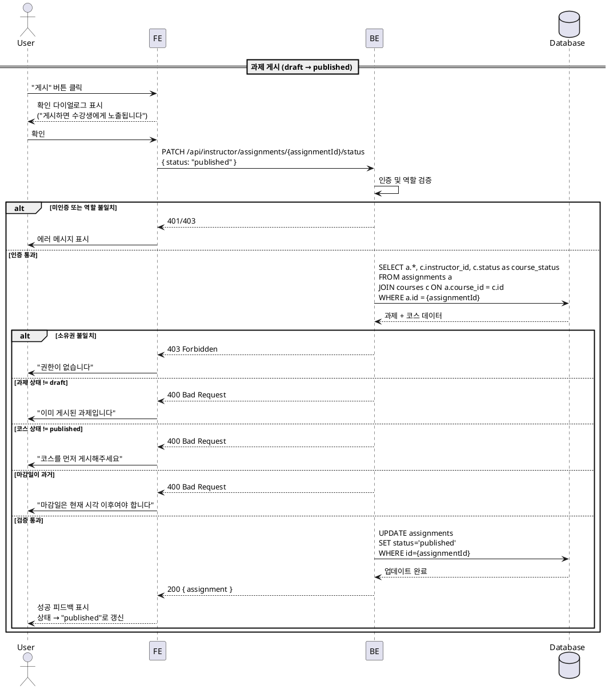
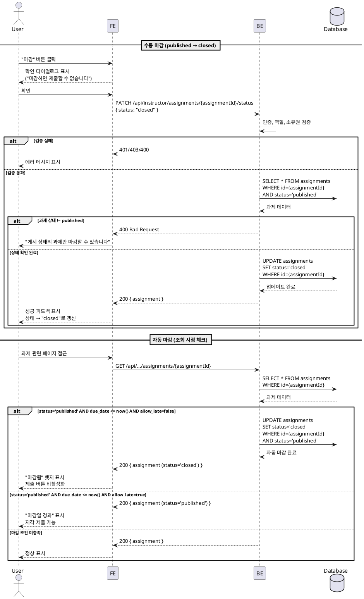

# UC-011: Assignment 게시/마감

## Primary Actor

Instructor (역할=instructor인 인증된 사용자)

## Precondition

- 회원가입 및 온보딩(역할 선택, 프로필 입력)을 완료한 상태
- Instructor 역할로 로그인되어 있는 상태
- 본인이 개설한 코스에 `draft` 상태의 과제가 존재한다 (과제 CRUD는 UC-009에서 다룸)

## Trigger

- Instructor가 과제 상세 화면에서 "게시" 또는 "마감" 버튼을 클릭한다.
- 마감일이 도래하여 시스템이 자동 마감을 수행한다.

---

## Main Scenario

### MS-1. 과제 게시 (draft -> published)

1. Instructor가 과제 관리 화면에서 `draft` 상태의 과제를 확인한다.
2. Instructor가 "게시" 버튼을 클릭한다.
3. FE가 확인 다이얼로그를 표시한다 ("게시하면 수강생에게 노출됩니다. 게시하시겠습니까?").
4. Instructor가 확인을 누른다.
5. FE가 `PATCH /api/instructor/assignments/{assignmentId}/status` 요청을 전송한다.
   - 요청 본문: `{ status: "published" }`
6. BE가 인증, 역할, 코스 소유권을 검증한다.
7. BE가 과제의 현재 상태가 `draft`인지 확인한다.
8. BE가 게시 전 필수 조건을 검증한다.
   - 제목(`title`)이 존재하는지
   - 마감일(`due_date`)이 현재 시각 이후인지
   - 소속 코스가 `published` 상태인지
9. BE가 `assignments` 테이블을 UPDATE한다.
   - `status='published'`
10. BE가 성공 응답을 반환한다.
11. FE가 성공 피드백을 표시하고 과제 상태를 `published`로 갱신한다.

### MS-2. 수동 마감 (published -> closed)

1. Instructor가 과제 관리 화면에서 `published` 상태의 과제를 확인한다.
2. Instructor가 "마감" 버튼을 클릭한다.
3. FE가 확인 다이얼로그를 표시한다 ("마감하면 더 이상 제출할 수 없습니다. 마감하시겠습니까?").
4. Instructor가 확인을 누른다.
5. FE가 `PATCH /api/instructor/assignments/{assignmentId}/status` 요청을 전송한다.
   - 요청 본문: `{ status: "closed" }`
6. BE가 인증, 역할, 코스 소유권을 검증한다.
7. BE가 과제의 현재 상태가 `published`인지 확인한다.
8. BE가 `assignments` 테이블을 UPDATE한다.
   - `status='closed'`
9. BE가 성공 응답을 반환한다.
10. FE가 성공 피드백을 표시하고 과제 상태를 `closed`로 갱신한다.

### MS-3. 자동 마감 (마감일 도래)

1. Learner 또는 Instructor가 과제 관련 페이지에 접근하여 BE에 요청이 발생한다.
2. BE가 해당 과제의 `status='published'`이고 `due_date <= now()`인지 확인한다.
3. `allow_late=true`인 과제는 자동 마감 대상에서 제외한다 (지각 제출 허용을 위해).
4. `allow_late=false`이고 조건 충족 시 BE가 `assignments` 테이블을 UPDATE한다.
   - `status='closed'`
5. BE가 마감 처리된 상태를 응답에 반영한다.

### MS-4. 마감 후 Learner 화면 반영

1. Learner가 코스 상세 또는 과제 목록 페이지에 접근한다.
2. `closed` 상태 과제는 "마감됨" 뱃지와 함께 표시된다.
3. `allow_late=false`인 과제가 `closed`되면 제출 버튼이 비활성화된다.
4. `allow_late=true`인 과제는 자동 마감되지 않으며, 마감일 이후에도 지각 제출(`is_late=true`)이 가능하다. Instructor가 수동 마감한 경우에만 제출이 불가하다.
4. 이미 제출된 과제는 채점 대기(`submitted`) 또는 채점 결과(`graded`/`resubmission_required`)를 확인할 수 있다.

---

## Edge Cases

| # | 상황 | 처리 |
|---|------|------|
| E1 | 제목 없이 게시 시도 | BE에서 400 반환, "과제 제목을 입력해주세요" 메시지 |
| E2 | 마감일이 과거인 과제를 게시 시도 | BE에서 400 반환, "마감일은 현재 시각 이후여야 합니다" 메시지 |
| E3 | `draft` 상태가 아닌 과제를 게시 시도 | BE에서 400 반환, "이미 게시된 과제입니다" 메시지 |
| E4 | `published` 상태가 아닌 과제를 마감 시도 | BE에서 400 반환, "게시 상태의 과제만 마감할 수 있습니다" 메시지 |
| E5 | `closed` 상태 과제를 다시 게시 시도 | BE에서 400 반환, "마감된 과제는 다시 게시할 수 없습니다" (단방향 전환) |
| E6 | 소속 코스가 `draft` 상태인데 과제 게시 시도 | BE에서 400 반환, "코스를 먼저 게시해주세요" 메시지 |
| E7 | 타 Instructor의 과제에 상태 변경 시도 | 403 Forbidden 반환, "권한이 없습니다" 메시지 |
| E8 | 미인증 사용자 접근 | 401 반환, 로그인 페이지로 리다이렉트 |
| E9 | Learner 역할이 상태 변경 시도 | 403 Forbidden 반환 |
| E10 | 네트워크 오류 | 에러 토스트 표시, 재시도 가능 |
| E11 | 자동 마감 시점에 동시 제출 요청 | BE에서 과제 상태를 먼저 확인하고 `closed`면 제출 거부 (400 반환) |

---

## Business Rules

| # | 규칙 |
|---|------|
| BR1 | 과제 상태 전환은 단방향이다: `draft` -> `published` -> `closed`. 역방향 전환은 불가하다. |
| BR2 | `draft` 상태 과제는 Learner에게 노출되지 않는다. `published` 전환 시점부터 Learner 화면에 표시된다. |
| BR3 | 게시 전 필수 조건: 제목 존재, 마감일이 미래 시각, 소속 코스가 `published` 상태. |
| BR4 | `closed` 상태 과제에는 새로운 제출이 불가하다. |
| BR5 | `allow_late=false`인 과제는 마감일 도래 시 자동으로 `published` -> `closed` 전환된다 (조회 시점 체크). |
| BR5-1 | `allow_late=true`인 과제는 자동 마감 대상에서 제외된다. 마감일 이후에도 `published` 상태를 유지하며 지각 제출을 허용한다. Instructor의 수동 마감만 가능하다. |
| BR6 | 수동 마감은 마감일 이전에도 Instructor가 임의로 수행할 수 있다. |
| BR7 | `closed` 상태 과제는 채점만 가능하다 (UC-010 참조). |
| BR8 | 게시/마감 권한은 해당 코스의 Instructor에게만 있다 (코스 소유권 검증). |
| BR9 | 자동 마감은 별도 배치 작업 없이, 과제 조회 시 `due_date`를 확인하여 처리한다 (lazy evaluation). |

---

## Sequence Diagram

### 과제 게시

### 수동 마감 & 자동 마감

