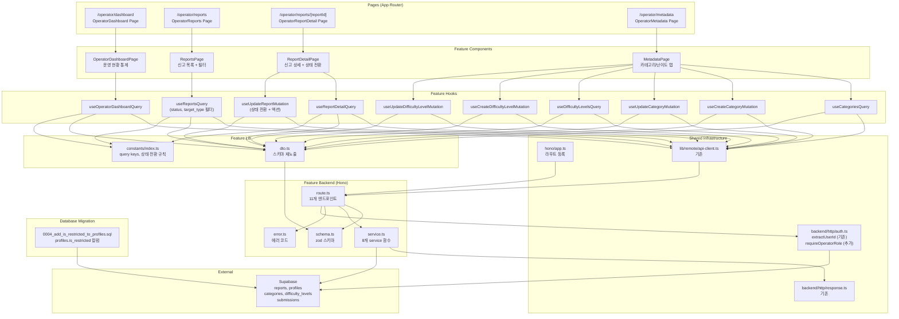

# UC-012 구현 설계: 운영 (Operator)

## Context

UC-012 유스케이스(Operator 운영 관리)를 구현하기 위한 모듈화 설계.
DB 스키마(`reports`, `categories`, `difficulty_levels`, `profiles`, `submissions`)는 `0002_create_lms_schema.sql`에 이미 존재.
단, `profiles` 테이블에 `is_restricted` 컬럼이 없으므로 migration 추가 필요 (BR5).
`src/features/instructor-dashboard/`와 `src/features/course-management/`의 패턴(schema→error→service→route, dto 재노출, React Query hooks, shadcn 컴포넌트)을 그대로 따른다.

---

## 현재 상태

### 이미 구현됨

- DB 스키마: `reports` (status/action enum 포함), `categories`, `difficulty_levels`, `profiles`, `submissions` 테이블
- 인증 인프라: `useCurrentUser`, `apiClient`, `respond`/`success`/`failure`, Hono 싱글턴
- 공통 인증 유틸: `extractUserId`, `requireInstructorRole`, `requireLearnerRole` (`src/backend/http/auth.ts`)
- `(protected)/layout.tsx`: 인증 가드
- shadcn 컴포넌트: button, card, badge, separator, dialog, form, input, select 등

### 구현 필요

- `src/backend/http/auth.ts` 수정 — `requireOperatorRole` 함수 추가
- `supabase/migrations/0004_add_is_restricted_to_profiles.sql` — `profiles.is_restricted` 컬럼 추가
- `src/features/operator/` 전체 (backend, hooks, components, lib, constants)
- `src/app/(protected)/operator/dashboard/page.tsx`
- `src/app/(protected)/operator/reports/page.tsx`
- `src/app/(protected)/operator/reports/[reportId]/page.tsx`
- `src/app/(protected)/operator/metadata/page.tsx`
- `src/backend/hono/app.ts` 수정 — operator 라우트 등록

---

## 개요

| # | 모듈 | 위치 | 설명 |
|---|------|------|------|
| 0 | Migration | `supabase/migrations/0004_add_is_restricted_to_profiles.sql` | `profiles.is_restricted` 컬럼 추가 |
| 1 | Auth Util 확장 | `src/backend/http/auth.ts` | `requireOperatorRole` 함수 추가 |
| 2 | Operator Backend Schema | `src/features/operator/backend/schema.ts` | 요청/응답 zod 스키마 |
| 3 | Operator Backend Error | `src/features/operator/backend/error.ts` | 에러 코드 정의 |
| 4 | Operator Backend Service | `src/features/operator/backend/service.ts` | 대시보드, 신고, 메타데이터 비즈니스 로직 |
| 5 | Operator Backend Route | `src/features/operator/backend/route.ts` | Hono 라우터 (11개 엔드포인트) |
| 6 | Operator DTO | `src/features/operator/lib/dto.ts` | 백엔드 스키마 프론트엔드 재노출 |
| 7 | Operator Constants | `src/features/operator/constants/index.ts` | Query Key, 상태 전환 규칙 상수 |
| 8 | useOperatorDashboardQuery | `src/features/operator/hooks/useOperatorDashboardQuery.ts` | 대시보드 통계 조회 훅 |
| 9 | useReportsQuery | `src/features/operator/hooks/useReportsQuery.ts` | 신고 목록 조회 훅 (필터 지원) |
| 10 | useReportDetailQuery | `src/features/operator/hooks/useReportDetailQuery.ts` | 신고 상세 조회 훅 |
| 11 | useUpdateReportMutation | `src/features/operator/hooks/useUpdateReportMutation.ts` | 신고 상태 전환 + 액션 실행 뮤테이션 |
| 12 | useCategoriesQuery | `src/features/operator/hooks/useCategoriesQuery.ts` | 카테고리 목록 조회 훅 (활성/비활성 포함) |
| 13 | useCreateCategoryMutation | `src/features/operator/hooks/useCreateCategoryMutation.ts` | 카테고리 추가 뮤테이션 |
| 14 | useUpdateCategoryMutation | `src/features/operator/hooks/useUpdateCategoryMutation.ts` | 카테고리 수정/비활성화 뮤테이션 |
| 15 | useDifficultyLevelsQuery | `src/features/operator/hooks/useDifficultyLevelsQuery.ts` | 난이도 목록 조회 훅 (활성/비활성 포함) |
| 16 | useCreateDifficultyLevelMutation | `src/features/operator/hooks/useCreateDifficultyLevelMutation.ts` | 난이도 추가 뮤테이션 |
| 17 | useUpdateDifficultyLevelMutation | `src/features/operator/hooks/useUpdateDifficultyLevelMutation.ts` | 난이도 수정/비활성화 뮤테이션 |
| 18 | OperatorDashboardPage | `src/features/operator/components/operator-dashboard-page.tsx` | 운영 현황 통계 대시보드 |
| 19 | ReportsPage | `src/features/operator/components/reports-page.tsx` | 신고 목록 테이블 + 필터 |
| 20 | ReportDetailPage | `src/features/operator/components/report-detail-page.tsx` | 신고 상세 + 상태 전환 UI |
| 21 | MetadataPage | `src/features/operator/components/metadata-page.tsx` | 카테고리/난이도 탭 관리 UI |
| 22 | Operator Dashboard Page | `src/app/(protected)/operator/dashboard/page.tsx` | Next.js 페이지 |
| 23 | Operator Reports Page | `src/app/(protected)/operator/reports/page.tsx` | Next.js 페이지 |
| 24 | Operator Report Detail Page | `src/app/(protected)/operator/reports/[reportId]/page.tsx` | Next.js 페이지 |
| 25 | Operator Metadata Page | `src/app/(protected)/operator/metadata/page.tsx` | Next.js 페이지 |
| 26 | Hono App | `src/backend/hono/app.ts` | **수정** — operator 라우트 등록 |

---

## Diagram



---

## Implementation Plan

### Phase 0: Database Migration

#### 0-1. `supabase/migrations/0004_add_is_restricted_to_profiles.sql`

`profiles` 테이블에 `is_restricted` 컬럼 추가. BR5 요구사항.

```sql
-- Migration: profiles 테이블에 is_restricted 컬럼 추가 (UC-012 restrict_account 액션)
BEGIN;

ALTER TABLE public.profiles
  ADD COLUMN IF NOT EXISTS is_restricted boolean NOT NULL DEFAULT false;

COMMENT ON COLUMN public.profiles.is_restricted IS '계정 제한 플래그 (operator restrict_account 액션 적용 시 true)';

EXCEPTION WHEN others THEN
  RAISE;
END;
```

---

### Phase 1: Auth Util 확장

#### 1-1. `src/backend/http/auth.ts` 수정

기존 `requireInstructorRole`, `requireLearnerRole` 패턴을 동일하게 따라 `requireOperatorRole` 추가.

```typescript
export const requireOperatorRole = async (
  supabase: SupabaseClient,
  userId: string,
): Promise<ErrorResult<string> | null> => {
  const { data: profile } = await supabase
    .from('profiles')
    .select('role')
    .eq('id', userId)
    .maybeSingle();

  if (profile?.role !== 'operator') {
    return failure(
      403,
      'FORBIDDEN_ROLE',
      '운영 권한이 필요합니다.',
    );
  }

  return null;
};
```

**Unit Test:**
- `role='operator'` → null 반환 (통과)
- `role='instructor'` → 403, `'FORBIDDEN_ROLE'` (E2)
- `role='learner'` → 403, `'FORBIDDEN_ROLE'` (E2)
- profile 없음 → 403 (E2)

---

### Phase 2: Backend Layer

#### 2-1. `src/features/operator/backend/schema.ts`

**zod 스키마 정의:**

```typescript
// 대시보드 응답
operatorDashboardResponseSchema: {
  receivedReportCount: z.number(),
  investigatingReportCount: z.number(),
  totalCourseCount: z.number(),
  totalUserCount: z.number(),
}

// 신고 목록 쿼리 파라미터
reportsQuerySchema: {
  status: z.enum(['received', 'investigating', 'resolved']).optional(),
  target_type: z.enum(['course', 'assignment', 'submission', 'user']).optional(),
}

// 신고 항목 스키마 (목록/상세 공통)
reportSchema: {
  id: z.string().uuid(),
  reporterId: z.string().uuid(),
  reporterName: z.string(),
  targetType: z.enum(['course', 'assignment', 'submission', 'user']),
  targetId: z.string().uuid(),
  reason: z.string(),
  content: z.string(),
  status: z.enum(['received', 'investigating', 'resolved']),
  action: z.enum(['warning', 'invalidate_submission', 'restrict_account']).nullable(),
  createdAt: z.string(),
  updatedAt: z.string(),
}

// 신고 목록 응답
reportsResponseSchema: {
  reports: z.array(reportSchema),
}

// 신고 상세 응답
reportDetailResponseSchema: {
  report: reportSchema,
}

// 신고 상태 전환 요청
updateReportBodySchema: {
  status: z.enum(['investigating', 'resolved']),
  action: z.enum(['warning', 'invalidate_submission', 'restrict_account']).optional(),
}

// reportId 파라미터
reportIdParamSchema: {
  reportId: z.string().uuid(),
}

// 카테고리 항목 스키마
categorySchema: {
  id: z.string().uuid(),
  name: z.string(),
  isActive: z.boolean(),
  createdAt: z.string(),
  updatedAt: z.string(),
}

// 카테고리 목록 응답
categoriesResponseSchema: {
  categories: z.array(categorySchema),
}

// 카테고리 추가 요청
createCategoryBodySchema: {
  name: z.string().min(1, '카테고리 이름을 입력해주세요.'),
}

// 카테고리 수정 요청
updateCategoryBodySchema: {
  name: z.string().min(1, '카테고리 이름을 입력해주세요.').optional(),
  isActive: z.boolean().optional(),
}

// categoryId 파라미터
categoryIdParamSchema: {
  categoryId: z.string().uuid(),
}

// 난이도 항목 스키마 (categorySchema와 동일 구조)
difficultyLevelSchema: {
  id: z.string().uuid(),
  name: z.string(),
  isActive: z.boolean(),
  createdAt: z.string(),
  updatedAt: z.string(),
}

// 난이도 목록 응답
difficultyLevelsResponseSchema: {
  difficultyLevels: z.array(difficultyLevelSchema),
}

// 난이도 추가 요청
createDifficultyLevelBodySchema: {
  name: z.string().min(1, '난이도 이름을 입력해주세요.'),
}

// 난이도 수정 요청
updateDifficultyLevelBodySchema: {
  name: z.string().min(1).optional(),
  isActive: z.boolean().optional(),
}

// levelId 파라미터
levelIdParamSchema: {
  levelId: z.string().uuid(),
}
```

**Unit Test:**
- `updateReportBodySchema`: `status='received'` → 실패 (E4 — receiving으로 직접 전환 불가)
- `updateReportBodySchema`: `status='resolved'` without action → 통과 (action은 optional; BE에서 검증)
- `createCategoryBodySchema`: 빈 문자열 → 실패 (E13)
- `reportsQuerySchema`: 유효하지 않은 status 값 → 실패

---

#### 2-2. `src/features/operator/backend/error.ts`

```typescript
export const operatorErrorCodes = {
  unauthorized: 'OPERATOR_UNAUTHORIZED',
  forbiddenRole: 'OPERATOR_FORBIDDEN_ROLE',
  notFound: 'OPERATOR_NOT_FOUND',
  validationError: 'OPERATOR_VALIDATION_ERROR',
  invalidStatusTransition: 'OPERATOR_INVALID_STATUS_TRANSITION',
  actionRequired: 'OPERATOR_ACTION_REQUIRED',
  invalidAction: 'OPERATOR_INVALID_ACTION',
  duplicateName: 'OPERATOR_DUPLICATE_NAME',
  fetchError: 'OPERATOR_FETCH_ERROR',
  updateFailed: 'OPERATOR_UPDATE_FAILED',
} as const;
```

**Unit Test:**
- 에러 코드 값의 고유성 검증

---

#### 2-3. `src/features/operator/backend/service.ts`

**함수 목록:**

| 함수명 | 입력 | 출력 | 설명 |
|--------|------|------|------|
| `getOperatorDashboard` | `(supabase)` | `HandlerResult<OperatorDashboardResponse>` | 운영 현황 통계 조회 (MS-1) |
| `getReports` | `(supabase, filters)` | `HandlerResult<ReportsResponse>` | 신고 목록 + 필터 (MS-2) |
| `getReport` | `(supabase, reportId)` | `HandlerResult<ReportDetailResponse>` | 신고 상세 조회 (MS-3) |
| `updateReport` | `(supabase, reportId, body)` | `HandlerResult<ReportDetailResponse>` | 신고 상태 전환 + 액션 실행 (MS-3, MS-4) |
| `getCategories` | `(supabase)` | `HandlerResult<CategoriesResponse>` | 카테고리 목록 전체 (MS-5) |
| `createCategory` | `(supabase, body)` | `HandlerResult<CategoryResponse>` | 카테고리 추가 (MS-5) |
| `updateCategory` | `(supabase, categoryId, body)` | `HandlerResult<CategoryResponse>` | 카테고리 수정/비활성화 (MS-5) |
| `getDifficultyLevels` | `(supabase)` | `HandlerResult<DifficultyLevelsResponse>` | 난이도 목록 전체 (MS-6) |
| `createDifficultyLevel` | `(supabase, body)` | `HandlerResult<DifficultyLevelResponse>` | 난이도 추가 (MS-6) |
| `updateDifficultyLevel` | `(supabase, levelId, body)` | `HandlerResult<DifficultyLevelResponse>` | 난이도 수정/비활성화 (MS-6) |

**비즈니스 로직 상세:**

**`getOperatorDashboard` (MS-1):**
1. `reports` SELECT count WHERE `status='received'`
2. `reports` SELECT count WHERE `status='investigating'`
3. `courses` SELECT count
4. `profiles` SELECT count WHERE `role != 'operator'` (or total)
5. 통계 응답 반환

**`getReports` (MS-2):**
1. `reports` SELECT JOIN `profiles(name) as reporter_name`
2. `status` 필터 파라미터가 있으면 WHERE 절 추가
3. `target_type` 필터 파라미터가 있으면 WHERE 절 추가
4. `created_at DESC` 정렬
5. 목록 반환

**`getReport` (MS-3):**
1. `reports` SELECT JOIN `profiles(name) as reporter_name` WHERE `id={reportId}`
2. 없으면 404, `OPERATOR_NOT_FOUND` (E11)
3. 신고 상세 반환

**`updateReport` (MS-3, MS-4):**
1. `reports` SELECT WHERE `id={reportId}` — 없으면 404 (E11)
2. 상태 전환 유효성 검증 (BR2):
   - `currentStatus === 'resolved'` → 400, `OPERATOR_INVALID_STATUS_TRANSITION`, "이미 처리 완료된 신고입니다" (E3)
   - `currentStatus === 'received'` AND `newStatus === 'resolved'` → 400, "조사 시작 후 처리 완료할 수 있습니다" (E4)
   - `currentStatus === 'investigating'` AND `newStatus === 'investigating'` → 400 (이미 해당 상태)
3. `newStatus === 'resolved'` 일 때:
   - `action` 미선택 → 400, `OPERATOR_ACTION_REQUIRED`, "처리 액션을 선택해주세요" (E5, BR3)
   - `action === 'invalidate_submission'` AND `target_type !== 'submission'` → 400, `OPERATOR_INVALID_ACTION` (E10, BR4)
   - `action === 'restrict_account'` AND `target_type !== 'user'` → 400, `OPERATOR_INVALID_ACTION` (BR5)
4. `reports` UPDATE `{ status, action }` WHERE `id={reportId}`
5. 액션별 후속 처리 (MS-4):
   - `action === 'invalidate_submission'`: `submissions` UPDATE `{ score: 0 }` WHERE `id={target_id}`
   - `action === 'restrict_account'`: `profiles` UPDATE `{ is_restricted: true }` WHERE `id={target_id}`
   - `action === 'warning'`: 추가 처리 없음
6. 업데이트된 신고 반환

**`createCategory` (MS-5):**
1. `categories` INSERT `{ name, is_active: true }`
2. UNIQUE 제약 위반 시 409, `OPERATOR_DUPLICATE_NAME`, "이미 존재하는 카테고리입니다" (E6, BR7)
3. 생성된 카테고리 반환 (201)

**`updateCategory` (MS-5):**
1. `categories` SELECT WHERE `id={categoryId}` — 없으면 404 (E11)
2. `name` 중복 확인 (name 변경 시) — 409, `OPERATOR_DUPLICATE_NAME` (E6)
3. `categories` UPDATE 전달된 필드만 (`name`, `is_active`) (BR8)
4. 업데이트된 카테고리 반환

`createDifficultyLevel`, `updateDifficultyLevel`은 카테고리와 동일 패턴.

**Unit Test:**
- `updateReport`: `status='resolved'`인 신고 상태 변경 → 400, `OPERATOR_INVALID_STATUS_TRANSITION` (E3)
- `updateReport`: `received` → `resolved` 직접 전환 → 400, "조사 시작 후 처리 완료할 수 있습니다" (E4)
- `updateReport`: `resolved` 전환 시 action 없음 → 400, `OPERATOR_ACTION_REQUIRED` (E5)
- `updateReport`: `invalidate_submission` 액션 + `target_type='user'` → 400, `OPERATOR_INVALID_ACTION` (E10)
- `updateReport`: `restrict_account` 액션 + `target_type='course'` → 400, `OPERATOR_INVALID_ACTION`
- `updateReport`: `received` → `investigating` → 200, status 갱신
- `updateReport`: `investigating` → `resolved` + `action='warning'` → 200, submissions/profiles 변경 없음
- `updateReport`: `investigating` → `resolved` + `action='invalidate_submission'` + `target_type='submission'` → submissions.score=0
- `updateReport`: `investigating` → `resolved` + `action='restrict_account'` + `target_type='user'` → profiles.is_restricted=true
- `createCategory`: 중복 이름 → 409, `OPERATOR_DUPLICATE_NAME` (E6)
- `createCategory`: 정상 → 201, is_active=true (BR8 반대)
- `updateCategory`: is_active=false → 200, 비활성화 (BR8)
- `updateCategory`: 존재하지 않는 categoryId → 404 (E11)

---

#### 2-4. `src/features/operator/backend/route.ts`

**엔드포인트:**

| Method | Path | 설명 |
|--------|------|------|
| GET | `/api/operator/dashboard` | 운영 현황 통계 (MS-1) |
| GET | `/api/operator/reports` | 신고 목록 + 필터 (MS-2) |
| GET | `/api/operator/reports/:reportId` | 신고 상세 (MS-3) |
| PATCH | `/api/operator/reports/:reportId` | 신고 상태 전환 + 액션 (MS-3, MS-4) |
| GET | `/api/operator/categories` | 카테고리 전체 목록 (MS-5) |
| POST | `/api/operator/categories` | 카테고리 추가 (MS-5) |
| PATCH | `/api/operator/categories/:categoryId` | 카테고리 수정/비활성화 (MS-5) |
| GET | `/api/operator/difficulty-levels` | 난이도 전체 목록 (MS-6) |
| POST | `/api/operator/difficulty-levels` | 난이도 추가 (MS-6) |
| PATCH | `/api/operator/difficulty-levels/:levelId` | 난이도 수정/비활성화 (MS-6) |

**공통 인증 흐름 (모든 엔드포인트):**
1. `extractUserId(c)` — 미인증 시 401, `OPERATOR_UNAUTHORIZED` (E1)
2. `requireOperatorRole(supabase, userId)` — 비운영자 시 403, `OPERATOR_FORBIDDEN_ROLE` (E2)
3. service 함수 호출
4. `respond(c, result)` 반환

---

### Phase 3: Shared / Infrastructure

#### 3-1. `src/features/operator/lib/dto.ts`

```typescript
export {
  operatorDashboardResponseSchema,
  reportsResponseSchema,
  reportDetailResponseSchema,
  reportSchema,
  updateReportBodySchema,
  categoriesResponseSchema,
  categorySchema,
  createCategoryBodySchema,
  updateCategoryBodySchema,
  difficultyLevelsResponseSchema,
  difficultyLevelSchema,
  createDifficultyLevelBodySchema,
  updateDifficultyLevelBodySchema,
  type OperatorDashboardResponse,
  type ReportsResponse,
  type ReportDetailResponse,
  type Report,
  type UpdateReportBody,
  type CategoriesResponse,
  type Category,
  type CreateCategoryBody,
  type UpdateCategoryBody,
  type DifficultyLevelsResponse,
  type DifficultyLevel,
  type CreateDifficultyLevelBody,
  type UpdateDifficultyLevelBody,
} from '../backend/schema';
```

---

#### 3-2. `src/features/operator/constants/index.ts`

```typescript
export const OPERATOR_QUERY_KEYS = {
  dashboard: ['operator', 'dashboard'] as const,
  reports: (filters?: { status?: string; targetType?: string }) =>
    ['operator', 'reports', filters] as const,
  report: (reportId: string) => ['operator', 'reports', reportId] as const,
  categories: ['operator', 'categories'] as const,
  difficultyLevels: ['operator', 'difficulty-levels'] as const,
} as const;

// 신고 상태 전환 규칙 (BR2)
export const ALLOWED_REPORT_STATUS_TRANSITIONS = {
  received: ['investigating'],
  investigating: ['resolved'],
  resolved: [],
} as const satisfies Record<string, readonly string[]>;

// 신고 상태 한국어 레이블
export const REPORT_STATUS_LABELS = {
  received: '접수',
  investigating: '조사 중',
  resolved: '처리 완료',
} as const;

// 신고 대상 유형 한국어 레이블
export const REPORT_TARGET_TYPE_LABELS = {
  course: '코스',
  assignment: '과제',
  submission: '제출물',
  user: '사용자',
} as const;

// 신고 처리 액션 레이블
export const REPORT_ACTION_LABELS = {
  warning: '경고',
  invalidate_submission: '제출물 무효화',
  restrict_account: '계정 제한',
} as const;

// 신고 처리 액션 적용 가능 target_type (BR3, BR4, BR5)
export const ACTION_ALLOWED_TARGET_TYPES = {
  warning: ['course', 'assignment', 'submission', 'user'],
  invalidate_submission: ['submission'],
  restrict_account: ['user'],
} as const;
```

---

#### 3-3. `src/backend/hono/app.ts` 수정

```typescript
import { registerOperatorRoutes } from '@/features/operator/backend/route';
// ...
registerOperatorRoutes(app);  // registerAssignmentManagementRoutes 다음에 추가
```

---

### Phase 4: Frontend Hooks

#### 4-1. `src/features/operator/hooks/useOperatorDashboardQuery.ts`

```typescript
// apiClient.get('/api/operator/dashboard')로 호출
// operatorDashboardResponseSchema.parse(data) 응답 검증
// queryKey: OPERATOR_QUERY_KEYS.dashboard
// staleTime: 60 * 1000
```

---

#### 4-2. `src/features/operator/hooks/useReportsQuery.ts`

```typescript
// 파라미터: filters?: { status?: string; targetType?: string }
// apiClient.get('/api/operator/reports', { params: { status, target_type } })로 호출
// reportsResponseSchema.parse(data) 응답 검증
// queryKey: OPERATOR_QUERY_KEYS.reports(filters)
// staleTime: 30 * 1000
```

---

#### 4-3. `src/features/operator/hooks/useReportDetailQuery.ts`

```typescript
// apiClient.get(`/api/operator/reports/${reportId}`)로 호출
// reportDetailResponseSchema.parse(data) 응답 검증
// queryKey: OPERATOR_QUERY_KEYS.report(reportId)
// staleTime: 0 (항상 최신)
// enabled: Boolean(reportId)
```

---

#### 4-4. `src/features/operator/hooks/useUpdateReportMutation.ts`

```typescript
// apiClient.patch(`/api/operator/reports/${reportId}`, body)로 호출
// onSuccess:
//   queryClient.invalidateQueries(OPERATOR_QUERY_KEYS.reports())
//   queryClient.invalidateQueries(OPERATOR_QUERY_KEYS.report(reportId))
//   queryClient.invalidateQueries(OPERATOR_QUERY_KEYS.dashboard)
// toast 성공/실패 피드백
```

---

#### 4-5. `src/features/operator/hooks/useCategoriesQuery.ts`

```typescript
// apiClient.get('/api/operator/categories')로 호출
// categoriesResponseSchema.parse(data) 응답 검증
// queryKey: OPERATOR_QUERY_KEYS.categories
// staleTime: 30 * 1000
```

---

#### 4-6. `src/features/operator/hooks/useCreateCategoryMutation.ts`

```typescript
// apiClient.post('/api/operator/categories', body)로 호출
// onSuccess: queryClient.invalidateQueries(OPERATOR_QUERY_KEYS.categories)
// toast 성공/실패 피드백
```

---

#### 4-7. `src/features/operator/hooks/useUpdateCategoryMutation.ts`

```typescript
// apiClient.patch(`/api/operator/categories/${categoryId}`, body)로 호출
// onSuccess: queryClient.invalidateQueries(OPERATOR_QUERY_KEYS.categories)
// toast 성공/실패 피드백
```

`useDifficultyLevelsQuery`, `useCreateDifficultyLevelMutation`, `useUpdateDifficultyLevelMutation`은 카테고리 훅과 동일 패턴으로 `/api/operator/difficulty-levels` 경로 사용.

---

### Phase 5: Frontend Components

#### 5-1. `src/features/operator/components/operator-dashboard-page.tsx`

**동작 흐름:**
- `useOperatorDashboardQuery()` 호출
- 통계 카드 4개 표시: 미처리 신고, 조사 중 신고, 전체 코스 수, 전체 사용자 수
- 신고 관리 페이지, 메타데이터 관리 페이지로의 빠른 링크 버튼 표시
- 로딩 중 스켈레톤 표시

**QA Sheet:**

| # | 시나리오 | 기대 결과 |
|---|----------|-----------|
| 1 | Operator로 대시보드 접근 | 통계 4개 카드 표시 |
| 2 | 로딩 중 | 스켈레톤 표시 |
| 3 | 미인증 접근 (E1) | 로그인 페이지 리다이렉트 |
| 4 | Operator가 아닌 역할 접근 (E2) | 403 에러 메시지 표시 |
| 5 | API 오류 (E12) | 에러 토스트 표시 |

---

#### 5-2. `src/features/operator/components/reports-page.tsx`

**동작 흐름:**
- 상태 필터 탭: 전체/접수/조사 중/처리 완료 (`REPORT_STATUS_LABELS` 활용)
- 대상 유형 필터 select: 전체/코스/과제/제출물/사용자 (`REPORT_TARGET_TYPE_LABELS` 활용)
- `useReportsQuery(filters)` 호출 — 필터 변경 시 자동 재조회
- 신고 목록 테이블: 대상 유형, 사유, 상태 badge, 신고자 이름, 접수일
- 각 행 클릭 시 `/operator/reports/{reportId}` 이동

**QA Sheet:**

| # | 시나리오 | 기대 결과 |
|---|----------|-----------|
| 1 | 초기 진입 | 전체 신고 목록 표시 |
| 2 | 상태 필터 "접수" 선택 | status=received 신고만 표시 |
| 3 | 대상 유형 "코스" 선택 | target_type=course 신고만 표시 |
| 4 | 복합 필터 | 교집합 결과 표시 |
| 5 | 신고 행 클릭 | 신고 상세 페이지 이동 |
| 6 | 신고 없음 | 빈 상태 메시지 표시 |
| 7 | API 오류 (E12) | 에러 토스트 표시 |

---

#### 5-3. `src/features/operator/components/report-detail-page.tsx`

**Props:**
```typescript
type ReportDetailPageProps = {
  reportId: string;
};
```

**동작 흐름:**
1. `useReportDetailQuery(reportId)` 호출 → 신고 상세 표시
   - 신고자 이름, 대상 유형, 대상 ID, 사유, 내용, 현재 상태 badge, 접수일/수정일
2. 상태에 따른 액션 UI:
   - `received`: "조사 시작" 버튼 → `useUpdateReportMutation` 호출 `{ status: 'investigating' }`
   - `investigating`: 액션 select + "처리 완료" 버튼
     - 액션 select: warning/invalidate_submission/restrict_account
     - 단, `target_type`에 따라 유효한 액션만 표시 (`ACTION_ALLOWED_TARGET_TYPES` 활용)
     - 액션 미선택 시 버튼 disabled (E5)
     - 확인 → `useUpdateReportMutation` 호출 `{ status: 'resolved', action }`
   - `resolved`: 적용된 액션 표시, 버튼 없음

**QA Sheet:**

| # | 시나리오 | 기대 결과 |
|---|----------|-----------|
| 1 | status=received 신고 조회 | "조사 시작" 버튼 표시 |
| 2 | "조사 시작" 클릭 → 성공 | status → investigating, UI 갱신 |
| 3 | status=investigating 신고 조회 | 액션 select + "처리 완료" 버튼 표시 |
| 4 | 액션 미선택 + "처리 완료" 클릭 (E5) | 버튼 disabled, 클릭 불가 |
| 5 | target_type=course 신고 → 액션 select | 'warning'만 선택 가능 |
| 6 | target_type=submission 신고 → 액션 select | 'warning', 'invalidate_submission' 선택 가능 |
| 7 | target_type=user 신고 → 액션 select | 'warning', 'restrict_account' 선택 가능 |
| 8 | "처리 완료" + warning 선택 → 성공 | status → resolved, action=warning 표시 |
| 9 | "처리 완료" + invalidate_submission → 성공 | status → resolved, submissions.score=0 처리됨 |
| 10 | "처리 완료" + restrict_account → 성공 | status → resolved, profiles.is_restricted=true 처리됨 |
| 11 | status=resolved 신고 조회 | 처리 액션 표시, 버튼 없음 |
| 12 | 존재하지 않는 reportId (E11) | 404 에러 메시지 표시 |
| 13 | received → resolved 직접 전환 시도 (E4) | BE에서 400, 에러 토스트 표시 |
| 14 | API 오류 (E12) | 에러 토스트 표시 |

---

#### 5-4. `src/features/operator/components/metadata-page.tsx`

**동작 흐름:**
- shadcn `Tabs` 컴포넌트로 카테고리/난이도 탭 구성
- **카테고리 탭:**
  - `useCategoriesQuery()` 호출 → 목록 테이블 (이름, 활성 상태 badge, 수정/비활성화 액션)
  - "추가" 버튼 클릭 → inline 입력 폼 또는 Dialog
  - 이름 수정: inline 편집 → `useUpdateCategoryMutation`
  - 활성화 토글: `useUpdateCategoryMutation({ isActive: false/true })`
- **난이도 탭:** 카테고리 탭과 동일 패턴, `useDifficultyLevelsQuery`, `useCreateDifficultyLevelMutation`, `useUpdateDifficultyLevelMutation` 사용

**QA Sheet:**

| # | 시나리오 | 기대 결과 |
|---|----------|-----------|
| 1 | 카테고리 탭 진입 | 전체 카테고리 목록 표시 (활성/비활성 포함) |
| 2 | 난이도 탭 클릭 | 난이도 목록 표시 |
| 3 | "추가" 버튼 → 이름 입력 → 저장 | 목록에 신규 카테고리 추가 |
| 4 | 빈 이름으로 추가 시도 (E13) | FE 유효성 차단, 저장 불가 |
| 5 | 중복 이름으로 추가 시도 (E6) | BE 409, 에러 토스트 표시 |
| 6 | 이름 수정 → 저장 | 목록 갱신 |
| 7 | 활성화 토글 OFF | is_active=false, 비활성 표시 |
| 8 | 활성화 토글 ON | is_active=true, 활성 표시 |
| 9 | 비활성화된 카테고리 | 비활성 badge 표시, 기존 코스 연결 유지 (BR9) |
| 10 | API 오류 (E12) | 에러 토스트 표시 |

---

### Phase 6: Pages

#### 6-1. `src/app/(protected)/operator/dashboard/page.tsx`

```typescript
'use client';

import { OperatorDashboardPage } from '@/features/operator/components/operator-dashboard-page';

type OperatorDashboardPageProps = {
  params: Promise<Record<string, never>>;
};

export default function OperatorDashboard({ params }: OperatorDashboardPageProps) {
  void params;
  return (
    <div className="mx-auto flex max-w-6xl flex-col gap-6 px-6 py-12">
      <header className="space-y-2">
        <h1 className="text-3xl font-semibold">운영 대시보드</h1>
        <p className="text-muted-foreground">운영 현황을 한눈에 확인하세요.</p>
      </header>
      <OperatorDashboardPage />
    </div>
  );
}
```

**QA Sheet:**

| # | 시나리오 | 기대 결과 |
|---|----------|-----------|
| 1 | Operator 접근 | 통계 카드 + 빠른 링크 표시 |
| 2 | 미인증 접근 (E1) | 로그인 페이지 리다이렉트 |
| 3 | Operator 아닌 역할 접근 (E2) | 403 에러 메시지 |

---

#### 6-2. `src/app/(protected)/operator/reports/page.tsx`

```typescript
'use client';

import { ReportsPage } from '@/features/operator/components/reports-page';

type OperatorReportsPageProps = {
  params: Promise<Record<string, never>>;
};

export default function OperatorReports({ params }: OperatorReportsPageProps) {
  void params;
  return (
    <div className="mx-auto flex max-w-6xl flex-col gap-6 px-6 py-12">
      <header className="space-y-2">
        <h1 className="text-3xl font-semibold">신고 관리</h1>
        <p className="text-muted-foreground">접수된 신고를 처리하세요.</p>
      </header>
      <ReportsPage />
    </div>
  );
}
```

---

#### 6-3. `src/app/(protected)/operator/reports/[reportId]/page.tsx`

```typescript
'use client';

import { use } from 'react';
import { ReportDetailPage } from '@/features/operator/components/report-detail-page';

type OperatorReportDetailPageProps = {
  params: Promise<{ reportId: string }>;
};

export default function OperatorReportDetail({ params }: OperatorReportDetailPageProps) {
  const { reportId } = use(params);
  return (
    <div className="mx-auto flex max-w-4xl flex-col gap-6 px-6 py-12">
      <header className="space-y-2">
        <h1 className="text-3xl font-semibold">신고 상세</h1>
      </header>
      <ReportDetailPage reportId={reportId} />
    </div>
  );
}
```

---

#### 6-4. `src/app/(protected)/operator/metadata/page.tsx`

```typescript
'use client';

import { MetadataPage } from '@/features/operator/components/metadata-page';

type OperatorMetadataPageProps = {
  params: Promise<Record<string, never>>;
};

export default function OperatorMetadata({ params }: OperatorMetadataPageProps) {
  void params;
  return (
    <div className="mx-auto flex max-w-4xl flex-col gap-6 px-6 py-12">
      <header className="space-y-2">
        <h1 className="text-3xl font-semibold">메타데이터 관리</h1>
        <p className="text-muted-foreground">카테고리와 난이도를 관리하세요.</p>
      </header>
      <MetadataPage />
    </div>
  );
}
```

---

## Shadcn 컴포넌트 설치 목록

구현에 필요하나 아직 설치되지 않았을 수 있는 컴포넌트:

```
$ npx shadcn@latest add tabs
```

(table, badge, dialog, form, input, select, button, card, separator는 기존 설치됨)

---

## 작업 순서 (의존성 기반)

```
Phase 0 (Migration — 선행 필수)
└── 0-1. supabase/migrations/0004_add_is_restricted_to_profiles.sql

Phase 1 (Auth Util — Phase 0 후)
└── 1-1. src/backend/http/auth.ts (requireOperatorRole 추가)

Phase 2 (Backend — 순차)
├── 2-1. schema.ts
├── 2-2. error.ts
├── 2-3. service.ts (schema, error 의존)
└── 2-4. route.ts (service, schema, error, auth.ts 의존)

Phase 3 (Shared — Phase 2 후)
├── 3-1. dto.ts
├── 3-2. constants/index.ts
└── 3-3. hono/app.ts 수정

Phase 4 (Frontend Hooks — Phase 3 후, 병렬 가능)
├── 4-1. useOperatorDashboardQuery.ts
├── 4-2. useReportsQuery.ts
├── 4-3. useReportDetailQuery.ts
├── 4-4. useUpdateReportMutation.ts
├── 4-5. useCategoriesQuery.ts
├── 4-6. useCreateCategoryMutation.ts
├── 4-7. useUpdateCategoryMutation.ts
├── 4-8. useDifficultyLevelsQuery.ts
├── 4-9. useCreateDifficultyLevelMutation.ts
└── 4-10. useUpdateDifficultyLevelMutation.ts

Phase 5 (Frontend Components — Phase 4 후)
├── 5-1. operator-dashboard-page.tsx
├── 5-2. reports-page.tsx
├── 5-3. report-detail-page.tsx
└── 5-4. metadata-page.tsx

Phase 6 (Pages — Phase 5 후)
├── 6-1. /operator/dashboard/page.tsx
├── 6-2. /operator/reports/page.tsx
├── 6-3. /operator/reports/[reportId]/page.tsx
└── 6-4. /operator/metadata/page.tsx
```

---

## 참조 파일

| 용도 | 파일 |
|------|------|
| Route 패턴 | `src/features/course-management/backend/route.ts` |
| Service 패턴 | `src/features/instructor-dashboard/backend/service.ts` |
| Schema 패턴 | `src/features/instructor-dashboard/backend/schema.ts` |
| Error 패턴 | `src/features/instructor-dashboard/backend/error.ts` |
| 공통 인증 유틸 | `src/backend/http/auth.ts` |
| HTTP 응답 | `src/backend/http/response.ts` |
| Hono Context | `src/backend/hono/context.ts` |
| Hono App | `src/backend/hono/app.ts` |
| Query Hook 패턴 | `src/features/instructor-dashboard/hooks/useInstructorDashboardQuery.ts` |
| Mutation Hook 패턴 | `src/features/course-management/hooks/useCreateCourseMutation.ts` |
| DTO 패턴 | `src/features/course-management/lib/dto.ts` |
| Constants 패턴 | `src/features/course-management/constants/index.ts` |
| API Client | `src/lib/remote/api-client.ts` |
| Component 패턴 (폼 페이지) | `src/features/course-management/components/course-form-page.tsx` |
| Protected Layout | `src/app/(protected)/layout.tsx` |
| Page 패턴 | `src/app/(protected)/instructor/dashboard/page.tsx` |
