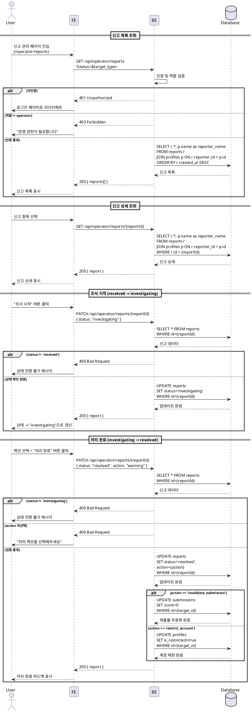
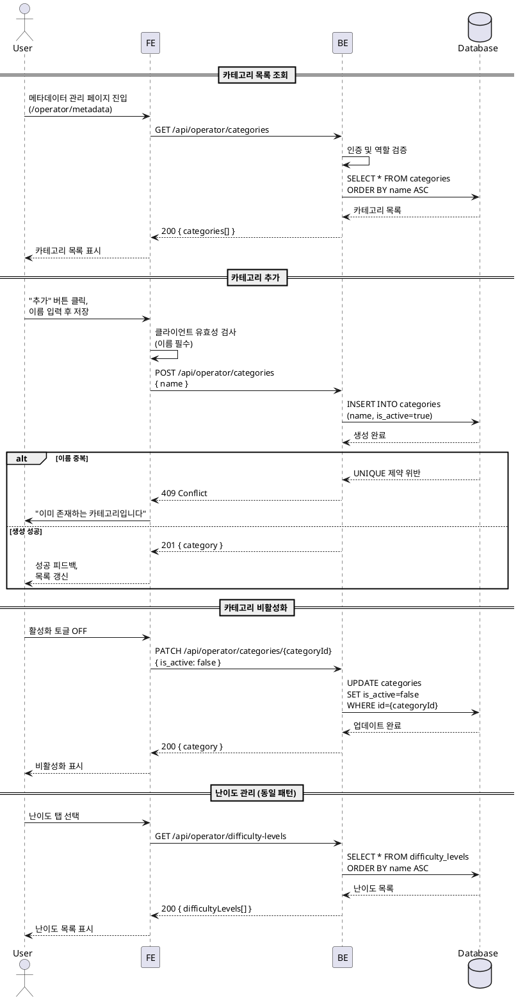

# UC-012: 운영 (Operator)

## Primary Actor

Operator (역할=operator인 인증된 사용자)

## Precondition

- 회원가입 및 온보딩을 완료한 상태
- Operator 역할로 로그인되어 있는 상태

## Trigger

- Operator가 운영 대시보드(`/operator/dashboard`)에 접근한다.
- Operator가 신고 관리 페이지(`/operator/reports`)에 접근한다.
- Operator가 메타데이터 관리 페이지(`/operator/metadata`)에 접근한다.

---

## Main Scenario

### MS-1. 운영 대시보드 조회

1. Operator가 운영 대시보드 페이지에 진입한다.
2. FE가 `GET /api/operator/dashboard` 요청을 전송한다.
3. BE가 인증 및 역할(`operator`)을 검증한다.
4. BE가 운영 현황 통계를 조회하여 반환한다.
   - 미처리 신고 건수 (`status='received'`)
   - 조사 중 신고 건수 (`status='investigating'`)
   - 전체 코스 수, 전체 사용자 수
5. FE가 대시보드를 렌더링한다.

### MS-2. 신고 목록 조회

1. Operator가 신고 관리 페이지에 진입한다.
2. FE가 `GET /api/operator/reports` 요청을 전송한다.
3. BE가 인증 및 역할(`operator`)을 검증한다.
4. BE가 `reports` 테이블에서 신고 목록을 조회한다.
   - 신고 대상 유형, 사유, 상태, 신고자 정보, 접수일
5. FE가 신고 목록을 테이블 형태로 표시한다.
   - 상태별 필터링 기능 제공 (전체/접수/조사 중/처리 완료)
   - 대상 유형별 필터링 기능 제공 (코스/과제/제출물/사용자)

### MS-3. 신고 상세 조회 및 상태 전환

1. Operator가 신고 목록에서 특정 신고를 선택한다.
2. FE가 `GET /api/operator/reports/{reportId}` 요청을 전송하여 상세 정보를 표시한다.
   - 신고자 정보, 대상 유형 및 대상 정보, 사유, 내용, 현재 상태, 처리 이력
3. Operator가 상태를 전환한다.
   - "조사 시작" 버튼: `received` -> `investigating`
   - "처리 완료" 버튼: `investigating` -> `resolved` (액션 선택 필수)
4. FE가 `PATCH /api/operator/reports/{reportId}` 요청을 전송한다.
   - 요청 본문: `{ status, action? }`
5. BE가 상태 전환 유효성을 검증한다 (단방향 전환만 허용).
6. BE가 `reports` 테이블을 UPDATE한다.
7. BE가 성공 응답을 반환한다.
8. FE가 성공 피드백을 표시하고 신고 상태를 갱신한다.

### MS-4. 신고 처리 액션 실행

1. Operator가 "처리 완료" 단계에서 액션을 선택한다.
   - `warning`: 경고 (기록만 남김)
   - `invalidate_submission`: 제출물 무효화
   - `restrict_account`: 계정 제한
2. FE가 선택된 액션과 함께 `PATCH /api/operator/reports/{reportId}` 요청을 전송한다.
   - 요청 본문: `{ status: "resolved", action: "warning" | "invalidate_submission" | "restrict_account" }`
3. BE가 `reports` 테이블을 UPDATE한다.
   - `status='resolved'`, `action={action}`
4. BE가 액션에 따른 후속 처리를 수행한다.
   - `invalidate_submission`: 대상 `submissions` 레코드의 `score`를 0으로 변경
   - `restrict_account`: 대상 `profiles` 레코드에 제한 플래그 기록 (`profiles.is_restricted` 컬럼 추가 필요)
   - `warning`: 별도 후속 처리 없음 (기록만)
5. BE가 성공 응답을 반환한다.

### MS-5. 메타데이터 관리 - 카테고리

1. Operator가 메타데이터 관리 페이지에서 카테고리 탭을 선택한다.
2. FE가 `GET /api/operator/categories` 요청을 전송한다.
3. BE가 `categories` 테이블의 전체 목록을 반환한다 (활성/비활성 포함).
4. FE가 카테고리 목록을 표시한다.
5. Operator가 카테고리를 추가/수정/비활성화한다.
   - 추가: "추가" 버튼 클릭 -> 이름 입력 -> `POST /api/operator/categories`
   - 수정: 이름 수정 -> `PATCH /api/operator/categories/{categoryId}`
   - 비활성화: 토글 -> `PATCH /api/operator/categories/{categoryId}` (is_active=false)
6. BE가 `categories` 테이블에 INSERT 또는 UPDATE를 수행한다.
7. FE가 성공 피드백을 표시하고 목록을 갱신한다.

### MS-6. 메타데이터 관리 - 난이도

1. Operator가 메타데이터 관리 페이지에서 난이도 탭을 선택한다.
2. FE가 `GET /api/operator/difficulty-levels` 요청을 전송한다.
3. BE가 `difficulty_levels` 테이블의 전체 목록을 반환한다 (활성/비활성 포함).
4. FE가 난이도 목록을 표시한다.
5. Operator가 난이도를 추가/수정/비활성화한다.
   - 추가: "추가" 버튼 클릭 -> 이름 입력 -> `POST /api/operator/difficulty-levels`
   - 수정: 이름 수정 -> `PATCH /api/operator/difficulty-levels/{levelId}`
   - 비활성화: 토글 -> `PATCH /api/operator/difficulty-levels/{levelId}` (is_active=false)
6. BE가 `difficulty_levels` 테이블에 INSERT 또는 UPDATE를 수행한다.
7. FE가 성공 피드백을 표시하고 목록을 갱신한다.

---

## Edge Cases

| # | 상황 | 처리 |
|---|------|------|
| E1 | 미인증 사용자 접근 | 401 반환, 로그인 페이지로 리다이렉트 |
| E2 | Operator가 아닌 역할이 접근 | 403 Forbidden 반환, "운영 권한이 필요합니다" 메시지 |
| E3 | 이미 `resolved` 상태인 신고에 상태 변경 시도 | 400 반환, "이미 처리 완료된 신고입니다" 메시지 |
| E4 | `received` -> `resolved` 직접 전환 시도 (조사 단계 건너뛰기) | 400 반환, "조사 시작 후 처리 완료할 수 있습니다" 메시지 |
| E5 | `resolved` 전환 시 액션 미선택 | FE에서 버튼 비활성화. BE에서도 400 반환 |
| E6 | 중복 카테고리 이름 추가 시도 | BE에서 409 Conflict 반환, "이미 존재하는 카테고리입니다" 메시지 |
| E7 | 중복 난이도 이름 추가 시도 | BE에서 409 Conflict 반환, "이미 존재하는 난이도입니다" 메시지 |
| E8 | 코스에서 사용 중인 카테고리 삭제 시도 | 물리적 삭제 대신 `is_active=false` 비활성화 처리. 기존 코스 연결 유지 |
| E9 | 코스에서 사용 중인 난이도 삭제 시도 | 물리적 삭제 대신 `is_active=false` 비활성화 처리. 기존 코스 연결 유지 |
| E10 | `invalidate_submission` 액션이지만 대상이 제출물이 아닌 경우 | BE에서 대상 유형에 따라 유효한 액션만 허용. 400 반환 |
| E11 | 존재하지 않는 신고/카테고리/난이도 ID 접근 | 404 반환 |
| E12 | 네트워크 오류 | 에러 토스트 표시, 재시도 가능 |
| E13 | 빈 이름으로 카테고리/난이도 추가 시도 | FE에서 입력 차단. BE에서도 400 반환 |

---

## Business Rules

| # | 규칙 |
|---|------|
| BR1 | 운영 기능 전체는 Operator 역할에게만 접근이 허용된다 (역할 기반 가드). |
| BR2 | 신고 상태 전환은 단방향이다: `received` -> `investigating` -> `resolved`. 역방향 전환은 불가하다. |
| BR3 | `resolved` 전환 시 반드시 액션(`warning`/`invalidate_submission`/`restrict_account`) 중 하나를 선택해야 한다. |
| BR4 | `invalidate_submission` 액션은 `target_type='submission'`인 신고에만 적용 가능하다. |
| BR5 | `restrict_account` 액션은 `target_type='user'`인 신고에만 적용 가능하다. `profiles` 테이블에 `is_restricted boolean NOT NULL DEFAULT false` 컬럼 추가가 필요하다. |
| BR6 | `warning` 액션은 모든 대상 유형에 적용 가능하다. |
| BR7 | 카테고리와 난이도의 `name` 필드는 UNIQUE 제약이며, 중복 등록이 불가하다. |
| BR8 | 카테고리와 난이도는 물리적 삭제 대신 `is_active=false`로 비활성화 처리한다. |
| BR9 | 비활성화된 카테고리/난이도는 새 코스 생성 시 선택 목록에서 제외되지만, 기존 코스와의 연결은 유지된다. |
| BR10 | 신고 접수 시 `status`는 자동으로 `received`로 설정된다. |
| BR11 | 신고 대상 유형은 `course`, `assignment`, `submission`, `user` 중 하나이다. |

---

## Sequence Diagram

### 신고 처리

### 메타데이터 관리

