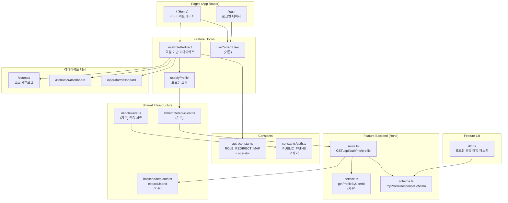

# 홈(`/`) 리다이렉트 정책 구현 설계

## 현재 상태 분석

### 이미 구현됨
- 미들웨어 인증 기반 경로 보호 (`src/middleware.ts`)
- `useCurrentUser` 훅/컨텍스트 (인증 여부만 제공, 역할 정보 없음)
- `ROLE_REDIRECT_MAP` — `learner → /courses`, `instructor → /instructor/dashboard`
- 보호된 라우트 레이아웃 (`(protected)/layout.tsx`)
- 백엔드 역할 검증 (`requireLearnerRole`, `requireInstructorRole`, `requireOperatorRole`)
- `getProfileByUserId` 서비스 함수 (프로필 조회)

### 구현 필요
- `/`를 보호 경로로 전환 (PUBLIC_PATHS에서 제거)
- 프로필 조회 API 엔드포인트 (`GET /api/auth/me/profile`)
- 프론트엔드 프로필 조회 훅 (`useMyProfile`)
- 홈 페이지를 역할 기반 리다이렉트 페이지로 교체
- `ROLE_REDIRECT_MAP`에 `operator` 추가
- 로그인 페이지의 기본 리다이렉트 경로를 `/`로 통일

---

## 개요

| # | 모듈 | 위치 | 설명 |
|---|------|------|------|
| 1 | Profile Response Schema | `src/features/auth/backend/schema.ts` | 프로필 조회 응답 zod 스키마 추가 |
| 2 | Auth Backend Route | `src/features/auth/backend/route.ts` | `GET /api/auth/me/profile` 엔드포인트 추가 |
| 3 | Auth DTO | `src/features/auth/lib/dto.ts` | 프로필 응답 타입 프론트엔드 재노출 |
| 4 | Auth Constants | `src/features/auth/constants/index.ts` | `ROLE_REDIRECT_MAP`에 `operator` 추가 |
| 5 | Shared Auth Constants | `src/constants/auth.ts` | `PUBLIC_PATHS`에서 `/` 제거 |
| 6 | useMyProfile Hook | `src/features/auth/hooks/useMyProfile.ts` | 프로필/역할 조회 React Query 훅 |
| 7 | useRoleRedirect Hook | `src/features/auth/hooks/useRoleRedirect.ts` | 역할 기반 리다이렉트 로직 훅 |
| 8 | Home Page | `src/app/page.tsx` | **수정** — 역할 기반 리다이렉트 페이지로 교체 |
| 9 | Login Page | `src/app/login/page.tsx` | **수정** — 기본 리다이렉트 경로를 `/`로 통일 |

---

## Diagram



---

## Implementation Plan

### Phase 1: Backend Layer

#### 1-1. `src/features/auth/backend/schema.ts` (수정)

**추가할 스키마:**

```typescript
myProfileResponseSchema: {
  id: z.string().uuid(),
  role: z.enum(['learner', 'instructor', 'operator']),
  name: z.string(),
  phone: z.string(),
  bio: z.string(),
  isRestricted: z.boolean(),
}
```

**Unit Test:**
- 유효한 프로필 데이터 파싱 통과
- `role`이 `learner`/`instructor`/`operator` 외 값일 때 실패
- 필수 필드 누락 시 실패

---

#### 1-2. `src/features/auth/backend/route.ts` (수정)

**추가 엔드포인트:**

| Method | Path | 설명 |
|--------|------|------|
| GET | `/api/auth/me/profile` | 현재 로그인 사용자의 프로필 조회 |

**`GET /api/auth/me/profile` 흐름:**
1. `extractUserId(c)`로 현재 사용자 ID 추출
2. 미인증 시 401 반환
3. `getProfileByUserId(supabase, userId)` 호출
4. 프로필 미존재 시 404 반환 (`PROFILE_NOT_FOUND`)
5. `myProfileResponseSchema`로 직렬화 후 200 반환

**Unit Test:**
- 인증된 사용자 + 프로필 존재 → 200 + 프로필 데이터
- 미인증 요청 → 401
- 인증됨 + 프로필 미존재 → 404

---

### Phase 2: Shared / Constants

#### 2-1. `src/features/auth/constants/index.ts` (수정)

**변경 사항:**

```typescript
// Before
export const ROLE_REDIRECT_MAP = {
  learner: '/courses',
  instructor: '/instructor/dashboard',
} as const;

// After
export const ROLE_REDIRECT_MAP = {
  learner: '/courses',
  instructor: '/instructor/dashboard',
  operator: '/operator/dashboard',
} as const;
```

---

#### 2-2. `src/constants/auth.ts` (수정)

**변경 사항:**

```typescript
// Before
const PUBLIC_PATHS = ["/", "/login", "/signup"] as const;

// After
const PUBLIC_PATHS = ["/login", "/signup"] as const;
```

이로써 미들웨어가 비인증 사용자의 `/` 접근을 자동으로 `/login`으로 리다이렉트한다.

---

#### 2-3. `src/features/auth/lib/dto.ts` (수정)

**추가 재노출:**

```typescript
export {
  myProfileResponseSchema,
  type MyProfileResponse,
} from '../backend/schema';
```

---

### Phase 3: Frontend Layer

#### 3-1. `src/features/auth/hooks/useMyProfile.ts` (신규)

**React Query 기반 프로필 조회 훅:**

```typescript
// apiClient를 통해 GET /api/auth/me/profile 호출
// queryKey: ['auth', 'me', 'profile']
// enabled: isAuthenticated === true 일 때만 실행
// 반환: { profile, isLoading, isError }
```

**Unit Test:**
- 인증 상태에서 프로필 데이터 반환 확인
- 미인증 상태에서 쿼리 비활성화 확인

---

#### 3-2. `src/features/auth/hooks/useRoleRedirect.ts` (신규)

**역할 기반 리다이렉트 로직 훅:**

```typescript
// useMyProfile로 역할 조회
// ROLE_REDIRECT_MAP에서 대상 경로 결정
// router.replace()로 리다이렉트 실행
// 프로필 미존재(404) 시 /login으로 리다이렉트 + 세션 정리 고려
```

**흐름:**
1. `useMyProfile()`로 프로필 조회
2. 로딩 중 → `{ isRedirecting: true }` 반환
3. 에러(404) → `/login`으로 리다이렉트
4. 성공 → `ROLE_REDIRECT_MAP[profile.role]`로 `router.replace()`
5. 매핑 실패(알 수 없는 역할) → `/login`으로 폴백

**Unit Test:**
- learner 프로필 → `/courses`로 리다이렉트
- instructor 프로필 → `/instructor/dashboard`로 리다이렉트
- operator 프로필 → `/operator/dashboard`로 리다이렉트
- 프로필 미존재 → `/login`으로 리다이렉트

---

#### 3-3. `src/app/page.tsx` (수정)

**변경 사항:**
- 기존 템플릿 화면 전체 제거
- `useCurrentUser`로 인증 확인
- 인증됨 → `useRoleRedirect` 실행
- 리다이렉트 진행 중 로딩 UI 표시 (스피너 + "리다이렉트 중...")

**QA Sheet:**

| # | 시나리오 | 기대 결과 |
|---|----------|-----------|
| 1 | 비인증 사용자가 `/` 접근 | 미들웨어에 의해 `/login?redirectedFrom=/`로 리다이렉트 |
| 2 | Learner로 인증된 사용자가 `/` 접근 | `/courses`로 리다이렉트 |
| 3 | Instructor로 인증된 사용자가 `/` 접근 | `/instructor/dashboard`로 리다이렉트 |
| 4 | Operator로 인증된 사용자가 `/` 접근 | `/operator/dashboard`로 리다이렉트 |
| 5 | 인증됨 + 프로필 미존재 (비정상) | `/login`으로 리다이렉트 |
| 6 | 프로필 조회 중 | 로딩 스피너 표시 |
| 7 | 네트워크 오류 | 에러 메시지 표시 + 재시도 안내 |

---

#### 3-4. `src/app/login/page.tsx` (수정)

**변경 사항:**
- 로그인 성공 후 `redirectedFrom`이 없거나 `/`인 경우 → 그대로 `/`로 리다이렉트
  - `/` 페이지가 역할 기반 리다이렉트를 처리하므로 별도 처리 불필요
- 이미 인증된 상태에서 접근 시 → `/`로 리다이렉트 (기존 `"/"` 폴백과 동일, 변경 없음)

> 실질적으로 로그인 페이지는 `redirectedFrom` 기본값이 이미 `"/"`이므로 코드 변경이 최소화된다.
> 핵심은 `/` 페이지가 역할 기반 리다이렉트를 담당하는 것이다.

**QA Sheet:**

| # | 시나리오 | 기대 결과 |
|---|----------|-----------|
| 1 | 로그인 성공 (redirectedFrom 없음) | `/`로 이동 → 역할별 페이지로 리다이렉트 |
| 2 | 로그인 성공 (redirectedFrom=/courses/1) | `/courses/1`로 이동 |
| 3 | 이미 인증된 상태로 `/login` 접근 | `/`로 이동 → 역할별 페이지로 리다이렉트 |

---

## 작업 순서 (의존성 기반)

```
Phase 1 (Backend)
├── 1-1. schema.ts — myProfileResponseSchema 추가
└── 1-2. route.ts — GET /api/auth/me/profile 추가 (schema, service 의존)

Phase 2 (Shared — Phase 1과 병렬 가능)
├── 2-1. auth/constants — ROLE_REDIRECT_MAP에 operator 추가
├── 2-2. constants/auth.ts — PUBLIC_PATHS에서 '/' 제거
└── 2-3. auth/lib/dto.ts — 프로필 응답 타입 재노출

Phase 3 (Frontend — Phase 1, 2 후)
├── 3-1. useMyProfile.ts — 프로필 조회 훅
├── 3-2. useRoleRedirect.ts — 역할 기반 리다이렉트 훅 (useMyProfile, constants 의존)
├── 3-3. page.tsx — 홈 페이지 수정 (useRoleRedirect 의존)
└── 3-4. login/page.tsx — 로그인 페이지 수정 (최소 변경)
```

---

## 리다이렉트 정책 요약

```
사용자가 / 접속
│
├─ 비인증 ─── [미들웨어] ──→ /login?redirectedFrom=/
│
└─ 인증됨 ─── [홈 페이지] ──→ GET /api/auth/me/profile
    │
    ├─ 프로필 없음 (404) ──→ /login (세션 비정상)
    │
    ├─ role = learner ──→ /courses
    │
    ├─ role = instructor ──→ /instructor/dashboard
    │
    └─ role = operator ──→ /operator/dashboard
```
