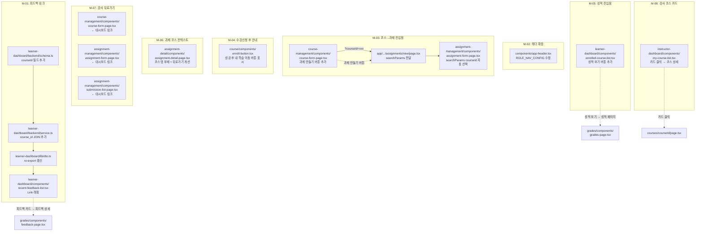
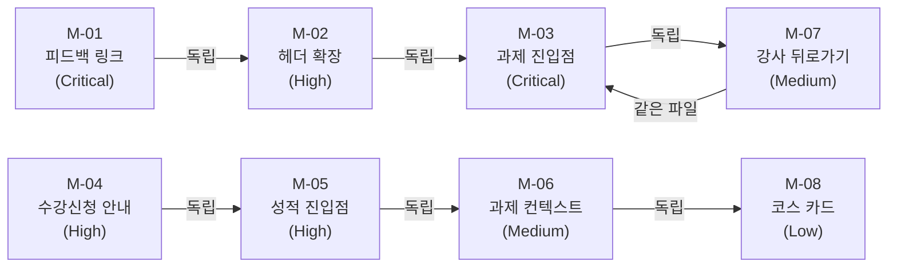

# Userflow 개선 구현 계획서

> 기반 문서: `userflow-check.md` (점검 보고서)
> 작성일: 2026-02-22

---

## 1. 개요

점검 보고서에서 도출된 12건 중, **F-12는 이미 구현 완료** 확인(`feedback-detail.tsx`에 재제출 버튼 존재).
나머지 11건을 8개 모듈로 그룹화하여 구현한다.

| # | 모듈 | 위치 | 설명 |
| --- | --- | --- | --- |
| M-01 | **피드백 링크 (F-01 + F-10)** | `learner-dashboard` feature (backend + frontend) | 피드백 스키마에 `courseId` 추가 + 카드를 클릭 가능한 링크로 변경 |
| M-02 | **헤더 네비게이션 확장 (F-03)** | `src/components/app-header.tsx` | Learner 헤더에 "코스 탐색" 링크 추가, Instructor에 "새 과제" 링크 추가 |
| M-03 | **코스 → 과제 생성 진입점 (F-02)** | `course-management` + `assignment-management` features | 코스 수정 페이지에 "과제 만들기" 버튼 + 쿼리 파라미터로 코스 자동 선택 |
| M-04 | **수강신청 후 안내 (F-04)** | `course` feature | 수강신청 후 EnrollButton을 "내 학습으로" 이동 버튼으로 전환 |
| M-05 | **성적 페이지 진입점 (F-05)** | `learner-dashboard` feature | 수강 중 코스 카드에 "성적 보기" 아이콘 버튼 추가 |
| M-06 | **과제 상세 코스 컨텍스트 (F-06)** | `assignment-detail` feature | 과제 상세 상단에 코스명 표시 + 뒤로가기 개선 |
| M-07 | **강사 페이지 뒤로가기 (F-07 + F-08 + F-09)** | `course-management` + `assignment-management` features | 코스 수정, 과제 생성, 제출물 관리 페이지에 뒤로가기 추가 |
| M-08 | **강사 코스 카드 개선 (F-11)** | `instructor-dashboard` feature | 카드 클릭을 코스 상세로, 수정은 드롭다운에서 진행 |

---

## 2. Diagram



---

## 3. Implementation Plan

### M-01. 피드백 링크 (F-01 + F-10) — Critical

#### 3.1.1 Backend: 스키마 수정

**파일**: `src/features/learner-dashboard/backend/schema.ts`

- `recentFeedbackSchema`에 `courseId: z.string().uuid()` 추가

```typescript
export const recentFeedbackSchema = z.object({
  submissionId: z.string().uuid(),
  assignmentId: z.string().uuid(),
  courseId: z.string().uuid(),          // 추가
  assignmentTitle: z.string(),
  courseTitle: z.string(),
  score: z.number().nullable(),
  feedback: z.string().nullable(),
  status: z.enum(['submitted', 'graded', 'resubmission_required']),
  gradedAt: z.string().nullable(),
});
```

#### 3.1.2 Backend: 서비스 수정

**파일**: `src/features/learner-dashboard/backend/service.ts`

- Step 6 (최근 피드백) 쿼리에서 `assignments.course_id` 를 함께 select
- `recentFeedback` 매핑에 `courseId` 추가

```typescript
// 기존 select에 course_id 추가
.select(`
  id, assignment_id, score, feedback, status, graded_at,
  assignments!submissions_assignment_id_fkey (
    title,
    course_id,
    courses!assignments_course_id_fkey ( title )
  )
`)

// 매핑에 courseId 추가
const recentFeedback = feedbackRows.map((f) => ({
  submissionId: f.id,
  assignmentId: f.assignment_id,
  courseId: f.assignments?.course_id ?? '',    // 추가
  assignmentTitle: f.assignments?.title ?? '',
  courseTitle: f.assignments?.courses?.title ?? '',
  // ... 나머지 동일
}));
```

#### 3.1.3 Frontend: 컴포넌트 수정

**파일**: `src/features/learner-dashboard/components/recent-feedback-list.tsx`

- `<Card>` 를 `<Link>` 로 감싸서 피드백 상세 페이지로 이동
- hover 효과 추가 (`hover:bg-accent transition-colors`)

```typescript
import Link from 'next/link';

// Card를 Link로 감싸기
<Link
  key={item.submissionId}
  href={`/courses/my/${item.courseId}/assignments/${item.assignmentId}/feedback`}
>
  <Card className="p-4 transition-colors hover:bg-accent">
    {/* 기존 내용 동일 */}
  </Card>
</Link>
```

#### QA Sheet

| # | 시나리오 | 기대 결과 | Pass/Fail |
| --- | --- | --- | --- |
| 1 | 러너 대시보드에서 피드백 카드 클릭 | 해당 과제의 피드백 상세 페이지로 이동 | |
| 2 | 채점 완료 피드백 카드 클릭 | `/courses/my/{courseId}/assignments/{assignmentId}/feedback` 로 이동, 점수/피드백 표시 | |
| 3 | 재제출 요청 피드백 카드 클릭 | 피드백 상세에서 "재제출하기" 버튼 노출 확인 | |
| 4 | 피드백이 없는 경우 | "아직 피드백이 없습니다" 빈 상태 표시, 링크 없음 | |
| 5 | 카드에 hover 효과 | 마우스 올리면 배경색 변경 (accent 색상) | |

---

### M-02. 헤더 네비게이션 확장 (F-03) — High

#### 3.2.1 컴포넌트 수정

**파일**: `src/components/app-header.tsx`

- `ROLE_NAV_CONFIG.learner`에 코스 탐색 항목 추가
- `ROLE_NAV_CONFIG.instructor`에 새 과제 항목 추가 (선택)

```typescript
import { BookOpen, GraduationCap, LayoutDashboard, LogOut, Search, Shield } from 'lucide-react';

const ROLE_NAV_CONFIG = {
  learner: [
    { href: '/', label: '코스 탐색', icon: Search },
    { href: '/courses/my', label: '내 코스', icon: BookOpen },
  ],
  instructor: [
    { href: '/instructor/dashboard', label: '강사 대시보드', icon: LayoutDashboard },
  ],
  operator: [
    { href: '/operator/dashboard', label: '운영 대시보드', icon: Shield },
  ],
} as const;
```

#### QA Sheet

| # | 시나리오 | 기대 결과 | Pass/Fail |
| --- | --- | --- | --- |
| 1 | Learner 로그인 후 헤더 확인 | "코스 탐색" + "내 코스" 2개 링크 표시 | |
| 2 | "코스 탐색" 클릭 | `/` (홈 = 코스 카탈로그) 으로 이동 | |
| 3 | "내 코스" 클릭 | `/courses/my` (러너 대시보드) 으로 이동 | |
| 4 | Instructor 로그인 후 헤더 확인 | "강사 대시보드" 링크 표시 (기존 동일) | |
| 5 | 비로그인 상태 | "로그인" + "회원가입" 표시 (기존 동일) | |

---

### M-03. 코스 → 과제 생성 진입점 (F-02) — Critical

#### 3.3.1 코스 수정 페이지에 버튼 추가

**파일**: `src/features/course-management/components/course-form-page.tsx`

- 코스 수정 모드(`mode === 'edit'`) 시, 폼 하단 `저장` 버튼 영역 옆 또는 페이지 상단에 "이 코스에 과제 만들기" 버튼 추가
- `<Link href={/instructor/assignments/new?courseId=${courseId}}>` 형태

```typescript
import { Plus } from 'lucide-react';

// 저장 버튼 하단 또는 header 영역에 추가
{mode === 'edit' && courseId && (
  <Link href={`/instructor/assignments/new?courseId=${courseId}`}>
    <Button variant="outline" type="button">
      <Plus className="mr-1 h-4 w-4" />
      이 코스에 과제 만들기
    </Button>
  </Link>
)}
```

#### 3.3.2 과제 생성 페이지에서 쿼리 파라미터 수신

**파일**: `src/app/(protected)/instructor/assignments/new/page.tsx`

- `searchParams` props 추가하여 `courseId` 전달

```typescript
type NewAssignmentPageProps = {
  params: Promise<Record<string, never>>;
  searchParams: Promise<{ courseId?: string }>;
};

export default function NewAssignmentPage({ params, searchParams }: NewAssignmentPageProps) {
  void params;
  const { courseId } = use(searchParams);
  return <AssignmentFormPage mode="create" defaultCourseId={courseId} />;
}
```

#### 3.3.3 과제 폼에서 courseId 자동 선택

**파일**: `src/features/assignment-management/components/assignment-form-page.tsx`

- `defaultCourseId` prop 추가
- `defaultValues.courseId` 에 반영

```typescript
type AssignmentFormPageProps = {
  mode: 'create' | 'edit';
  assignmentId?: string;
  defaultCourseId?: string;   // 추가
};

// form defaultValues에 반영
defaultValues: {
  courseId: defaultCourseId ?? '',
  // ...
},
```

#### QA Sheet

| # | 시나리오 | 기대 결과 | Pass/Fail |
| --- | --- | --- | --- |
| 1 | 코스 수정 페이지에서 "과제 만들기" 버튼 확인 | 편집 모드일 때만 버튼 표시 | |
| 2 | "과제 만들기" 클릭 | `/instructor/assignments/new?courseId=xxx` 로 이동 | |
| 3 | 과제 생성 폼 진입 시 코스 자동 선택 | 대상 코스 드롭다운에 해당 코스 자동 선택됨 | |
| 4 | 쿼리 파라미터 없이 직접 접근 | 기존 동작 유지 (코스 미선택 상태) | |
| 5 | 코스 생성 모드에서 버튼 확인 | 생성 모드에서는 "과제 만들기" 버튼 미표시 | |

---

### M-04. 수강신청 후 안내 (F-04) — High

#### 3.4.1 EnrollButton 수정

**파일**: `src/features/course/components/enroll-button.tsx`

- 수강신청 성공 후, 기존 수강취소 버튼 옆에 "내 학습으로" 이동 버튼을 함께 표시
- `enrollmentStatus === 'active'` 일 때 이미 수강취소 버튼이 보이므로, 그 옆에 "내 학습으로" 링크 버튼 추가

```typescript
import Link from 'next/link';

// isEnrolled 분기 내부에 추가
if (isEnrolled) {
  return (
    <div className="flex items-center gap-2">
      <Link href="/courses/my">
        <Button variant="outline" size="lg">
          내 학습으로
        </Button>
      </Link>
      <Button
        variant="destructive"
        size="lg"
        disabled={isPending}
        onClick={() => setDialogOpen(true)}
      >
        {cancelMutation.isPending ? '처리 중...' : '수강취소'}
      </Button>
      {/* Dialog 그대로 유지 */}
    </div>
  );
}
```

#### QA Sheet

| # | 시나리오 | 기대 결과 | Pass/Fail |
| --- | --- | --- | --- |
| 1 | 수강신청 성공 후 버튼 영역 확인 | "내 학습으로" + "수강취소" 두 버튼 표시 | |
| 2 | "내 학습으로" 클릭 | `/courses/my` 로 이동, 방금 수강한 코스 표시 | |
| 3 | 미수강 상태에서 | "수강신청" 버튼만 표시 (기존 동일) | |

---

### M-05. 성적 페이지 진입점 (F-05) — High

#### 3.5.1 수강 중 코스 카드 수정

**파일**: `src/features/learner-dashboard/components/enrolled-course-list.tsx`

- 코스 카드 하단에 "성적 보기" 버튼 추가
- 카드 전체 `<Link>`는 코스 상세로, "성적 보기"는 `event.stopPropagation()` + 별도 링크

```typescript
import { BarChart3 } from 'lucide-react';

// CardContent 하단에 추가
<CardContent className="space-y-3">
  {/* 기존 진행률 UI */}
  <div className="flex items-center justify-between">
    <p className="text-sm text-muted-foreground">
      {course.instructorName}
    </p>
    <Link
      href={`/courses/my/${course.id}/grades`}
      onClick={(e) => e.stopPropagation()}
    >
      <Button variant="ghost" size="sm" className="h-7 gap-1 px-2 text-xs">
        <BarChart3 className="h-3 w-3" />
        성적
      </Button>
    </Link>
  </div>
  {/* 진행률 바 */}
</CardContent>
```

#### QA Sheet

| # | 시나리오 | 기대 결과 | Pass/Fail |
| --- | --- | --- | --- |
| 1 | 수강 중 코스 카드에 "성적" 버튼 확인 | 각 코스 카드 하단에 "성적" 버튼 표시 | |
| 2 | "성적" 버튼 클릭 | `/courses/my/{courseId}/grades` 로 이동 | |
| 3 | 카드 본체 클릭 | 코스 상세 페이지(`/courses/{courseId}`)로 이동 (기존 동작 유지) | |
| 4 | 과제 0건인 코스에서 성적 클릭 | 성적 페이지에서 "등록된 과제가 없습니다" 표시 | |

---

### M-06. 과제 상세 코스 컨텍스트 (F-06) — Medium

#### 3.6.1 과제 상세 페이지 수정

**파일**: `src/features/assignment-detail/components/assignment-detail-page.tsx`

- 뒤로가기 텍스트를 "내 학습" 대신 코스명으로 변경
- 과제 제목 위에 코스명 부제 추가 (데이터는 이미 `assignment.courseTitle`로 존재할 것이므로 확인 필요)

현재 `useAssignmentDetailQuery` 응답에 `courseTitle`이 포함되어 있는지 확인 후:

- **포함됨**: 바로 표시
- **미포함**: 스키마/서비스에 `courseTitle` 추가 필요

```typescript
// 뒤로가기 개선
<Link href="/courses/my">
  <Button variant="ghost" size="sm">
    <ArrowLeft className="mr-1 h-4 w-4" />
    내 학습
  </Button>
</Link>

// 제목 영역 개선
<div>
  <p className="text-sm text-muted-foreground">{assignment.courseTitle}</p>
  <h1 className="text-2xl font-bold">{assignment.title}</h1>
</div>
```

#### QA Sheet

| # | 시나리오 | 기대 결과 | Pass/Fail |
| --- | --- | --- | --- |
| 1 | 과제 상세 진입 | 과제 제목 위에 코스명 표시 | |
| 2 | 뒤로가기 클릭 | `/courses/my` 로 이동 | |
| 3 | 코스명 확인 | 실제 코스 제목과 일치 | |

---

### M-07. 강사 페이지 뒤로가기 (F-07 + F-08 + F-09) — Medium

3개 페이지에 동일 패턴으로 뒤로가기를 추가한다.

#### 3.7.1 코스 수정 페이지

**파일**: `src/features/course-management/components/course-form-page.tsx`

- `<header>` 위에 뒤로가기 버튼 추가

```typescript
import { ArrowLeft } from 'lucide-react';
import Link from 'next/link';

// header 바로 위에 추가
<Link href="/instructor/dashboard">
  <Button variant="ghost" size="sm">
    <ArrowLeft className="mr-1 h-4 w-4" />
    대시보드
  </Button>
</Link>
```

#### 3.7.2 과제 생성 페이지

**파일**: `src/features/assignment-management/components/assignment-form-page.tsx`

- 동일 패턴으로 `<header>` 위에 뒤로가기 추가

```typescript
<Link href="/instructor/dashboard">
  <Button variant="ghost" size="sm">
    <ArrowLeft className="mr-1 h-4 w-4" />
    대시보드
  </Button>
</Link>
```

#### 3.7.3 제출물 관리 페이지

**파일**: `src/features/assignment-management/components/submission-list-page.tsx`

- `<header>` 위에 뒤로가기 추가

```typescript
<Link href="/instructor/dashboard">
  <Button variant="ghost" size="sm">
    <ArrowLeft className="mr-1 h-4 w-4" />
    대시보드
  </Button>
</Link>
```

#### QA Sheet

| # | 시나리오 | 기대 결과 | Pass/Fail |
| --- | --- | --- | --- |
| 1 | 코스 수정 페이지 상단 | "← 대시보드" 링크 표시 | |
| 2 | 과제 생성 페이지 상단 | "← 대시보드" 링크 표시 | |
| 3 | 제출물 관리 페이지 상단 | "← 대시보드" 링크 표시 | |
| 4 | 각 뒤로가기 클릭 | `/instructor/dashboard` 로 이동 | |

---

### M-08. 강사 코스 카드 개선 (F-11) — Low

#### 3.8.1 카드 링크 대상 변경

**파일**: `src/features/instructor-dashboard/components/my-course-list.tsx`

- 카드 전체 `<Link>` 를 일반 코스 상세 페이지(`/courses/{courseId}`)로 변경
- 드롭다운의 "수정" 메뉴는 기존대로 `/instructor/courses/{courseId}/edit` 로 이동

```typescript
// 기존: <Link href={`/instructor/courses/${course.id}/edit`}>
// 변경:
<Link href={`/courses/${course.id}`}>
  <CardHeader>...</CardHeader>
  <CardContent>...</CardContent>
</Link>
```

#### QA Sheet

| # | 시나리오 | 기대 결과 | Pass/Fail |
| --- | --- | --- | --- |
| 1 | 강사 대시보드에서 코스 카드 클릭 | `/courses/{courseId}` (코스 상세 조회) 로 이동 | |
| 2 | 드롭다운 > "수정" 클릭 | `/instructor/courses/{courseId}/edit` 로 이동 (기존 동일) | |
| 3 | 코스 상세에서 수강신청 버튼 | 강사 본인 코스이므로 수강신청 불가 표시 또는 미표시 확인 필요 | |

---

## 4. 구현 순서 및 의존성



권장 구현 순서:

1. **M-01** (피드백 링크) — 스키마/서비스/프론트 3계층 수정. 가장 임팩트 큼
2. **M-02** (헤더 확장) — 단일 파일, 15분
3. **M-03 + M-07** (과제 진입점 + 강사 뒤로가기) — `course-form-page.tsx` 공유하므로 병합 작업
4. **M-04** (수강신청 안내) — 단일 파일
5. **M-05** (성적 진입점) — 단일 파일
6. **M-06** (과제 컨텍스트) — 단일 파일
7. **M-08** (코스 카드) — 단일 파일, 후순위

---

## 5. 영향받는 파일 전체 목록

| 파일 | 수정 모듈 | 변경 유형 |
| --- | --- | --- |
| `src/features/learner-dashboard/backend/schema.ts` | M-01 | 스키마 필드 추가 |
| `src/features/learner-dashboard/backend/service.ts` | M-01 | Supabase 쿼리 수정 + 매핑 수정 |
| `src/features/learner-dashboard/components/recent-feedback-list.tsx` | M-01 | Link 래핑 |
| `src/components/app-header.tsx` | M-02 | ROLE_NAV_CONFIG 항목 추가 |
| `src/features/course-management/components/course-form-page.tsx` | M-03, M-07 | 과제 만들기 버튼 + 뒤로가기 |
| `src/app/(protected)/instructor/assignments/new/page.tsx` | M-03 | searchParams 전달 |
| `src/features/assignment-management/components/assignment-form-page.tsx` | M-03, M-07 | defaultCourseId prop + 뒤로가기 |
| `src/features/course/components/enroll-button.tsx` | M-04 | 내 학습으로 버튼 추가 |
| `src/features/learner-dashboard/components/enrolled-course-list.tsx` | M-05 | 성적 버튼 추가 |
| `src/features/assignment-detail/components/assignment-detail-page.tsx` | M-06 | 코스명 표시 |
| `src/features/assignment-management/components/submission-list-page.tsx` | M-07 | 뒤로가기 추가 |
| `src/features/instructor-dashboard/components/my-course-list.tsx` | M-08 | 카드 링크 대상 변경 |

---

## 6. 예상 총 공수

| 모듈 | 예상 공수 |
| --- | --- |
| M-01 (피드백 링크) | 2h |
| M-02 (헤더 확장) | 15min |
| M-03 (과제 진입점) | 1.5h |
| M-04 (수강신청 안내) | 30min |
| M-05 (성적 진입점) | 30min |
| M-06 (과제 컨텍스트) | 1h |
| M-07 (강사 뒤로가기) | 30min |
| M-08 (코스 카드) | 30min |
| **합계** | **~7h** |

---

## 7. 제외 항목

| 항목 | 사유 |
| --- | --- |
| F-12 (피드백 → 재제출 링크) | `feedback-detail.tsx` 에 이미 "재제출하기" 버튼 구현 완료 확인 |
| 브레드크럼 공통 컴포넌트 | 현재 코드베이스에 브레드크럼 패턴 없음. 뒤로가기 버튼 패턴으로 통일하여 일관성 유지 |
| URL 빌더 유틸리티 | 현재 인라인 템플릿 리터럴 패턴이 일관됨. 추가 추상화 불필요 |
